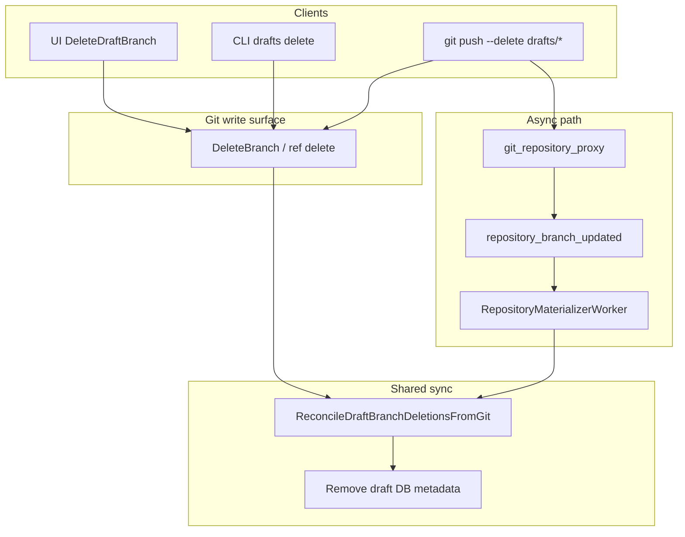

# Git-first draft deletion

## Problem

Today draft deletion is **DB-first** and **asymmetric**:

- [`DeleteDraftBranch`](pkg/grpc/actions/canvases/delete_draft_branch.go) deletes DB rows, then git — opposite of git-first
- External `git push origin --delete drafts/custom` removes the git ref but leaves stale `canvas_draft_branches` rows ([`git_repository_proxy.go`](pkg/public/git_repository_proxy.go) only notifies **existing** branches)
- [`ListDraftBranches`](pkg/grpc/actions/canvases/list_draft_branches.go) reads DB only — deleted git branches can still appear in UI/CLI

This implements the follow-up called out in [`git-first_draft_sync_8a9db7d1.plan.md`](.cursor/plans/git-first_draft_sync_8a9db7d1.plan.md): **Delete symmetry**.

## Target architecture



Mirror draft create / live publish tiers:

| Client | Git write | DB cleanup |
|--------|-----------|------------|
| UI / CLI / API `DeleteDraftBranch` | `DeleteBranch` (sync) | `ReconcileDraftBranchDeletionsFromGit` (sync, same function) |
| External `git push --delete` | Already on server | Worker → `ReconcileDraftBranchDeletionsFromGit` (async) |

**Policy (per your choice):** no change-request guard — API and git delete both remove the draft even if an open CR references the branch.

---

## 1. Add `ReconcileDraftBranchDeletionsFromGit`

**New file:** [`pkg/canvas/materialize/reconcile_draft_branch_deletions.go`](pkg/canvas/materialize/reconcile_draft_branch_deletions.go)

```go
type ReconcileDraftBranchDeletionsOptions struct {
    BranchName string // optional: reconcile one branch; empty = all drafts for canvas
}

func ReconcileDraftBranchDeletionsFromGit(ctx, tx, gitProvider, canvasID, opts) (removed []string, err error)
```

Logic:

1. Load repository for canvas
2. `gitProvider.ListBranches(ctx, repoID, materialize.DraftBranchPrefix)` → set of live git draft refs
3. `models.ListDraftBranchesForCanvasInTransaction(tx, canvasID)` → DB rows
4. For each DB row where `branch_name` **not** in git set (and matches `opts.BranchName` when set):
   - `DeleteDraftBranchInTransaction`
   - `DeleteRepositoryMaterializationStateInTransaction`
   - append to `removed`
5. Idempotent: no-op when DB already clean or branch still exists in git
6. After transaction (or inside, before commit): for each removed branch, emit `repository_branch_updated` with `materialization_status = "deleted"` (new constant in [`pkg/models/canvas_version.go`](pkg/models/canvas_version.go): `MaterializationStatusDeleted = "deleted"`) so UI invalidates draft list via existing websocket handler in [`useCanvasWebsocket.ts`](web_src/src/hooks/useCanvasWebsocket.ts)

**Unit tests:** [`pkg/canvas/materialize/reconcile_draft_branch_deletions_test.go`](pkg/canvas/materialize/reconcile_draft_branch_deletions_test.go) — git branch gone + DB row present → row removed; git branch exists → no-op; idempotent second call.

---

## 2. Refactor `DeleteDraftBranch` to git-first

**File:** [`pkg/grpc/actions/canvases/delete_draft_branch.go`](pkg/grpc/actions/canvases/delete_draft_branch.go)

New flow:

1. Auth / validation (unchanged: not `main`, not template)
2. Resolve branch exists in **git OR DB** (not DB-only); return `NotFound` only when neither exists
3. **`gitProvider.DeleteBranch`** first (treat already-deleted ref as success if provider returns not-found)
4. **DB transaction:** `ReconcileDraftBranchDeletionsFromGit(..., BranchName: branchName)`
5. Return empty response

Remove current DB-first ordering (lines 58–70 before git delete).

---

## 3. Wire async path: worker + git proxy

### Worker

**File:** [`pkg/workers/repository_materializer.go`](pkg/workers/repository_materializer.go)

At the start of `ConsumeRepositoryBranchUpdated` (after canvas lookup, before branch-specific materialize):

- Run `ReconcileDraftBranchDeletionsFromGit` for the canvas (full reconcile, no `BranchName` filter)
- Idempotent; cheap when nothing stale

This catches external ref deletes triggered by any push notification (including `main`-only updates after publish).

### Git proxy (optional sync polish)

**File:** [`pkg/public/git_repository_proxy.go`](pkg/public/git_repository_proxy.go)

In `notifyRepositoryBranchesUpdated`, after listing surviving git draft branches:

- Call `ReconcileDraftBranchDeletionsFromGit` synchronously (same as API) so UI/CLI see removal immediately without waiting for worker

Worker remains the reliable async path; proxy sync reduces lag (same pattern as API publish + worker for live).

---

## 4. Reuse in `PublishCanvas`

**File:** [`pkg/grpc/actions/canvases/publish_canvas.go`](pkg/grpc/actions/canvases/publish_canvas.go)

Replace inline `DeleteDraftBranchInTransaction` + `DeleteRepositoryMaterializationStateInTransaction` with `ReconcileDraftBranchDeletionsFromGit(..., BranchName: draftBranch)` after successful `SyncLiveFromGit` (git branch already deleted separately via `DeleteBranch` — reconcile still cleans DB if git delete succeeded).

Keep `gitProvider.DeleteBranch` call after DB transaction as today, or reorder to: merge → sync live → git delete draft → reconcile DB (consistent git-first: git delete before reconcile).

Recommended publish order:

1. `MergeBranch`
2. `SyncLiveFromGit`
3. `DeleteBranch(draftBranch)` — git write
4. `ReconcileDraftBranchDeletionsFromGit(draftBranch)` — DB derived

---

## 5. UI / CLI

**Minimal changes:**

- Existing `useDeleteDraftBranch` / `repository_branch_updated` invalidation of `draftBranches` query should pick up `"deleted"` status events
- Optional: in [`index.tsx`](web_src/src/pages/workflowv2/index.tsx) websocket handler, if user is editing the deleted branch, call `exitToLive()` (same as publish cleanup)

**CLI:** [`superplane apps drafts delete`](pkg/cli/commands/apps/drafts/delete.go) unchanged (still calls API).

**Pure git workflow (document):**

```bash
git push origin --delete drafts/custom
# DB draft row removed via worker/proxy reconcile
```

---

## 6. Docs

Update [`docs/contributing/git-native-apps.md`](docs/contributing/git-native-apps.md):

- Add materialization/sync row: external draft branch delete → `ReconcileDraftBranchDeletionsFromGit`
- Document `git push --delete` as valid draft discard
- Note `DeleteDraftBranch` API performs git delete first, then shared reconcile

---

## 7. Tests

| Area | Action |
|------|--------|
| Unit | `reconcile_draft_branch_deletions_test.go` |
| API | New `delete_draft_branch_test.go`: git+DB deleted; git-only delete cleans DB; idempotent |
| Integration | Extend or add test: create draft → `git push --delete` (or simulate proxy notify + worker) → `ListDraftBranches` empty |
| Regression | `publish_canvas_test.go` (draft still removed after publish) |

Run: `make test PKG_TEST_PACKAGES=./pkg/canvas/materialize`, `./pkg/grpc/actions/canvases`, `./test/integration`, `make format.go`.

---

## Out of scope

- List-on-read reconcile in `ListDraftBranches` (still worker/proxy/API sync only)
- Blocking delete when open change requests reference the branch
- Auto-deleting draft after external publish to `main` (separate publish cleanup decision)
