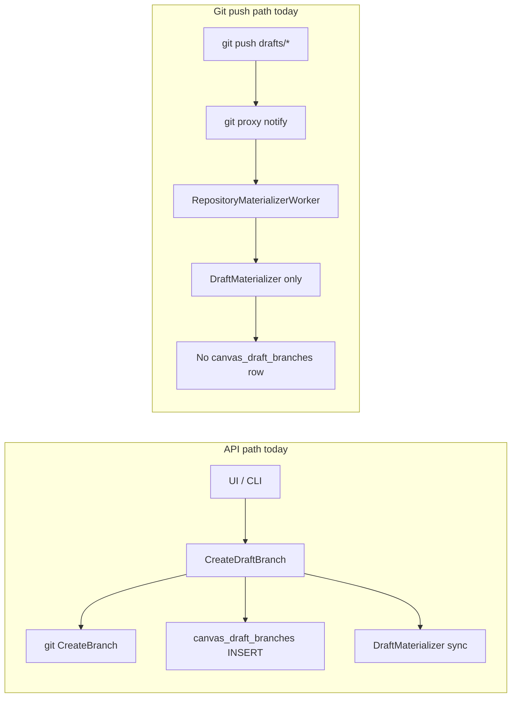
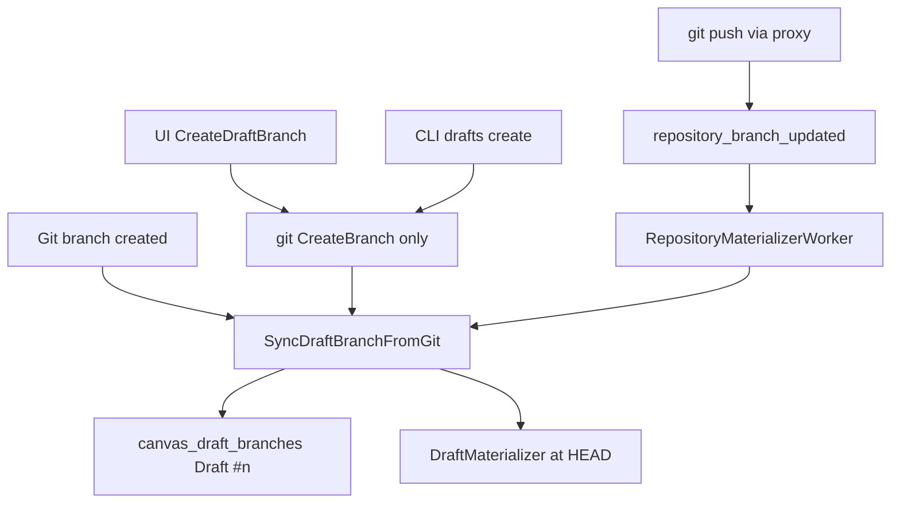

# Git-first draft branch sync

## Problem

Today draft lifecycle is split across two paths:



- [`create_draft_branch.go`](pkg/grpc/actions/canvases/create_draft_branch.go) creates the git branch **and** inserts DB metadata inline.
- [`repository_materializer.go`](pkg/workers/repository_materializer.go) materializes YAML on push but **never registers** missing `canvas_draft_branches` rows.
- [`list_draft_branches.go`](pkg/grpc/actions/canvases/list_draft_branches.go) reads DB only, so git-only branches are invisible in UI/CLI.
- [`uniqueDraftBranchName`](pkg/grpc/actions/canvases/create_draft_branch.go) checks DB, not git — can collide with branches created via pure git push.

**Target (uni-directional):**



Git is the write surface; SuperPlane metadata is always derived.

---

## 1. Add shared sync: `SyncDraftBranchFromGit`

**New file:** [`pkg/canvas/materialize/sync_draft_branch.go`](pkg/canvas/materialize/sync_draft_branch.go)

Extract and centralize logic currently in `CreateDraftBranch`:

| Responsibility | Details |
|----------------|---------|
| Validate branch | Must exist in git (`Head`); must match `drafts/` prefix |
| Register metadata | If no `canvas_draft_branches` row: insert with `Draft #n` via moved `nextDraftDisplayName()` |
| Owner inference | Parse `drafts/{uuid}` and `drafts/{uuid}-{suffix}` → `OwnerID`; API path passes `CreatedBy` as fallback |
| Materialize | Call existing `DraftMaterializer.MaterializeDraft` at branch HEAD |
| Idempotent | Safe to call repeatedly (existing row + already-materialized SHA → no-op) |

**Options struct** (for API-initiated creates only):

- `CreatedBy *uuid.UUID` — set `CreatedBy` on new rows
- `DisplayNameOverride string` — optional; when empty, auto `Draft #n`

Move helpers from [`create_draft_branch.go`](pkg/grpc/actions/canvases/create_draft_branch.go):

- `nextDraftDisplayName` → materialize package (exported for tests)
- New `OwnerFromDraftBranchName(branch string) *uuid.UUID`
- New `UniqueDraftBranchName(ctx, gitProvider, repoID, userID) (string, error)` — checks **git** `ListBranches` under `drafts/{user-id}`, not DB

**Unit tests:** [`pkg/canvas/materialize/sync_draft_branch_test.go`](pkg/canvas/materialize/sync_draft_branch_test.go)

- New git branch → creates row with `Draft #1`, `Draft #2`, … after deletes
- Existing row → updates tip only via materializer
- Owner parsing for default and suffixed branch names
- Idempotent re-sync

---

## 2. Refactor `CreateDraftBranch` to git-only + sync

**File:** [`pkg/grpc/actions/canvases/create_draft_branch.go`](pkg/grpc/actions/canvases/create_draft_branch.go)

New flow:

1. Auth + canvas/repo validation (unchanged)
2. Resolve branch name via `UniqueDraftBranchName` (git-aware)
3. **If git branch already exists** (partial failure / race): skip create, call `SyncDraftBranchFromGit`, return — makes default-branch creation idempotent for CLI `EnsureCurrentUserDraftBranch`
4. Else `gitProvider.CreateBranch(..., from main)`
5. Call `SyncDraftBranchFromGit` synchronously (same code worker uses)
6. On sync failure: rollback git branch via `DeleteBranch` (unchanged safety)
7. Return serialized branch from sync result

Remove inline DB insert + inline materializer call. Optional `display_name` from proto body becomes `DisplayNameOverride` only (git-only branches always get `Draft #n`).

**No proto/OpenAPI changes** — existing `POST .../repository/drafts` contract stays; clients still receive `branchName`, `displayName`, `tipSha`.

---

## 3. Wire worker to shared sync

**File:** [`pkg/workers/repository_materializer.go`](pkg/workers/repository_materializer.go)

Replace the current “materialize only if draft row exists” block with:

```go
materialize.SyncDraftBranchFromGit(ctx, tx, w.GitProvider, w.Registry, canvas.OrganizationID, canvasID, message.GetBranch(), materialize.SyncDraftBranchOptions{
    HeadSHA: message.GetHeadSha(), // optional pre-read from message
})
```

This covers external `git push` of new `drafts/*` branches detected by [`git_repository_proxy.go`](pkg/public/git_repository_proxy.go) `notifyRepositoryBranchesUpdated`.

Per your preference: **no reconcile-on-list** — draft rows appear after the worker processes `repository_branch_updated` (brief lag acceptable).

---

## 4. UI and CLI — no API surface changes

### UI

Files like [`bootstrapBlankCanvasDraft.ts`](web_src/src/lib/bootstrapBlankCanvasDraft.ts), [`useCreateDraftBranch`](web_src/src/hooks/useCanvasData.ts), and [`workflowv2/index.tsx`](web_src/src/pages/workflowv2/index.tsx) keep calling `canvasesCreateDraftBranch`. Behavior change is backend-only: API creates git branch, sync returns metadata.

**Optional UX polish (small):** after external push, existing `repository_branch_updated` websocket handler in workflowv2 already invalidates queries — ensure it also invalidates `draftBranches` query key so sidebar picks up new drafts once worker finishes. Check [`useDraftBranchesEditStatus`](web_src/src/pages/workflowv2/useDraftBranchesEditStatus.ts) / reload banner wiring.

### CLI

[`pkg/cli/commands/apps/drafts/create.go`](pkg/cli/commands/apps/drafts/create.go) and [`EnsureCurrentUserDraftBranch`](pkg/cli/commands/apps/common/repository.go) stay on `CreateDraftBranch` API.

Improve idempotency in `EnsureCurrentUserDraftBranch`: after refactored API, calling create when default git branch exists (worker not yet run) will sync in-process instead of failing with `branch already exists`.

Pure-git workflow for operators:

```bash
git push origin HEAD:refs/heads/drafts/$(superplane me -q id)
# worker registers draft + materializes; appears in `drafts list` shortly after
```

---

## 5. supergit — no changes required

supergit already supports branch create/list via REST and accepts new refs on push. SuperPlane owns sync logic via:

- API → `gitProvider.CreateBranch` → supergit REST
- Push → SuperPlane git proxy → RabbitMQ → worker

**Optional follow-up (out of scope):** supergit post-receive webhook for environments where clients push directly to supergit bypassing the SuperPlane proxy. Not needed for the standard `/git/{canvas-id}.git` remote.

---

## 6. Tests and docs

| Area | Action |
|------|--------|
| Unit | `sync_draft_branch_test.go` — naming, owner, idempotency |
| Integration | Extend worker test or add grpc test: simulate `RepositoryBranchUpdatedMessage` for unknown `drafts/*` → row + materialization |
| Integration | `CreateDraftBranch` creates git branch; metadata only via sync (assert single code path) |
| Regression | [`commit_canvas_repository_files_test.go`](pkg/grpc/actions/canvases/commit_canvas_repository_files_test.go), [`publish_canvas_test.go`](pkg/grpc/actions/canvases/publish_canvas_test.go) — should pass unchanged |
| Docs | Update [`docs/contributing/git-native-apps.md`](docs/contributing/git-native-apps.md) — external push auto-registers drafts via worker; API/CLI create only the git branch |

Run after implementation: `make test PKG_TEST_PACKAGES=./pkg/canvas/materialize,./pkg/workers`, targeted grpc tests, `make check.build.ui` if websocket invalidation touched.

---

## Out of scope (follow-ups)

- **Delete symmetry:** git branch deleted externally → stale DB row cleanup
- **List reconcile:** on-demand git→DB sync in `ListDraftBranches` (you chose worker-only)
- **Main branch push → live materialize** (separate git-first milestone)
- **Custom branch names** outside `drafts/{user-id}[-suffix]` — supported in git, owner may be null
