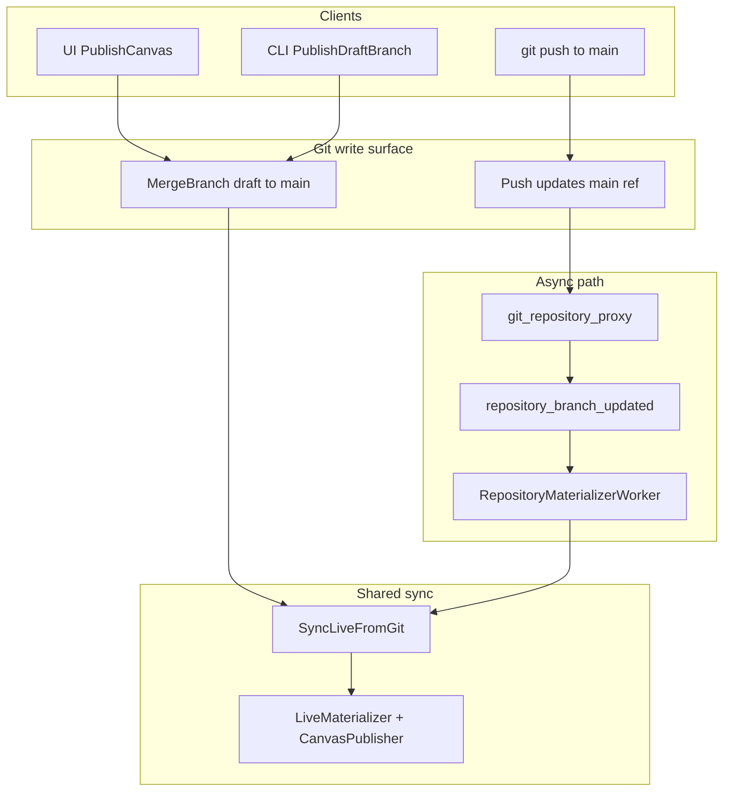

# Git-first live publish (Option 2)

## Target architecture

Publish becomes uni-directional: **git `main` advances first**, then **DB live projection is always derived** from the main HEAD SHA via one shared function.



Mirror the existing draft pattern from [`sync_draft_branch.go`](pkg/canvas/materialize/sync_draft_branch.go):

| Client | Git write | Live materialization |
|--------|-----------|----------------------|
| UI / CLI `PublishCanvas` | `MergeBranch` (sync) | `SyncLiveFromGit` (sync, same function) |
| External `git push` to `main` | Already on server | Worker → `SyncLiveFromGit` (async) |

**Not changing:** commits still target draft branches only ([`commit_canvas_repository_files.go`](pkg/grpc/actions/canvases/commit_canvas_repository_files.go) blocks `main`). Publish remains a merge-to-`main` operation, not a direct main commit.

---

## 1. Add `SyncLiveFromGit`

**New file:** [`pkg/canvas/materialize/sync_live.go`](pkg/canvas/materialize/sync_live.go)

Centralize live materialization currently inlined in [`publish_canvas.go`](pkg/grpc/actions/canvases/publish_canvas.go) and [`live.go`](pkg/canvas/materialize/live.go):

```go
type SyncLiveFromGitOptions struct {
    HeadSHA                    string
    SkipChangeManagementCheck  bool // set only by trusted API publish paths after CM validation
}

func SyncLiveFromGit(ctx, tx, gitProvider, reg, encryptor, authService, webhookBaseURL, orgID, canvasID, opts) (*models.CanvasVersion, error)
```

Responsibilities (move from `PublishCanvas` / `LiveMaterializer` callers):

1. Validate branch is `main` (read HEAD from git if `HeadSHA` empty)
2. **Change-management guard:** if canvas has change management enabled and `SkipChangeManagementCheck` is false → fail with `FailedPrecondition` (records `materialization_status=error` on [`repository_materialization_state`](pkg/models/repository_materialization_state.go)); per your choice, **external git pushes cannot go live when CM is on**
3. `ensureCanvasNameAvailableInTransaction` (from snapshot name, currently in `PublishCanvas`)
4. Call existing `LiveMaterializer.MaterializeLive` (CanvasPublisher + `live_version_id` promotion)
5. `refreshOpenCanvasChangeRequestsInTransaction`
6. Emit `repository_branch_updated` for `main` with `ready`/`error` status (symmetry with draft materializer in [`draft.go`](pkg/canvas/materialize/draft.go))
7. Idempotent: skip when `repository_materialization_state` + `live_version_id` already match HEAD SHA and status is `ready`

**Unit tests:** [`pkg/canvas/materialize/sync_live_test.go`](pkg/canvas/materialize/sync_live_test.go) — idempotency, CM rejection, error state on parse failure.

---

## 2. Extend `RepositoryMaterializerWorker` for `main`

**File:** [`pkg/workers/repository_materializer.go`](pkg/workers/repository_materializer.go)

Today the worker **no-ops on main**:

```112:114:pkg/workers/repository_materializer.go
	if message.GetBranch() == models.CanvasGitBranchMain {
		return nil
	}
```

Changes:

- Remove the early return; route by branch:
  - `main` → `SyncLiveFromGit` (with CM check enforced)
  - `drafts/*` → existing `SyncDraftBranchFromGit`
- Add worker dependencies required by `LiveMaterializer` / `CanvasPublisher`:
  - `Encryptor`, `AuthService`, `WebhookBaseURL`
- Idempotency short-circuit for main: skip when HEAD already materialized and `canvas.live_version_id == headSHA`

**Wire deps in** [`pkg/server/server.go`](pkg/server/server.go) (`START_REPOSITORY_MATERIALIZER` block ~L205–208): pass `encryptor`, `authService`, `getWebhookBaseURL(baseURL)` into `NewRepositoryMaterializerWorker`.

The git proxy already publishes `repository_branch_updated` for `main` after push ([`git_repository_proxy.go`](pkg/public/git_repository_proxy.go) L112–126); no proxy changes needed.

---

## 3. Refactor `PublishCanvas` to git-first + shared sync

**File:** [`pkg/grpc/actions/canvases/publish_canvas.go`](pkg/grpc/actions/canvases/publish_canvas.go)

New flow:

1. Auth / validation (unchanged, including CM-disabled check)
2. **`gitProvider.MergeBranch`** — git write first, outside DB transaction (unchanged)
3. **DB transaction:** `SyncLiveFromGit(..., SkipChangeManagementCheck: true)` + delete draft DB metadata (`DeleteDraftBranchInTransaction`, `DeleteRepositoryMaterializationStateInTransaction`)
4. **`gitProvider.DeleteBranch`** for merged draft (after successful sync, unchanged)
5. Return serialized version from sync result

Remove direct `Materializer.MaterializeFromGit(ModeLive)` call.

---

## 4. Refactor other live materialization call sites

Replace `MaterializeFromGit(..., ModeLive, ...)` with `SyncLiveFromGit` where the intent is “main HEAD is live”:

| File | Notes |
|------|-------|
| [`publish_canvas_change_request.go`](pkg/grpc/actions/canvases/publish_canvas_change_request.go) | Git CR path: merge + `SyncLiveFromGit(SkipChangeManagementCheck: true)`; leave legacy DB-only CR path untouched |
| [`create_canvas.go`](pkg/grpc/actions/canvases/create_canvas.go) | Initial main seed after repo create |
| [`installation/install.go`](pkg/installation/install.go) | Install seed on main |
| [`test/support/git_first_canvas.go`](test/support/git_first_canvas.go) | Test helper |

Keep `MaterializeFromGit` / `ModeLive` as thin wrapper or deprecate in favor of `SyncLiveFromGit` only.

---

## 5. UI / CLI behavior

**Minimal changes expected** — API publish stays synchronous and still returns a `Version` in `PublishCanvasResponse`, so [`usePublishCanvas`](web_src/src/hooks/useCanvasData.ts) and [`handleCommitOrPublish`](web_src/src/pages/workflowv2/index.tsx) keep working.

**Optional UX polish (small):**
- In [`index.tsx`](web_src/src/pages/workflowv2/index.tsx) websocket handler, treat `repository_branch_updated` on `main` while viewing live (no local staging) like a remote update — invalidate canvas/version queries or set reload banner. `canvas_updated` from `LiveMaterializer` may already suffice; verify during implementation.

**CLI:** [`PublishDraftBranch`](pkg/cli/commands/apps/common/repository.go) unchanged — still calls `PublishCanvas`.

**New pure-git publish workflow (document):**
```bash
git push origin drafts/$(superplane me -q id):main
# worker materializes live shortly after; draft branch is NOT auto-deleted
```

---

## 6. Docs

Update [`docs/contributing/git-native-apps.md`](docs/contributing/git-native-apps.md):

- Materialization table: add row for external push to `main` → async `SyncLiveFromGit`
- Document pure-git publish command and CM restriction
- Clarify that `PublishCanvas` API still performs the merge for UI/CLI but live projection uses the same sync function as the worker

---

## 7. Tests

| Area | Action |
|------|--------|
| Unit | `sync_live_test.go` — CM guard, idempotency, error marking |
| Worker | New test: `RepositoryBranchUpdatedMessage` for `main` → live materialized |
| Regression | [`publish_canvas_test.go`](pkg/grpc/actions/canvases/publish_canvas_test.go) — still passes with shared sync |
| Integration | Simulate git push updating `main` (proxy message or direct worker consume) → `live_version_id` advances |

Run: `make test PKG_TEST_PACKAGES=./pkg/canvas/materialize,./pkg/workers`, targeted grpc tests, `make check.build.ui` if UI websocket tweak is added.

---

## Policy summary

- **Uni-directional:** live DB never updates without git `main` HEAD advancing first; all live reads come from materialized projection of that SHA.
- **Change management:** external main push → materialization **rejected** when CM enabled; CR/API publish paths pass `SkipChangeManagementCheck: true` after their own approval checks.
- **Draft cleanup:** only `PublishCanvas` API deletes the merged draft branch; external git publish leaves draft branches for manual cleanup.
- **CanvasPublisher failure:** `SyncLiveFromGit` returns error, does not advance `live_version_id` (existing `LiveMaterializer` behavior); worker retries on next message or re-push.
