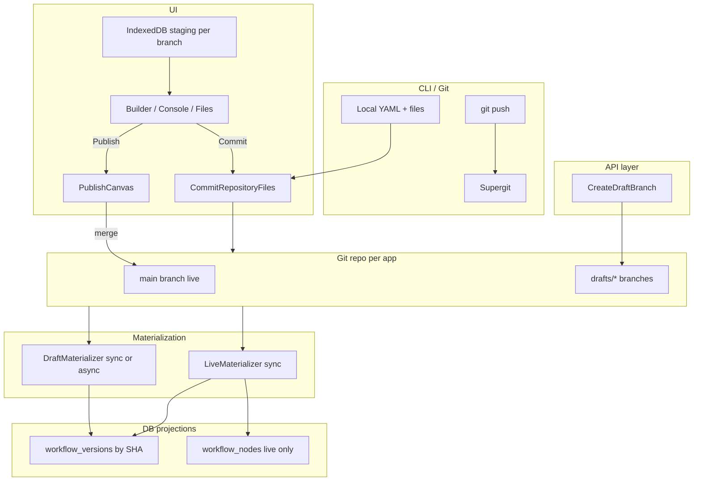
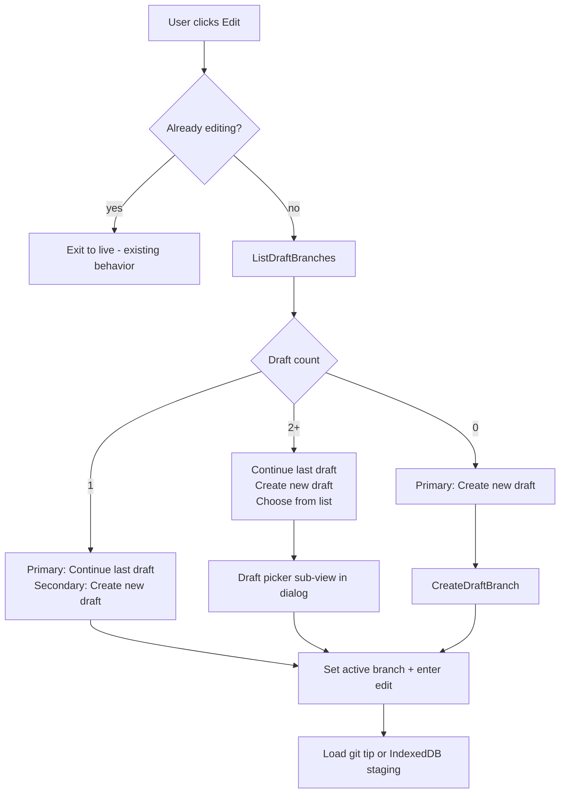

# Git-First Architecture (Option 4)

## Target architecture

**Uni-directional rule:** spec never flows DB → git. All spec reads for drafts/live come from DB rows **materialized from git** (UI IndexedDB is client-only staging until Commit).

**Option 4 materialization tiers:**

| Trigger | Git | DB |
|---------|-----|-----|
| UI/CLI **Commit** on draft branch | Atomic commit all files | **Sync** `DraftMaterializer` |
| External **git push** to draft branch | Already on server | **Async** worker + websocket |
| **Publish** (merge → `main`) | Merge draft branch → `main` | **Sync** `LiveMaterializer` + `CanvasPublisher` |

No legacy path; fresh DB schema only ([`db/structure.sql`](db/structure.sql) regenerated via migrations).

---

## Phase 1 — Schema and domain models

### 1.1 New / changed tables (migrations via `make db.migration.create`)

- **`workflow_versions`**: change `id` from UUID to `varchar(40)` (git commit SHA). Remove `idx_workflow_versions_unique_draft`. Add columns:
  - `git_branch text NOT NULL` (`main` or `drafts/{id}`)
  - `materialization_status varchar(32)` (`pending`, `ready`, `error`)
  - `materialization_error text`
  - Drop reliance on mutable draft rows; each commit = new immutable version row
- **`workflows.live_version_id`**: `varchar(40)` FK → `workflow_versions.id`
- **`workflow_runs.version_id`**: `varchar(40)` FK
- **`workflow_change_requests`**: `version_id` and `based_on_version_id` → `varchar(40)`
- **New `canvas_draft_branches`**: maps draft branch → metadata
  - `canvas_id`, `branch_name` (unique per canvas), `owner_id`, `display_name`, `created_at`, `tip_sha`, `created_by`
- **New `repository_materialization_state`**: tracks last materialized SHA per `(canvas_id, branch)`
  - `canvas_id`, `branch`, `head_sha`, `materialized_sha`, `status`, `error`, `updated_at`

### 1.2 Model layer ([`pkg/models`](pkg/models))

- Update [`canvas_version.go`](pkg/models/canvas_version.go): SHA primary key; remove `SaveCanvasDraftInTransaction` / one-draft-per-user logic; add `UpsertMaterializedVersion`, `FindVersionBySHA`, `ListVersionsForBranch`
- Add [`canvas_draft_branch.go`](pkg/models/canvas_draft_branch.go)
- Add [`repository_materialization_state.go`](pkg/models/repository_materialization_state.go)
- Update [`canvas.go`](pkg/models/canvas.go): `live_version_id` as string SHA
- Update change request models to use SHA version references

### 1.3 Reserved paths

- Document/enforce: `canvas.yaml`, `console.yaml` at repo root are system-managed paths (committed atomically)
- Keep [`.superplane` reserved](pkg/git/provider/provider.go) for future metadata

---

## Phase 2 — Git provider: branch-aware operations

Extend [`pkg/git/provider/provider.go`](pkg/git/provider/provider.go):

| Method | Purpose |
|--------|---------|
| `Head(ctx, repoID, ref)` | HEAD SHA for branch or tag |
| `ListFiles(ctx, repoID, ref)` | Already partial in supergit client; wire ref through provider |
| `GetFile(ctx, repoID, path, ref)` | Read file at ref |
| `ListBranches(ctx, repoID, prefix)` | List `drafts/*` |
| `CreateBranch(ctx, repoID, branch, fromRef)` | New draft from `main` |
| `MergeBranch(ctx, repoID, sourceBranch, targetBranch, message)` | Publish: draft → `main` |
| `DeleteBranch(ctx, repoID, branch)` | Discard draft |

Implement in [`pkg/git/supergit`](pkg/git/supergit) (primary) and [`pkg/git/codestorage`](pkg/git/codestorage); update [`pkg/git/inmemory`](pkg/git/inmemory) for tests.

Update [`CommitCanvasRepositoryFiles`](pkg/grpc/actions/canvases/commit_canvas_repository_files.go): accept `branch`, require full-file snapshot (all changed paths in one commit), validate reserved paths.

---

## Phase 3 — Materialization core

New package: **`pkg/canvas/materialize/`**

### 3.1 `LoadRepoSnapshot(ctx, repoID, sha) (*RepoSnapshot, error)`

- Read all files at SHA (at minimum `canvas.yaml`, `console.yaml`)
- Reuse parsers from [`pkg/installation/fetch.go`](pkg/installation/fetch.go) and [`pkg/models/canvas_dashboard_yml.go`](pkg/models/canvas_dashboard_yml.go)
- Validate; return structured canvas + console + extra file paths

### 3.2 `DraftMaterializer`

- Input: `canvasID`, `branch`, `commitSHA`
- Upsert `workflow_versions` row (`id=sha`, `state=draft|snapshot`, nodes/edges/console JSON from YAML)
- Update `canvas_draft_branches.tip_sha`
- Update `repository_materialization_state`
- Emit `canvas_version_updated` websocket/RabbitMQ ([`pkg/grpc/actions/messages/canvas.go`](pkg/grpc/actions/messages/canvas.go))
- On parse error: set `materialization_status=error`, do not partially write nodes

### 3.3 `LiveMaterializer`

- Input: `canvasID`, `commitSHA` (must be `main` HEAD after merge)
- Load previous live SHA from `workflows.live_version_id`
- Upsert `workflow_versions` row (`state=published`)
- Run [`changesets.CanvasPublisher`](pkg/grpc/actions/canvases/changesets/canvas_publisher.go) from previous live version row → new version row (reconcile `workflow_nodes`, webhooks, subscriptions)
- Set `workflows.live_version_id = commitSHA`
- Emit `canvas_updated` + `canvas_version_updated`
- **On CanvasPublisher failure:** do not update `live_version_id`; return error for retry

### 3.4 `MaterializeFromGit` orchestrator

- Single entry used by sync handlers and async worker
- Idempotent on same SHA

---

## Phase 4 — API / proto changes

Edit [`protos/canvases.proto`](protos/canvases.proto); regenerate (`make pb.gen`, `make openapi.*`).

### 4.1 Remove RPCs (spec mutation)

- `UpdateCanvasVersion`
- `ApplyCanvasVersionChangeset`
- `ValidateCanvasVersionChangeset` (unless reimplemented as validate-YAML-only pre-commit)
- `UpdateCanvasDashboard`
- `CreateCanvasVersion` (replaced)

### 4.2 Add / extend RPCs

| RPC | Behavior |
|-----|----------|
| `CreateDraftBranch` | Git create branch from `main`; create `canvas_draft_branches` row; optional seed commit with current `main` files |
| `ListDraftBranches` | Git branches + DB metadata + tip materialization status |
| `DeleteDraftBranch` | Delete git branch + DB row; cannot delete `main` |
| `CommitCanvasRepositoryFiles` | **Extend:** `branch`, atomic all-files; on success → **sync** `DraftMaterializer` |
| `PublishCanvas` | Merge `draft_branch` → `main`; **sync** `LiveMaterializer`; CR path uses same |
| `GetCanvasRepositoryFile` | Add `ref` / `branch` param |
| `ListCanvasRepositoryFiles` | Add `ref` / `branch` param |

### 4.3 Version ID semantics

- All `version_id` fields in API = 40-char commit SHA
- `DescribeCanvasVersion`, `ListCanvasVersions` return materialized projections only (`materialization_status=ready`)
- `CanvasVersion.metadata.id` = SHA

### 4.4 Authorization ([`pkg/authorization/interceptor.go`](pkg/authorization/interceptor.go))

- Register new RPCs; remove deleted RPCs
- Commit/publish require `canvases:update`

### 4.5 gRPC handlers ([`pkg/grpc/canvas_service.go`](pkg/grpc/canvas_service.go), [`pkg/grpc/actions/canvases/`](pkg/grpc/actions/canvases/))

- Wire new handlers; delete old action files after porting tests

---

## Phase 5 — Async worker (external git push)

New worker: **`pkg/workers/repository_materializer.go`**

- Trigger: supergit post-receive hook **or** poll `repository_materialization_state` after git proxy push (prefer webhook endpoint `POST /internal/git/repository-updated` if supergit supports it; else hook from push completion in proxy)
- Message: `{ canvas_id, branch, head_sha }`
- Run `DraftMaterializer` async (skip if `materialized_sha == head_sha`)
- Emit new websocket event `repository_branch_updated { canvasId, branch, headSha, materializationStatus }`

Register in [`cmd/server/main.go`](cmd/server/main.go) + docker-compose env vars.

---

## Phase 6 — Create / install flows seed git

### 6.1 [`CreateCanvas`](pkg/grpc/actions/canvases/create_canvas.go)

- After repo provision: write initial `canvas.yaml` (+ empty `console.yaml`) to `main` via git commit
- Sync `LiveMaterializer` for initial SHA
- Remove direct JSON node writes to version row as SoT

### 6.2 [`installation/install.go`](pkg/installation/install.go)

- After create: copy fetched `canvas.yaml` / `console.yaml` into per-app git repo on `main` (not DB-only)
- Materialize live from that commit

---

## Phase 7 — Change requests (branch/SHA based)

Adapt [`pkg/grpc/actions/canvases/create_canvas_change_request.go`](pkg/grpc/actions/canvases/create_canvas_change_request.go), publish/resolve/conflict logic:

- CR references: `draft_branch`, `tip_sha`, `based_on_sha` (live/main SHA at creation)
- Diff/conflict: compare materialized `workflow_versions` rows at SHAs (or git diff of `canvas.yaml` between SHAs)
- **Resolve:** Commit resolved YAML to draft branch → sync draft materialize → refresh conflict flags
- **Publish CR:** `PublishCanvas` merge + live materialize (reuse [`publish_canvas_change_request.go`](pkg/grpc/actions/canvases/publish_canvas_change_request.go) merge path, remove DB-only JSON merge as SoT)
- Update [`docs/contributing/canvas-change-requests.md`](docs/contributing/canvas-change-requests.md)

---

## Phase 8 — UI: IndexedDB staging + git-only Files

### 8.1 IndexedDB layer

New [`web_src/src/lib/canvas-staging/`](web_src/src/lib/) (not `utils/`):

- `openStagingDB`, `getStaging(canvasId, branch)`, `putStaging`, `clearStaging`
- Record: `{ canvasId, branch, baseHeadSha, files: Record<path, content>, updatedAt }`

### 8.2 Remove virtual files

- Delete generated file injection: [`web_src/src/pages/workflowv2/lib/canvas-files.ts`](web_src/src/pages/workflowv2/lib/canvas-files.ts) `buildWorkflowFiles` virtual entries; [`useWorkflowFilesFromCanvas.ts`](web_src/src/pages/workflowv2/useWorkflowFilesFromCanvas.ts)
- Files tab lists git paths only via [`useWorkflowRepositoryFilesCatalog.ts`](web_src/src/pages/workflowv2/useWorkflowRepositoryFilesCatalog.ts)

### 8.3 Builder/console → staging

- On edit (debounced): serialize to `canvas.yaml` / `console.yaml` → IndexedDB
- On branch load: if staging exists and `baseHeadSha === headSha` → parse staging into builder; else load from git files at tip
- Remove all calls to `UpdateCanvasVersion`, `ApplyCanvasVersionChangeset`, `UpdateCanvasDashboard` from [`web_src/src/pages/workflowv2/index.tsx`](web_src/src/pages/workflowv2/index.tsx) and [`DashboardOverlay.tsx`](web_src/src/pages/workflowv2/dashboard/DashboardOverlay.tsx)

### 8.4 Commit / Publish UX

- Extend [`useWorkflowFilesPublish.ts`](web_src/src/pages/workflowv2/useWorkflowFilesPublish.ts) / header actions:
  - **Commit** when staging non-empty: flush all staged files → `CommitCanvasRepositoryFiles` on active draft branch → clear staging on success
  - **Publish** when staging empty: call `PublishCanvas` (merge to main)
- Block Publish if `materialization_status != ready` on draft tip

### 8.5 External updates + reload banner

- Listen for `repository_branch_updated` / `canvas_version_updated`
- When remote HEAD advances: show existing reload banner ([`remoteCanvasUpdatePending`](web_src/src/pages/workflowv2/index.tsx)); clear IndexedDB staging on reload
- Do not auto-apply remote while local staging exists (keep banner)

### 8.6 Draft discovery — persistent draft list

Users must be able to see all drafts for an app **without** entering edit mode first.

**Primary surface: sidebar Drafts section**

Extend [`web_src/src/components/CanvasToolSidebar/VersionsTabPanel.tsx`](web_src/src/components/CanvasToolSidebar/VersionsTabPanel.tsx) (or add sibling `DraftsTabPanel.tsx` if versions vs drafts should separate):

| Column / field | Source |
|----------------|--------|
| Display name | `canvas_draft_branches.display_name` (fallback: branch suffix) |
| Branch | `drafts/{id}` |
| Tip SHA | short hash (7 chars) + full on hover |
| Updated | `updated_at` from branch row or tip commit time |
| Owner | user display name |
| Status | materialization (`ready` / `pending` / `error`) |
| Active indicator | highlight row matching current `?branch=` |

**Actions per row:**

- **Open** — activate draft branch (same as choosing from Edit dialog); readonly if user lacks update permission
- **Delete** — `DeleteDraftBranch` with confirm; disabled if branch has open change request

**Secondary surface: header chip**

When editing, show `Editing: {displayName} @ {shortSha}` in canvas header ([`web_src/src/ui/CanvasPage/index.tsx`](web_src/src/ui/CanvasPage/index.tsx) or workflow header). Click opens draft list / switch dialog.

**Data:** `ListDraftBranches` API via `useDraftBranches(canvasId)` hook; invalidate on `repository_branch_updated` websocket.

---

### 8.7 Edit entry flow — StartEditingDialog

Replace today’s [`handleToggleEditMode`](web_src/src/pages/workflowv2/index.tsx) behavior (auto-reuse single draft or call `CreateCanvasVersion`) with an explicit chooser.

**Trigger:** User clicks **Edit** in header when viewing **live** (`!hasEditableVersion`).

**New component:** `StartEditingDialog` ([`web_src/src/pages/workflowv2/StartEditingDialog.tsx`](web_src/src/pages/workflowv2/StartEditingDialog.tsx))

**“Last draft” definition (priority order):**

1. `localStorage` key `superplane:lastDraftBranch:{canvasId}` if branch still exists
2. Else most recently updated draft branch for current user
3. Else most recently updated draft branch org-wide (any owner)

**Dialog options by draft count:**

| Drafts | Options shown |
|--------|----------------|
| 0 | **Create new draft** (only action) |
| 1 | **Continue {name}** (primary, pre-selected) · **Create new draft** |
| 2+ | **Continue last draft** (primary) · **Create new draft** · **Choose from list…** (opens inline list / second step) |

**Choose from list:** Reuse draft list row UI from sidebar inside dialog (search/filter by name, owner, updated time).

**After selection:**

- Set `activeDraftBranch` state + `?branch=drafts/xyz` in URL ([`useSearchParams`](web_src/src/pages/workflowv2/index.tsx))
- Persist choice to `localStorage`
- Load branch files at tip SHA into builder/console (or IndexedDB staging if valid)
- Set `hasEditableVersion` / edit mode ON

**Edge cases:**

- **Uncommitted IndexedDB staging** on current branch when switching: confirm discard (same copy as reload banner) or cancel
- **`?edit=1` deep link** ([`useWorkflowHeaderEditActions`](web_src/src/pages/workflowv2/useWorkflowHeaderEditActions.ts)): open `StartEditingDialog` instead of silent draft creation
- **Console “Add panel”** while live ([`useWorkflowViewModeActions`](web_src/src/pages/workflowv2/useWorkflowViewModeActions.ts)): open same dialog before entering edit
- **External draft created via CLI/git:** list refreshes via websocket; appears in dialog on next Edit

**Remove:** `useCreateCanvasVersion`, `handleCreateVersion`, `createCanvasVersionMutation` paths tied to old single-draft model.

---

### 8.8 Active draft session state

New hook: `useActiveDraftBranch(canvasId)` — owns:

- `activeBranch: string | null` (null = viewing live)
- `activateBranch(branch)` / `exitToLive()`
- sync with URL `?branch=` and localStorage last-draft key

Replace `activeCanvasVersion` / `hasEditableVersion` semantics:

- **Live view:** `activeBranch === null`, render from `main` / `live_version_id` SHA
- **Edit view:** `activeBranch === drafts/xyz`, render from branch tip (via staging or materialized projection)

Published snapshots / runs history still use commit SHA (`?version=` optional for historical run view).

---

### 8.9 Hooks cleanup

- Remove/update [`useCanvasData.ts`](web_src/src/hooks/useCanvasData.ts) mutations for deleted APIs
- Regenerate OpenAPI client (`make openapi.web.client.gen`)

---

## Phase 9 — CLI

| Command | New behavior |
|---------|--------------|
| [`apps canvas update`](pkg/cli/commands/apps/canvas/update.go) | Commit `canvas.yaml` (+ required companion files) to draft branch via API |
| [`apps console set`](pkg/cli/commands/apps/console/set.go) | Merge into commit payload with `canvas.yaml` or separate commit that includes both files in one API call |
| [`apps canvas get`](pkg/cli/commands/apps/canvas/get.go) | Read from materialized version at branch tip SHA |
| New `apps drafts create/list/delete` | Branch management |
| New `apps commit` | Commit all local dir files to branch (atomic) |
| [`clone`](pkg/cli/clone.go) | Document: clone gets git files; use `get` for materialized read |

Remove CLI paths that call deleted RPCs. Update agent prompts ([`pkg/agents/constants.go`](pkg/agents/constants.go), [`pkg/agents/anthropic/agent_prompt.md`](pkg/agents/anthropic/agent_prompt.md)).

---

## Phase 10 — Tests and verification

### Backend

- Unit: `pkg/canvas/materialize/*_test.go` (parse, draft upsert, live publisher integration)
- Unit: git provider branch ops
- Update/remove: `update_canvas_version_test.go`, `apply_canvas_version_changeset_test.go`, `canvas_dashboard_test.go`
- CR tests with SHA versions

### Frontend

- Staging DB tests; Files tab without virtual files
- Commit/Publish button state tests (extend [`WorkflowFilesOverlayLayer.spec.tsx`](web_src/src/pages/workflowv2/WorkflowFilesOverlayLayer.spec.tsx))
- `StartEditingDialog` tests (0 / 1 / N drafts)
- Draft list panel tests (`VersionsTabPanel` / `DraftsTabPanel`)
- `useActiveDraftBranch` URL + localStorage sync tests

### E2E

- New flow: create draft branch → edit in UI → commit → publish → run workflow
- Edit → StartEditingDialog → create new vs continue last vs pick from list
- Draft list visible in sidebar; switch draft with staging confirm
- CLI commit → UI reload banner → reload
- Git push → async materialize → UI reload

### CI commands

- `make test`, `make lint`, `make check.build.app`
- `make format.js`, `make check.build.ui`
- `make e2e` for new packages

---

## Phase 11 — Documentation

- New doc: `docs/contributing/git-native-apps.md` (architecture, staging, commit vs publish, three interfaces)
- Update [`docs/contributing/canvas-change-requests.md`](docs/contributing/canvas-change-requests.md)
- Update [`docs/prd/console-and-widgets.md`](docs/prd/console-and-widgets.md) install section (per-app repo seed)
- Update [`AGENTS.md`](AGENTS.md) if CLI workflow changes

---

## Implementation order (recommended)

Strict dependency order to keep main buildable:

1. Schema + models (Phase 1)
2. Git provider branches (Phase 2)
3. Materialize package (Phase 3)
4. Proto + commit/create/publish handlers (Phase 4.2, 4.5 — partial)
5. Remove old RPCs + update authorization (Phase 4.1)
6. Create/install seed git (Phase 6)
7. Async worker (Phase 5)
8. Change requests (Phase 7)
9. UI staging + remove DB saves (Phase 8)
10. CLI (Phase 9)
11. Tests + docs (Phases 10–11)

---

## Key files to touch (summary)

| Area | Primary files |
|------|----------------|
| Schema | `db/migrations/*`, [`db/structure.sql`](db/structure.sql) |
| Materialize | **new** `pkg/canvas/materialize/` |
| Git | [`pkg/git/provider/provider.go`](pkg/git/provider/provider.go), [`pkg/git/supergit/`](pkg/git/supergit) |
| API | [`protos/canvases.proto`](protos/canvases.proto), [`pkg/grpc/actions/canvases/`](pkg/grpc/actions/canvases/) |
| Worker | **new** `pkg/workers/repository_materializer.go`, [`cmd/server/main.go`](cmd/server/main.go) |
| UI | [`web_src/src/pages/workflowv2/index.tsx`](web_src/src/pages/workflowv2/index.tsx), **new** `web_src/src/lib/canvas-staging/`, **new** `StartEditingDialog.tsx`, [`VersionsTabPanel.tsx`](web_src/src/components/CanvasToolSidebar/VersionsTabPanel.tsx) |
| CLI | [`pkg/cli/commands/apps/canvas/`](pkg/cli/commands/apps/canvas/), [`pkg/cli/commands/apps/console/`](pkg/cli/commands/apps/console/) |

---

## Out of scope (Option 4 only)

- Full reconciliation loop (Option 5) — only minimal `repository_materialization_state` for async retry
- Legacy canvas migration / dual-mode
- Server-side working tree (IndexedDB is the UI staging layer)
