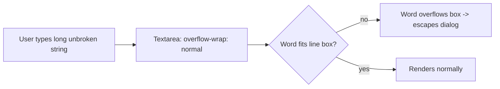

# Fix: Long commit message overflows in the commit message input (#6168)

## Problem

In the **Commit changes** dialog (`CommitStagingDialog`), typing a long commit
message with no spaces (a single unbroken string) causes the text to spill out
of the textarea and beyond the right edge of the dialog, painting over the
canvas behind it.

Root cause: the shared `Textarea` component relies on the browser default
`overflow-wrap: normal`, which never breaks an unbroken word. When the string
is longer than the box, it overflows instead of wrapping. The dialog width is
fixed (`w-full max-w-lg`), so the overflowing text escapes the modal.

## Fix

Add `break-words` (`overflow-wrap: break-word`) and `whitespace-pre-wrap` to the
base `Textarea` components so any unbroken string wraps within the box:

- `web_src/src/components/ui/textarea.tsx` (used by `CommitStagingDialog` and many others)
- `web_src/src/components/Textarea/textarea.tsx` (second base variant, same defect)

`break-word` only kicks in when a token would otherwise overflow, so normal
wrapping at spaces is unchanged. `width` stays explicit (`w-full`), so
`field-sizing-content` does not affect horizontal sizing.

## Why the shared component (long-term)

Fixing the base `Textarea` rather than patching only `CommitStagingDialog`
resolves the class of bug for every current and future consumer (identity
fields, node forms, markdown editor, survey form, etc.).

### Pros
- One-line change fixes the reported case and all sibling textareas.
- No behavior change for normal, space-separated input.

### Cons / tradeoffs
- Touches a widely-used primitive, so it affects every textarea. This is the
  desired outcome, but worth noting for review.
- `overflow-wrap: break-word` (not `anywhere`) is intentional: it preserves
  intrinsic sizing and only breaks as a last resort, matching expected editor
  behavior.

## Verification
- Open the Commit changes dialog, paste a long unbroken string, confirm it
  wraps inside the textarea and the dialog no longer overflows.
