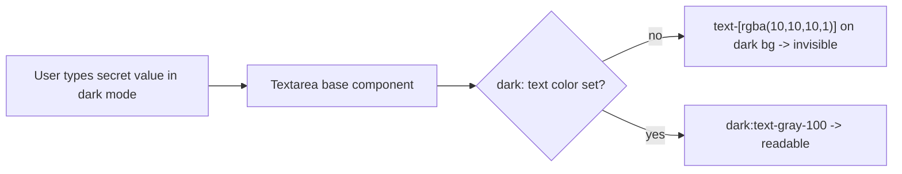

# Fix: Black text on dark background when creating secrets (#6137)

## Problem

In the **Create Secret** dialog, the text typed into a secret **Value** field is
rendered as near-black on a dark background in dark mode, making it effectively
invisible. This is not a deliberate masking feature — the field is a plain
`<textarea>` whose color simply does not adapt to the dark theme.

Root cause: the dialog's Value field uses the base `Textarea` from
`web_src/src/components/Textarea/textarea.tsx`. That component hardcodes a
near-black text color (`text-[rgba(10,10,10,1)]`) together with a dark
background (`dark:bg-input/30`) but is **missing a `dark:` text-color
override**. Its sibling primitives already get this right:

| Component | Path | Dark text color |
| --- | --- | --- |
| `Input` (secret **Key** field) | `components/ui/input.tsx` | `dark:text-gray-100` ✅ |
| `Textarea` (other variant) | `components/ui/textarea.tsx` | `dark:text-gray-100` ✅ |
| `Textarea` (secret **Value** field) | `components/Textarea/textarea.tsx` | *missing* ❌ |

## Fix

Add the missing dark-mode text color to the base `Textarea` component so its
text is readable on the dark background, matching `Input` and the other
`Textarea` variant:

- `web_src/src/components/Textarea/textarea.tsx`: append `dark:text-gray-100`.

## Why fix the base component (long-term)

The Value field is one of many consumers of this `Textarea`. Fixing the shared
primitive rather than patching only `CreateSecretDialog` resolves the class of
bug for every current and future consumer in dark mode, and aligns this
component with its already-correct siblings.

### Pros
- One-line change fixes the reported case and every other consumer of this
  `Textarea` in dark mode.
- Brings the three text-input primitives (`Input`, both `Textarea`s) into
  consistent dark-mode behavior.
- No change to light mode.

### Cons / tradeoffs
- Touches a widely-used primitive, so it affects every textarea. This is the
  intended outcome, but worth noting for review.
- Two near-duplicate `Textarea` components remain (`components/ui/textarea.tsx`
  and `components/Textarea/textarea.tsx`). Consolidating them is out of scope
  here but would prevent this drift from recurring; noted as follow-up.

## Verification
- Open **Create Secret** in dark mode, type a value, confirm the text is
  clearly visible.
- Confirm light mode is unchanged, and that the secret **Key** input (already
  correct) still reads normally.
- `make check.build.ui` and `make format.js`.
