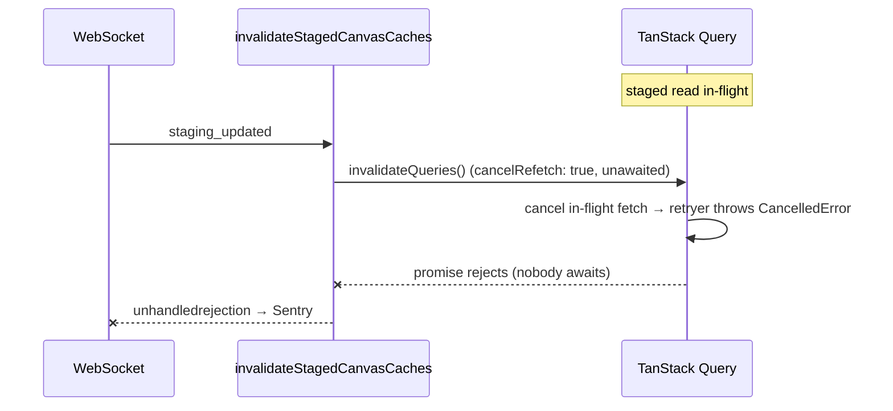

# Fix: `Error: CancelledError` unhandled rejection (#5945)

## Problem

A WebSocket `staging_updated` event triggers `invalidateStagedCanvasCaches()`,
which fires **five** `queryClient.invalidateQueries()` calls **without awaiting
or handling** the returned promises.

`invalidateQueries` defaults to `cancelRefetch: true` (TanStack Query v5). When
a staged read (`canvas.yaml` / `console.yaml`) is already **in-flight**, the
invalidation cancels it. Cancellation makes the retryer throw a
`CancelledError`, which rejects the unawaited promise and escapes to
`window.onunhandledrejection` — the Sentry error.

Introduced in #5937 (Jul 7); first seen the same day.

## Fix

In `web_src/src/hooks/useCanvasData.ts → invalidateStagedCanvasCaches()`:

1. **`cancelRefetch: false`** on every `invalidateQueries` call. This is the
   correct semantic for event-driven invalidation: when a `staging_updated`
   event arrives mid-fetch, let the in-flight fetch finish (it already returns
   fresh data) instead of cancelling and restarting it. This removes the source
   of the `CancelledError`.
2. **Swallow the fire-and-forget promises** via `void Promise.allSettled([...])`.
   Callers (WebSocket handler, mutation `onSuccess`) intentionally do not await
   this helper, so any rejection — the known `CancelledError` or a future one —
   must be contained here rather than leaking to `onunhandledrejection`.

Guard (1) fixes the reported cause; guard (2) makes the helper robust for the
long term so no rejection from these detached promises can surface again.

## Pros / Cons / Tradeoffs

**Pros**
- Fixes the exact reported cause and defends against the whole class of leaked
  rejections from this detached helper.
- Correct semantics: WS-driven invalidation no longer aborts a healthy
  in-flight read.
- Contained to one function; no API or call-site changes.

**Cons / tradeoffs**
- `cancelRefetch: false` means an in-flight read is not restarted; the just-
  arrived event data is picked up by the *next* fetch. Acceptable — the
  in-flight fetch already returns current server state, and `invalidateQueries`
  still marks the query stale so subsequent reads refetch.
- `Promise.allSettled` silently absorbs errors here. That is intended for a
  fire-and-forget cache-invalidation helper; genuine query errors still surface
  through each query's own state/error handling.

## Verification
- `make check.build.ui` / `make format.js`.
- Existing tests in `useCanvasWebsocket.spec.ts` cover the `staging_updated`
  path; confirm they still pass.
