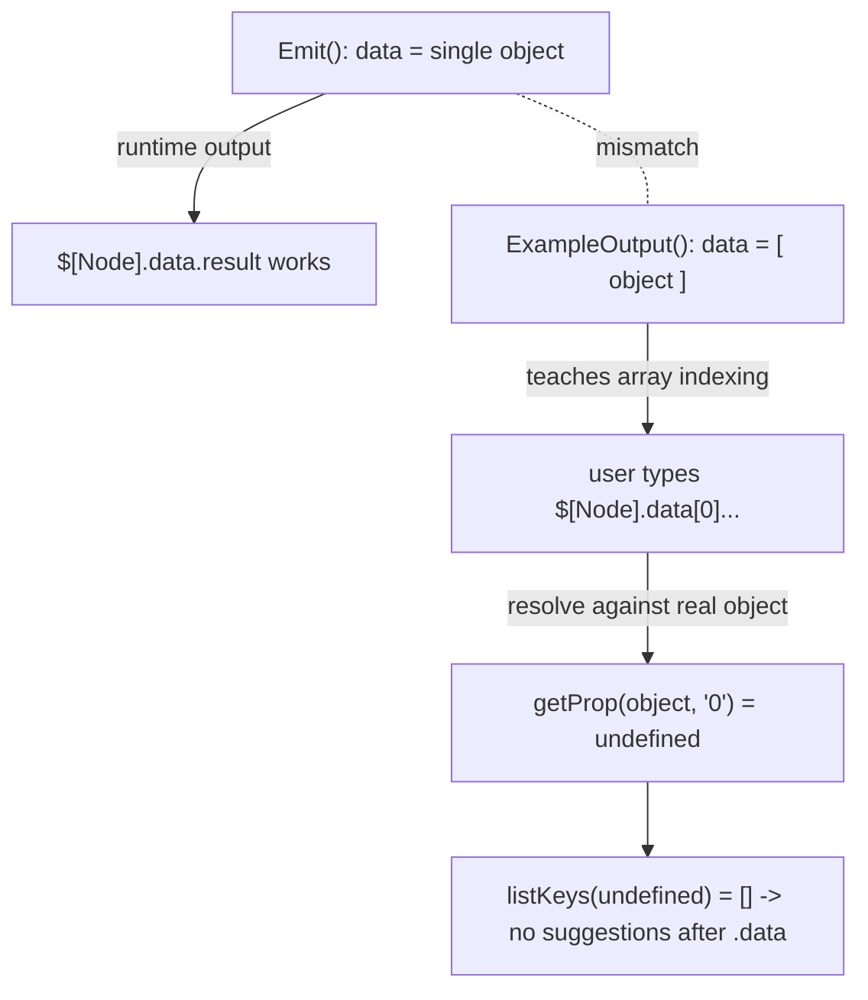

# Fix: Expression autocomplete breaks after `.data` on runner output (#5944)

## Problem

In the expression editor, autocomplete stops producing suggestions after `.data`
when referencing a **runner** node's output, e.g.:

```
{{ $["Fetch GitHub Stats"].data[0].result.closed_last_7_days.count }}
```

Autocomplete works up to `.data`, then goes silent — the user has to type the
rest blind. Other components (triggers, HTTP, integrations) work fine.

## Root cause — an example/runtime shape mismatch (not the autocomplete engine)

The runner components declare their example output's `data` as an **array**, but
at runtime the execution engine emits `data` as a **single object**.

`ExecutionStateContext.Emit` wraps every emitted payload individually:

```go
// pkg/workers/contexts/execution_state_context.go:61
for _, payload := range payloads {
    event := map[string]any{"type": payloadType, "timestamp": ..., "data": payload}
    // one event per payload -> data is ALWAYS a single object, never an array
}
```

The runner emits exactly one payload, so its real finished event is:

```jsonc
{ "type": "...finished", "timestamp": "...", "data": { "status": ..., "exit_code": ..., "result": {...} } }
```

confirmed by the mapper that reads it: `firstRunnerPayload` in
`web_src/src/pages/app/mappers/runner.tsx` accesses `outputs.passed[0].data.exit_code`
— treating `data` as an object.

But `ExampleOutput()` in all four runner components lied and declared `data` as
an array:

```go
// pkg/components/runner/run_python.go (also run_bash, run_javascript, run_commands)
"data": []any{map[string]any{ "status": ..., "exit_code": 0, "result": {...} }}
```

### Why this breaks autocomplete

The autocomplete engine (`web_src/src/components/AutoCompleteInput/core.ts`) is
**correct** — it walks arrays and objects fine (verified empirically, see below).
The mismatch is what breaks the flow:

- The array-shaped example teaches the user (and any downstream expectation) to
  write `.data[0]…`.
- On a real execution the node example is built from actual outputs, where
  `data` is an **object**. Resolving `…data[0]` then indexes an object with key
  `"0"` → `undefined` → `listKeys(undefined)` returns `[]` → **zero suggestions
  after `.data`**. Hard stop. Exactly the reported symptom.



### Empirical verification

A throwaway spec driving the real `getSuggestions` engine confirmed the
diagnosis (removed after use):

- `data` as an **object** (real shape): `$["…"].data.` → suggests
  `status/exit_code/result`; `$["…"].data[0].` → `[]` (the bug).
- `data` as an **array** (example shape): `$["…"].data[0].` → suggests fields
  (this is why the wrong shape looked plausible and misled users).

So the engine is not at fault; the backend example shape is.

## Fix

Make the runner `ExampleOutput()` `data` a single object, matching `Emit` and
every other component in the codebase (all use `data` as an object):

- `pkg/components/runner/run_python.go`
- `pkg/components/runner/run_bash.go`
- `pkg/components/runner/run_javascript.go`
- `pkg/components/runner/run_commands.go`

```go
"data": map[string]any{ "status": "succeeded", "exit_code": 0, "result": map[string]any{"example": "value"} }
```

Correct expression after the fix:
`{{ $["Fetch GitHub Stats"].data.result.closed_last_7_days.count }}` — and
autocomplete flows through the whole structure regardless of whether an
execution exists yet.

Regression test added: `pkg/components/runner/example_output_test.go` asserts
each runner's `ExampleOutput()["data"]` is an object with `status/exit_code/result`.

## Prevent recurrence (recommended follow-up)

The `examplepayloads` lint checker (`pkg/lint/examplepayloads/checker.go`)
already infers the real `data` schema from each `Emit(...)` call
(`spec.Data` via `inferPayloadList`, which unwraps `[]any{out}` to the element
object). Today `validateExampleAgainstSpecs` only checks the `type` string and
**ignores** `spec.Data`. Extending it to compare the example's `data` *kind*
(object vs array) against the inferred `spec.Data.Kind` would have caught this
at `make lint`.

- **Pro:** closes the whole class of bug for every component, using
  infrastructure that already exists.
- **Con / tradeoff:** must skip `schemaUnknown` (many `any`-typed payloads infer
  to unknown) to avoid false positives; needs a run of `make lint` across all
  components to confirm no legitimate shapes are flagged. Left out of the core
  fix to keep it focused and because Go tooling was unavailable in this session
  to validate it.

## Why this over patching the frontend

The frontend engine already handles arrays correctly, so patching it (e.g.
auto-injecting `[0]`, or descending empty arrays) would paper over the real
defect while leaving the runtime/example shapes inconsistent — the output
viewer, mappers, and any docs would still disagree with reality. Fixing the
source of truth (the example matches what the runner actually emits) is the
long-term-correct change and keeps all consumers consistent.

### Tradeoffs / notes

- Users who previously wrote `…data[0]…` against a runner have expressions that
  never resolved anyway (indexing an object) — this fix does not regress any
  working expression.
- **Go toolchain was not available in this session**, so `make lint`,
  `make format.go`, and `make test PKG_TEST_PACKAGES=./pkg/components/runner`
  must be run in CI / locally to confirm build + the new test. The edits are
  mechanical (array literal → object literal) and match the established
  convention.

## Verification checklist

- [ ] `make format.go && make lint && make check.build.app`
- [ ] `make test PKG_TEST_PACKAGES=./pkg/components/runner` (new regression test)
- [ ] In the app: add a runner node, connect a downstream node, confirm
      autocomplete suggests `data` → `result` → nested fields (no `[0]` needed).
