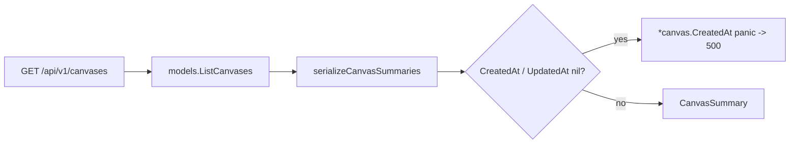

# Fix: HTTP 500 on `/api/v1/canvases` (#5853)

## Problem

`GET /api/v1/canvases` intermittently returns HTTP 500. The gRPC handler
`ListCanvases` panics while serializing canvas summaries, and the panic is
recovered as an `Internal` error.

Root cause (current code) is an **unconditional pointer dereference** in
`serializeCanvasSummaries`:

```go
// pkg/grpc/actions/canvases/list_canvases.go:111-112
CreatedAt: timestamppb.New(*canvas.CreatedAt),
UpdatedAt: timestamppb.New(*canvas.UpdatedAt),
```

`Canvas.CreatedAt` / `Canvas.UpdatedAt` are `*time.Time`. When either is `nil`
the deref panics → 500.



### History (from Sentry RCA)

- PR #3373 made `SerializeCanvas` call `FindLiveCanvasVersionByCanvasInTransaction`,
  which returned `ErrRecordNotFound` for canvases with `live_version_id = NULL`.
- PR #5338 replaced that with `serializeCanvasSummaries`, which no longer errors
  on a missing live version (it uses a **map lookup** on
  `FindLiveCanvasSpecsByCanvasIDs`, so an absent spec degrades gracefully).
- What that rewrite left behind is the unguarded `*canvas.CreatedAt` deref —
  the remaining source of 500s (last event 2026-06-29).

The live-version failure mode is **already resolved**; only the nil deref
remains.

## Fix

Add nil guards before dereferencing the timestamps in `serializeCanvasSummaries`
(`pkg/grpc/actions/canvases/list_canvases.go`):

```go
var createdAt, updatedAt *timestamppb.Timestamp
if canvas.CreatedAt != nil {
    createdAt = timestamppb.New(*canvas.CreatedAt)
}
if canvas.UpdatedAt != nil {
    updatedAt = timestamppb.New(*canvas.UpdatedAt)
}
// ...CanvasSummary{ CreatedAt: createdAt, UpdatedAt: updatedAt, ... }
```

A `nil` timestamp field serializes to an absent value in the proto/JSON
response — safe for the UI, and far better than a 500 for the whole list.

## Why this over alternatives

- **Guard at the serializer (chosen).** Fixes the exact panic and keeps the
  endpoint resilient no matter how a canvas row was produced. The fields are
  pointer types, so a `nil` is always representable; defending against it is the
  correct long-term contract.
- Changing the DB query to force non-null timestamps or making the columns
  non-nullable in the model does **not** protect against GORM leaving a pointer
  `nil` on partial scans/alias mismatches, and a single bad row would still take
  down the whole list. Rejected.

### Pros
- Removes the entire class of 500s from this endpoint; one bad row no longer
  fails the whole request.
- Minimal, localized, no schema/query change.

### Cons / tradeoffs
- A canvas with a genuinely missing timestamp now returns without that field
  rather than surfacing the anomaly. Acceptable — the list endpoint should not
  500, and such rows are already malformed.

## Tests

Extend `list_canvases_test.go` with a canvas whose `CreatedAt`/`UpdatedAt` are
`nil`, asserting `ListCanvases` returns 200 with the canvas present and empty
timestamps (regression guard against the panic).

## Verification

- `make test PKG_TEST_PACKAGES=./pkg/grpc/actions/canvases`
- `make lint && make check.build.app`
