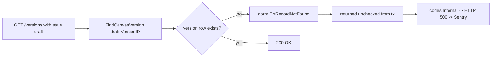

# Fix: HTTP 500 on `GET /api/v1/canvases/{id}/versions` (#5851)

## Problem

Sentry reported 29 HTTP 500s on the canvas **versions** endpoint, all for a
single canvas (`0c1a69ad…`) that had a stale user-draft row.

Root cause (at commit `2aa05bff`): in `ListCanvasVersionsPaginated`, the draft
version was resolved with `FindCanvasVersionInTransaction(tx, canvas.ID,
draft.VersionID)`. When the draft's `version_id` pointed at a version row that
no longer existed, GORM returned `gorm.ErrRecordNotFound`. Unlike the draft
lookup two lines above, this error was **returned unchecked** from the
transaction closure, so it surfaced as `codes.Internal` → HTTP 500 instead of a
benign "no draft version" outcome.

## Current status: the reported path is already gone

On this branch the endpoint has already been rewritten (PR #4107 + the later
removal of the canvas-draft subsystem):

- `list_canvas_versions.go` no longer resolves any draft/version by id. It only
  calls `ListCanvasVersionHistoryInTransaction` + `CountCanvasVersionsInTransaction`,
  neither of which dereferences a version id — so `ErrRecordNotFound` cannot
  occur here anymore.
- There is **no `CanvasUserDraft` / `FindCanvasDraft`** model left in the tree;
  the whole draft concept that produced the stale reference was removed.

So the specific 500 cannot recur through this code path. What remains is to
**lock in** that guarantee and confirm the same *class* of bug is guarded in the
sibling paths that still resolve a version by id.

## Fix (this change)

1. **Regression guard** — add a subtest to
   `pkg/grpc/actions/canvases/list_canvas_versions_test.go` that points a
   canvas's `live_version_id` at a non-existent version and asserts the endpoint
   returns success (never `codes.Internal`). If anyone re-introduces a
   version-by-id lookup into this handler, the test fails.

2. **Audit of the bug class** (verified, no code change needed) — every other
   HTTP-reachable caller of `FindCanvasVersion*` already maps
   `ErrRecordNotFound` to a non-500 result:
   - `describe_canvas_version.go` → `NotFound`
   - `services/files/file_reader.go` → `ErrFileNotFound`
   - `public/repository_file_download.go` → `ErrFileNotFound`

## Pros / cons & tradeoffs

- **Pro:** Zero behavior change; the fix is a test that pins current, correct
  behavior and prevents regressions of the exact defect Sentry reported.
- **Pro (long-term):** The underlying subsystem that caused the stale reference
  is already deleted, so this is a durable resolution, not a patch over a
  symptom.
- **Con / tradeoff:** Because the buggy line is gone, the test cannot exercise
  the original draft path directly; it guards the invariant ("versions listing
  never 500s on a dangling version reference") rather than the removed code.
  This is the strongest guard available without resurrecting dead code.
- **Alternative considered:** Broadly wrap every `FindCanvasVersion*` caller in
  `ErrRecordNotFound` handling. Rejected — the reachable handlers already do
  this, so it would be churn without behavior change.

## Verification

- `make test PKG_TEST_PACKAGES=./pkg/grpc/actions/canvases` — the new
  `stale live version reference -> no internal error` subtest passes.
