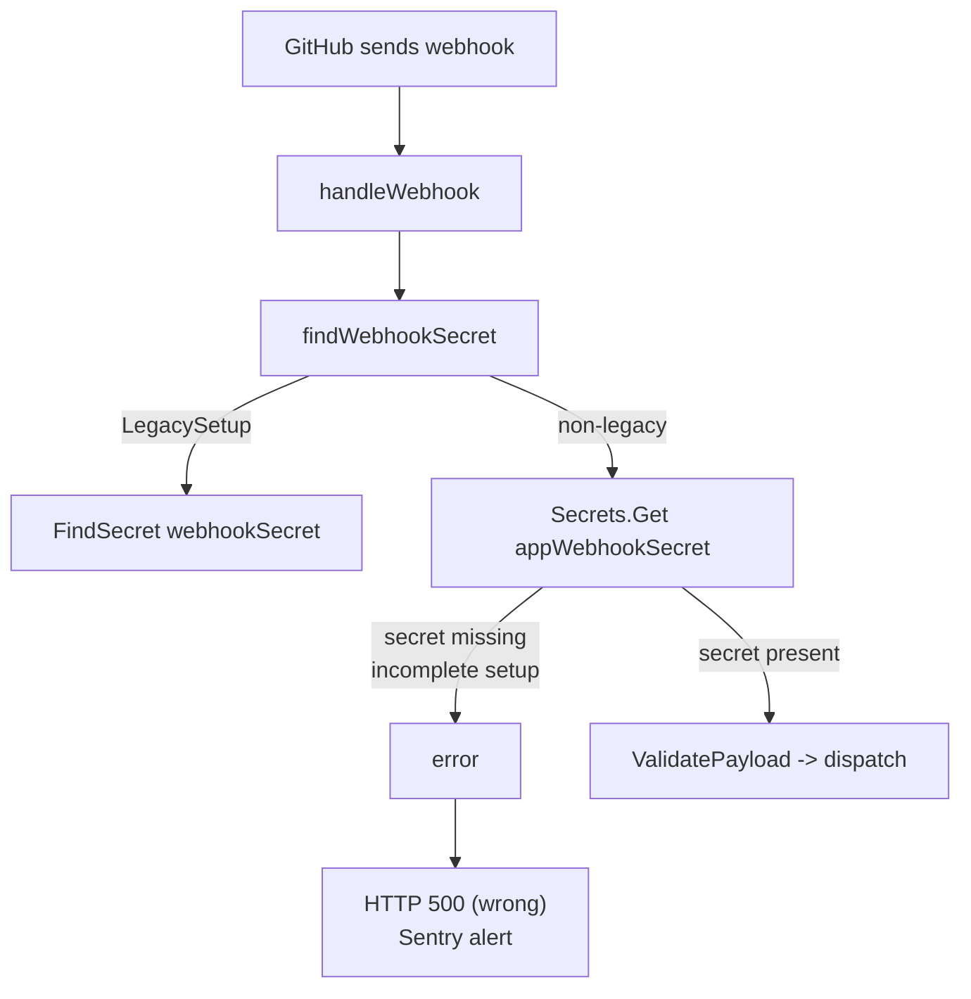

# Fix: HTTP 500 on `/api/v1/integrations/{id}/webhook` (issue #5850)

## Problem

GitHub sends webhook events (e.g. `installation_repositories`) to
`/api/v1/integrations/{id}/webhook`. For **non-legacy** GitHub App integrations
(introduced by PR #4646), `handleWebhook` resolves the webhook secret via
`findWebhookSecret`, which calls `Secrets().Get("appWebhookSecret")`.

If the integration setup never completed — i.e. `afterAppCreation` failed
before `Secrets().CreateMany(...)` ran — the `appWebhookSecret` row is absent
from `app_installation_secrets`. `Get` then returns an error, and
`handleWebhook` writes **HTTP 500**. The logging middleware forwards every 5xx
to Sentry, producing recurring `HTTP 500 <path>` alerts.

A 500 is misleading here: this is a **configuration/setup problem**, not a
server bug. Before PR #4646 the code used
`common.FindSecret(ctx.Integration, "webhookSecret")` and never hit a 500 in
this path.



## Root cause

- **File:** `pkg/integrations/github/github.go` → `handleWebhook()` (line ~238)
- **Origin:** PR #4646 (`feat: new GitHub setup flow`)
- Missing `appWebhookSecret` row is treated as a server error rather than an
  unconfigured/incomplete integration.

## Fix

1. **Return the correct status code.** In `handleWebhook`, when
   `findWebhookSecret` fails, respond with **HTTP 404** ("integration setup
   incomplete") instead of 500, and log at `Warn` (not `Error`) so it no longer
   trips the 5xx Sentry capture. 404 is preferable to 400/401 because from
   GitHub's perspective this integration is effectively not a valid webhook
   target yet; GitHub treats 4xx as a delivery failure it can surface/retry
   without paging us.

2. **Distinguish "not configured" from real failures.** Have
   `findWebhookSecret` return a sentinel/typed error when the secret is simply
   absent, versus a genuine unexpected error (e.g. store/DB failure). Map the
   "absent" case to 404 and keep 500 only for truly unexpected errors, so we
   don't hide real infrastructure faults.

3. **Confirm signature-validation path is unaffected.** The secret lookup
   happens before `github.ValidatePayload`; the change only alters the error
   response, not validation semantics.

### Sketch

```go
func (g *GitHub) handleWebhook(ctx core.HTTPRequestContext) {
    webhookSecret, err := g.findWebhookSecret(ctx)
    if err != nil {
        if errors.Is(err, common.ErrSecretNotFound) {
            ctx.Logger.Warnf("webhook secret not configured, integration setup incomplete: %v", err)
            http.Error(ctx.Response, "integration setup incomplete", http.StatusNotFound)
            return
        }
        ctx.Logger.Errorf("error finding webhook secret: %v", err)
        ctx.Response.WriteHeader(http.StatusInternalServerError)
        return
    }
    ...
}
```

(If the store cannot cheaply signal "not found", start with a simple
Warn + 404 for any `findWebhookSecret` error — the practical outcome for #5850
— and layer the sentinel distinction in as a follow-up.)

## Tests

- Non-legacy integration **without** `appWebhookSecret` → webhook request
  returns 404 and logs at Warn (no 5xx / Sentry capture).
- Non-legacy integration **with** `appWebhookSecret` → unchanged behaviour
  (valid payload dispatches, invalid signature → 400).
- Legacy integration path unchanged.

## Tradeoffs

- **Pro:** Stops false-positive 500 pages; correctly classifies incomplete
  setup as a client-visible 4xx; minimal, low-risk change confined to the
  webhook error path.
- **Pro (long-term):** Sentinel-error distinction preserves visibility into
  genuine secret-store failures.
- **Con:** Does not fix the *underlying* incomplete-setup state — the
  integration still lacks its secret and will keep rejecting webhooks until
  re-installed. That is a separate setup-robustness concern (see below) and out
  of scope for stopping the 500.

## Follow-up (out of scope, noted for long-term success)

`afterAppCreation` writes properties and secrets in separate steps; a failure
between them leaves a half-configured integration. A durable fix would make app
creation atomic (or mark the integration state as `error`/`incomplete` and
surface a re-setup prompt) so integrations can't silently persist without their
webhook secret. Track separately.
