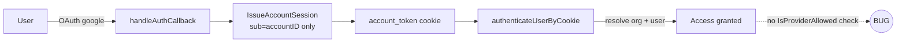
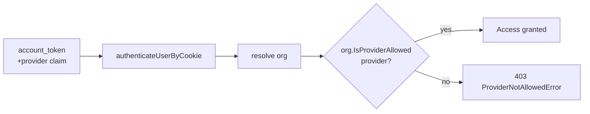

# Issue #1077 — User can log in with provider not allowed by organization

## Problem

Every organization has an `allowed_providers` column (default `["github"]`), and the
`Organization.IsProviderAllowed(provider)` helper exists — **but it is never called
anywhere in the codebase**. As a result a user can authenticate with Google and access an
organization that only permits GitHub.

```
$ grep -rn IsProviderAllowed pkg/
pkg/models/organization.go:30:func (o *Organization) IsProviderAllowed(provider string) bool {
# ...no callers.
```

## Root cause

Authentication and authorization operate at two different scopes:

- **Login is global (account-level).** OAuth (`github`/`google`), password, and magic-code
  logins all mint a single `account_token` JWT whose only identity claim is `sub=accountID`.
  The token does **not** record *which* provider was used.
- **`allowed_providers` is per-organization.** A single account can belong to many orgs, each
  with its own policy.

Because the session is provider-agnostic and login carries no org context, there is currently
no point in the request flow where the org's policy can be applied against the provider the
user actually authenticated with.



## Approach — enforce at organization access, using a provider claim

Keep global login intact, but gate **organization access** on the org's `allowed_providers`.
This requires the session to remember how the account authenticated.

### 1. Record the auth method in the session (`pkg/authentication/session.go`)
- Add a `provider` claim to the account JWT.
- Thread a `provider` argument through `GenerateAccountToken` / `IssueAccountSession` /
  `issueAccountSession`.
- Set it at each login site:
  - OAuth callbacks (`handleAuthCallback`, `handleDevAuth`, `handleSuccessfulAuth`) →
    `gothUser.Provider` (`github` / `google`).
  - Password login/signup, magic-code, change-password reissue, owner setup →
    `models.ProviderPassword` / `models.ProviderMagicCode` (new constants).
- `MaybeRefreshAccountSession` must **preserve** the existing `provider` claim on refresh.

### 2. Enforce at the org-access choke point (`pkg/public/middleware/auth.go`)
`authenticateUserByCookie` already resolves `account → org → user`. After loading the org:
```go
if models.IsOAuthProvider(provider) && !org.IsProviderAllowed(provider) {
    return nil, nil, errors.New(ProviderNotAllowedError)
}
```
- Read `provider` from the validated cookie claims (extend `getAccountFromCookie`).
- Only OAuth SSO providers (`github`/`google`) are gated (see tradeoff below).
- Surface a distinct `ProviderNotAllowedError` so the SPA can show *"This organization only
  allows sign-in via GitHub"* instead of a generic "not found".

### 3. Tests
- Unit: `IsProviderAllowed` gating in `authenticateUserByCookie` (allowed vs denied provider).
- Unit: provider claim round-trips through issue/refresh.
- E2E: Google login denied access to a `["github"]`-only org; GitHub login succeeds.



## Why enforce at org access (not at login)

Login is global and an account may span multiple orgs with different policies, so there is no
single org whose policy applies at login time. Gating at org access applies each org's policy
independently and matches the column's per-org semantics.

**Pros**
- Correct multi-tenant semantics; same account, different policy per org.
- Single choke point already resolves org + account.
- Global login and the login screen stay unchanged.

**Cons**
- Session token format changes (mitigated: missing claim treated as legacy/allowed, expires
  within the 7-day max age).
- A blocked user still authenticates globally; they are stopped at the org boundary, not the
  login button.

## Tradeoffs / decisions

- **Password & magic-code are out of scope of `allowed_providers`.** The column only ever holds
  OAuth providers, has no management UI, and every existing org defaults to `["github"]`.
  Gating password/magic against it would lock out those flows for every current org. They stay
  governed by the installation-level `passwordLoginEnabled` / `magicCodeEnabled` flags. Only
  known OAuth providers are checked. *(Follow-up: if org-level control over password/magic is
  wanted, add explicit sentinel values plus a data migration + settings UI.)*
- **Legacy tokens without the claim are allowed** to avoid mass logout on deploy; they age out
  naturally within the 7-day session max age.
- **No DB migration** — reuses the existing column and helper.

## Files touched
- `pkg/authentication/session.go` — provider claim, issue/refresh.
- `pkg/authentication/authentication.go` — pass provider at each OAuth/password/magic login.
- `pkg/public/change_password.go`, `pkg/public/setup_owner.go` — pass provider on reissue.
- `pkg/public/middleware/auth.go` — read claim, enforce `IsProviderAllowed`, new error.
- `pkg/models/constants.go` — `ProviderPassword`, `ProviderMagicCode`, `IsOAuthProvider`.
- Tests under `pkg/authentication`, `pkg/public/middleware`, `test/e2e/session`.
- Frontend: map `ProviderNotAllowedError` to a clear message on the org/login screen.
