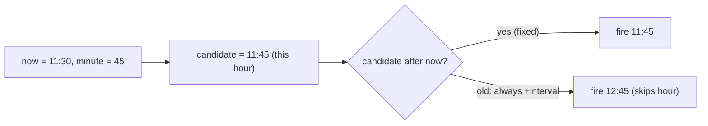

# Fix: Scheduler first run skips current hour when minute has not passed yet (#6230)

## Problem

When a Schedule trigger is configured with the **Hours** frequency (trigger
every N hours at a specific minute), the very first run always skips the
current hour — even when the target minute is still in the future.

**Reproduce:** now `11:30`, config = every hour at minute `45`.
- **Expected:** first run at `11:45` (minute 45 hasn't passed yet).
- **Actual:** first run at `12:45`.

### Root cause

`nextHoursTrigger` in `pkg/triggers/schedule/schedule.go` builds the
occurrence of the target minute in the current hour and then **unconditionally**
adds the interval:

```go
nextTrigger := time.Date(..., nowInTZ.Hour(), minute, 0, 0, ...)
nextTrigger = nextTrigger.Add(time.Duration(interval) * time.Hour) // always +interval
```

So it never considers that the current-hour occurrence might still be ahead of
`now`. Every other schedule type (minutes/days/weeks/months/cron) reads far
enough into the future that this class of bug does not occur; hours is the only
type anchored to the current hour.



## Fix

Only advance by the interval when the current-hour occurrence has already
passed (`<= now`):

```go
nextTrigger := time.Date(..., nowInTZ.Hour(), minute, 0, 0, ...)
if !nextTrigger.After(nowInTZ) {
    nextTrigger = nextTrigger.Add(time.Duration(interval) * time.Hour)
}
```

Behavior after the fix:

| now   | minute | interval | next trigger |
|-------|--------|----------|--------------|
| 11:30 | 45     | 1        | 11:45 (this hour) |
| 11:50 | 45     | 1        | 12:45 (next hour) |
| 11:45 | 45     | 1        | 12:45 (exactly at minute -> next) |
| 11:30 | 45     | 3        | 11:45, then 14:45, 17:45 ... |

Using `!After` (strictly future) rather than `Before` means firing exactly at
the target minute correctly rolls to the next interval, and the recurring
`emitEvent` re-schedule keeps a clean `interval`-hour spacing after the first
run.

## Files changed

- `pkg/triggers/schedule/schedule.go` — `nextHoursTrigger`: conditional advance.
- `pkg/triggers/schedule/schedule_test.go` — updated the three cases that
  encoded the old (buggy) "always skip current hour" expectation, and added
  cases for: minute-not-passed (fires this hour), minute-passed, exactly-at-minute,
  and `interval > 1` first-run.

## Why this scope (long term)

The fix lives in the single pure function that computes the hours trigger, so
both entry points — `Setup` (first run) and `emitEvent` (recurring) — get the
correct behavior with no duplicated logic. No config/metadata/schema changes are
needed, so existing scheduled canvases pick up the corrected first-run timing
transparently.

### Pros
- Minimal, targeted change to one pure function; easy to reason about and test.
- Fixes both first-run and steady-state paths at once.
- No migration, API, or UI changes.

### Cons / tradeoffs
- Three existing unit tests changed their expected values because they asserted
  the buggy behavior; this is intentional and documented above.
- For `interval > 1`, the first run now fires at the next occurrence of the
  minute in the current hour (ASAP) rather than waiting a full interval. This
  matches the issue's intent ("fire in the current hour if the minute hasn't
  passed") and is the natural, least-surprising behavior; subsequent runs keep
  the configured spacing.

## Verification

- `make test PKG_TEST_PACKAGES=./pkg/triggers/schedule`
- `make lint && make check.build.app`
- Manual: create an Hours schedule with a minute a few minutes ahead of the
  current time, activate the canvas, confirm the first tick fires in the current
  hour.
