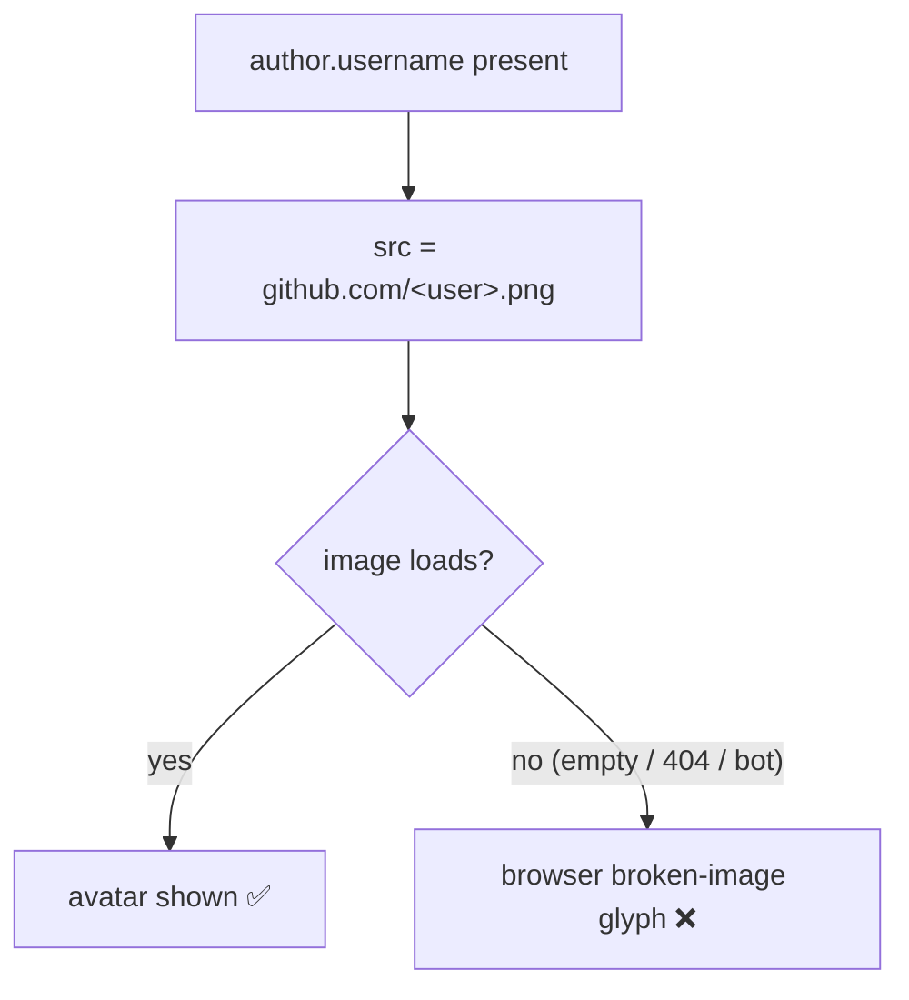

# Fix: broken image icon shown when user avatar is unavailable (#6235)

## Problem

In the console UI, both console panel types render a user's avatar directly as an
`` pointing at `https://github.com/<username>.png`. When that URL is empty
or 404s the browser shows its default **broken-image glyph** instead of a
graceful placeholder.

This is reproducible for GitHub **bot** accounts (screenshot:
`superplane-gh-integration-9000[bot]`): the `[bot]` suffix makes
`https://github.com/superplane-gh-integration-9000[bot].png` an invalid avatar
URL, so it 404s. We cannot know in advance whether a given URL will resolve, so
the fix has to react to the *runtime* load failure.

Two independent render paths are affected:

| Path | Where | How the avatar is produced |
|------|-------|----------------------------|
| **Table view** | `widget/WidgetTableCell.tsx` → `AvatarCell` → `components/Avatar/avatar.tsx` | React `<Avatar src=... />` component |
| **HTML view** | `widget/celBuiltins.ts` `githubAvatar()` → `HtmlBody` `dangerouslySetInnerHTML` | raw `` string, sanitized then injected |

### Root cause

- `components/Avatar/avatar.tsx` renders `` with **no `onError` handler** and
  falls back to `initials` only when `src` is falsy — never when a present `src`
  fails to load. (The Radix-based `ui/avatar/index.tsx` already does the right
  thing via `AvatarFallback`; the catalyst `components/Avatar` does not.)
- `resolveConsoleAvatar()` returns **only** `src` (no `initials`) whenever a
  username exists, so even an error-aware component would have nothing to fall
  back to.
- `githubAvatar()` emits a bare `` HTML string. An inline `onerror=` would
  be stripped by the sanitizer (`ALLOW_DATA_ATTR:false`, no event attrs), so the
  HTML path needs a JS-side error handler, not markup.

## Fix

Make both paths **degrade to initials, then to a generic silhouette** when the
image is missing or fails to load.

### 1. Table view (React component) — long-term, app-wide

- **`components/Avatar/avatar.tsx`**: track an `onError` flag with `useState`.
  When the `` errors (or `src` is null), render the `initials` SVG; if no
  initials, render a generic user silhouette. This also fixes every other
  consumer of this component (org Members, group members, combobox, etc.).
  Reset the error flag when `src` changes so recycled table rows re-attempt load.
- **`console/consoleAvatar.ts`**: always compute `initials` (from name/username)
  **even when `src` is set**, so the component has a fallback to show. `name`
  stays available for the tooltip.

### 2. HTML view (sanitized string)

- **`widget/celBuiltins.ts` `githubAvatar()`**: keep emitting the `` but add
  a `data-avatar-fallback="<initial>"` attribute carrying the fallback letter
  (empty when unknown). Keep the existing `avatar-fallback` `
` for the
  no-username case.
- **`console/htmlSanitize.ts`**: add `data-avatar-fallback` to `ALLOWED_ATTR`
  (arbitrary `data-*` stays disabled; only this one is whitelisted).
- **`console/HtmlBody.tsx`**: attach a **capture-phase `error` listener** on the
  scoped root (`error` doesn't bubble, so capture is required). When a failing
  target is an `img.avatar-image`, replace it in place with the fallback markup
  (`
` + letter, or a silhouette when the
  letter is empty). Remove the listener on unmount.

### 3. Shared silhouette

Add one small inline SVG user-silhouette used by both paths for the "no image,
no initial" case, so behavior is identical across views.

## Files changed

- `web_src/src/components/Avatar/avatar.tsx` — `onError` → initials/silhouette fallback.
- `web_src/src/pages/app/console/consoleAvatar.ts` — always return `initials`.
- `web_src/src/pages/app/console/widget/celBuiltins.ts` — emit `data-avatar-fallback`.
- `web_src/src/pages/app/console/htmlSanitize.ts` — allow `data-avatar-fallback`.
- `web_src/src/pages/app/console/HtmlBody.tsx` — capture-phase error handler.
- Tests: extend `WidgetTable.avatar.spec.tsx`, `consoleAvatar.spec.ts`,
  `celBuiltins`/`celExpr` specs, and an `HtmlBody` error-swap test; Storybook
  stories for the errored state.

## Why this scope (long term)

Fixing the shared `Avatar` component (rather than a console-only wrapper) removes
the broken-image failure mode everywhere the component is used, and aligns its
behavior with the already-correct Radix `ui/avatar`. The HTML path is handled by
a single delegated listener on the panel root instead of per-image markup, so it
scales to any number of avatars in a panel and needs no author changes.

### Pros
- One robust behavior across both panel types and the whole app.
- No backend, proto, DB, or panel-config changes; existing dashboards fix
  themselves.
- Reacts to real load failures, so it covers 404s, empty URLs, and `[bot]` users
  alike — cases we can't detect ahead of time.

### Cons / tradeoffs
- Touching the shared `Avatar` component has app-wide blast radius; mitigated by
  keeping the happy path unchanged (fallback only engages on error/empty) and by
  tests.
- The HTML path needs a whitelisted `data-avatar-fallback` attribute and a small
  amount of imperative DOM work inside `HtmlBody`; kept minimal and scoped to the
  panel root, cleaned up on unmount.
- CSS-only approaches were rejected: there is no reliable `:broken` selector, so
  a JS error signal is required.

## Verification

- `make check.build.ui` and `make format.js`.
- Frontend unit tests for both paths (table + HTML) covering: valid image,
  404/empty URL → initials, and no-initial → silhouette.
- Manual: open the runs table / an HTML panel with a `[bot]` author and confirm
  a placeholder (not the broken-image glyph) is shown.
