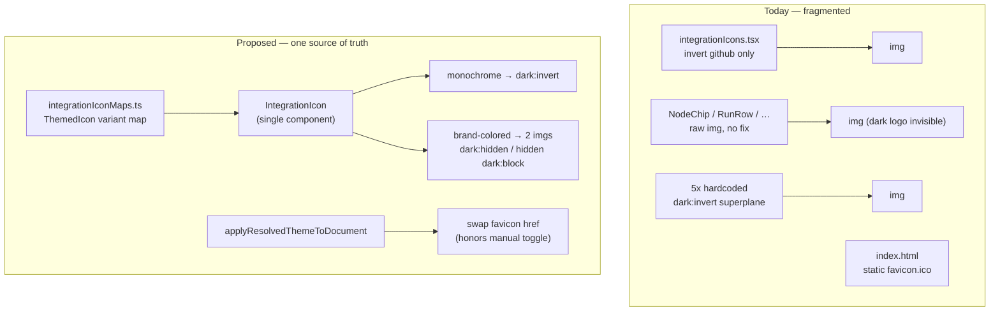

# Fix: Component icons must adapt their color to the active theme (#6234)

## Problem

Integration/component logos are dark-on-transparent SVGs rendered as ``.
On the dark theme they sit on a dark surface, so dark logos (GitHub mark,
Semaphore sign, Superplane, CircleCI) become nearly invisible, and the browser
tab's `favicon.ico` never changes either.

Issue scope (author comment): **review all integration icons and add a dark-mode
equivalent for every one that needs it**, plus make the **favicon** theme-aware.

Explicitly named: GitHub, Semaphore, AWS, CircleCI, Superplane, favicon.

### How theme works today

`web_src` uses Tailwind v4's **class** strategy (`@custom-variant dark` in
`web_src/src/App.css`, opt-out via `.dark-mode-disabled`). `ThemeProvider`
(`web_src/src/contexts/ThemeProvider.tsx`) resolves `light | dark` from the
stored preference (`light | dark | system`) and toggles `.dark` on
`<html>` via `applyResolvedThemeToDocument` in `web_src/src/lib/themePreference.ts`.
`useTheme()` exposes `resolvedTheme`. A FOUC-prevention inline script in
`web_src/index.html` (lines 12–30) reads the `superplane-theme` key and pre-adds
`.dark` **before React boots** — the natural place to also set the initial favicon.

### How icons work today

- Assets: `web_src/src/assets/icons/integrations/*.svg` and a few in
  `web_src/src/assets/*.svg` (e.g. `github-mark.svg`, `semaphore-logo-sign-black.svg`,
  `superplane.svg`).
- `web_src/src/ui/componentSidebar/integrationIconMaps.ts` maps integration/block
  name → **URL string**, consumed via `getIntegrationIconSrc` / `getHeaderIconSrc`.
- Rendered as ``. Because they are external ``, CSS
  `currentColor`/text color cannot recolor them.

### Root cause: two gaps

1. **No single theme-aware render path.** Icon rendering is spread across three
   unrelated paths, only one of which does anything for dark mode:
   - `integrationIcons.tsx` (`IntegrationIcon`, sidebar/Settings) inverts only
     `github` (`INTEGRATION_LOGO_INVERT_IN_DARK = {"github"}`).
   - **Canvas node headers** render through `web_src/src/ui/componentHeader/index.tsx`
     (fed by `componentBase`), whose `iconSrc` comes straight from each mapper
     (e.g. `mappers/github/base.ts`, `circleci/base.ts`, `semaphore/*`, `aws/*`)
     and is drawn as a **plain `` with no inversion** — this is where the
     dark, invisible node icons in the issue screenshots come from.
   - `superplane.svg` gets `dark:brightness-0 dark:invert` copy-pasted in ~6 files.
   - Raw `` in `NodeChip`, `RunRow`,
     `RunExecutionNodeRow`, `MentionDropdown`, … apply **nothing** either.
2. **Favicon is static** (`web_src/index.html`: `<link rel="icon" href="/favicon.ico">`).



## Approach

Centralize on **one theme-aware icon abstraction** and pick the recoloring
mechanism **per icon**, driven entirely by Tailwind's existing `.dark` class
(no per-call-site `resolvedTheme` threading, no flash).

### 1. Model icon variants (`integrationIconMaps.ts`)

Replace bare `string` values with a small descriptor:

```ts
type ThemedIcon =
  | string                                 // theme-agnostic (most brand icons)
  | { src: string; invertInDark: true }    // pure monochrome → CSS filter
  | { light: string; dark: string };       // distinct brand asset per theme
```

- **Monochrome, invert is correct** → `invertInDark`: `github`, `semaphore`
  (black sign), `superplane`. `dark:brightness-0 dark:invert` turns black → white.
- **Brand-colored, invert is wrong** → `{ light, dark }` with an official dark
  asset: `aws` (dark text/smile), `circleci` (black wordmark → white variant).
  Inverting these would corrupt the brand color, so ship real dark SVGs.
- Everything else stays a plain `string`.

Add resolver `getIntegrationIcon(name): ThemedIcon | undefined` (keep the old
`getIntegrationIconSrc`/`getHeaderIconSrc` as thin wrappers returning the light
src for any remaining non-visual callers).

### 2. One render path (`IntegrationIcon`)

Make `web_src/src/ui/componentSidebar/integrationIcons.tsx` the **only** place
that renders an integration logo, and teach it all three variants:

- `invertInDark` → ``.
- `{ light, dark }` → render both, `dark:hidden` and `hidden dark:block`
  (pure CSS swap — no JS, no hydration flash, respects the manual toggle because
  it keys off `.dark`).
- plain string → unchanged.

Then route the other two paths through the same variant logic:
- **`componentHeader/index.tsx`** (canvas node headers — the main offender):
  instead of a bare ``, resolve the integration from the block name and
  render via the shared logic so node icons adapt. Because mappers set `iconSrc`
  directly, the cleanest long-term fix is to let the header look up the
  `ThemedIcon` by component name (it already knows the block) rather than trust
  a single pre-baked `iconSrc`.
- The raw `` call sites (`NodeChip`, `RunRow`,
  `RunExecutionNodeRow`, `MentionDropdown`, Settings/header spots) → `IntegrationIcon`,
  deleting the copy-pasted `dark:invert` classes.

This closes gap #1 across all three paths at once.

Delete the now-redundant `INTEGRATION_LOGO_INVERT_IN_DARK` set (its knowledge
moves into the variant map).

### 3. Favicon (`themePreference.ts` + `index.html`)

`<link rel="icon">` lives in `<head>`, so CSS can't switch it and a
`prefers-color-scheme` media `<link>` would ignore the in-app manual toggle.
Drive it from the same place the theme class is applied:

- Add `favicon-dark.svg` (light-colored mark) under `web_src/public/`.
- In `applyResolvedThemeToDocument`, set the `<link rel="icon">` `href` to the
  light/dark asset for `resolvedTheme`. This automatically honors `light`,
  `dark`, and `system`, and updates live when the user toggles.
- Set the same initial href inside the FOUC inline script in `index.html`
  (which already resolves the theme pre-boot) so the tab icon is correct on
  first paint with no flash; keep `favicon.ico` as the no-JS default.

### 4. Icon audit (issue's core ask)

Walk every entry in `INTEGRATION_APP_LOGO_MAP` / `APP_LOGO_MAP` on a dark
surface and classify each as: fine as-is / monochrome-invert / needs-dark-asset.
Record the result in a short table in the PR so "we reviewed all icons" is
demonstrable, not assumed. Source any new dark assets from official brand kits.

## Pros / Cons

**Pros**
- Single source of truth: adding an integration means one map entry; the render
  path and favicon logic are shared, so future icons can't regress.
- Correct per icon: monochrome logos invert cheaply; brand-colored logos get a
  faithful dark asset instead of a wrong hue.
- Pure-CSS theme swap for logos → no flash, no extra re-renders, works with the
  existing class strategy and with the manual (non-system) preference.
- Removes ~5 copies of hardcoded `dark:invert` and the ad-hoc invert set.

**Cons / tradeoffs**
- Sourcing/committing a handful of dark-variant SVGs (AWS, CircleCI) is manual
  and must match brand guidelines.
- The `{ light, dark }` variant ships two `` tags (one hidden); negligible
  weight, but two network refs for those icons.
- Touches many call sites to route them through `IntegrationIcon`; larger diff,
  but it is the change that makes the fix durable rather than another local patch.

### Alternatives considered
- **Blanket `dark:invert` on all logos** — rejected: destroys brand color on
  AWS/CircleCI and any multi-color icon.
- **Inline SVG + `currentColor` (svgr)** — rejected: forces every logo
  monochrome (loses brand palette) and is a large tooling/refactor change.
- **`prefers-color-scheme` favicon `<link>`** — rejected: ignores the in-app
  manual light/dark toggle.

## Files (planned)

- `web_src/src/ui/componentSidebar/integrationIconMaps.ts` — `ThemedIcon` model + resolver.
- `web_src/src/ui/componentSidebar/integrationIcons.tsx` — render all variants; drop invert set.
- `web_src/src/ui/componentHeader/index.tsx` (+ `componentBase/index.tsx`) — theme-aware node header icon.
- `web_src/src/assets/icons/integrations/{aws,circleci}-dark.svg` (+ any from audit) — new dark assets.
- Call sites: `NodeChip.tsx`, `RunRow.tsx`, `RunExecutionNodeRow.tsx`,
  `MentionDropdown.tsx`, Settings/header spots — route through `IntegrationIcon`.
- `web_src/src/lib/themePreference.ts` — favicon swap in `applyResolvedThemeToDocument`.
- `web_src/public/favicon-dark.svg`, `web_src/index.html` — theme-aware favicon (link + FOUC script).
- Stories/specs for `IntegrationIcon` covering monochrome + dual-asset in both themes.

## Verification

- Storybook: `IntegrationIcon` for github, semaphore, superplane, aws, circleci
  in light **and** dark — all legible, brand colors intact.
- Toggle the in-app theme control and confirm canvas node icons, sidebar,
  headers, and the **browser tab favicon** all update live (incl. `system`).
- `make check.build.ui` and `make format.js`.
