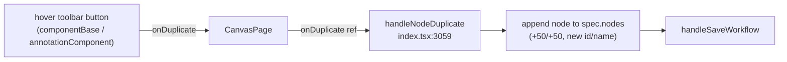

# Clone notes on the canvas (#6238)

## Problem

Canvas components expose a **duplicate** action (a "copy" button in the
per-node hover toolbar). **Notes** — the sticky-note annotations on the
canvas — do not. The issue asks us to give notes the same clone ability.

## Background: how the pieces already fit together

Notes are not a separate entity. A note is an ordinary canvas node with
`type: "TYPE_WIDGET"` and `component: "annotation"`, whose text/color/size live
in the node's `configuration` Struct inside `canvas.spec.nodes`
(`protos/components.proto` `Node`, `protos/canvases.proto` spec). They persist
through the same canvas-save path as components — there is **no per-note CRUD
API**.

Duplication is a purely client-side spec mutation. The single-node handler
`handleNodeDuplicate` (`web_src/src/pages/app/index.tsx:3059`) is **type-agnostic**:
it spreads the source node (carrying `configuration`, so a note's text, color
and dimensions come along), assigns a fresh id + unique name, offsets the
position by +50/+50, and re-saves the canvas.

### Root cause — one missing wire

`onDuplicate` is **already threaded all the way to the note component**:
`BlockContent` puts it in `actionProps` and spreads those into
`<AnnotationComponent>` (`web_src/src/ui/CanvasPage/Block/content.tsx:122`).
But `AnnotationComponent` (`web_src/src/ui/annotationComponent/index.tsx`) only
destructures `onDelete` (line 80) and renders just a color picker + delete
button in its hover toolbar (lines 287-333). It never reads or renders
`onDuplicate`. That single omission is the whole gap.

Two supporting facts that make this safe:

- `applyAutoLayoutOnAddedNode` (`index.tsx:1173`) **returns early for
  `TYPE_WIDGET`**, so a duplicated note keeps its +50/+50 offset and is never
  yanked into the auto-layout grid.
- `buildDuplicatedNodes` (`lib/duplicate-nodes.ts`) is already generic, so the
  **multi-select** "Copy" toolbar path (`onDuplicateNodes`) already clones
  selected notes today. Only the per-note button is missing.

## Plan

Frontend-only. No proto, model, migration, or backend change.

1. **`web_src/src/ui/annotationComponent/index.tsx`**
   - Destructure `onDuplicate` from props (it's already in
     `ComponentActionsProps`, which `AnnotationComponentProps` extends).
   - Render a duplicate button in the existing hover-actions strip
     (the `showNoteActions` block, ~lines 287-333), placed before Delete.
     Mirror the component toolbar exactly: the lucide `Copy` icon,
     `data-testid="node-action-duplicate"`, `aria-label="Duplicate note"`,
     `preventDefault`/`stopPropagation` then `onDuplicate?.()`, same
     `text-gray-500 hover:text-gray-800 …` styling as `componentBase/index.tsx:375-388`.
   - Gate on `showNoteActions` (edit mode, actions not hidden) so it matches the
     delete button's visibility.

2. **Tests (test-first).**
   - Unit: extend the annotation component spec to assert the duplicate button
     renders in edit mode and calls `onDuplicate` on click, and is absent in
     live mode / when `onDuplicate` is undefined.
   - E2E (if a canvas-notes flow exists under `test/e2e`): clone a note and
     assert a second note appears with the same text/color, offset position,
     and a distinct id.

3. **Verify.** `make format.js`, `make check.build.ui`, and manually clone a
   note in the running app (`make dev.server`) — confirm text, color, and size
   copy over and the clone lands offset from the original.

## Why this scope (long term)

The clone handler, prop plumbing, persistence, and auto-layout guard already
exist and already treat a note as just another node. Reusing `handleNodeDuplicate`
rather than adding a note-specific clone path means notes and components stay on
one code path — future changes to duplication behavior apply to both for free.
The change is additive and localized to the one component that was missing the
button.

### Pros
- Tiny, additive diff in a single component; reuses the tested duplicate path.
- No backend/proto/migration work — notes already persist as spec nodes.
- Auto-layout already skips widgets, so no special-casing for note positioning.

### Cons / tradeoffs
- The note toolbar grows a third control (color, duplicate, delete); on very
  small notes the hover strip is slightly busier. Acceptable — it matches the
  component toolbar users already know.
- `AnnotationComponent`'s `React.memo` comparator (lines 493-505) doesn't
  compare `onDuplicate`; this is fine because the handler is a stable ref
  (`getNodeAction`), consistent with how `onDelete` is already handled.

## Files changed

- `web_src/src/ui/annotationComponent/index.tsx` — consume `onDuplicate`, render
  the duplicate button in the hover toolbar.
- Corresponding `*.spec.tsx` (and an E2E flow if one exists) covering the new
  action.
