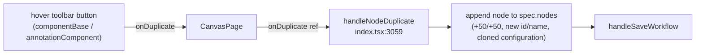

# Clone notes on the canvas (#6238)

## Problem

Canvas **components** expose a *duplicate* action in their per-node hover
toolbar. **Notes** — the sticky-note annotations on the canvas — do not. The
issue asks us to give notes the same clone ability.

## How the pieces already fit together

A note is not a special entity: it is an ordinary canvas node with
`type: "TYPE_WIDGET"` and `component: "annotation"`. Its text, color, and size
live in the node's `configuration` inside `canvas.spec.nodes`
(`web_src/src/pages/app/index.tsx:2504`, `2521-2524`). Notes persist through the
same canvas-save path as components — there is **no per-note API**.

Duplication is a purely client-side spec mutation. The single-node handler
`handleNodeDuplicate` (`web_src/src/pages/app/index.tsx:3059`) is
**type-agnostic**: it spreads the source node — so `configuration` (a note's
text, color, dimensions) comes along for free — assigns a fresh id + unique
name, offsets the position by +50/+50, and re-saves the canvas.

### Root cause — one missing wire

`onDuplicate` is **already threaded all the way to the note component**:
`AnnotationBlockContent` puts it in `actionProps` and spreads those into
`<AnnotationComponent>` (`web_src/src/ui/CanvasPage/Block/content.tsx:113-123`).
But `AnnotationComponent`
(`web_src/src/ui/annotationComponent/index.tsx`) only destructures `onDelete`
(line 80) and renders just a color picker + delete button in its hover toolbar
(the `showNoteActions` block, lines 287-333). It never reads or renders
`onDuplicate`. That single omission is the whole gap.

Two supporting facts that make this safe:

- `applyAutoLayoutOnAddedNode` (`index.tsx:1166`) **returns early for
  `TYPE_WIDGET`**, so a duplicated note keeps its +50/+50 offset and is never
  pulled into the auto-layout grid.
- `buildDuplicatedNodes` (`web_src/src/pages/app/lib/duplicate-nodes.ts`) is
  already generic, so the **multi-select** "Duplicate" toolbar path
  (`onDuplicateNodes`) already clones selected notes today. Only the per-note
  button is missing.

## Plan

Frontend-only. No proto, model, migration, or backend change.

1. **`web_src/src/ui/annotationComponent/index.tsx`**
   - Destructure `onDuplicate` from props (already in `ComponentActionsProps`,
     which `AnnotationComponentProps` extends).
   - Render a duplicate button inside the existing `showNoteActions` hover strip,
     placed before Delete. Mirror the component toolbar: lucide `Copy` icon,
     `data-testid="node-action-duplicate"`, `aria-label="Duplicate note"`,
     `preventDefault()`/`stopPropagation()` then `onDuplicate?.()`, matching the
     delete button's `text-gray-500 hover:text-gray-800 …` styling.
   - Gate on `showNoteActions` (edit mode, actions not hidden) and on
     `onDuplicate` being defined — same visibility rules as the delete button.

2. **Tests (test-first).**
   - Unit (`web_src/src/ui/annotationComponent/index.spec.tsx`): the duplicate
     button renders in edit mode and calls `onDuplicate` on click; it is absent
     in live mode, when `onDuplicate` is undefined, and when `hideActionsButton`
     is set. Stub `NodeResizeControl` (needs a ReactFlow provider we don't set up).
   - E2E (if a canvas-notes flow exists under `test/e2e`): clone a note and
     assert a second note appears with the same text/color, an offset position,
     and a distinct id.

3. **Verify.** `make format.js`, `make check.build.ui`, then manually clone a
   note in the running app (`make dev.server`): confirm text, color, and size
   copy over and the clone lands offset from the original.

## Why this scope (long term)

The clone handler, prop plumbing, persistence, and auto-layout guard already
exist and already treat a note as just another node. Reusing
`handleNodeDuplicate` instead of adding a note-specific clone path keeps notes
and components on **one duplication code path** — future changes to duplication
behavior apply to both for free. The change is additive and localized to the one
component that was missing the button.

### Pros

- Tiny, additive diff in a single component; reuses the already-tested duplicate
  path used by components.
- No backend/proto/migration work — notes already persist as spec nodes.
- Auto-layout already skips widgets, so no special-casing for note positioning.

### Cons / tradeoffs

- The note toolbar grows a third control (color, duplicate, delete); on very
  small notes the hover strip is slightly busier. Acceptable — it matches the
  component toolbar users already know.
- `AnnotationComponent`'s `React.memo` comparator (lines 493-505) does not
  compare `onDuplicate`. This is fine: the handler is a stable ref
  (`getNodeAction`), consistent with how `onDelete` is already handled.

## Files changed

- `web_src/src/ui/annotationComponent/index.tsx` — consume `onDuplicate`, render
  the duplicate button in the hover toolbar.
- `web_src/src/ui/annotationComponent/index.spec.tsx` — cover the new action
  (and an E2E flow if one exists).
