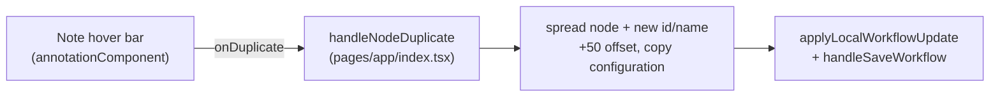

# Clone notes on the canvas (#6238)

## Problem

Components on the canvas can be cloned (surfaced in the UI as a **Duplicate**
action), but **notes** (the "annotation" widget) cannot. The issue asks us to
add clone support for notes.

## Findings

The duplicate *data pipeline already reaches note nodes* — the gap is purely in
the note's UI:

- `handleNodeDuplicate` (`web_src/src/pages/app/index.tsx:3059`) is
  type-agnostic. It spreads the whole node (`...nodeToDuplicate`), so it already
  copies a note's widget `configuration` (text, color, width, height), assigns a
  unique name/id, and offsets the position by +50. A note's `name` is `"Note"`,
  so `generateUniqueNodeName` produces a clean `"Note 2"`-style name with no
  special-casing needed.
- `onDuplicate` is already plumbed to every node, including annotations:
  `getActionProps` → `AnnotationBlockContent` spreads `{...actionProps}` into
  `AnnotationComponent` (`web_src/src/ui/CanvasPage/Block/content.tsx:34,122`),
  and `AnnotationComponentProps extends ComponentActionsProps` which declares
  `onDuplicate`.
- The **only** gap: `AnnotationComponent`
  (`web_src/src/ui/annotationComponent/index.tsx`) never destructured
  `onDuplicate` and rendered no Duplicate button in its hover action bar (which
  had only color swatches + Delete).

There is no right-click context menu for nodes; actions are a hover-revealed bar
above each node. There is no backend "clone" endpoint — duplication is entirely
client-side (add a node to the spec, save via the normal canvas-save path), so
**no backend, proto, or migration changes are required.**

## Change

`web_src/src/ui/annotationComponent/index.tsx`:

1. Import the `Copy` icon from `lucide-react` (already used by the multi-select
   duplicate button, so it matches the existing visual language).
2. Destructure the already-declared `onDuplicate` prop.
3. Render a **Duplicate note** button in the hover action bar, before Delete,
   mirroring the existing Delete button (same styling, `stopPropagation`,
   `aria-label`, `data-testid="note-action-duplicate"`).

The button is gated by the same `showNoteActions` (`canvasMode === "edit"`) and
`onDuplicate &&` guards as the rest of the bar, so it only appears in edit mode
when the handler is wired (read-only canvases pass `onDuplicate = undefined`).

## Why this scope (long term)

Reusing the existing type-agnostic `handleNodeDuplicate` — rather than adding a
note-specific clone path — keeps a single source of truth for duplication
behavior (naming, offset, autolayout, save). Notes now inherit any future
improvements to duplication for free. The change is confined to the note's
presentation layer, which is exactly where the missing affordance lived.

Multi-select duplicate already includes notes (the multi-select bar's Copy
button is type-agnostic), so this closes the remaining single-note case.

### Pros
- Minimal, surgical change in one file; no new duplication logic.
- No backend, proto, migration, or API changes.
- Consistent icon/behavior with component Duplicate and multi-select Copy.

### Cons / tradeoffs
- Relies on `handleNodeDuplicate`'s generic path; if that path ever needs
  note-specific handling (it does not today), it would have to branch. Accepted:
  the generic path copies `configuration` verbatim, which is correct for notes.

## Files changed

- `web_src/src/ui/annotationComponent/index.tsx` — import `Copy`, destructure
  `onDuplicate`, render the Duplicate note button in the hover action bar.

## Verification

- `make format.js` then `make check.build.ui` (requires `web_src` deps via
  `make dev.setup`; not runnable in this sandbox — no `node_modules`).
- Manual: enter edit mode, hover a note, click Duplicate — a copy appears offset
  by +50 with the same text/color/size and a unique name; confirm it persists
  after save and does not appear on read-only canvases.
