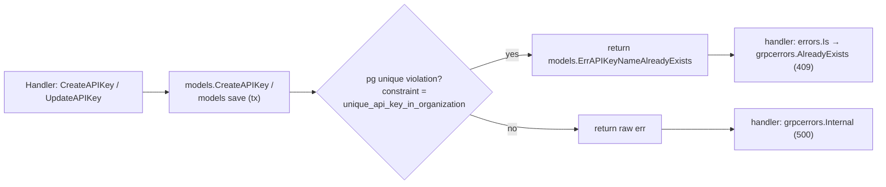

# Plan — Issue #6219: Duplicate API key name returns HTTP 500 instead of a conflict error

## Problem

Creating an API key with a name that already exists in the organization returns
`HTTP 500 Internal Server Error` (`{"message":"failed to create API key"}`) instead of a
client-actionable conflict error.

The DB correctly rejects the duplicate via the partial unique index
`unique_api_key_in_organization` on `users (organization_id, name) WHERE type = 'api_key'`
(SQLSTATE 23505). But in `pkg/grpc/actions/apikeys/create_api_key.go:106-108` the transaction
error is blanket-wrapped as `grpcerrors.Internal(...)`, so a foreseeable user input surfaces
as a generic server error.

**The same latent bug exists in `UpdateAPIKey`** (`update_api_key.go:72-75`): renaming a key to a
name already used by another key hits the same constraint and returns a 500.

## Approach

Follow the pattern already established in the codebase for the same class of problem
(`mapCanvasFolderTitleUniqueConstraintError` in `pkg/models/canvas_folder.go`, and the
`AlreadyExists` handling in `canvases/common.go`): map the Postgres unique-constraint violation
to a typed sentinel error in the model layer, then translate it to a gRPC `AlreadyExists`
(→ HTTP 409) in the handlers.

### Changes

1. **`pkg/models/user.go`**
   - Add constraint-name constant `apiKeyNameUniqueConstraint = "unique_api_key_in_organization"`.
   - Add sentinel `ErrAPIKeyNameAlreadyExists = errors.New("API key name already exists")`.
   - Add helper `mapAPIKeyNameUniqueConstraintError(err error) error` that returns the sentinel when
     `errors.As(err, *pgconn.PgError)` matches the constraint name, else the original error.
   - Apply the mapper inside `CreateAPIKey` on the `tx.Create` error.
   - Add `UpdateAPIKey(tx, user)` model helper that runs the save and applies the mapper, so the
     update handler shares the same mapping (keeps the SQL-error translation in the model layer,
     per the DB/transaction guidelines).

2. **`pkg/grpc/actions/apikeys/create_api_key.go`**
   - After the transaction, before the blanket `Internal`, add:
     `if errors.Is(err, models.ErrAPIKeyNameAlreadyExists) { return grpcerrors.AlreadyExists(err, "an API key with the name \"<name>\" already exists in this organization") }`.

3. **`pkg/grpc/actions/apikeys/update_api_key.go`**
   - Route the save through the new model helper and map `ErrAPIKeyNameAlreadyExists` to
     `grpcerrors.AlreadyExists` the same way.

4. **Tests** (`create_api_key_test.go`, `update_api_key_test.go`)
   - Duplicate name (including the whitespace-collision case `" ci-bot "` vs `ci-bot`) returns
     `codes.AlreadyExists`, not `Internal`, and no second key is created.
   - Update-rename to an existing key's name returns `AlreadyExists`.
   - Existing happy-path tests still pass.

## Why this approach

- **Consistent** with existing constraint-violation handling (`canvas_folder`, `canvas`, integrations)
  — no new convention introduced.
- **Layer-correct**: SQL/driver knowledge (SQLSTATE, constraint name) stays in `pkg/models`; handlers
  deal only in typed domain errors. Respects the transaction guidelines (explicit `*gorm.DB`, no new
  `*InTransaction` / `database.Conn()` debt).
- **Complete**: fixes both the reported create path and the equivalent update-rename path.

### Pros / cons & tradeoffs

- **Pro:** precise 409/`AlreadyExists` with an actionable message; whitespace-collision covered because
  the name is already trimmed before insert; no behavioral change to the happy path.
- **Con:** couples the model to the concrete constraint name string. Mitigated by pinning it to a named
  constant next to the model; renaming the index is already a DB-migration-level change that would flag
  this. This matches the existing `canvas_folder` precedent.
- **Alternative considered — pre-insert existence check (`SELECT` then `INSERT`):** rejected. It races
  under concurrency (TOCTOU) and the unique index is the real source of truth; catching 23505 is both
  correct and atomic.
- **Alternative — map generically in `error_sanitizer.go`:** rejected. The sanitizer lacks per-field
  context to produce a good message and would broadly reclassify all unique violations; explicit
  per-handler mapping is clearer and safer.

## Validation

- `make format.go`
- `make lint && make check.build.app`
- `make test PKG_TEST_PACKAGES=./pkg/grpc/actions/apikeys`
