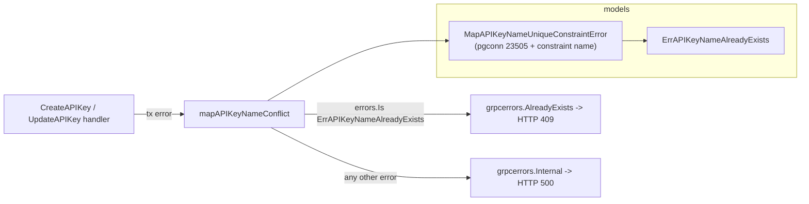

# Fix: Duplicate API key name returns HTTP 500 instead of a conflict error

**Issue:** [#6219](https://github.com/superplanehq/superplane/issues/6219)

## Problem

`POST /api/v1/api-keys` with a name that collides with an existing key in the
organization returns `HTTP 500 Internal Server Error` (`"failed to create API
key"`). The Postgres partial unique index `unique_api_key_in_organization`
(`organization_id, name WHERE type = 'api_key'`) correctly rejects the insert
with SQLSTATE `23505`, but the handler wraps every transaction error as
`grpcerrors.Internal`, so a foreseeable user input surfaces as an opaque server
error.

The same latent bug exists on the **rename path** in `update_api_key.go`:
renaming a key to a name already in use also hits the constraint and returns a
`500`.

## Goal

A duplicate name should return a client-actionable **`AlreadyExists` (HTTP 409)**
error with a message explaining the name is already in use — on both create and
update.

## Approach

Follow the pattern already established for canvases
(`pkg/models/canvas.go` + `pkg/grpc/actions/canvases/common.go`): classify the
constraint violation at the **model layer** into a typed sentinel error, then
map that sentinel to a gRPC code at the **handler layer**.

### Changes

1. **`pkg/models/user.go`**
   - Add sentinel `var ErrAPIKeyNameAlreadyExists = errors.New("api key name already exists")`.
   - Add `const apiKeyNameUniqueConstraint = "unique_api_key_in_organization"`.
   - Add `MapAPIKeyNameUniqueConstraintError(err error) error` that inspects a
     `*pgconn.PgError` and returns the sentinel when `ConstraintName` matches
     (mirrors `MapCanvasNameUniqueConstraintError`).
   - Have `CreateAPIKey` return `MapAPIKeyNameUniqueConstraintError(err)` so the
     classification is centralized in the model.

2. **`pkg/grpc/actions/apikeys/common.go`**
   - Add a small handler helper `mapAPIKeyNameConflict(err) error` that returns
     `grpcerrors.AlreadyExists(...)` with a clear message when
     `errors.Is(err, models.ErrAPIKeyNameAlreadyExists)`, else the original error.

3. **`pkg/grpc/actions/apikeys/create_api_key.go`**
   - After the transaction, run the error through the helper before wrapping as
     `Internal`, so the conflict maps to `AlreadyExists` and everything else stays `Internal`.

4. **`pkg/grpc/actions/apikeys/update_api_key.go`**
   - Wrap the `db.Save(user)` error identically (the rename collision path). The
     direct `db.Save` returns the raw pg error, so run it through
     `models.MapAPIKeyNameUniqueConstraintError` + the handler helper.

5. **Tests**
   - `create_api_key_test.go`: create `ci-bot`, then create `" ci-bot "`
     (whitespace, per the issue) and assert `grpcerrors.Code(err) ==
     codes.AlreadyExists` and that no second row is created.
   - `update_api_key_test.go`: create two keys, rename one onto the other's
     name, assert `codes.AlreadyExists`.

## Pros / Cons & Tradeoffs

**Pros**
- Mirrors the existing canvas convention -> consistent, discoverable, low risk.
- Classification lives in the model, so any future caller of `CreateAPIKey`
  gets correct behavior for free.
- Keeps the DB unique index as the single source of truth (no TOCTOU race that
  a pre-`SELECT` existence check would introduce).

**Cons / Tradeoffs**
- Relies on the constraint **name** string matching the migration. Guarded by a
  named constant and a test so a rename is caught.
- We map to `AlreadyExists` (409) rather than `InvalidArgument` (400). 409 is the
  more precise semantic for a resource-name conflict and matches the canvas /
  integration handlers; chosen for cross-endpoint consistency.

### Known edge case (documented, not fixed here)
The unique index does **not** exclude soft-deleted rows (`deleted_at`), and
`User.Delete()` clears `token_hash` but keeps `name`. So a name colliding with a
*soft-deleted* key also yields `AlreadyExists` even though the key is invisible
to the user. This pre-exists the issue and is out of scope; noting it here as a
potential follow-up (e.g. make the partial index also `WHERE deleted_at IS NULL`).

## Verification
- `make format.go`
- `make lint && make check.build.app`
- `make test PKG_TEST_PACKAGES="./pkg/grpc/actions/apikeys ./pkg/models"`
