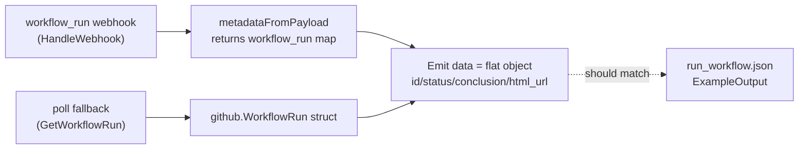

# GitHub Run Workflow: example nest (#6264)

## Problem

The Run Workflow component's example output nests fields under
`data.workflow_run.*`, but the component actually emits the workflow-run
object **flat** at `data.*`. Expressions users copy from the example
(e.g. `data.workflow_run.id`) therefore fail against the real payload.

- File: `pkg/integrations/github/components/actions/payloads/run_workflow.json`
- Surfaced via `RunWorkflow.ExampleOutput()` (`example.go`), which embeds and
  unmarshals that JSON.

## Findings: what the component really emits

Both emit paths produce a **flat** object at `data`:

1. Webhook path — `HandleWebhook` → `metadataFromPayload` returns the raw
   `payload["workflow_run"]` map and emits it as `data`
   (`run_workflow.go:411-415`, `:424-457`). Keys: `id`, `status`,
   `conclusion`, `html_url` (GitHub webhook field names).
2. Poll fallback — `poll` emits the go-github `WorkflowRun` struct directly
   (`run_workflow.go:525-529`). It serializes to the same flat keys:
   `id`, `status`, `conclusion`, `html_url`.

Payload type is `github.workflow.finished` (`WorkflowPayloadType`), which the
example's `type` field already matches.



## Change

Flatten `run_workflow.json` so the example matches the emitted shape:

```json
{
  "data": {
    "id": 9001,
    "status": "completed",
    "conclusion": "success",
    "html_url": "https://github.com/acme/widgets/actions/runs/9001"
  },
  "timestamp": "2026-01-16T17:56:16.680755501Z",
  "type": "github.workflow.finished"
}
```

Only the `data` object is de-nested; `timestamp` and `type` are unchanged.

## Why this scope (long term)

The example is documentation-as-data: it must mirror the real emitted payload
so copied expressions work. Fixing the example (not the emit code) is correct
because the flat emit is the intended, consistent contract across both the
webhook and poll paths — changing the emit shape would be a breaking change for
existing workflows. Keeping the example in sync with the code is the durable
fix.

### Pros
- One-line-of-intent change; matches the actual runtime contract.
- No Go/proto/API/migration changes; no behavior change for running workflows.
- Removes a real footgun (silently-failing expressions).

### Cons / tradeoffs
- Docs-only fix relies on the emit shape staying flat. Mitigation below.

## Follow-up (optional, not in this change)

Add a small test that asserts `RunWorkflow.ExampleOutput()["data"]` has the
same top-level keys the emit paths produce, so the example can't drift again.

## Files changed

- `pkg/integrations/github/components/actions/payloads/run_workflow.json`
  — de-nest `data` (remove the `workflow_run` wrapper).

## Verification

- `go build ./...` (embed still valid JSON).
- Manual: add a Run Workflow component, confirm example shows `data.id`,
  `data.status`, `data.conclusion`, `data.html_url`; run a workflow and confirm
  the real payload matches.
