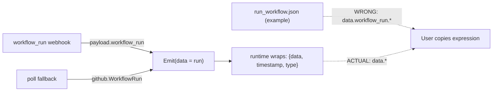

# GitHub Run Workflow: example output nesting (#6264)

## Problem

The Run Workflow component's example output nests the workflow-run fields under
`data.workflow_run.*`, but the component actually emits the workflow-run object
*flat* at `data`. So expressions users copy from the example
(`data.workflow_run.id`) fail against the real payload (`data.id`).

## Findings

Emitted shape comes from two paths in
`pkg/integrations/github/components/actions/run_workflow.go`:

- Webhook path (`HandleWebhook` -> `metadataFromPayload`): emits `data` =
  `payload["workflow_run"]` (a flat `map[string]any` with `id`, `status`,
  `conclusion`, `html_url`, ...).
- Poll fallback (`poll`): emits the `github.WorkflowRun` struct, whose JSON tags
  are also flat (`id`, `status`, `conclusion`, `html_url`, ...).

Both are wrapped by the runtime into `{ "data": <run>, "timestamp", "type" }`.
So the real emitted shape is `data.id`, `data.status`, `data.conclusion`,
`data.html_url` — never `data.workflow_run.*`.

The example is loaded via `ExampleOutput()` in `example.go`, which embeds
`payloads/run_workflow.json`. That JSON is the *only* thing wrong: it wraps the
fields in an extra `workflow_run` object.

## Change

Flatten `pkg/integrations/github/components/actions/payloads/run_workflow.json`
so `data` holds the workflow-run fields directly, matching what is emitted:
`data.id`, `data.status`, `data.conclusion`, `data.html_url`. Keep the existing
`timestamp` and `type` (`github.workflow.finished`) untouched.

## Why this scope (long term)

The bug is purely a documentation/example mismatch; the emit code is correct and
shared by both webhook and poll paths. Fixing the example — rather than changing
the emitted shape — avoids breaking existing workflows that already consume
`data.*`, and keeps the example as the single source of truth users copy from.

### Pros
- One-file, zero-risk change; no code, proto, or migration impact.
- Example now matches both emit paths exactly.

### Cons / tradeoffs
- The example only shows the four documented fields (id/status/conclusion/
  html_url). The real webhook payload has many more flat fields, but these four
  are the documented, stable contract, so we keep the example focused.

## Files changed

- `pkg/integrations/github/components/actions/payloads/run_workflow.json` —
  remove the `workflow_run` nesting; place fields flat under `data`.

## Verification

- `go build ./...` (embed still compiles).
- `go test ./pkg/integrations/github/...`.
- Manual: add a Run Workflow component, inspect example output — fields appear at
  `data.id`, `data.status`, `data.conclusion`, `data.html_url`, matching a real
  run.
