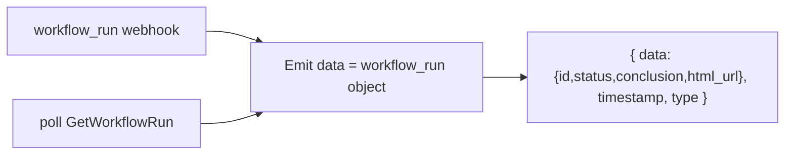

# Plan — Issue #6264: GitHub Run Workflow example nest

## Problem
The Run Workflow component's example output nests the workflow-run fields under
`data.workflow_run.*`, but the component actually emits the workflow-run object
flat at `data`. Expressions users copy from the example (e.g.
`data.workflow_run.id`) therefore fail against the real payload.

File: `pkg/integrations/github/components/actions/payloads/run_workflow.json`

## Evidence (verified in `run_workflow.go`)
Both emit paths put the workflow-run object directly at `data`:

- Webhook path (`HandleWebhook`): `metadataFromPayload` returns the raw
  `workflow_run` map as `data`, then `Emit(..., []any{data})`. Fields land at
  `data.id`, `data.status`, `data.conclusion`, `data.html_url`, etc.
- Poll fallback (`poll`): `Emit(..., []any{run})` where `run` is a go-github
  `*WorkflowRun`. Its JSON tags (`id`, `status`, `conclusion`, `html_url`)
  produce the same flat shape.

So the emitted envelope is `{ data: {<workflow_run fields>}, timestamp, type }`,
not `{ data: { workflow_run: {...} }, ... }`.



## Goal
Make the example match the emitted shape so copied expressions work:
`data.id`, `data.status`, `data.conclusion`, `data.html_url`.

## Approach
Rewrite `run_workflow.json` to un-nest the workflow-run fields — move them from
`data.workflow_run.*` up to `data.*`. Keep the existing `timestamp` and
`type: github.workflow.finished` envelope fields unchanged.

Target content:

```json
{
  "data": {
    "id": 9001,
    "status": "completed",
    "conclusion": "success",
    "html_url": "https://github.com/acme/widgets/actions/runs/9001"
  },
  "timestamp": "2026-01-16T17:56:16.680755501Z",
  "type": "github.workflow.finished"
}
```

The four fields match those explicitly called out in the issue and are common to
both emit paths, keeping the example accurate regardless of webhook vs. poll.

## Validation
- `example.go` embeds the file and unmarshals it via
  `RunWorkflow.ExampleOutput()`; JSON must stay valid — verify with
  `go build ./...` and `go test ./pkg/integrations/github/...`.
- Confirm the field names against go-github `WorkflowRun` JSON tags and the
  webhook payload keys (both use snake_case `html_url`).

## Pros / Cons / Tradeoffs
- Pro: example now matches reality; copied expressions work; minimal, targeted
  change with no code-behavior risk.
- Con: the example is intentionally minimal (4 fields). The real payload has
  many more fields; we show only the documented, stable ones to avoid implying
  guarantees about the full GitHub object.
- Tradeoff considered: could instead change the component to nest under
  `data.workflow_run` to match the old example. Rejected — it would break
  existing users relying on the current flat emit and touch runtime code for a
  docs-only defect. Fixing the example is the lower-risk, correct fix.

## Deliverable
- Updated `pkg/integrations/github/components/actions/payloads/run_workflow.json`.
- Committed to branch `sf-runner/1784817664` with a `fix:` message + DCO sign-off.
