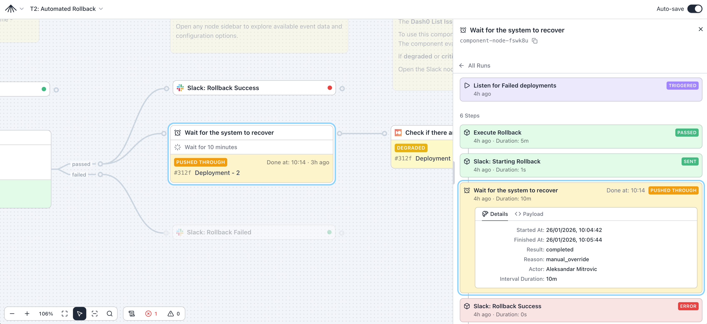

# SuperPlane

SuperPlane er et **åpen kildekode DevOps-kontrollplan** for å definere og kjøre
hendelsesbaserte arbeidsflyter. Det fungerer på tvers av verktøyene du allerede
bruker, som Git, CI/CD, observerbarhet, hendelseshåndtering, infrastruktur og varsler.



## Prosjektstatus

<p>
  <a href="https://superplanehq.semaphoreci.com/projects/superplane"></a>
  <a href="https://github.com/superplanehq/superplane/pulse"></a>
  <a href="https://discord.gg/KC78eCNsnw"></a>
</p>

Dette prosjektet er i alfa og beveger seg raskt. Forvent ujevne kanter og tidvis
endringer som ikke er bakoverkompatible mens vi stabiliserer kjernemodellen og integrasjonene.
Hvis du prøver det og støter på noe forvirrende, vennligst [opprett en issue](https://github.com/superplanehq/superplane/issues/new).
Tidlig tilbakemelding er svært verdifull.

## Hva den gjør

- **Arbeidsflyt-orkestrering**: Modellér operasjonelle arbeidsflyter i flere steg som går på tvers av systemer.
- **Hendelsesdrevet automatisering**: Start arbeidsflyter fra pushes, deploy-hendelser, alarmer, tidsplaner og webhooks.
- **Kontrollplan-UI**: Design og administrer DevOps-prosesser; se kjøringer, status og historikk på ett sted.
- **Delt operasjonell kontekst**: Hold arbeidsflytdefinisjoner og operasjonell intensjon i ett system i stedet for spredte skript.

## Hvordan det fungerer

- **Canvas**: Du modellerer en arbeidsflyt som en rettet graf (en “Canvas”) av steg og avhengigheter.
- **Komponenter**: Hvert steg er en gjenbrukbar komponent (innebygd eller via integrasjon) som utfører en handling (for eksempel: kalle CI/CD, opprette en hendelse/incident, sende et varsel, vente på en betingelse, kreve godkjenning).
- **Hendelser og triggere**: Innkommende hendelser (webhooks, tidsplaner, verktøy-hendelser) matcher triggere og starter kjøringer med hendelsens payload som input.
- **Kjøring + synlighet**: SuperPlane kjører grafen, sporer tilstand og viser kjøringer/historikk/debugging i UI-en (og via CLI).

### Eksempler på brukstilfeller

Noen konkrete ting team bygger med SuperPlane:

- **Policy-styrt produksjonsdeploy**: når CI er grønn, hold igjen utenfor arbeidstid, krev godkjenning fra on-call + produkt, og trigge deploy.
- **Progressiv utrulling (10% → 30% → 60% → 100%)**: deploy i bølger, vent/verifiser i hvert steg, og rull tilbake ved feil med en godkjenningsport.
- **Release train med multi-repo ship set**: vent på tags/builds fra et sett tjenester, fan-in når alt er klart, og start en koordinert deploy.
- **“Første 5 minutter” incident-triage**: når en incident opprettes, hent kontekst parallelt (nylige deploys + helsesignaler), generer en “evidence pack”, og opprett en issue.

## Kom i gang raskt

Kjør den nyeste demo-containeren:

```
docker pull ghcr.io/superplanehq/superplane-demo:stable
docker run --rm -p 3000:3000 -v spdata:/app/data -ti ghcr.io/superplanehq/superplane-demo:stable
```

Deretter åpner du [http://localhost:3000](http://localhost:3000) og følger [hurtigstartguiden](https://docs.superplane.com/get-started/quickstart/).

## Støttede integrasjoner

SuperPlane integrerer med verktøyene du allerede bruker. Hver integrasjon gir triggere (hendelser som starter arbeidsflyter) og komponenter (handlinger du kan kjøre).

> Se hele listen i [dokumentasjonen](https://docs.superplane.com/components/). Mangler en leverandør? [Opprett en issue](https://github.com/superplanehq/superplane/issues/new) for å be om den.

### AI og LLM

<table>
<tr>
<td align="center" width="150"><a href="https://docs.superplane.com/components/claude/" target="_blank"><br/>Claude</a></td>
<td align="center" width="150"><a href="https://docs.superplane.com/components/openai/" target="_blank"><br/>OpenAI</a></td>
</tr>
</table>

### Versjonskontroll og CI/CD

<table>
<tr>
<td align="center" width="150"><a href="https://docs.superplane.com/components/github/" target="_blank"><br/>GitHub</a></td>
<td align="center" width="150"><a href="https://docs.superplane.com/components/gitlab/" target="_blank"><br/>GitLab</a></td>
<td align="center" width="150"><a href="https://docs.superplane.com/components/semaphore/" target="_blank"><br/>Semaphore</a></td>
<td align="center" width="150"><a href="https://docs.superplane.com/components/render/" target="_blank"><br/>Render</a></td>
</tr>
</table>

### Sky og infrastruktur

<table>
<tr>
<td align="center" width="150"><a href="https://docs.superplane.com/components/aws/#ecr-•-on-image-push" target="_blank"><br/>AWS ECR</a></td>
<td align="center" width="150"><a href="https://docs.superplane.com/components/aws/#lambda-•-run-function" target="_blank"><br/>AWS Lambda</a></td>
<td align="center" width="150"><a href="https://docs.superplane.com/components/aws/#code-artifact-•-on-package-version" target="_blank"><br/>AWS CodeArtifact</a></td>
<td align="center" width="150"><a href="https://docs.superplane.com/components/cloudflare/" target="_blank"><br/>Cloudflare</a></td>
<td align="center" width="150"><a href="https://docs.superplane.com/components/dockerhub/" target="_blank"><br/>DockerHub</a></td>
</tr>
</table>

### Observerbarhet

<table>
<tr>
<td align="center" width="150"><a href="https://docs.superplane.com/components/datadog/" target="_blank"><br/>DataDog</a></td>
<td align="center" width="150"><a href="https://docs.superplane.com/components/dash0/" target="_blank"><br/>Dash0</a></td>
</tr>
</table>

### Hendelseshåndtering

<table>
<tr>
<td align="center" width="150"><a href="https://docs.superplane.com/components/pagerduty/" target="_blank"><br/>PagerDuty</a></td>
<td align="center" width="150"><a href="https://docs.superplane.com/components/rootly/" target="_blank"><br/>Rootly</a></td>
</tr>
</table>

### Kommunikasjon

<table>
<tr>
<td align="center" width="150"><a href="https://docs.superplane.com/components/discord/" target="_blank"><br/>Discord</a></td>
<td align="center" width="150"><a href="https://docs.superplane.com/components/slack/" target="_blank"><br/>Slack</a></td>
<td align="center" width="150"><a href="https://docs.superplane.com/components/sendgrid/" target="_blank"><br/>SendGrid</a></td>
<td align="center" width="150"><a href="https://docs.superplane.com/components/smtp/" target="_blank"><br/>SMTP</a></td>
</tr>
</table>

### Ticketing / saker

<table>
<tr>
<td align="center" width="150"><a href="https://docs.superplane.com/components/jira/" target="_blank"><br/>Jira</a></td>
</tr>
</table>

### Utviklerverktøy

<table>
<tr>
<td align="center" width="150"><a href="https://docs.superplane.com/components/daytona/" target="_blank"><br/>Daytona</a></td>
</tr>
</table>

## Produksjonsinstallasjon

Du kan distribuere SuperPlane på en enkelt vert eller på Kubernetes:

- **[Installasjon på én vert](https://docs.superplane.com/installation/overview/#single-host-installation)** - Distribuer på AWS EC2, GCP Compute Engine eller andre skyleverandører
- **[Kubernetes-installasjon](https://docs.superplane.com/installation/overview/#kubernetes)** - Distribuer på GKE, EKS eller hvilken som helst Kubernetes-klynge

## Veikart (oversikt)

Denne seksjonen gir et raskt bilde av hva SuperPlane allerede støtter og hva som kommer videre.

**Tilgjengelig nå**

✓ 75+ components  
✓ Event-driven workflow engine  
✓ Visual Canvas builder  
✓ Run history, event chain view, debug console  
✓ Starter CLI and example workflows

**Under arbeid / kommer**

→ 200+ new components (AWS, Grafana, DataDog, Azure, GitLab, Jira, and more)  
→ [Canvas version control](https://github.com/superplanehq/superplane/issues/1380)  
→ [SAML/SCIM](https://github.com/superplanehq/superplane/issues/1377) with [extended RBAC and permissions](https://github.com/superplanehq/superplane/issues/1378)  
→ [Artifact version tracking](https://github.com/superplanehq/superplane/issues/1382)  
→ [Public API](https://github.com/superplanehq/superplane/issues/1854)

## Bidra

Vi tar gjerne imot feilrapporter, forbedringsidéer og fokuserte PR-er.

- Les **[Contributing Guide](CONTRIBUTING.md)** for å komme i gang.
- Issues: bruk GitHub issues for feil og feature-forespørsler.

## Lisens

Apache License 2.0. Se `LICENSE`.

## Fellesskap

- **[Discord](https://discord.superplane.com)** - Bli med i fellesskapet for diskusjoner, spørsmål og samarbeid
- **[X](https://x.com/superplanehq)** - Følg oss for oppdateringer og kunngjøringer
