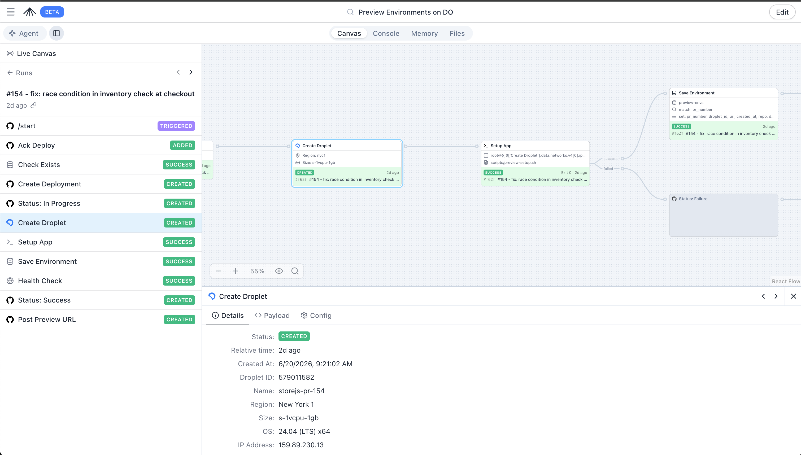

# SuperPlane

SuperPlane is an open source automation engine for AI-driven engineering.

It lets you orchestrate engineering workflows across the tools you use — such as Git, LLMs, CI/CD, observability, incident tools, and infrastructure — with durable execution, approvals, and operational UI.

SuperPlane executes your processes deterministically, providing the exact guardrails both humans and AI need to safely interact with your systems.



## Project status

<p>
  <a href="https://superplanehq.semaphoreci.com/projects/superplane"></a>
  <a href="https://github.com/superplanehq/superplane/pulse"></a>
  <a href="https://discord.gg/KC78eCNsnw"></a>
</p>

SuperPlane is in **beta**. Self-host the core engine ([installation guide](https://docs.superplane.com/installation/overview/)) or use [SuperPlane Cloud](https://app.superplane.com) for managed runners and one-click app installs. Core primitives and integrations are maturing; breaking changes are possible. Report issues on [GitHub](https://github.com/superplanehq/superplane/issues/new).

## What it does

SuperPlane orchestrates your existing stack into git-backed **apps** with durable execution — workflows too complex for a single script or CI job.

- **Apps**: A deployable unit combining a workflow graph, custom console UI, app-scoped memory, and deterministic execution. Versioned in git (`canvas.yaml`, `console.yaml`); defines guardrails for AI agents and human operators.
- **Event-driven orchestration**: Multi-step workflows across your Git, CI/CD, observability, incident tools, and notifications — triggered by webhooks, schedules, and tool events, with approvals, policy checks, and human-in-the-loop steps.
- **Console dashboards**: Define your own per-app operational UI as a dynamic grid of panels. Use it to display KPIs, tables, charts, runbooks, pinned nodes, and workflow controls, backed by live data from memory, runs, and executions.
- **Agents & operators**: Built-in per-app agent to design workflows and debug runs; CLI and [skills](https://github.com/superplanehq/skills) for external coding agents. Same RBAC on all paths.

## How it works

- **Canvases**: A graph of steps and their dependencies; a single canvas can express multiple workflows and run them concurrently.
- **Components**: Each node is a trigger or action, built-in or integration-backed that performs a specific task (for example: deploy a service, open an incident, post a notification, wait for a condition, require approval, etc.).
- **Events & triggers**: Incoming events match triggers and start runs with the event payload as input.
- **Runs & durable execution**: Runs, run items, and payloads are tracked across restarts; failed steps can resume without custom retry logic.
- **Memory**: App-scoped JSON storage that persists across runs.

### Example use cases

A few concrete things teams build with SuperPlane:

- **PR preview environments**: on pull request, provision an ephemeral environment, run tests, and post the live URL back to the PR.
- **Policy-gated production deploy**: when CI finishes green, hold outside business hours, require on-call + product approval, then trigger the deploy.
- **Progressive delivery (10% → 50% → 100%)**: deploy in waves, wait/verify at each step, and rollback on failure with an approval gate.
- **Release train with a multi-repo ship set**: wait for tags/builds from a set of services, fan-in once all are ready, then dispatch a coordinated deploy.
- **“First 5 minutes” incident triage**: on incident created, fetch context in parallel (recent deploys + health signals), generate an evidence pack, and open an issue.

## Quick start

**Local (demo container):**

```
docker pull ghcr.io/superplanehq/superplane-demo:stable
docker run --rm -p 3000:3000 -v spdata:/app/data -ti ghcr.io/superplanehq/superplane-demo:stable
```

Open [http://localhost:3000](http://localhost:3000).

**Cloud:** Sign up at [app.superplane.com](https://app.superplane.com) ([cloud beta overview](https://superplane.com/blog/superplane-cloud-beta/)).

For a guided first workflow, see the [quick start guide](https://docs.superplane.com/get-started/quickstart/).

## Supported Integrations

SuperPlane integrates with the tools you already use. Each integration provides triggers (events that start workflows) and components (actions you can run).

> View the full list in our [documentation](https://docs.superplane.com/components/). Missing a provider? [Open an issue](https://github.com/superplanehq/superplane/issues/new).

### AI & LLM

<table>
<tr>
<td align="center" width="150"><a href="https://docs.superplane.com/components/claude/" target="_blank"><br/>Claude</a></td>
<td align="center" width="150"><a href="https://docs.superplane.com/components/cursor/" target="_blank"><br/>Cursor</a></td>
<td align="center" width="150"><a href="https://docs.superplane.com/components/openai/" target="_blank"><br/>OpenAI</a></td>
<td align="center" width="150"><a href="https://docs.superplane.com/components/perplexity/" target="_blank"><br/>Perplexity</a></td>
</tr>
</table>

### Version Control & CI/CD

<table>
<tr>
<td align="center" width="150"><a href="https://docs.superplane.com/components/bitbucket/" target="_blank"><br/>Bitbucket</a></td>
<td align="center" width="150"><a href="https://docs.superplane.com/components/circleci/" target="_blank"><br/>CircleCI</a></td>
<td align="center" width="150"><a href="https://docs.superplane.com/components/github/" target="_blank"><br/>GitHub</a></td>
<td align="center" width="150"><a href="https://docs.superplane.com/components/gitlab/" target="_blank"><br/>GitLab</a></td>
<td align="center" width="150"><a href="https://docs.superplane.com/components/harness/" target="_blank"><br/>Harness</a></td>
<td align="center" width="150"><a href="https://docs.superplane.com/components/octopusdeploy/" target="_blank"><br/>Octopus Deploy</a></td>
<td align="center" width="150"><a href="https://docs.superplane.com/components/render/" target="_blank"><br/>Render</a></td>
<td align="center" width="150"><a href="https://docs.superplane.com/components/semaphore/" target="_blank"><br/>Semaphore</a></td>
</tr>
</table>

### Cloud & Infrastructure

<table>
<tr>
<td align="center" width="150"><a href="https://docs.superplane.com/components/aws/#ecr-•-on-image-push" target="_blank"><br/>AWS ECR</a></td>
<td align="center" width="150"><a href="https://docs.superplane.com/components/aws/#lambda-•-run-function" target="_blank"><br/>AWS Lambda</a></td>
<td align="center" width="150"><a href="https://docs.superplane.com/components/aws/#code-artifact-•-on-package-version" target="_blank"><br/>AWS CodeArtifact</a></td>
<td align="center" width="150"><a href="https://docs.superplane.com/components/aws/#cloud-watch-•-on-alarm" target="_blank"><br/>AWS CloudWatch</a></td>
<td align="center" width="150"><a href="https://docs.superplane.com/components/aws/#sns-•-on-topic-message" target="_blank"><br/>AWS SNS</a></td>
</tr>
<tr>
<td align="center" width="150"><a href="https://docs.superplane.com/components/googlecloud/#cloud-build-•-create-build" target="_blank"><br/>GCP Cloud Build</a></td>
<td align="center" width="150"><a href="https://docs.superplane.com/components/googlecloud/#cloud-functions-•-invoke-function" target="_blank"><br/>GCP Cloud Functions</a></td>
<td align="center" width="150"><a href="https://docs.superplane.com/components/googlecloud/#compute-•-on-vm-instance" target="_blank"><br/>GCP Compute</a></td>
<td align="center" width="150"><a href="https://docs.superplane.com/components/cloudflare/" target="_blank"><br/>Cloudflare</a></td>
<td align="center" width="150"><a href="https://docs.superplane.com/components/digitalocean/" target="_blank"><br/>DigitalOcean</a></td>
</tr>
<tr>
<td align="center" width="150"><a href="https://docs.superplane.com/components/dockerhub/" target="_blank"><br/>DockerHub</a></td>
<td align="center" width="150"><a href="https://docs.superplane.com/components/hetznercloud/" target="_blank"><br/>Hetzner Cloud</a></td>
<td align="center" width="150"><a href="https://docs.superplane.com/components/microsoftazure/" target="_blank"><br/>Azure</a></td>
<td align="center" width="150"><a href="https://docs.superplane.com/components/oraclecloudinfrastructure/" target="_blank"><br/>OCI</a></td>
<td align="center" width="150"><a href="https://docs.superplane.com/components/coolify/" target="_blank"><br/>Coolify</a></td>
</tr>
</table>

### Observability

<table>
<tr>
<td align="center" width="150"><a href="https://docs.superplane.com/components/datadog/" target="_blank"><br/>DataDog</a></td>
<td align="center" width="150"><a href="https://docs.superplane.com/components/dash0/" target="_blank"><br/>Dash0</a></td>
<td align="center" width="150"><a href="https://docs.superplane.com/components/grafana/" target="_blank"><br/>Grafana</a></td>
<td align="center" width="150"><a href="https://docs.superplane.com/components/honeycomb/" target="_blank"><br/>Honeycomb</a></td>
<td align="center" width="150"><a href="https://docs.superplane.com/components/logfire/" target="_blank"><br/>Logfire</a></td>
<td align="center" width="150"><a href="https://docs.superplane.com/components/newrelic/" target="_blank"><br/>New Relic</a></td>
<td align="center" width="150"><a href="https://docs.superplane.com/components/prometheus/" target="_blank"><br/>Prometheus</a></td>
</tr>
<tr>
<td align="center" width="150"><a href="https://docs.superplane.com/components/elastic/" target="_blank"><br/>Elastic</a></td>
<td align="center" width="150"><a href="https://docs.superplane.com/components/sentry/" target="_blank"><br/>Sentry</a></td>
</tr>
</table>

### Incident Management

<table>
<tr>
<td align="center" width="150"><a href="https://docs.superplane.com/components/firehydrant/" target="_blank"><br/>FireHydrant</a></td>
<td align="center" width="150"><a href="https://docs.superplane.com/components/incident/" target="_blank"><br/>Incident.io</a></td>
<td align="center" width="150"><a href="https://docs.superplane.com/components/pagerduty/" target="_blank"><br/>PagerDuty</a></td>
<td align="center" width="150"><a href="https://docs.superplane.com/components/rootly/" target="_blank"><br/>Rootly</a></td>
<td align="center" width="150"><a href="https://docs.superplane.com/components/statuspage/" target="_blank"><br/>Statuspage</a></td>
</tr>
</table>

### Communication

<table>
<tr>
<td align="center" width="150"><a href="https://docs.superplane.com/components/discord/" target="_blank"><br/>Discord</a></td>
<td align="center" width="150"><a href="https://docs.superplane.com/components/sendgrid/" target="_blank"><br/>SendGrid</a></td>
<td align="center" width="150"><a href="https://docs.superplane.com/components/slack/" target="_blank"><br/>Slack</a></td>
<td align="center" width="150"><a href="https://docs.superplane.com/components/smtp/" target="_blank"><br/>SMTP</a></td>
<td align="center" width="150"><a href="https://docs.superplane.com/components/microsoftteams/" target="_blank"><br/>Microsoft Teams</a></td>
<td align="center" width="150"><a href="https://docs.superplane.com/components/telegram/" target="_blank"><br/>Telegram</a></td>
</tr>
</table>

### Ticketing

<table>
<tr>
<td align="center" width="150"><a href="https://docs.superplane.com/components/jira/" target="_blank"><br/>Jira</a></td>
<td align="center" width="150"><a href="https://docs.superplane.com/components/servicenow/" target="_blank"><br/>ServiceNow</a></td>
</tr>
</table>

### Developer Tools

<table>
<tr>
<td align="center" width="150"><a href="https://docs.superplane.com/components/cloudsmith/" target="_blank"><br/>Cloudsmith</a></td>
<td align="center" width="150"><a href="https://docs.superplane.com/components/daytona/" target="_blank"><br/>Daytona</a></td>
<td align="center" width="150"><a href="https://docs.superplane.com/components/jfrogartifactory/" target="_blank"><br/>JFrog Artifactory</a></td>
<td align="center" width="150"><a href="https://docs.superplane.com/components/launchdarkly/" target="_blank"><br/>LaunchDarkly</a></td>
</tr>
</table>

## Security

- **RBAC** and **service accounts** for API access — see [access control](https://docs.superplane.com/concepts/access-control/) and [service accounts](https://docs.superplane.com/concepts/service-accounts/)
- **Secrets** stored encrypted — see [secrets](https://docs.superplane.com/concepts/secrets/)

## Production installation

**Footprint:** PostgreSQL, RabbitMQ, and the SuperPlane application (bundled in the single-host Docker Compose installer). Deploy on a single Linux host or Kubernetes (GKE, EKS) with external PostgreSQL. See the [installation overview](https://docs.superplane.com/installation/overview/) for topology-specific upgrade paths.

- **[Single Host Installation](https://docs.superplane.com/installation/overview/#single-host-installation)** — AWS EC2, GCP Compute Engine, Hetzner, DigitalOcean, Linode, or any Linux server
- **[Kubernetes Installation](https://docs.superplane.com/installation/overview/#kubernetes)** — GKE, EKS, or any Kubernetes cluster

Installation admins can enable private network access during owner setup or later in `/admin/settings` when SuperPlane needs to reach tools inside a VPC, private Kubernetes cluster, or another closed network. Environment variables still take precedence: set `BLOCKED_HTTP_HOSTS` or `BLOCKED_PRIVATE_IP_RANGES` to override the UI-controlled policy, and set either variable to an empty value to disable that specific block list entirely.

## Contributing

We welcome your bug reports, ideas for improvement, and focused PRs.

- Read the **[Contributing Guide](CONTRIBUTING.md)** to get started.
- Issues: use GitHub issues for bugs and feature requests.

## License

Apache License 2.0. See `LICENSE`.

## Community

- **[Discord](https://discord.superplane.com)** - Join our community for discussions, questions, and collaboration
- **[X](https://x.com/superplanehq)** - Follow us for updates and announcements

test

test

test

test

test

test

test

test

test

test

test

test

test

test

test

test

test

test

test

test

test

test

test

test

test

test

test
