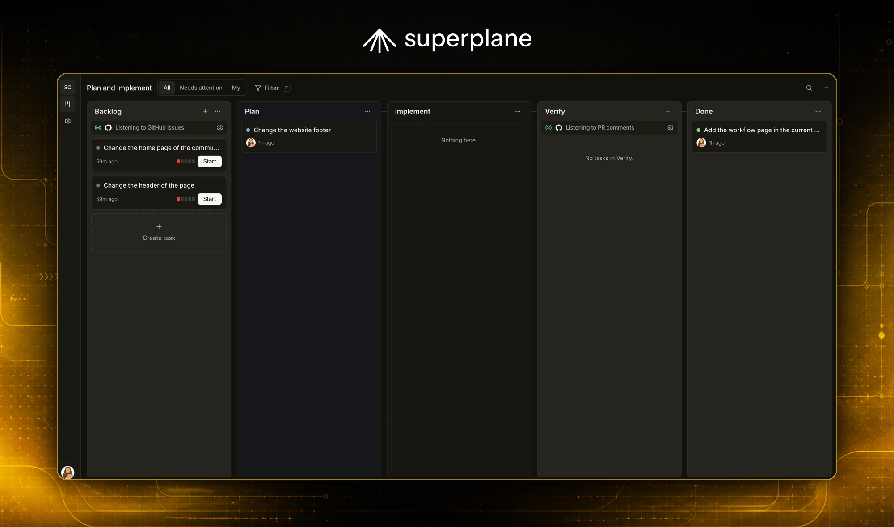
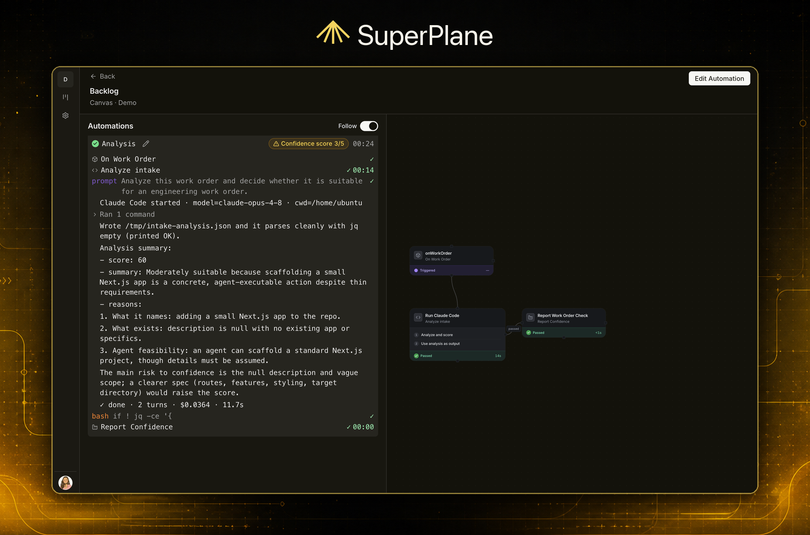

  
  
  
  

  <a href="https://superplane.com/">Website</a> ·
  <a href="https://docs.superplane.com/">Docs</a> ·
  <a href="https://discord.superplane.com/">Discord</a> ·
  <a href="https://superplane.com/blog/">Blog</a> ·
  <a href="https://luma.com/superplane">Event</a>

> [!NOTE]
> SuperPlane is in beta. We are building the **Open source factory for one-shot
> engineering**. Follow the
> [latest releases](https://github.com/superplanehq/superplane/releases),
> explore [open issues](https://github.com/superplanehq/superplane/issues) and
> see [how you can contribute](#contributing) as the SuperPlane matures.

## About

**Open source factory for one-shot engineering.**

SuperPlane turns high-confidence backlog issues into verified, review-ready
pull requests so engineers can focus on work that needs judgment.

SuperPlane lets AI agents fully automate routine development work. It
coordinates coding agents, source control, CI, review, approvals and feedback
in one visible system so engineers do not have to project-manage every step.

The factory continuously evaluates which backlog issues agents can handle with
high confidence. It applies the same workflow-level guardrails to every run,
checks the result and sends failures back to the agent with actionable context.
Ambiguous work and decisions that need human judgment stay with your team.

SuperPlane is built on an Apache 2.0 open source engine. Choose your models,
run in the cloud or on-prem and build the factory around your stack and cost
constraints.

## How the factory works

A SuperPlane Factory turns incoming work into a durable operational record.
A work order enters through the backlog, moves through one or more automation
lines and produces pull requests, notes, branches and other reviewable
artifacts.

| Resource | What it does |
| --- | --- |
| **Factory** | Holds work orders, automation lines and the policies for a team. |
| **Work order** | Records one delegated task from intake through its final outcome. |
| **Line** | Defines the ordered stages that process a work order. |
| **Automation** | Runs an agent, calls a tool, waits for an event or requires approval through a Canvas-backed app. |
| **Run** | Tracks durable execution, inputs, outputs, retries and cost for one automation step. |

Every step stays visible. SuperPlane preserves the event history, execution
state and artifacts across retries so a failed run can resume without custom
glue or lost context.

## Built around your stack

SuperPlane coordinates the systems where engineering work already happens.
Each integration provides event triggers and actions that you can compose on a
Canvas.

| Area | Examples |
| --- | --- |
| **AI and coding agents** | Claude, Cursor, OpenAI, OpenRouter and Perplexity |
| **Source control and CI** | GitHub, GitLab, Bitbucket, Semaphore, CircleCI and Harness |
| **Cloud and delivery** | AWS, Google Cloud, Azure, Cloudflare, Docker Hub and Render |
| **Observability** | Datadog, Grafana, Honeycomb, New Relic, Prometheus and Sentry |
| **Incidents and service management** | PagerDuty, Rootly, FireHydrant, incident.io, Jira and ServiceNow |
| **Communication** | Slack, Discord, Microsoft Teams, Telegram, SendGrid and SMTP |

[Explore every integration →](https://docs.superplane.com/components/)

## Contributing

We welcome focused pull requests, bug reports and product ideas.

1. Read the [contributing guide](./CONTRIBUTING.md).
2. Review the [issue tracking process](./docs/contributing/issue-tracking.md).
3. Find an [open issue](https://github.com/superplanehq/superplane/issues) or an
   [open bounty](https://superplane.com/bounties/).
4. Join the [Discord community](https://discord.superplane.com) to discuss an
   approach with maintainers.

Contributor setup is Docker-based. Start with the repository instructions in
[`AGENTS.md`](./AGENTS.md) and the development section of
[`CONTRIBUTING.md`](./CONTRIBUTING.md).

## Community

- [Discord](https://discord.superplane.com) for discussions and support
- [Blog](https://superplane.com/blog/) for engineering notes and releases
- [Community events](https://luma.com/superplane) for maintainer sessions
- [X](https://x.com/superplanehq) for product updates

## License

SuperPlane is available under the [Apache License 2.0](./LICENSE).
