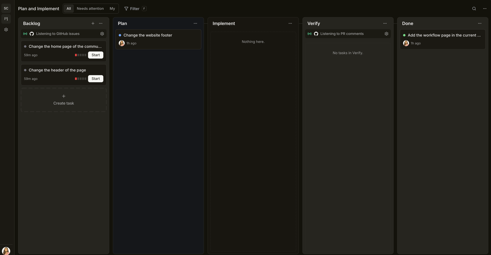

<div align="center">

# SuperPlane

**The open source control plane for agentic engineering.**

Turn focused issues into verified, review-ready pull requests without asking
engineers to manage every agent step.

[](https://github.com/superplanehq/superplane)
[](https://superplanehq.semaphoreci.com/projects/superplane)
[](LICENSE)
[](https://discord.superplane.com)

[Website](https://superplane.com) ·
[Cloud](https://app.superplane.com) ·
[Documentation](https://docs.superplane.com) ·
[Quickstart](https://docs.superplane.com/get-started/quickstart/) ·
[Discord](https://discord.superplane.com)

</div>



## Make agents work like they should

SuperPlane lets AI agents automate routine development work so your team can
focus on work that needs engineering judgment.

It is an open source AI software factory for repeatable, high-confidence work.

It coordinates coding agents, source control, CI, review, approvals and
feedback in one visible system. You define the workflow once. SuperPlane then
runs each work order with durable execution and returns the result when it is
ready for review.

> [!NOTE]
> SuperPlane is in beta. Core primitives and integrations are still maturing
> and breaking changes are possible.

## From backlog to reviewed work

| 01 / Discover | 02 / Control | 03 / Verify |
| --- | --- | --- |
| Find codebase and backlog work that agents can complete with high confidence. | Define scope, required checks, review policy, approvals and escalation paths. | Capture failures, send actionable feedback, rerun checks and return verified work. |

```text
Focused issue → Plan → Implement → Verify ↺ Repair → Review-ready pull request
```

The workflow owns the rules. The agent performs the work inside those rules.
Ambiguous work and decisions that need human judgment stay with your team.

## One factory. Your standards.

- **Bring your agents.** Use Claude, Cursor, OpenAI and other coding agents
  with the tools already in your engineering stack.
- **Make judgment executable.** Apply the same tests, architecture rules,
  risk checks and approvals to every run.
- **Keep work visible.** See what is planned, what is running, what failed and
  where human attention is required.
- **Recover without custom glue.** Resume durable runs and route failures back
  through feedback and repair steps.
- **Keep control of the system.** Self-host the Apache 2.0 engine or use
  SuperPlane Cloud.

## How the factory works

A SuperPlane Factory turns incoming work into a durable operational record.
Each work order can move through one or more automation lines and can produce
pull requests, notes, branches and other artifacts.

| Resource | What it does |
| --- | --- |
| **Factory** | Holds work orders, automation lines and the policies for a team. |
| **Work order** | Records one piece of delegated work from the first request to the final outcome. |
| **Line** | Defines the ordered stages that process a work order. |
| **Automation** | Uses a Canvas-backed app to run an agent, call a tool, wait for an event or require approval. |
| **Run** | Tracks durable execution, inputs, outputs, retries and cost for one automation step. |

SuperPlane also supports general-purpose **Apps** for release workflows,
preview environments, incident response and other engineering operations.
Apps combine a workflow canvas, a custom console, app-scoped memory and
git-backed configuration.

## What teams build

- **Issue-to-pull-request factories** that plan, implement and verify focused
  backlog work.
- **PR feedback loops** that listen for review comments and return the work to
  an agent with clear context.
- **Policy-gated deployments** that wait for checks and approvals before they
  change production.
- **Progressive delivery** that deploys in stages, verifies each stage and
  rolls back when a check fails.
- **Preview environments** that provision infrastructure for a pull request
  and post the live URL back to source control.
- **Incident response** that gathers recent changes and health signals before
  it opens an evidence-rich issue.

## Built around your stack

SuperPlane connects agents to the systems where engineering work already
happens. Each integration provides event triggers and actions that you can
compose on a Canvas.

| Area | Examples |
| --- | --- |
| **AI and coding agents** | Claude, Cursor, OpenAI, OpenRouter and Perplexity |
| **Source control and CI** | GitHub, GitLab, Bitbucket, Semaphore, CircleCI and Harness |
| **Cloud and delivery** | AWS, Google Cloud, Azure, Cloudflare, Docker Hub and Render |
| **Observability** | Datadog, Grafana, Honeycomb, New Relic, Prometheus and Sentry |
| **Incidents and service management** | PagerDuty, Rootly, FireHydrant, incident.io, Jira and ServiceNow |
| **Communication** | Slack, Discord, Microsoft Teams, Telegram, SendGrid and SMTP |

[Explore every integration →](https://docs.superplane.com/components/)

## Quickstart

### SuperPlane Cloud

Use [SuperPlane Cloud](https://app.superplane.com) for managed runners and
one-click app installation.

### Local demo

Run the demo container to explore SuperPlane on your machine:

```bash
docker pull ghcr.io/superplanehq/superplane-demo:stable
docker run --rm -p 3000:3000 -v spdata:/app/data -ti ghcr.io/superplanehq/superplane-demo:stable
```

Open [http://localhost:3000](http://localhost:3000), then follow the
[guided quickstart](https://docs.superplane.com/get-started/quickstart/).

> [!IMPORTANT]
> The demo container is for evaluation. Use the production installation paths
> below for persistent or shared environments.

### Production installation

SuperPlane runs with PostgreSQL, RabbitMQ and the SuperPlane application.

- [Install on one Linux host](https://docs.superplane.com/installation/overview/#single-host-installation)
- [Install on Kubernetes](https://docs.superplane.com/installation/overview/#kubernetes)
- [Review the installation architecture](https://docs.superplane.com/installation/overview/)

## Repository pulse

Open source work should be observable. This section turns the repository into
a small public console with live signals for commits, issues, pull requests
and contributors.

<a href="https://github.com/superplanehq/superplane/pulse">
  
</a>

<p align="center">
  <a href="https://github.com/superplanehq/superplane/commits/main"></a>
  <a href="https://github.com/superplanehq/superplane/issues"></a>
  <a href="https://github.com/superplanehq/superplane/pulls"></a>
  <a href="https://github.com/superplanehq/superplane/graphs/contributors"></a>
</p>

Follow the [full activity feed](https://github.com/superplanehq/superplane/activity),
review [open pull requests](https://github.com/superplanehq/superplane/pulls)
or see the [latest release](https://github.com/superplanehq/superplane/releases/latest).

## Repository guide

SuperPlane keeps the engine, interface and public API in one repository.

| Path | Responsibility |
| --- | --- |
| [`cmd/`](./cmd/) | Server, worker and CLI entry points |
| [`pkg/`](./pkg/) | Go application code, integrations, models and durable workers |
| [`web_src/`](./web_src/) | React and TypeScript product interface |
| [`protos/`](./protos/) | Source definitions for the public API and generated clients |
| [`docs/`](./docs/) | Product decisions, design notes and contributor documentation |

Read the [architecture guide](./docs/contributing/architecture.md) before you
make a cross-cutting change.

## Contributing

We welcome focused pull requests, bug reports and product ideas.

1. Read the [contributing guide](./CONTRIBUTING.md).
2. Review the [issue tracking process](./docs/contributing/issue-tracking.md).
3. Find an [open issue](https://github.com/superplanehq/superplane/issues) or an
   [open bounty](https://superplane.com/bounties/).
4. Join the [Discord community](https://discord.superplane.com) when you want
   to discuss an approach with maintainers.

Contributor setup is Docker-based. Start with the repository instructions in
[`AGENTS.md`](./AGENTS.md) and the development section of
[`CONTRIBUTING.md`](./CONTRIBUTING.md).

## Security

SuperPlane provides role-based access control, scoped API keys and encrypted
secret storage. Read the guides for [access control](https://docs.superplane.com/concepts/access-control/),
[service accounts](https://docs.superplane.com/concepts/service-accounts/) and
[secrets](https://docs.superplane.com/concepts/secrets/).

Report vulnerabilities privately with
[GitHub Security Advisories](https://github.com/superplanehq/superplane/security/advisories/new).

## Community

- [Discord](https://discord.superplane.com) for discussions and support
- [Blog](https://superplane.com/blog/) for engineering notes and releases
- [Community events](https://luma.com/superplane) for maintainer sessions
- [X](https://x.com/superplanehq) for product updates

## License

SuperPlane is available under the [Apache License 2.0](./LICENSE).

<p align="center">
  <strong>Your practices. Your tools. Your factory.</strong>
</p>
