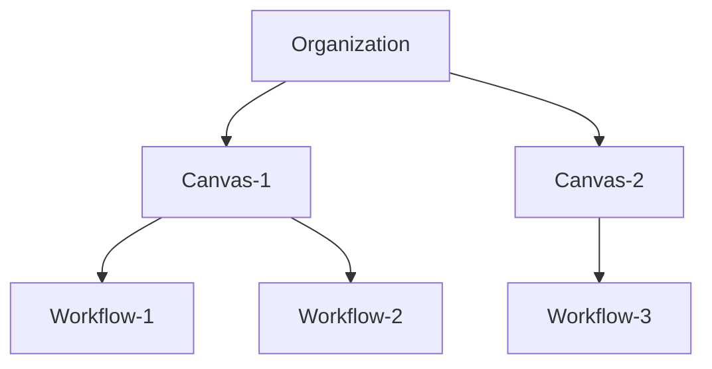
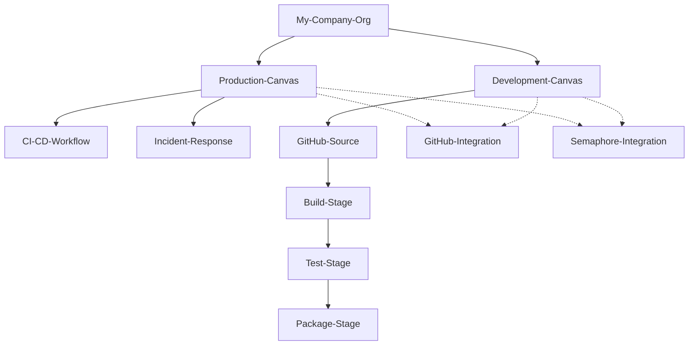
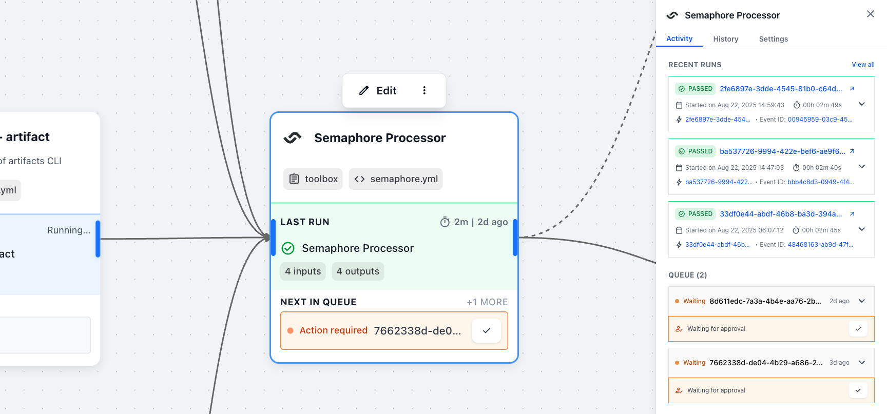
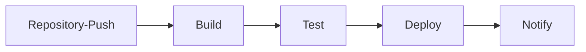
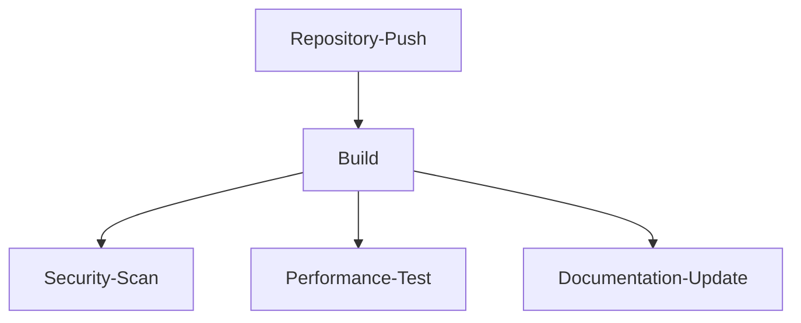
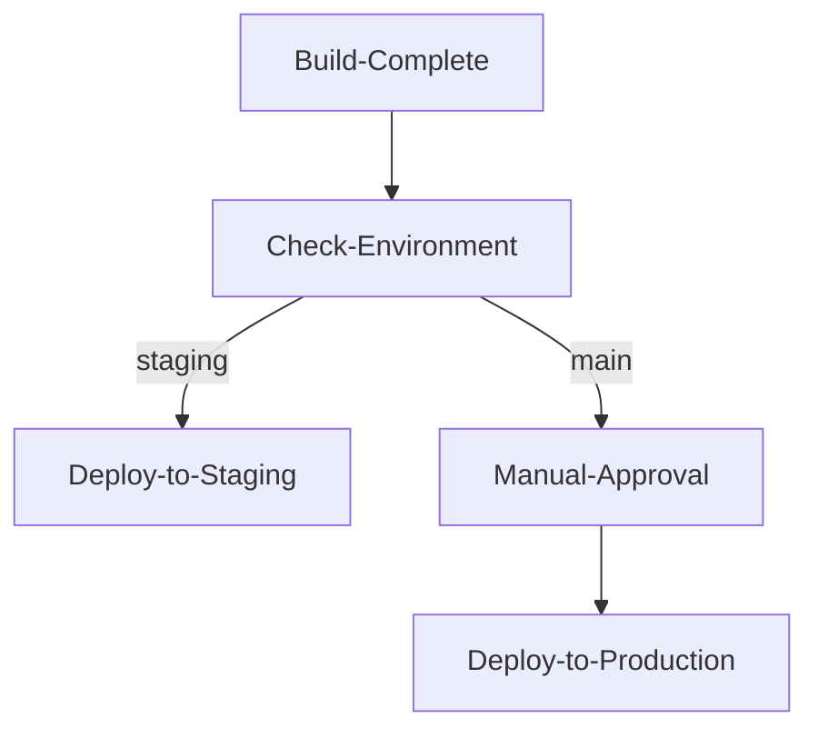
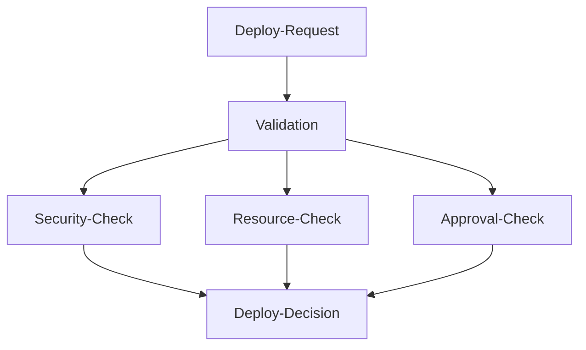
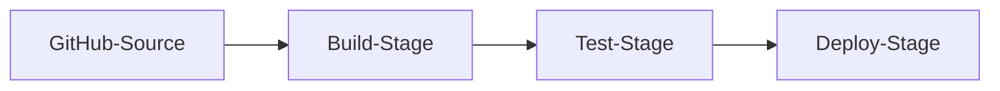
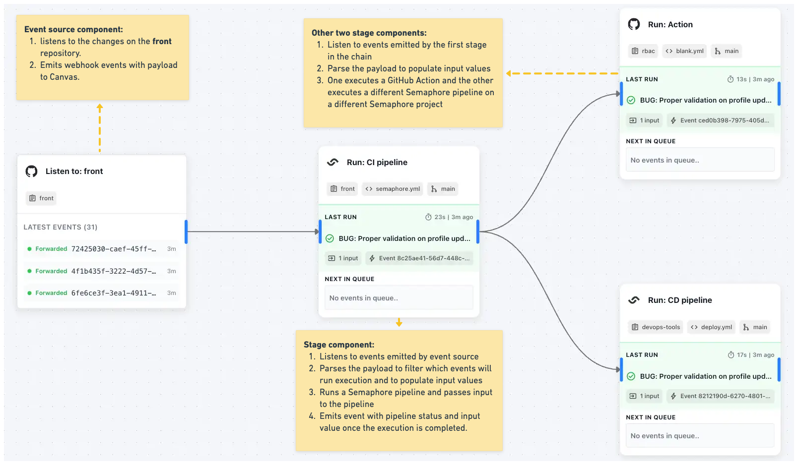
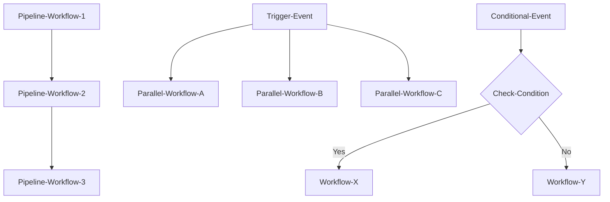

# Canvas and Workflows

## Table of Contents

- [Overview](#overview)
- [Organizations](#organizations)
- [Canvas](#canvas)
- [Workflows](#workflows)
- [Cross-Workflow Coordination](#cross-workflow-coordination)

---

## Overview

SuperPlane organizes DevOps automation through a hierarchical structure: Organizations contain Canvases, and Canvases contain multiple Workflows.

---

## Organizations

Organizations provide the top-level boundary for all SuperPlane resources, operating as isolated tenants with complete data separation.

### Organization Structure Example

This example shows how integrations can be shared across Canvases while workflows remain isolated within their respective Canvas boundaries.

---

## Canvas

Canvas is your main workspace for building and managing DevOps workflows. Each Canvas operates as a self-contained project environment.

### Canvas Management

Use Canvases to organize workflows by:
- **Application** - One Canvas per application or service
- **Environment** - Separate Canvases for dev/staging/production
- **Team** - Different Canvases for different team responsibilities

---

## Workflows

Workflows represent complete operational processes built from connected components.

### Workflow Patterns

**Linear chains:** Sequential component execution.

**Parallel branches:** Multiple components execute simultaneously.

**Conditional routing:** Path selection based on conditions.

**Fan-out/fan-in:** Multiple parallel operations that converge.

### Workflow Example

---

## Cross-Workflow Coordination

Workflows can coordinate through several mechanisms:

### Orchestration Patterns

**Pattern types:**
- **Pipeline workflows** - Sequential workflows where one triggers the next
- **Parallel workflows** - Independent workflows running simultaneously
- **Conditional workflows** - Different workflows triggered based on conditions