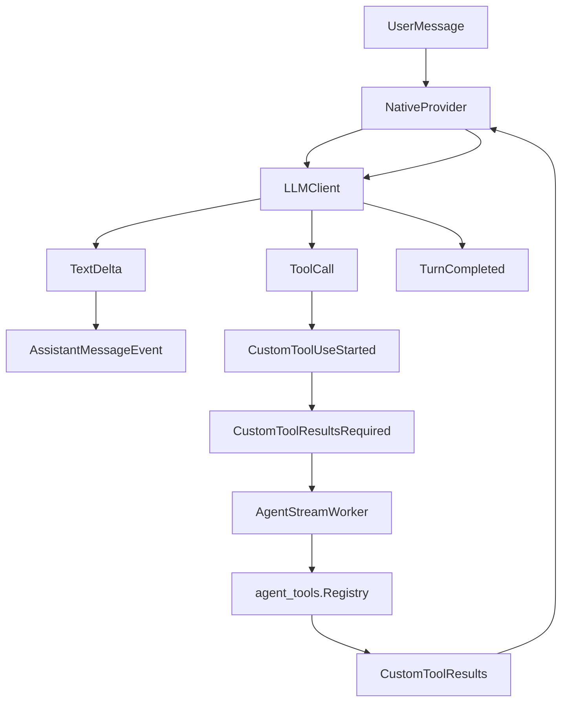

# Native Agent Provider

SuperPlane has two agent provider paths:

- `anthropic`: Anthropic Managed Agents, kept as the high-power fallback.
- `native`: SuperPlane's own Go agent loop around either an OpenAI-compatible chat completions API or Anthropic's direct Messages API.

Both providers implement `agents.Provider`, so `agents.Service`, `AgentStreamWorker`, the websocket event path, and `agent_tools.Registry` stay provider-neutral.

The native provider uses the same SuperPlane agent prompt as the Anthropic
managed provider. The prompt text lives in `pkg/agents/anthropic/agent_prompt.md`
and is exposed through `agents.DefaultAgentPrompt()`, so behavior changes apply
to both providers.

## Loop Shape

The native provider follows the standard Go agent harness loop:

1. Initialize session history with the shared SuperPlane system prompt.
2. Append each user message with the same refreshed preamble built by `agents.Service`.
3. Build a provider-neutral `llm.StreamRequest` with message history and SuperPlane tool definitions.
4. Stream model events through an `llm.Client`.
5. Emit assistant text as `ProviderEventAssistantMessage`.
6. Emit model tool calls as `ProviderEventCustomToolUseStarted`.
7. If there are tool calls, pause and emit `ProviderEventCustomToolResultsRequired`.
8. `AgentStreamWorker` executes those tools through `agent_tools.Registry`.
9. `SendCustomToolResults` appends tool results to native session history.
10. The worker calls `StreamEvents` again, and the loop continues.
11. When the model returns no tool calls, the provider emits `ProviderEventTurnCompleted`.



## Important Files

- `pkg/agents/native/provider.go`: `agents.Provider` implementation and event emission.
- `pkg/agents/native/session.go`: session history, pending tool state, max-step accounting, interruption, and repeated tool-call detection.
- `pkg/agents/native/store.go`: durable session snapshot interface and in-memory test store.
- `pkg/agents/native/database_store.go`: Postgres-backed native session store.
- `pkg/agents/native/llm/types.go`: provider-neutral messages, blocks, tool calls, tool results, and stream events.
- `pkg/agents/native/llm/openai/client.go`: OpenAI-compatible adapter. It uses SSE streaming and accumulates function-call argument chunks before emitting a complete tool call.
- `pkg/agents/native/llm/anthropic/client.go`: Anthropic Messages API adapter. It uses direct Claude API streaming and accumulates streamed tool-use JSON before emitting a complete tool call.
- `pkg/agents/factory/factory.go`: provider selection for `anthropic` vs `native`.
- `pkg/workers/agent_stream_worker.go`: streams provider events, executes required custom tools concurrently, and preserves provider-required result ordering.

## Tools And Instructions

The native provider exposes the same SuperPlane custom tools as the managed
Anthropic provider:

- `superplane_app`: access checks, app reads, runtime reads, draft creation,
  draft updates, repository file reads/writes/deletes, file commits, and
  connected integration listing.
- `superplane_component_schema`: registry-backed component, trigger, and widget
  schema lookup.

These are built from `agent_tools.DefaultDefinitions()` and executed by
`agent_tools.Registry`, exactly like Anthropic custom tool calls.

The native provider intentionally does not expose Anthropic's generic
`agent_toolset_20260401` tools such as bash/read/write/edit/glob/grep. SuperPlane
app work should still go through `superplane_app` and
`superplane_component_schema`, as required by the shared prompt.

## Configuration

Anthropic managed agents remain the default:

```sh
SUPERPLANE_AGENT_PROVIDER=anthropic
ANTHROPIC_API_KEY=...
ANTHROPIC_AGENT_ID=...
ANTHROPIC_ENVIRONMENT_ID=...
```

To use the native loop:

```sh
SUPERPLANE_AGENT_PROVIDER=native
NATIVE_AGENT_LLM_PROVIDER=openai
NATIVE_AGENT_API_KEY=...
NATIVE_AGENT_BASE_URL=https://api.openai.com/v1
NATIVE_AGENT_MODEL=...
NATIVE_AGENT_MAX_STEPS=12
NATIVE_AGENT_MAX_TOOL_CALLS=20
NATIVE_AGENT_MAX_CONTEXT_CHARS=120000
NATIVE_AGENT_MAX_RETRIES=3
```

`NATIVE_AGENT_BASE_URL` can point at any OpenAI-compatible chat completions endpoint.

To use direct Claude API instead of Anthropic managed agents:

```sh
SUPERPLANE_AGENT_PROVIDER=native
NATIVE_AGENT_LLM_PROVIDER=anthropic
NATIVE_AGENT_API_KEY=...
NATIVE_AGENT_BASE_URL=https://api.anthropic.com/v1
NATIVE_AGENT_MODEL=<claude-model>
NATIVE_AGENT_MAX_STEPS=12
NATIVE_AGENT_MAX_TOOL_CALLS=20
NATIVE_AGENT_MAX_CONTEXT_CHARS=120000
NATIVE_AGENT_MAX_RETRIES=3
```

This path does not use Anthropic managed-agent IDs or environments. It only uses Anthropic's Messages API as the model backend for SuperPlane's native Go agent loop.

## Safety And Bounds

- A session rejects new user messages with `agents.ErrSessionBusy` while waiting for tool results.
- Native session snapshots are persisted in `native_agent_sessions` before/after each loop step, including history, pending tools, interruption state, and loop counters.
- `NATIVE_AGENT_MAX_STEPS` caps model/tool iterations per user turn.
- `NATIVE_AGENT_MAX_TOOL_CALLS` caps tool calls from a single model step.
- `NATIVE_AGENT_MAX_CONTEXT_CHARS` caps the message history sent to the LLM. The native provider keeps the system prompt, adds a compacted summary of older omitted turns, and preserves the most recent messages verbatim within that budget.
- `NATIVE_AGENT_MAX_RETRIES` controls model API retries. Native LLM clients retry only retryable statuses (`429`, `500`, `502`, `503`, `504`), honor `Retry-After`, use capped jittered backoff otherwise, and never retry a stream after any event has been emitted.
- Repeating the same tool call with the same input three times returns a doom-loop error.
- Interrupting a session prevents additional native loop execution.
- Custom tools still run through existing SuperPlane authorization and tool registries.
- Worker-side custom tool execution is concurrent, but results are sent back to the provider in the exact required ID order.
- `AgentStreamWorker` still applies its provider stream timeout, so a stuck turn cannot run forever.

## Current Trade-Offs

The native provider is intentionally a strict Go harness, not an external agent framework. It keeps the SuperPlane provider boundary small, avoids generic shell/file tools, and uses deterministic compaction instead of adding another summarizer model call to every long session. If native agents become the default for heavy production traffic, the next scaling step is proactive per-tenant/model token buckets at the gateway or worker boundary.
