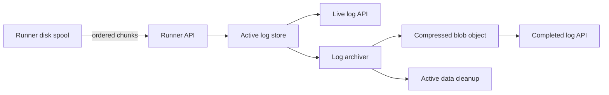

# Active Runner Task Log Storage

This document defines the design for active runner task logs.
It also describes the filesystem store implementation.

## Decision Summary

- SuperPlane will use a filesystem for active runner task logs.
- Local and single-replica installations can use a local filesystem.
- Multi-replica installations must use a shared filesystem.
- Blob storage will continue to hold completed task logs.
- A task log will have a maximum retained size of 10 MiB.
- Active stores will initially keep log chunks uncompressed.
- The runner will keep unacknowledged log data on its local disk.
- The runner API will acknowledge data only after the active store persists it.
- The runner API will tell the runner to stop sending logs when the task reaches
  the retained-size limit.
- SuperPlane will send a log upload policy with each task.
- SuperPlane can update the policy in log upload responses.
- Clients will use a cursor and will not request old active data again.

## Context

The runner currently writes NDJSON log chunks of up to 64 KiB.
It also seals a nonempty chunk every 2.5 to 5 seconds.

The runner API stores each chunk as a separate blob object.
The live log API reads these objects in sequence and streams them to the client.

This design causes many object storage requests for one task.
A ten-minute task can create 120 to 240 chunks from timed flushes alone.
High-output tasks can create more chunks.

The live log client also does not use the existing chunk cursor.
Each reconnect can cause the API to read all active chunks again.

Object storage request latency makes the initial read slow.
Repeated reads also increase storage operations and backend work.

## Goals

- Show new log data within approximately five seconds.
- Keep runner log data durable after the API acknowledges it.
- Limit the retained log size for each task.
- Read active logs without one storage request for each runner chunk.
- Support multiple API replicas.
- Keep active log traffic out of the application database.
- Support small and large installations with the same storage implementation.
- Move completed logs to the existing blob storage system.
- Control runner log traffic without a runner configuration change.

## Non-goals

- This design does not change the legacy runner log backend.
- This design does not provide full-text search across logs.
- This design does not define the retention period for completed logs.
- This design does not give cloud storage credentials to runners.
- This design does not replace the final blob storage provider.

## Capacity Assumptions

The current average timed flush interval is 3.75 seconds.
The expected write rate is approximately one chunk per active logging task per interval.

| Concurrent logging tasks | Approximate chunk writes per second |
| ---: | ---: |
| 10 | 3 |
| 100 | 27 |
| 1,000 | 267 |
| 10,000 | 2,667 |

The expected installation sizes are:

| Organization size | Concurrent tasks | Filesystem guidance |
| --- | ---: | --- |
| Small | 10 to 100 | Local or shared filesystem |
| Medium | 100 to 1,000 | Local or shared filesystem |
| Large | 1,000 to 10,000 | Shared filesystem |
| Huge | More than 10,000 | Shared filesystem with measured capacity |

Multi-tenant installations combine workloads from many organizations.
Operators must size the active log store for the combined workload.
Load tests must confirm filesystem capacity for each installation.

## Storage Lifecycle

An active log and a completed log use different storage systems.



The lifecycle has these states:

1. `active`: The runner can append data, and readers use the active store.
2. `archivable`: The task is terminal, and the archiver can claim its log.
3. `archiving`: The archiver creates the compressed object.
4. `archived`: The compressed object is available. New readers use blob storage.
   Existing readers can finish reading from the active store.

SuperPlane stores this lifecycle in PostgreSQL.
The lifecycle record has one row for each runner task.
Task start creates the record in the `active` state.

The record includes:

- Task ID
- Active store name
- State
- Final object key
- Final cursor
- Truncation status
- Active-data cleanup time
- Archiving lease time
- Creation and update times

An archived lifecycle with a cleanup time still has active data available for
existing readers. After the grace period, SuperPlane deletes the active data,
keeps the lifecycle archived, and clears the cleanup time.

The filesystem store owns its chunk sequence and byte-count metadata.
SuperPlane must not update PostgreSQL for every append.

## Active Log Store Contract

The active log store is an internal interface.
Its logical operations are:

- `Setup`: Prepare and validate the filesystem store during application startup.
- `Initialize`: Create store metadata before SuperPlane sends the task to a runner.
- `Append`: Persist one ordered runner chunk.
- `ReadAfter`: Read data after an opaque cursor.
- `Delete`: Remove all active data for one task.

The implementation must provide these guarantees:

- `Setup` is idempotent and safe when multiple application replicas call it.
- `Initialize` is idempotent.
- An acknowledged append is durable.
- Appends for one task are ordered.
- A retry of an accepted append succeeds without adding duplicate data.
- An append with a future sequence fails.
- A read returns complete NDJSON records in order.
- A cursor identifies the last returned position.
- `Delete` is idempotent.
- One task cannot exceed the configured retained-size limit.
- Multiple API replicas can use the store safely.

The cursor is opaque outside the store implementation.
The append sequence and read cursor are independent:

- The append sequence identifies runner upload chunks for ordering and deduplication.
- The read cursor identifies a store-specific position in the combined active log.

The filesystem uses a committed byte offset.
Clients must not construct or interpret cursors.

SuperPlane calls `Setup` before it starts runner API handlers and log workers.
Startup fails if the filesystem store cannot complete setup.
The setup context supplies the operation context and metrics provider.

SuperPlane calls `Initialize` before it sends a task to a runner.
This call creates the store metadata and selects the filesystem path.
An append fails with `ErrNotFound` if initialization did not complete.

## Upload Flow

The runner keeps its current durable disk spool.
It uploads sealed chunks in sequence.

For each chunk, the runner API:

1. Authenticates the runner.
2. Confirms that the runner owns the task.
3. Confirms that the task accepts logs.
4. Calls `Append` with the task ID, sequence, and content.
5. Returns an acknowledgement and the next upload action after durable storage
   succeeds.

If the API fails before acknowledgement, the runner retries the same sequence.
The store treats the retry as an idempotent operation.

The runner sends task completion only after all retained data receives acknowledgement.
This behavior preserves logs during API and store failures.

## Runner Upload Policy

SuperPlane selects the upload policy.
The runner does not select a policy for a storage backend.

The task payload contains the initial policy:

- `target_chunk_bytes`: Seal a chunk when it reaches this size.
- `partial_flush_interval_min_ms`: Set the minimum delay for a partial chunk.
- `partial_flush_interval_max_ms`: Set the maximum delay for a partial chunk.

The runner selects a random partial flush interval within the configured range.
This behavior prevents synchronized uploads from many runners.

The runner seals a chunk when one of these conditions occurs:

- The chunk reaches `target_chunk_bytes`.
- The selected partial flush interval expires.
- The task finishes.

A successful upload response has one of these actions:

- `Continue`: Delete the acknowledged local chunk and continue uploads.
- `Stop`: Delete the acknowledged local chunk and stop uploads for the task.

A response can include a replacement upload policy.
The runner applies the replacement policy to data that is not sealed.
The task payload policy controls new tasks.
Upload response policies also control tasks that are already running.

The API can reject an upload with a retry delay during temporary overload.
The runner keeps the unacknowledged chunk and retries it after that delay.

SuperPlane validates each policy against protocol safety limits.
The runner uses safe defaults when an older task payload does not contain a
policy.

Smaller chunks reduce each mutation size.
They also increase HTTP requests, storage mutations, and stored chunk metadata.
Larger chunks reduce request rates but can increase write latency and live-log
latency.

SuperPlane initially uses one default policy for all active stores.
During high load, SuperPlane can increase the target size or flush intervals.
Load tests can determine if a future store needs a different policy.

## Log Size Limit

The retained log limit is 10 MiB for each task.
The active store enforces the limit.
The task payload does not need to include this limit.

When a chunk reaches the limit, the store adds one truncation record.
The record explains that SuperPlane discarded additional task output.

The API acknowledges the accepted data and returns a `Stop` instruction.
After it receives this instruction, the runner stops sending logs for that
task.

The local spool limit must not be smaller than the retained log limit.
The implementation can use the same 10 MiB value for both limits.

The transport endpoint limits each request to twice the current target chunk
size. This limit gives the runner space for record boundaries while protecting
the API from an invalid or malicious request.

## Active Read Flow

The live log API accepts an opaque `after` cursor.
It immediately returns only data that follows that cursor.

The response includes the next cursor and log state.
The client stores this cursor for the next request.
The client sends the cursor back unchanged:

```text
response header:
X-SuperPlane-Log-Cursor: 65536

next request:
?after=65536
```

The `after` value is not a runner chunk index.

The client must not replay all active data after each reconnect.
An initial request can read the complete active log.
Later requests read only new data.

The browser requests new data at a configured interval.
The API reads the active store with one query or one bounded file read.
An empty response keeps the same cursor.
This flow does not require a notification system.

### Final-log transition

The final cursor identifies the end of the active log after task completion.
The archiver stores this cursor in the lifecycle record.

During archiving, readers continue to read data from the active store.
The API uses these rules after the final object becomes available:

- A client at the final cursor receives the `archived` state and no additional
  data.
- A client behind the final cursor reads the missing active data.
- A new client without a cursor reads the complete final object.
- A stale client receives a reset instruction if active data is no longer
  available.

A client stops polling when it receives the `archived` state at the final
cursor.
The client keeps the log data that it already received.

For a reset, the client clears its current log state and reads the complete
final object.
The API does not seek into the gzip-compressed final object.

## Archiving Flow

Task completion changes the lifecycle from `active` to `archivable`.
The runner sends completion only after the final chunk receives acknowledgement.
The runner API accepts appends only while the lifecycle is `active`.
The store does not need a separate seal operation.

The archiver uses a lease so only one worker processes a task.

For each task, the archiver:

1. Claims an `archivable` lifecycle and changes it to `archiving`.
2. Calls `ReadAfter` with an empty cursor.
3. Records the returned cursor as the final cursor.
4. Writes one gzip-compressed NDJSON object to blob storage.
5. Confirms that the blob write succeeded.
6. Changes the lifecycle state to `archived`.
7. Schedules explicit deletion after the live-reader grace period.

The final object key remains:

```text
{installationID}/orgs/{organizationID}/runner-tasks/{taskID}/logs/v1/logs.ndjson.gz
```

The archiver can safely retry each step.
It can overwrite the same final object after an interrupted attempt.

Readers continue to use the active store during archiving.
SuperPlane changes the read source only after the final object is available.

Cleanup failure does not make the completed log unavailable.
The cleanup worker retries the explicit deletion.
After successful deletion, the lifecycle remains `archived`, and the worker
clears the scheduled cleanup time.

## Filesystem Store

The filesystem store is the active runner log store for all installations.
Local development and single-replica installations can use a local filesystem.
Larger and multi-replica installations use the same implementation with a
shared filesystem.
All runner API and archiver replicas must mount the same paths.

The shared filesystem must provide these features:

- Read-write access from multiple pods.
- POSIX-compatible file behavior.
- Advisory file locks across clients.
- Atomic file replacement through `rename`.
- Durable file synchronization.

Google Cloud Filestore with NFSv4.1 provides these capabilities for GKE.
Other shared filesystems can be used if they provide the same behavior.

### Physical layout

The store creates one directory for each task:

```text
{root}/{taskID}/
  logs.ndjson
  manifest.json
```

`logs.ndjson` is one append-only file.
`manifest.json` contains this append-frequency metadata:

- Next sequence.
- Total committed bytes.
- Truncation status.
- Last update time.

The store keeps this metadata outside the application database.
An append to the filesystem does not write to PostgreSQL.

`Setup` creates `{root}/.locks` for each configured root.
The store can create up to 4,096 fixed lock shard files in this directory.
It creates each shard file when an operation first uses it and retains the file.
The task ID selects one lock shard.

```text
task UUID
    |
    v
first two UUID bytes as a 16-bit number
    |
    v
value modulo 4,096
    |
    v
shard 0-4,095
    |
    v
.locks/xxxx.lock
```

For example, a UUID that starts with `f2f7` produces this result:

```text
0xf2f7 = 62,199
62,199 modulo 4,096 = 759
759 = 0x02f7
lock path = .locks/02f7.lock
```

Prefixes `02f7`, `12f7`, through `f2f7` select the same shard.
Random UUIDs distribute tasks evenly across the shards.

One lock file for each task would accumulate indefinitely.
Deleting these files during task cleanup would be unsafe.
A process can still hold the deleted inode while another process creates and
locks a new file at the same path.
The processes would then hold different locks for the same task.

Fixed shards do not require lock-file deletion and keep the file count bounded.
Tasks that select the same shard serialize briefly, but their data stays
separate.
The 4,096 shard count balances lock-file count against collision contention.

### Write consistency

Each operation takes an in-process shard lock and a filesystem advisory lock.
The in-process lock serializes goroutines in one application process.
The filesystem lock also serializes separate processes and pods on shared storage.
Local development uses both locks on its Docker volume.
It follows the same operation path without requiring shared storage.

Ordering and deduplication use `next_sequence`.
They do not use `total_bytes`.

| Incoming sequence | Result |
| --- | --- |
| Less than `next_sequence` | The chunk is a duplicate. Return success without writing. |
| Equal to `next_sequence` | Append the chunk and increment `next_sequence`. |
| Greater than `next_sequence` | An earlier chunk is missing. Return a conflict. |

For example:

```text
before:
  file = "abc"
  next_sequence = 1
  total_bytes = 3

receive:
  sequence = 1
  content = "hello"

after data synchronization:
  file = "abchello"
  next_sequence = 1
  total_bytes = 3

after manifest commit:
  file = "abchello"
  next_sequence = 2
  total_bytes = 8
```

An append uses this sequence:

1. Locate the task manifest.
2. Read the current manifest.
3. Repair uncommitted file bytes if a previous append stopped early.
4. Append data to `logs.ndjson`.
5. Synchronize the data file.
6. Write a temporary manifest.
7. Synchronize the temporary manifest.
8. Replace `manifest.json` atomically.
9. Synchronize the task directory.

The manifest defines the committed byte count.
Extra file bytes are not committed if the process fails before manifest replacement.
A later append truncates these extra bytes before it writes new data.

```text
failure before manifest commit:
  manifest still has next_sequence = 1 and total_bytes = 3
  retry truncates the file to 3 bytes and appends sequence 1 again

failure after manifest commit but before HTTP acknowledgement:
  manifest has next_sequence = 2 and total_bytes = 8
  retry of sequence 1 returns success without another append
```

Task locks prevent two replicas from accepting the same next sequence.
Duplicate detection uses only the sequence.
It assumes the runner's durable spool sends the same content for each retry.
The store applies the 10 MiB limit before it writes data.

### Reads and cleanup

`ReadAfter` reads the manifest and opens a bounded section of `logs.ndjson`.
The returned cursor is the committed byte offset.
Later appends do not change the bounded read result.

```text
manifest total bytes: 13
requested cursor:      6
returned section:      [6,13)
returned cursor:       13

later append extends file to byte 20
existing section:      [6,13)
next request section:  [13,20)
next cursor:           20
```

The section is a view over an open file, not an in-memory copy.
The store never modifies committed bytes in place.
It can release the task lock after it opens the bounded section.

`Delete` removes the task directory.
It uses the same locks as append and read operations.

### Filesystem migration

The store accepts one primary path and zero or more fallback paths.
`Initialize` creates each new task in the primary path.
Other operations locate the task manifest across all configured paths.

Existing tasks stay in their original path during a storage migration.
New tasks use the new primary path.
A task manifest in more than one path is an error.

Use this deployment sequence:

1. Mount the old and new filesystems on all applicable deployments.
2. Configure the old path as primary and make both paths readable.
3. Deploy the configuration to runner API and archiver replicas.
4. Change the primary path to the new filesystem.
5. Keep the old path as a fallback.
6. Wait until tasks on the old path finish and active data cleanup completes.
7. Remove the old fallback path and volume mount.

This flow does not move active files.
It routes each task to the path selected during initialization.

## Configuration

The filesystem store uses these variables:

```text
RUNNER_ACTIVE_LOG_FS_PATH=/primary/path
RUNNER_ACTIVE_LOG_FS_FALLBACK_PATHS=/old/path,/another/old/path
```

`RUNNER_ACTIVE_LOG_FS_PATH` is the primary path.
`RUNNER_ACTIVE_LOG_FS_FALLBACK_PATHS` is an optional comma-separated list.
Local Docker uses `/var/lib/superplane/active-runner-logs` on a named volume.
It does not configure fallback paths.

The task lifecycle record stores the active store name.
Filesystem fallback paths support volume changes without interrupting active
tasks.

The task lifecycle table belongs to the application schema.
Application database migrations create it for every installation.
It coordinates archiving and records pending active-data cleanup.

Final log storage continues to use the existing blob provider configuration.

## Compression

Active stores initially keep chunks uncompressed.
Active logs are temporary, so compression does not materially reduce their
storage cost.

Compression could reduce the data transferred between SuperPlane and an active
store. JSONL compresses well, but compression adds CPU work and implementation
complexity.

Add active-store compression only after benchmarks show that transfer volume
is a constraint.
Completed log objects remain gzip-compressed.

## Failure Handling

### Active store unavailable

The runner API does not acknowledge the chunk.
The runner keeps the chunk on disk and retries it.

### API fails after append

The runner retries the same sequence.
The active store returns success without adding duplicate data.

### Runner fails

SuperPlane marks the task as lost through the existing runner lifecycle.
The archiver archives all acknowledged chunks.

### Final blob write fails

The lifecycle remains `archiving`.
Readers continue to use the active store.
The archiver retries the blob write.

### Lifecycle update fails after blob write

The archiver writes the same object again or verifies the existing object.
It then retries the lifecycle update.

### Active cleanup fails

The final object remains available.
The cleanup worker retries deletion.

## Security and Tenant Isolation

The public API authorizes every read through the task's organization.
The runner API authorizes every append through the assigned runner.

The active store is not directly accessible to runners or browsers.
Only SuperPlane services can access the filesystem store.
The application enforces organization isolation.

Logs can contain secrets.
The store must use encryption in transit and at rest.
Operators must not include log content in application logs or metrics.

## Observability

Each store implementation creates and records its metrics internally.
It creates the required instruments during `Setup` and uses the operation
context when it records them.

Implementations can expose different metrics for their storage model.
Useful logical metrics include:

- Append requests, bytes, latency, and errors
- Duplicate and conflicting appends
- Active tasks, bytes, and chunks
- Reads, returned bytes, latency, and errors
- Cursor lag
- Truncated task count
- Archiving attempts, latency, and errors
- Cleanup attempts, latency, and errors
- Age of the oldest active and archiving task

Filesystem deployments should also monitor:

- Operation latency and errors
- Bytes read and written
- Lock wait time
- Filesystem capacity and utilization
- Age of the oldest active task

## Alternatives

### One blob object for each active chunk

This is the current approach.
It creates too many sequential storage reads.
Client replay can multiply those reads.

### One growing PostgreSQL value

This approach uses fewer rows.
It rewrites the growing value and creates excessive WAL and dead data.

### Immutable PostgreSQL chunk rows

This approach can serve small installations without additional infrastructure.
Each chunk adds application database writes, WAL traffic, and cleanup work.
The filesystem store keeps active log traffic out of the application database
and supports the same storage model at larger scales.

### Redis

Redis Streams can provide low-latency active log reads.
Redis memory and persistence costs make it a poor authoritative store for all active bytes.
Redis can remain an optional active store or cache layer.

### Multipart uploads

Multipart uploads do not expose a normal object before completion.
They do not support live reads of the unfinished task log.

### Appendable object storage

GCS Rapid and S3 Express support appendable objects.
These services can become future active store implementations.

Their APIs, availability models, and costs differ.

## Implementation Sequence

1. Add the active log lifecycle record.
2. Add the active log store interface.
3. Implement the filesystem store and volume migration routing.
4. Add cursor-based active reads.
5. Update the client to preserve and send its cursor.
6. Enforce the 10 MiB retained-size limit.
7. Update archiving to read through the active store.
8. Add common metrics and failure tests.

## Validation Plan

Test the filesystem store with:

- 100 concurrent logging tasks
- 500 concurrent logging tasks
- 1,000 concurrent logging tasks
- Average chunks of 1 KiB, 4 KiB, 16 KiB, and 64 KiB
- Ten-minute, one-hour, and 24-hour task durations
- Initial full-log reads
- Incremental cursor reads
- Archiving during active reads
- Duplicate, missing, and future sequences
- API failure after a durable append
- Store unavailability and recovery
- Cleanup retries after explicit deletion failure
- Policy changes while tasks are running
- Temporary overload responses and runner retries
- Active readers that reach the final cursor
- Stale cursors after active data cleanup
- New readers of completed logs

Record filesystem utilization during each test.
Confirm that normal SuperPlane API latency stays stable.

Also test:

- Concurrent appends from multiple application replicas.
- Shared-volume advisory locks.
- Process failure between data synchronization and manifest replacement.
- Primary and fallback path routing.
- Duplicate manifests across configured paths.
- Cleanup across primary and fallback paths.
