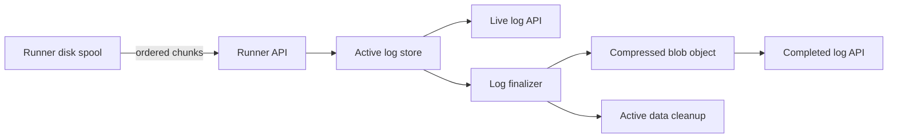

# Active Runner Task Log Storage

This document defines the target design for active runner task logs.
It does not describe the current implementation.

## Decision Summary

- SuperPlane will use a configurable active log store.
- SuperPlane will set up only the selected active log store during startup.
- PostgreSQL is intended for small and medium installations.
- Bigtable is available for larger installations.
- Blob storage will continue to hold completed task logs.
- A task log will have a maximum retained size of 10 MiB.
- Active stores will initially keep log chunks uncompressed.
- The runner will keep unacknowledged log data on its local disk.
- The runner API will acknowledge data only after the active store persists it.
- The runner API will tell the runner to stop sending logs when the task reaches
  the retained-size limit.
- SuperPlane will send a log upload policy with each task.
- SuperPlane can update the policy in log upload responses.
- Active log data will have a seven-day safety expiration.
- Clients will use a cursor and will not request old active data again.

## Context

The runner currently writes NDJSON log chunks of up to 64 KiB.
It also seals a nonempty chunk every 2.5 to 5 seconds.

The runner API stores each chunk as a separate blob object.
The live log API reads these objects in sequence and streams them to the client.

This design causes many object storage requests for one task.
A ten-minute task can create 120 to 240 chunks from timed flushes alone.
High-output tasks can create more chunks.

The live log client also does not use the existing chunk cursor.
Each reconnect can cause the API to read all active chunks again.

Object storage request latency makes the initial read slow.
Repeated reads also increase storage operations and backend work.

## Goals

- Show new log data within approximately five seconds.
- Keep runner log data durable after the API acknowledges it.
- Limit the retained log size for each task.
- Read active logs without one storage request for each runner chunk.
- Support multiple API replicas.
- Keep requirements small for installations that use PostgreSQL.
- Support large workloads without adding log traffic to the application database.
- Move completed logs to the existing blob storage system.
- Let operators select an active log store for their installation.
- Control runner log traffic without a runner configuration change.

## Non-goals

- This design does not change the legacy runner log backend.
- This design does not provide full-text search across logs.
- This design does not define the retention period for completed logs.
- This design does not give cloud storage credentials to runners.
- This design does not replace the final blob storage provider.

## Capacity Assumptions

The current average timed flush interval is 3.75 seconds.
The expected write rate is approximately one chunk per active logging task per interval.

| Concurrent logging tasks | Approximate chunk writes per second |
| ---: | ---: |
| 10 | 3 |
| 100 | 27 |
| 1,000 | 267 |
| 10,000 | 2,667 |

The expected installation sizes are:

| Organization size | Concurrent tasks | Store guidance |
| --- | ---: | --- |
| Small | 10 to 100 | PostgreSQL |
| Medium | 100 to 1,000 | PostgreSQL |
| Large | 1,000 to 10,000 | Bigtable |
| Huge | More than 10,000 | Bigtable with additional capacity |

Multi-tenant installations combine workloads from many organizations.
Operators must size the active log store for the combined workload.

## Storage Lifecycle

An active log and a completed log use different storage systems.



The lifecycle has these states:

1. `active`: The runner can append data, and readers use the active store.
2. `finalizing`: The finalizer creates the compressed object. Readers continue to use the active store.
3. `archived`: The compressed object is available. New readers use blob storage.
   Existing readers can finish reading from the active store.

SuperPlane stores this lifecycle in PostgreSQL.
The lifecycle record has one row for each runner task.

The record includes:

- Task ID
- Organization ID
- Active store name
- State
- Final object key
- Final cursor
- Truncation status
- Active-data cleanup time
- Creation and update times

An archived lifecycle with a cleanup time still has active data available for
existing readers. After the grace period, SuperPlane deletes the active data,
keeps the lifecycle archived, and clears the cleanup time.

External active stores own their chunk sequence and byte-count metadata.
SuperPlane must not update PostgreSQL for every external-store append.

## Active Log Store Contract

The active log store is an internal interface.
Its logical operations are:

- `Setup`: Prepare and validate the selected store during application startup.
- `Append`: Persist one ordered runner chunk.
- `ReadAfter`: Read data after an opaque cursor.
- `Seal`: Stop new appends and return a stable ordered stream and final cursor.
- `Delete`: Remove all active data for one task.

The implementation must provide these guarantees:

- `Setup` is idempotent and safe when multiple application replicas call it.
- An acknowledged append is durable.
- Appends for one task are ordered.
- A retry of an accepted append succeeds without adding duplicate data.
- An append with a future sequence fails.
- A read returns complete NDJSON records in order.
- A cursor identifies the last returned position.
- `Seal` is idempotent.
- `Delete` is idempotent.
- One task cannot exceed the configured retained-size limit.
- Multiple API replicas can use the store safely.

The cursor is opaque outside the store implementation.
This rule permits different physical layouts in PostgreSQL and Bigtable.

SuperPlane calls `Setup` before it starts runner API handlers and log workers.
Startup fails if the selected store cannot complete setup.
SuperPlane does not set up stores that the installation did not select.
The setup context supplies store dependencies, including the application
database and the metrics provider. Each implementation uses only the
dependencies that it needs.

## Upload Flow

The runner keeps its current durable disk spool.
It uploads sealed chunks in sequence.

For each chunk, the runner API:

1. Authenticates the runner.
2. Confirms that the runner owns the task.
3. Confirms that the task accepts logs.
4. Calls `Append` with the task ID, sequence, and content.
5. Returns an acknowledgement and the next upload action after durable storage
   succeeds.

If the API fails before acknowledgement, the runner retries the same sequence.
The store treats the retry as an idempotent operation.

The runner sends task completion only after all retained data receives acknowledgement.
This behavior preserves logs during API and store failures.

## Runner Upload Policy

SuperPlane selects the upload policy.
The runner does not select a policy for a storage backend.

The task payload contains the initial policy:

- `target_chunk_bytes`: Seal a chunk when it reaches this size.
- `partial_flush_interval_min_ms`: Set the minimum delay for a partial chunk.
- `partial_flush_interval_max_ms`: Set the maximum delay for a partial chunk.

The runner selects a random partial flush interval within the configured range.
This behavior prevents synchronized uploads from many runners.

The runner seals a chunk when one of these conditions occurs:

- The chunk reaches `target_chunk_bytes`.
- The selected partial flush interval expires.
- The task finishes.

A successful upload response has one of these actions:

- `Continue`: Delete the acknowledged local chunk and continue uploads.
- `Stop`: Delete the acknowledged local chunk and stop uploads for the task.

A response can include a replacement upload policy.
The runner applies the replacement policy to data that is not sealed.
The task payload policy controls new tasks.
Upload response policies also control tasks that are already running.

The API can reject an upload with a retry delay during temporary overload.
The runner keeps the unacknowledged chunk and retries it after that delay.

SuperPlane validates each policy against protocol safety limits.
The runner uses safe defaults when an older task payload does not contain a
policy.

Smaller chunks reduce each mutation size.
They also increase HTTP requests, storage mutations, and stored chunk metadata.
Larger chunks reduce request rates but can increase write latency and live-log
latency.

SuperPlane selects a policy from active-store guidance and current system load.
During high load, SuperPlane can increase the target size or flush intervals.
Load tests must determine the default policy for each active store.

## Log Size Limit

The retained log limit is 10 MiB for each task.
The active store enforces the limit.
The task payload does not need to include this limit.

When a chunk reaches the limit, the store adds one truncation record.
The record explains that SuperPlane discarded additional task output.

The API acknowledges the accepted data and returns a `Stop` instruction.
After it receives this instruction, the runner stops sending logs for that
task.

The local spool limit must not be smaller than the retained log limit.
The implementation can use the same 10 MiB value for both limits.

The transport endpoint limits each request to twice the current target chunk
size. This limit gives the runner space for record boundaries while protecting
the API from an invalid or malicious request.

## Active Read Flow

The live log API accepts an opaque `after` cursor.
It immediately returns only data that follows that cursor.

The response includes the next cursor and log state.
The client stores this cursor for the next request.

The client must not replay all active data after each reconnect.
An initial request can read the complete active log.
Later requests read only new data.

The browser requests new data at a configured interval.
The API reads the active store with one query or one row scan.
An empty response keeps the same cursor.
This flow does not require a notification system.

### Final-log transition

The final cursor identifies the end of the sealed active log.
The finalizer stores this cursor in the lifecycle record.

During finalization, readers continue to read new data from the active store.
The API uses these rules after the final object becomes available:

- A client at the final cursor receives the `archived` state and no additional
  data.
- A client behind the final cursor reads the missing active data.
- A new client without a cursor reads the complete final object.
- A stale client receives a reset instruction if active data is no longer
  available.

A client stops polling when it receives the `archived` state at the final
cursor.
The client keeps the log data that it already received.

For a reset, the client clears its current log state and reads the complete
final object.
The API does not seek into the gzip-compressed final object.

## Finalization Flow

The finalizer processes terminal runner tasks.
It uses a lease so only one worker finalizes a task.

For each task, the finalizer:

1. Changes the lifecycle state to `finalizing`.
2. Calls `Seal` on the active store and records the final cursor.
3. Reads the active log in order.
4. Writes one gzip-compressed NDJSON object to blob storage.
5. Confirms that the blob write succeeded.
6. Changes the lifecycle state to `archived`.
7. Schedules explicit deletion after a one-minute grace period.

The final object key remains:

```text
runner-logs/v1/{organizationID}/{taskID}/logs.ndjson.gz
```

The finalizer can safely retry each step.
It can overwrite the same final object after an interrupted attempt.

Readers continue to use the active store during finalization.
SuperPlane changes the read source only after the final object is available.

Cleanup failure does not make the completed log unavailable.
The cleanup worker retries the explicit deletion.
After successful deletion, the lifecycle remains `archived`, and the worker
clears the scheduled cleanup time.
The active store also uses a seven-day expiration policy as a final safeguard.
This policy removes data if the cleanup worker cannot complete the deletion.

## PostgreSQL Store

PostgreSQL is the default active store for self-hosted installations.
It requires no additional infrastructure.

The PostgreSQL implementation uses immutable chunk rows.
A conceptual table has these columns:

| Column | Purpose |
| --- | --- |
| `task_id` | Identifies the runner task |
| `sequence` | Orders the chunks |
| `content` | Stores NDJSON bytes |
| `created_at` | Supports operations and cleanup |

The primary key is `(task_id, sequence)`.
The table does not need a UUID for each chunk.
It should not have unrelated secondary indexes.

The chunk table belongs to the PostgreSQL active store.
Application database migrations do not create this table.
The PostgreSQL store creates and upgrades its table through `Setup`.
This rule prevents installations that select Bigtable from creating an unused
chunk table.

PostgreSQL setup must use versioned and concurrency-safe schema changes.
It must not depend only on `CREATE TABLE IF NOT EXISTS` for future schema
updates.

One transaction inserts the chunk and advances the task upload metadata.
The transaction also enforces the 10 MiB limit.

The implementation must not append all data to one growing `bytea` value.
PostgreSQL would create a new row and TOAST value for each update.
This behavior causes repeated data writes, WAL growth, and vacuum work.

An active read uses one ordered query for the task.
It does not perform one query for each chunk.

Cleanup uses one indexed delete for normal task sizes.
Large deletions can use rate-limited batches.
Batching smooths load but does not reduce total vacuum work.

PostgreSQL marks deleted tuples as dead.
Autovacuum later makes their space reusable.
Operators must monitor dead tuples, WAL volume, and vacuum delay.

This store targets small and medium self-hosted organizations.
Large installations can select another active store.

## Bigtable Store

Bigtable is an optional active store for large installations.
It removes active log bytes and per-chunk metadata from PostgreSQL.

### Physical layout

The proposed layout uses one Bigtable row for each task.
The 10 MiB task limit stays below Bigtable's recommended 100 MiB row limit.

The row key starts with a hash of the task identity:

```text
{taskHash}#{organizationID}#{taskID}
```

The hash distributes tasks across tablets.
The organization and task IDs support investigation and repair.

The row contains two column families:

- `metadata`: next sequence, total bytes, state, truncation status, and update time.
- `chunks`: one cell for each fixed-width sequence number.

For example:

```text
metadata:next_sequence
metadata:total_bytes
metadata:state
metadata:truncated
chunks:00000000000000000000
chunks:00000000000000000001
```

All mutations for one task affect one row.
Bigtable can apply conditional row mutations atomically.

An append reads or checks the current metadata.
It then writes the chunk cell and new metadata in one conditional mutation.

A duplicate sequence returns success.
A future sequence returns a conflict.

An active read fetches one row.
A column filter returns only chunk cells after the supplied cursor.

The table keeps one cell version.
An age-based garbage collection policy removes abandoned active logs.
Explicit deletion still occurs after successful finalization.

Bigtable infrastructure can be provisioned outside the application.
The Bigtable `Setup` implementation validates the table, column families, and
seven-day garbage collection policy.
This validation does not require the runtime service account to create or
administer Bigtable resources.

### Capacity and scaling

Representative load tests must confirm the required capacity.

SuperPlane connects with project, instance, table, and application-profile
identifiers.
The application profile controls cluster routing.
Infrastructure configuration controls capacity and availability.
This document does not define the cluster or node topology.

## Configuration

Each installation selects one active log store.
The exact configuration names are an implementation detail.

The expected choices are:

- `postgres`: Intended for small and medium installations.
- `bigtable`: Intended for larger installations.

PostgreSQL configuration uses the existing application database.
Bigtable configuration requires project, instance, table, and application-profile identifiers.

The task lifecycle record stores the selected backend.
An installation can change its default without losing access to active older tasks.

The task lifecycle table belongs to the application schema.
Application database migrations create it for every installation.
It coordinates finalization and records pending active-data cleanup for all
active store implementations.

Final log storage continues to use the existing blob provider configuration.

## Compression

Active stores initially keep chunks uncompressed.
Active logs are temporary, so compression does not materially reduce their
storage cost.

Compression could reduce the data transferred between SuperPlane and an active
store. It could also improve Bigtable throughput when uncompressed chunks are
large. JSONL compresses well, but compression adds CPU work and implementation
complexity.

Add active-store compression only after benchmarks show that transfer volume
or Bigtable throughput is a constraint.
Completed log objects remain gzip-compressed.

## Failure Handling

### Active store unavailable

The runner API does not acknowledge the chunk.
The runner keeps the chunk on disk and retries it.

### API fails after append

The runner retries the same sequence.
The active store returns success without adding duplicate data.

### Runner fails

SuperPlane marks the task as lost through the existing runner lifecycle.
The finalizer archives all acknowledged chunks.

### Final blob write fails

The lifecycle remains `finalizing`.
Readers continue to use the active store.
The finalizer retries the blob write.

### Lifecycle update fails after blob write

The finalizer writes the same object again or verifies the existing object.
It then retries the lifecycle update.

### Active cleanup fails

The final object remains available.
The cleanup worker retries deletion.
The store expiration policy removes abandoned data later.

## Security and Tenant Isolation

The public API authorizes every read through the task's organization.
The runner API authorizes every append through the assigned runner.

The active store is not directly accessible to runners or browsers.
Only the configured SuperPlane service account can access Bigtable.

Bigtable uses one shared table for all organizations.
The application enforces organization isolation.
The organization ID in the row key supports audits and cleanup.

Logs can contain secrets.
The store must use encryption in transit and at rest.
Operators must not include log content in application logs or metrics.

## Observability

Each store implementation creates and records its metrics internally.
It creates the required instruments during `Setup` and uses the operation
context when it records them.

Implementations can expose different metrics for their storage model.
Useful logical metrics include:

- Append requests, bytes, latency, and errors
- Duplicate and conflicting appends
- Active tasks, bytes, and chunks
- Reads, returned bytes, latency, and errors
- Cursor lag
- Truncated task count
- Finalization attempts, latency, and errors
- Cleanup attempts, latency, and errors
- Age of the oldest active and finalizing task

The PostgreSQL implementation also reports:

- Live and dead chunk tuples
- Chunk-table size
- WAL bytes from log storage
- Autovacuum runs and delay

The Bigtable implementation also reports:

- Node CPU utilization
- Read and write latency
- Read and write throughput
- Storage utilization
- Throttled and failed requests

## Alternatives

### One blob object for each active chunk

This is the current approach.
It creates too many sequential storage reads.
Client replay can multiply those reads.

### One growing PostgreSQL value

This approach uses fewer rows.
It rewrites the growing value and creates excessive WAL and dead data.

### Redis

Redis Streams can provide low-latency active log reads.
Redis memory and persistence costs make it a poor authoritative store for all active bytes.
Redis can remain an optional active store or cache layer.

### Shared filesystem

A shared filesystem permits one append-only file for each task.
It also adds locking, availability, scaling, and metadata-operation concerns.

This option does not fit a stateless multi-zone API.
A filesystem implementation can remain useful for local development.

### Multipart uploads

Multipart uploads do not expose a normal object before completion.
They do not support live reads of the unfinished task log.

### Appendable object storage

GCS Rapid and S3 Express support appendable objects.
These services can become future active store implementations.

Their APIs, availability models, and costs differ.

## Implementation Sequence

1. Add the active log lifecycle record.
2. Add the active log store interface.
3. Implement the PostgreSQL store.
4. Add cursor-based active reads.
5. Update the client to preserve and send its cursor.
6. Enforce the 10 MiB retained-size limit.
7. Update finalization to read through the active store.
8. Add common metrics and failure tests.

## Validation Plan

Test PostgreSQL with:

- 100 concurrent logging tasks
- 500 concurrent logging tasks
- 1,000 concurrent logging tasks
- Average chunks of 1 KiB, 4 KiB, 16 KiB, and 64 KiB
- Ten-minute, one-hour, and 24-hour task durations
- Initial full-log reads
- Incremental cursor reads
- Finalization during active reads
- Duplicate, missing, and future sequences
- API failure after a durable append
- Store unavailability and recovery
- Cleanup retries after explicit deletion failure
- Seven-day safety expiration
- Policy changes while tasks are running
- Temporary overload responses and runner retries
- Active readers that reach the final cursor
- Stale cursors after active data cleanup
- New readers of completed logs

Record database or store utilization during each test.
Confirm that normal SuperPlane API latency stays stable.
