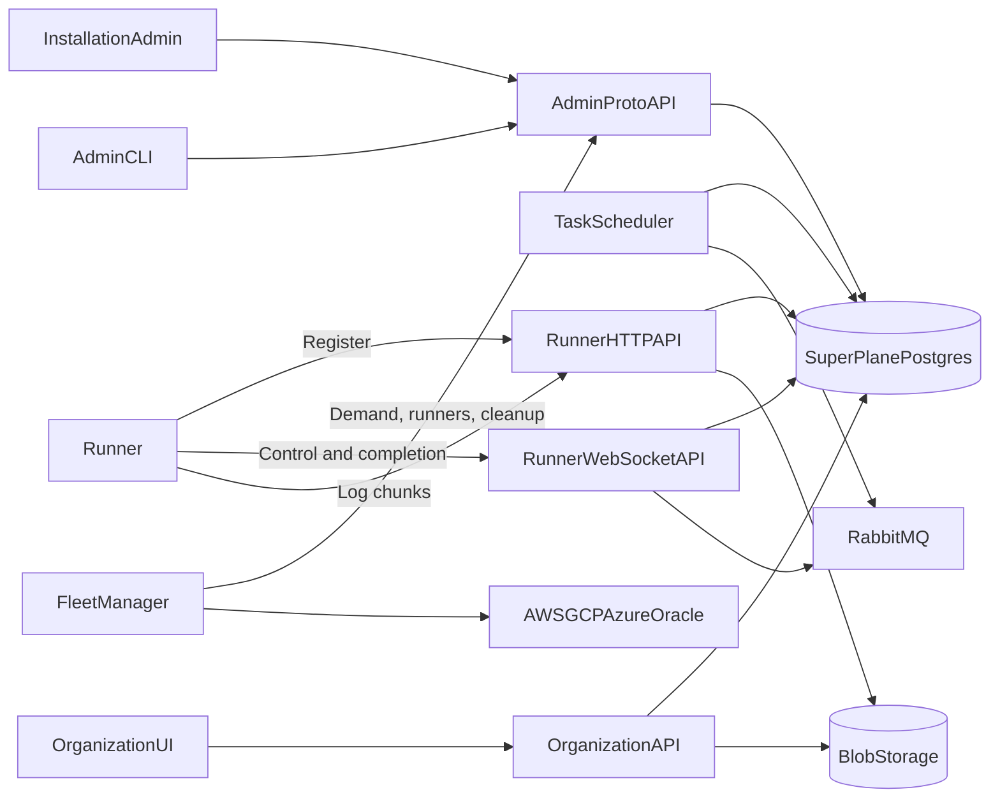

# Runners

Status: design approved for implementation

This document defines the next SuperPlane runner architecture and its rollout plan.

The new architecture makes SuperPlane authoritative for fleets, tasks, runners, and task logs.
The Fleet Manager provides compute capacity through outbound SuperPlane API calls.
Runners use a separate registration, WebSocket, and log protocol.

The new stack will run beside the legacy stack during the rollout.
SuperPlane will route new tasks by organization.
The final cutover can include planned downtime.

## Contents

- [Goals](#goals)
- [Non-goals](#non-goals)
- [Current problems](#current-problems)
- [Architecture](#architecture)
- [Terms](#terms)
- [API boundaries](#api-boundaries)
  - [Installation admin API](#installation-admin-api)
  - [Admin gateway and authentication](#admin-gateway-and-authentication)
  - [Organization API](#organization-api)
  - [Runner API](#runner-api)
- [Fleet model](#fleet-model)
- [Organization fleet extension](#organization-fleet-extension)
- [Task model](#task-model)
  - [Task-specific runners](#task-specific-runners)
- [Runner model](#runner-model)
- [Registration](#registration)
- [WebSocket protocol](#websocket-protocol)
  - [Durable connection state](#durable-connection-state)
  - [Deployment behavior](#deployment-behavior)
- [Fleet Manager](#fleet-manager)
  - [Multi-cloud extension](#multi-cloud-extension)
- [Local runners](#local-runners)
- [Logs](#logs)
  - [UI log reads](#ui-log-reads)
  - [Log security and retention](#log-security-and-retention)
- [Task data and secrets](#task-data-and-secrets)
- [Runner release](#runner-release)
- [New code isolation](#new-code-isolation)
- [Backend-sticky integration](#backend-sticky-integration)
- [Feature flag](#feature-flag)
- [Rollout plan](#rollout-plan)
  - [Phase 1: Data model and admin APIs](#phase-1-data-model-and-admin-apis)
  - [Phase 2: Runner API and integrated scheduler](#phase-2-runner-api-and-integrated-scheduler)
  - [Phase 3: New runner and Fleet Manager](#phase-3-new-runner-and-fleet-manager)
  - [Phase 4: Local and isolated testing](#phase-4-local-and-isolated-testing)
  - [Phase 5: Production canary](#phase-5-production-canary)
  - [Phase 6: Expand the canary](#phase-6-expand-the-canary)
  - [Phase 7: Global cutover](#phase-7-global-cutover)
  - [Phase 8: Drain the legacy stack](#phase-8-drain-the-legacy-stack)
  - [Phase 9: Migrate historical logs](#phase-9-migrate-historical-logs)
  - [Phase 10: Remove the legacy stack](#phase-10-remove-the-legacy-stack)
- [Rollback boundaries](#rollback-boundaries)
- [Failure behavior](#failure-behavior)
- [Observability](#observability)
- [Security](#security)
- [Open implementation details](#open-implementation-details)

## Goals

- Make SuperPlane authoritative for fleet definitions.
- Store task and runner state in the SuperPlane database.
- Remove the direct Fleet Manager dependency on task-broker.
- Keep all Fleet Manager communication outbound to SuperPlane.
- Support local, AWS, GCP, Azure, and Oracle runners.
- Keep one task per production runner.
- Support runners that are bound to one specific task.
- Use WebSocket for runner control messages.
- Use cloud-neutral object storage for task logs.
- Make runner artifacts public, versioned, and verifiable.
- Support installation fleets now and organization fleets later.
- Test the new stack without changing the legacy binaries.
- Remove the legacy stack as one isolated unit after cutover.

## Non-goals

- This work does not add installation-scoped RBAC.
- This work does not add installation service accounts.
- This work does not support multiple independent Fleet Managers.
- This work does not automatically retry a task after execution starts.
- This work does not move queued or running tasks between backends.
- This work does not make task payloads visible to Fleet Manager.
- This work does not require all existing `/admin/api/*` routes to move to proto immediately.

## Current problems

The current task-broker owns fleet definitions, task state, registration, and runner WebSocket connections.
Fleet Manager also defines fleets in its configuration and registers them with task-broker.
SuperPlane separately contains hard-coded fleet identifiers.

The current design has these problems:

- SuperPlane is not authoritative for fleet definitions.
- Fleet Manager and SuperPlane must agree on hard-coded fleet identifiers.
- Fleet Manager needs direct task-broker access and its shared control token.
- The runner binary uses a mutable private S3 location.
- Production logs depend on AWS CloudWatch.
- Local task-broker logs are process-local and are lost after a restart.
- Connected runner and drain state are process-local.
- The broker database uses GORM auto-migration outside the SuperPlane migration system.
- Task payloads can contain expanded plaintext secrets.
- The current protocol does not support safe multi-replica WebSocket routing.

## Architecture



SuperPlane owns all authoritative task and runner state.
RabbitMQ carries runner wake and control notifications.
Logs do not use RabbitMQ.
PostgreSQL remains authoritative when a notification is delayed or lost.

Each WebSocket process owns only its current network connections.
The process does not own runner or task state.

## Terms

| Term | Meaning |
| --- | --- |
| Fleet | A provider-neutral class of compatible runners. |
| Fleet Manager | The process that decides capacity and creates or deletes provider resources. |
| Runner | One registered execution process. A production runner executes one task. |
| Task | One unit of runner work created by SuperPlane. |
| Task reservation | A queued task that is bound to a pending runner before delivery. |
| Legacy backend | The current task-broker, runner, and Fleet Manager stack. |
| Integrated backend | The new SuperPlane-owned task and runner stack. |

## API boundaries

The architecture has three API boundaries.

### Installation admin API

The installation admin API uses proto definitions and grpc-gateway.
Its routes use the existing `/admin/api` namespace.

Initial routes:

```text
GET    /admin/api/installation/fleets
GET    /admin/api/installation/fleets/{fleet_id}
PATCH  /admin/api/installation/fleets/{fleet_id}
GET    /admin/api/installation/fleets/{fleet_id}/capacity
GET    /admin/api/installation/fleets/{fleet_id}/tasks

POST   /admin/api/installation/runners
GET    /admin/api/installation/runners
GET    /admin/api/installation/runners/{runner_id}
DELETE /admin/api/installation/runners/{runner_id}
```

`GET .../capacity` supports long polling with a generation or cursor.
It returns runnable demand and runner counts.
It does not return task payloads.

`PATCH .../fleets/{fleet_id}` updates mutable fleet configuration.
For example, an administrator can pin a new runner version:

```json
{
  "runnerVersion": "0.2.0"
}
```

Use `PATCH` for this partial update.
Do not require the caller to replace the complete fleet specification.

`GET .../tasks` returns redacted provisioning metadata.
The response can include task ID, fleet ID, queue time, state, and organization ID.
The response must not include commands, files, environment variables, secrets, prompts, or signed URLs.

`POST .../runners` creates a pending runner and returns its registration credential.
The request accepts an optional task ID.
The operation requires an idempotency key.

`GET .../runners` supports filters for fleet and state.
Fleet Manager uses `state=terminated` to find provider resources that it can delete.

`DELETE .../runners/{runner_id}` terminates a pending or idle logical runner.
It does not delete the database record.
It returns a conflict for a busy runner.

### Admin gateway and authentication

Create a separate admin grpc-gateway mux.
Register installation admin proto services only on that mux.
Do not route admin methods through organization RBAC.

Use this middleware order:

```text
AdminAuthMiddleware
  -> RequireInstallationAdmin
  -> admin grpc-gateway
  -> InstallationAdminService
```

`AdminAuthMiddleware` supports these credentials:

- Account-session cookie for the admin UI.
- Personal API token owned by an installation administrator.

The bearer path resolves the token owner and then resolves its account.
The middleware rejects organization API keys and non-personal token types.
`RequireInstallationAdmin` continues to return `404` for non-admin accounts.

The admin UI, admin CLI, scripts, and Fleet Manager use the same API.
Fleet Manager can use an installation administrator personal API token during this rollout.

Installation-scoped roles and service accounts remain future work.
Their future addition must not change the API paths or proto contracts.

### Organization API

Normal organization users do not read logs through the admin API.
The organization-authorized API continues to provide the UI log session.
It provides bounded live-log reads while a task runs.
It redirects completed-log reads to a short-lived signed blob URL.

During rollout, this API hides the selected task backend.
It reads legacy logs from the legacy sink and integrated logs from shared blob storage.

Future organization fleet routes will use this shape:

```text
/api/v1/organizations/{organization_id}/fleets
/api/v1/organizations/{organization_id}/runners
```

Installation and organization resources must use the same data models.
Do not create separate fleet or runner tables for each scope.

### Runner API

The runner API is separate from the public and admin proto APIs.
It has a stable versioned namespace.

```text
POST /runner/v1/register
GET  /runner/v1/connect
PUT  /runner/v1/tasks/{task_id}/logs/chunks/{sequence}
```

`GET /runner/v1/connect` upgrades to WebSocket.
Registration and log upload use ordinary HTTP.

Only runner credentials can use these routes.
The runner never receives the Fleet Manager or installation administrator token.

## Fleet model

A fleet defines the minimum environment that a task can use.
The fleet does not define one cloud provider product.

Recommended fleet fields:

```text
id
scope_type
scope_id
slug
name
enabled
operating_system
architecture
cpu
memory
disk
capabilities
max_execution_timeout_seconds
supports_docker
runner_version
runner_release_channel
one_task_per_runner
created_at
updated_at
```

`scope_type` is `installation` or `organization`.
`scope_id` is empty for installation fleets.
It contains the organization ID for organization fleets.

Use a stable UUID as the fleet identity.
Use a mutable slug or name for display and configuration.
Disable or soft-delete a fleet while tasks or runners reference it.

CPU, memory, and disk values are minimum requirements.
Fleet Manager selects a provider machine type that satisfies them.

`runner_version` is the exact version for newly created runners.
An update does not change existing pending, idle, or busy runners.
An administrator can terminate old pending or idle runners when an immediate
rollout is required.
Busy runners continue with their original version.

If a fleet uses an approved release channel, SuperPlane resolves the channel to
an exact version when it creates a runner.
Do not give Fleet Manager a mutable `latest` artifact URL.

Fleet Manager owns provider-specific settings:

- Cloud account and credentials.
- Region and zone.
- Machine type.
- Image.
- Network and subnet.
- Security groups or firewall rules.
- Instance profile or workload identity.
- Warm capacity.
- Provider cost policy.

SuperPlane does not calculate desired capacity.
Fleet Manager reads demand and current pending, idle, and busy runner counts.
Fleet Manager decides how much capacity to create and which provider supplies it.

The first new Fleet Manager supports one process and one AWS provider implementation.
Its provider interface must allow GCP, Azure, and Oracle implementations later.
One future multi-cloud Fleet Manager can select providers by cost and availability.

Multiple independent Fleet Managers remain future work.
Future independent managers will require capacity reservations, static shares, or another allocation protocol.

## Organization fleet extension

Design organization ownership now, but do not implement organization fleet management in the first rollout.

The future model must support:

- Installation fleets that are available to all organizations.
- Installation fleets that are available to selected organizations.
- Organization-owned fleets that are available to one organization.
- Organization permissions for fleet and runner management.
- Stable fleet references when slugs change.

Use an explicit access or binding model for restricted installation fleets.
Do not encode organization access in fleet names.

## Task model

The integrated backend stores tasks in the SuperPlane database.
Use normal SuperPlane database migrations.
Do not use GORM auto-migration.

Recommended task fields:

```text
id
organization_id
fleet_id
runner_id
backend
state
payload_ciphertext
result_ciphertext
exit_code
cancel_requested_at
queued_at
reserved_at
started_at
finished_at
created_at
updated_at
```

`organization_id` is required.
Do not use optional labels as the tenant security boundary.

`backend` is `legacy` or `integrated`.
SuperPlane writes it when the task is created.
All later task operations use the stored backend.

Task states:

```text
queued -> reserved -> running -> succeeded
                              -> failed
                              -> canceled
                              -> lost
```

`reserved` is used when a specific pending runner owns the task.
A generic idle runner can move a task directly from `queued` to `running`.

SuperPlane does not automatically run a task again after it enters `running`.
Runner loss moves the task to `lost` or `failed`.
An explicit workflow retry creates a new task and a new pristine runner.

### Task-specific runners

`POST /admin/api/installation/runners` accepts an optional `task_id`.

If `task_id` is present, one transaction:

1. Locks the task.
2. Confirms that the task is queued and unreserved.
3. Confirms that the fleet is compatible.
4. Creates the pending runner.
5. Reserves the task for that runner.
6. Creates a registration credential bound to runner, fleet, and task.

The reserved task is not visible to generic idle runners.
The bound runner cannot receive a different task.

If registration expires before delivery, SuperPlane releases the reservation.
This is safe because execution did not start.

After SuperPlane delivers the task, it never assigns that task to another runner.
If delivery is uncertain, the same runner receives the same task after reconnect.
If the runner is lost, SuperPlane marks the task as lost or failed.

## Runner model

Recommended runner fields:

```text
id
fleet_id
state
runner_version
registered_at
last_seen_at
current_connection_id
termination_reason
created_at
updated_at
terminated_at
```

Runner states:

```text
pending -> idle -> busy -> terminated
pending -> terminated
```

State meanings:

| State | Meaning |
| --- | --- |
| `pending` | SuperPlane created the runner, but registration is incomplete. |
| `idle` | The runner registered and waits for its one task. |
| `busy` | The runner runs its task. |
| `terminated` | SuperPlane will not assign work. Provider deletion is safe. |

Connection health is derived from `last_seen_at`.
Do not add `offline` as another lifecycle state.

The runner row does not store its current task ID.
Use `tasks.runner_id` as the authoritative relation.
Add an index on `tasks.runner_id`.
Add a unique constraint for non-empty runner IDs because one runner executes one task.

When SuperPlane creates a runner, it copies the fleet's current exact version
to `runner_version`.
The runner reports its version during registration or its first `hello`.
SuperPlane verifies that the reported version matches the stored version.
This snapshot prevents a fleet update from changing a runner after Fleet Manager
has started provisioning it.

The runner row does not store its creator.
Write the authenticated account to the runner creation audit event instead.

The runner row does not store provider or provider resource fields.
Fleet Manager owns provider state and finds resources through the SuperPlane runner ID tag.
Local runners have no provider resource.

A production runner executes one task.
Success, failure, cancellation, or loss moves the runner to `terminated`.

An expired pending registration moves the runner to `terminated`.
Use `registration_timeout` as its termination reason.
Keep the record for audit and provider cleanup.

`DELETE /runners/{runner_id}` has these results:

- `pending`: move to `terminated`.
- `idle`: move to `terminated`.
- `busy`: return a conflict.
- `terminated`: return success without another state change.

`terminated` means the provider resource is safe to delete.
Fleet Manager treats provider deletion and provider `not found` responses as success.
SuperPlane does not need a separate `decommissioned` runner state.

## Registration

SuperPlane creates the runner identity before Fleet Manager creates infrastructure.
The runner name does not depend on a provider instance ID.

`POST /admin/api/installation/runners` returns:

```text
runner_id
display_name
registration_token
registration_expires_at
runner_api_url
runner_version
```

The registration token is short-lived and single-use.
Bind it to these values:

- Runner ID.
- Fleet ID.
- Optional task ID.
- Audience.
- Expiration.
- JWT ID (`jti`).

The JWT `exp` claim validates expiry during registration.
Do not duplicate this expiry on the runner row.

Persist registration state separately:

```text
runner_registrations
  jti
  runner_id
  expires_at
  consumed_at
  revoked_at
  created_at
```

This state supports single-use validation, revocation, pending-runner cleanup, and audit.
The cleanup worker needs `expires_at` after the plaintext JWT is no longer available.
Remove expired registration rows according to the audit retention policy.

`POST /runner/v1/register` verifies:

- The runner exists.
- The runner state is `pending`.
- The fleet exists and is enabled.
- The token runner and fleet match the record.
- The optional task binding matches.
- The token is unexpired.
- The JTI is unused.

Registration consumes the JTI and returns a revocable runner access token.
Store only the access token hash.

The runner creation response contains only the exact runner version.
Artifact URLs and checksums are release metadata, not runner state.
Fleet Manager uses the version to read the public release manifest.
It selects the operating-system- and architecture-specific artifact and verifies
its checksum and signature.
It must not resolve a release channel or use a mutable artifact URL.

SuperPlane does not deliver a task when the reported version differs from
`runner_version`.
Record the reported mismatch in an audit event or log instead of another
runner column.

Fleet Manager must tag every provider resource with the SuperPlane runner ID.
This tag permits cleanup when the runner never starts.

## WebSocket protocol

The new runner uses WebSocket like the legacy runner.
`/runner/v1/connect` defines the v1 JSON message schema.
Messages use explicit Go structs and a `type` discriminator, as in the legacy
protocol.
Use a new versioned path for an incompatible future schema.

Suggested endpoint:

```text
GET /runner/v1/connect
Authorization: Bearer <runner-access-token>
```

Suggested server messages:

| Type | Purpose |
| --- | --- |
| `task` | Deliver the runner's assigned task. |
| `cancel` | Cancel the active task. |
| `shutdown` | Stop an idle or terminated runner. |
| `reconnect` | Ask the runner to connect to another gateway. |
| `ping` | Check connection liveness. |
| `ack` | Confirm a persisted runner message. |
| `error` | Return a typed protocol error. |

Suggested runner messages:

| Type | Purpose |
| --- | --- |
| `hello` | Report runner ID, fleet ID, version, and current task. |
| `state` | Report idle or running state. |
| `complete` | Report the terminal task result. |
| `pong` | Confirm connection liveness. |

The runner does not accept or reject a task.
SuperPlane assigns the task before it sends the `task` message.

The `complete` message includes a request ID.
SuperPlane persists the terminal result before it sends `ack`.
Duplicate completion with the same result returns the same successful acknowledgement.
A conflicting terminal result returns a protocol error.

The runner keeps the terminal result until it receives `ack`.
It reconnects and resends the result after connection loss.
It does not exit or power off before acknowledgement.

Use one writer loop for each WebSocket.
Set frame, message, queue, and deadline limits.
Use WebSocket ping and pong frames or equivalent protocol messages.
Reject browser origins because runners are not browser clients.

### Durable connection state

PostgreSQL owns runner and task state.
The WebSocket gateway owns only open sockets.

`current_connection_id` is a UUID fencing token.
It is not a protocol version or a lifecycle state.

After it authenticates a new connection, the gateway generates a UUID and
atomically stores it on the runner:

```text
runner_id: runner-123
state: busy
current_connection_id: 9a987647-10d3-4f3a-a8c3-320f0827b627
```

The gateway keeps the same UUID with its in-memory socket handle.
Heartbeats, state reports, and completion handling use a conditional update:

```sql
UPDATE runners
SET last_seen_at = NOW()
WHERE id = $runner_id
  AND current_connection_id = $connection_id;
```

If the update affects no rows, another connection replaced this socket.
The stale handler must stop and close its socket.
It must not retry the update as an optimistic-lock conflict.

During reconnect, an old gateway can retain the previous socket after another
gateway accepts a replacement socket for the same runner.
Kubernetes readiness changes stop new upgrades but do not close existing
WebSockets.
Close frames and TCP shutdown are also asynchronous.

The replacement connection writes a new `current_connection_id` and becomes
authoritative.
An old gateway cannot update durable state after that write.
On graceful close, a gateway can clear the field only with a condition on its
own connection ID.
An unexpected gateway exit can leave the ID in the row.
Use `last_seen_at`, not a non-empty connection ID, to determine connection
health.

RabbitMQ publishes task, cancellation, shutdown, and reconnect notifications.
Gateway replicas subscribe and deliver a notification when they own the runner socket.
The database state remains authoritative when no replica handles a notification.

PostgreSQL cannot recreate a WebSocket after a gateway restart.
The runner reconnects and sends `hello` with its current task ID.
The new gateway then reads the runner and its task from PostgreSQL.

For example:

- An idle runner with no assigned task waits for an assignment.
- A busy runner that reports the same running task continues without task
  redelivery.
- A reserved or uncertainly delivered task can be sent again only to the same
  runner.
- A non-empty `cancel_requested_at` causes the gateway to send `cancel`.
- A terminated runner receives `shutdown`.
- A repeated completion request receives the persisted acknowledgement.
- A runner that reports a different task fails the consistency check.

RabbitMQ is only a wake-up signal.
After every notification, the gateway reloads durable state before it sends a
command.

### Deployment behavior

A deployment must not wait for long tasks to finish.

Use this sequence:

1. Start and ready new gateway pods.
2. Mark old pods unready for new WebSocket upgrades.
3. Send `reconnect` to connected runners when possible.
4. Close remaining sockets with WebSocket status `1012`.
5. Reconnect runners with randomized backoff.
6. Replace `current_connection_id` and reload runner, task, and cancellation state.
7. Stop old pods after a bounded grace period.

An active runner continues its task during WebSocket reconnection.
Completion and cancellation state survive the deployment.

The gateway can initially run in the SuperPlane server process.
A separate gateway deployment can use the same code and database later.
Use a separate deployment when connection scale or release frequency requires it.

## Fleet Manager

Fleet Manager uses only the proto-backed installation admin API.
It does not call the runner API.
SuperPlane never calls Fleet Manager.

The first version uses one Fleet Manager process.
It can manage multiple fleets and providers.

Reconciliation flow:

1. Long-poll fleet demand and runner state.
2. Read pending, idle, busy, and terminated runner counts.
3. Decide capacity and provider placement.
4. Create pending runner records with idempotency keys.
5. Read the exact runner version from each create response.
6. Create provider resources with the runner ID tag.
7. Resolve, download, and verify the versioned artifact during bootstrap.
8. Start each provider resource with its registration token.
9. Delete provider resources for terminated runners.
10. Call the runner delete API when provider creation fails.

Fleet Manager does not report generic capacity.
Registration and WebSocket heartbeat show ready and live runner capacity.
Fleet Manager keeps provider resource state in its reconciliation loop.
It rebuilds that state from provider resources and SuperPlane runner ID tags after restart.

### Multi-cloud extension

Use one provider-neutral reconcile loop.
Put cloud-specific behavior behind a provider interface.

The provider interface must support:

- List resources by SuperPlane tags.
- Create a resource.
- Delete a resource.
- Read provider state.
- Build provider bootstrap data.

Start with the copied AWS implementation.
Add GCP, Azure, and Oracle implementations later.
One Fleet Manager can select a provider by cost or availability.

## Local runners

The new architecture does not require Fleet Manager for a manual runner.

A local runner flow:

1. An installation administrator calls `POST /admin/api/installation/runners`.
2. SuperPlane returns a runner ID and registration token.
3. The admin starts the public runner binary.
4. The runner registers and opens its outbound WebSocket.
5. The runner executes one task.
6. The runner reports completion and exits.

A CLI can combine these actions:

```bash
superplane admin runners start --fleet local
superplane admin runners start --task <task-id>
```

The CLI uses the administrator API token only to create the runner.
It starts the runner with only the short-lived registration token.
Task execution must not receive the administrator token.

Local runners require only outbound HTTPS and WebSocket access.
They do not require provider metadata or inbound firewall rules.

A local supervisor can start runners repeatedly.
Each logical runner must use a fresh container or equivalent clean sandbox.
This rule preserves the pristine-runner contract.

Customer-managed local runners in SaaS require future organization-scoped runner APIs.
The first installation API supports installation operators.

## Logs

Logs do not use the runner WebSocket.
The runner sends logs through a separate HTTP path.

Suggested request:

```text
PUT /runner/v1/tasks/{task_id}/logs/chunks/{sequence}
Authorization: Bearer <runner-access-token>
Content-Type: application/x-ndjson
```

Each request contains one bounded NDJSON chunk.
The sequence in the URL starts at zero and increases by one.
The runner sends only one chunk at a time.
The request does not use custom first- or last-sequence headers.

The log service:

1. Confirms that the runner owns the task.
2. Confirms the task is not owned by another runner.
3. Confirms that the sequence is the expected next sequence.
4. Writes the chunk to a deterministic key in shared blob storage.
5. Advances the expected sequence after the object write succeeds.
6. Returns `204 No Content`.

A retry for an already stored sequence also returns `204 No Content`.
A gap returns `409 Conflict`.
The successful HTTP status is the acknowledgement.
The response does not contain an acknowledged sequence.

Use deterministic temporary keys:

```text
runner-logs/v1/{organization_id}/{task_id}/chunks/{sequence}.ndjson
```

PostgreSQL stores only transient upload state:

```text
task_log_uploads
  task_id
  next_chunk_sequence
  total_bytes
  finalizing_at
  updated_at
```

Create this row when SuperPlane assigns the task.
The row exists only while upload or finalization is in progress.
Do not keep a permanent log catalog row after finalization.
Do not create a row for each chunk.

The runner keeps a bounded local log spool.
The spool contains chunk files that have not received a successful response.
One uploader goroutine sends the files in sequence.
It deletes a local file only after the server returns success.
It retries after network or server failure.

Do not use API pod disk as authoritative storage.
Do not wait for task completion before logs become durable.

When the task process exits, the runner:

1. Closes the local log writer.
2. Uploads all remaining spool files.
3. Waits for every upload acknowledgement.
4. Sends the WebSocket `complete` message.
5. Waits for the completion acknowledgement.
6. Exits.

Task completion means that the runner has no pending logs.
The completion message does not need a final log sequence.
If the final log flush exceeds its configured deadline, the runner reports
that logs are incomplete in the completion result.

Compaction is required and runs asynchronously after task completion.
It does not delay task completion, runner exit, or provider deletion.

Use one deterministic final key:

```text
runner-logs/v1/{organization_id}/{task_id}/logs.ndjson.gz
```

The final object is a gzip-compressed NDJSON stream.
Store it with these object attributes:

```text
Content-Type: application/x-ndjson
Content-Encoding: gzip
```

The compactor reads temporary chunks in sequence and writes them through a
streaming gzip writer directly to blob storage.
It does not write the complete uncompressed log to API pod disk.
Temporary chunks remain uncompressed so that live reads do not require
decompression.

Extend the blob provider `PutOptions` with `ContentEncoding`.
All providers must preserve the content type and encoding on signed reads.

A periodic SuperPlane worker finds terminal tasks that still have a
`task_log_uploads` row.
It performs this restartable finalization:

1. Read chunks from zero through `next_chunk_sequence - 1`.
2. Compress them in sequence into the deterministic final object.
3. Wait for the final object write to succeed.
4. Set `finalizing_at`.
5. Wait for the maximum live-log request duration.
6. Delete every temporary chunk.
7. Delete the `task_log_uploads` row.

The private final object can exist before the last step.
SuperPlane does not expose it while the transient row exists.
The absence of the row commits the handoff to the final object.

If finalization stops before the final object write, the row and chunks remain.
If it stops after the write, retrying safely overwrites the deterministic object.
If it stops during deletion, it repeats the idempotent deletes.
It does not delete the transient row until every temporary object deletion succeeds.

This process does not require a manifest, a persistent log descriptor, a cleanup
queue, or a blob-provider lifecycle policy.

### UI log reads

The UI uses a stable organization-authorized SuperPlane endpoint.
It never connects to a runner gateway pod.

Suggested integrated log request:

```text
GET /api/v1/canvases/{canvas_id}/node-executions/{execution_id}/runner-logs?after_chunk={sequence}
```

The endpoint resolves the task from the organization-owned execution.
It authorizes the organization user before it reads logs or signs a URL.

While `task_log_uploads` exists and `finalizing_at` is empty, the endpoint:

1. Returns complete chunks after the requested sequence.
2. Waits for new chunks when none are available.
3. Ends after a fixed maximum duration.
4. Requires the browser to reconnect from its last complete chunk.

This is bounded long polling, not an indefinite response.
The hard request deadline bounds the lifetime of every temporary-chunk reader.

When `finalizing_at` is set, new reads return `202 Accepted` with `Retry-After`.
The finalizer waits for the maximum request duration before it deletes chunks.
This wait lets requests that selected temporary chunks finish without a
distributed reader registry.

When no transient row exists, the endpoint checks the deterministic final key.
If it exists, the endpoint returns a temporary redirect to a short-lived signed
blob URL.
If the provider cannot sign URLs, use the existing SuperPlane HMAC-protected
download URL.
JavaScript reads from provider URLs require blob-storage CORS for the SuperPlane
origin.
Browsers automatically decompress a signed response that has
`Content-Encoding: gzip`.
The UI can continue to parse NDJSON from the response stream.
Do not depend on byte-range reads for the compressed final object.

If neither transient state nor a final object exists, return `404 Not Found`.
A database query failure is an API failure.
Do not treat a failed query as an absent row.

The final object is the only durable log catalog after finalization.
Its deterministic key removes the need to store an object key in PostgreSQL.
Blob `HEAD` provides object size when required.
SuperPlane deletes final objects according to task retention.
Retention must not depend on provider lifecycle features.

### Log security and retention

- Encrypt log objects at rest.
- Apply organization access checks before every read.
- Mask known task secrets before upload where possible.
- Set task and organization size limits.
- Set a retention policy.
- Finalize or remove transient chunks for lost and cancelled tasks.
- Delete retained final objects through SuperPlane.
- Record dropped-log markers when the runner exceeds its bounded spool.

## Task data and secrets

Fleet Manager APIs never return task payloads.
The runner receives a payload only after authentication and assignment.

Encrypt task payloads and results in the SuperPlane database.
The encrypted payload can contain commands, files, environment variables, and integration data.

The current runner model expands secrets before task creation.
The new design must not make this exposure worse.

Future work can replace expanded values with task-scoped secret references.
The runner can then retrieve secrets just before execution.

Clear or expire all sensitive task fields according to the retention policy.
Do not clear only environment variables while retaining sensitive files or commands.

## Runner release

Publish the new runner as a public versioned artifact.
Use independent runner tags such as:

```text
runner/v0.1.0
```

Each release must include:

- Operating system and architecture artifacts.
- SHA-256 checksums.
- A release manifest.
- Signature or provenance information.
- Protocol compatibility information.

Fleet definitions pin a runner version or approved release channel.
SuperPlane resolves a release channel to an exact version when it creates a runner.
Fleet Manager reads that version's public release manifest.
It selects the artifact for the fleet operating system and architecture and
verifies the checksum and signature before start.
Do not use a mutable `latest` path for production.

## New code isolation

Build the new runner stack beside the legacy `runner/` module.
Use a temporary folder or module such as `runner-next/`.

The new module contains:

- New runner binary.
- New Fleet Manager binary.
- Versioned WebSocket message types.
- HTTP registration and log clients.
- Copied execution engine and executors.
- Copied result and cancellation logic.
- Copied AWS provisioning implementation.
- New provider abstraction.

Do not share runtime packages between the legacy and new modules.
This deliberate duplication isolates production behavior.
It also makes final removal mechanical.

Freeze the legacy module except for critical security and correctness fixes.
Apply each critical fix to both copies before cutover.

After cutover:

1. Delete the legacy `runner/` module.
2. Promote or rename `runner-next/`.
3. Remove legacy build, test, release, and deployment configuration.

## Backend-sticky integration

The rollout temporarily supports both backends.
The organization feature flag selects the backend only when SuperPlane creates a task.

Persist the selected backend with the task and execution metadata.

The stored backend controls:

- Task creation.
- Status reads.
- Cancellation.
- Completion.
- Live and historical logs.
- Usage and billing idempotency.
- Admin task views.

Do not use the organization's current feature value for an existing task.
Do not create the same task in both backends.

The new Fleet Manager demand API counts only integrated tasks.
The legacy Fleet Manager and task-broker continue to handle only legacy tasks.

Introduce an internal task backend interface around the existing runner component lifecycle.
The interface must cover create, status, cancel, logs, and terminal result handling.

The UI remains backend-neutral.
It uses the same execution and log surfaces during the rollout.

## Feature flag

Add an organization experimental feature for integrated runners.
The flag is disabled by default.

When disabled:

- New runner-backed tasks use the legacy backend.
- Existing integrated tasks remain integrated.

When enabled:

- New runner-backed tasks use the integrated backend.
- Existing legacy tasks remain legacy.

Changing the flag never moves an existing task.

## Rollout plan

### Phase 1: Data model and admin APIs

1. Add SuperPlane migrations for fleets, tasks, runners, credentials, registration JTIs, and transient log uploads.
2. Add the proto-backed admin grpc-gateway.
3. Add installation fleet, demand, task, and runner APIs.
4. Add cookie and personal API token authentication for admin routes.
5. Design scope fields for future organization fleets.
6. Add audit events and API idempotency.

Exit criteria:

- Admin UI and CLI can list fleets and runners.
- A personal administrator token can use the admin API.
- Non-admin tokens receive `404`.
- Fleet Manager responses contain no task payload secrets.

### Phase 2: Runner API and integrated scheduler

1. Add registration and credential exchange.
2. Add the versioned WebSocket endpoint.
3. Add durable task assignment and runner state.
4. Add cancellation and completion acknowledgement.
5. Add RabbitMQ runner-control notifications.
6. Add WebSocket reconnect and deployment behavior.
7. Add HTTP log ingestion, finalization, signed reads, and organization live-log reads.

Exit criteria:

- A runner can register, receive one task, upload logs, report completion, and terminate.
- Connection loss does not duplicate task execution.
- Gateway deployment does not stop an active task.
- Logs survive API and gateway restarts.

### Phase 3: New runner and Fleet Manager

1. Copy the needed runner execution code into the new isolated module.
2. Replace the legacy broker client with the new runner protocol.
3. Copy the AWS Fleet Manager implementation.
4. Replace task-broker calls with installation admin API calls.
5. Add the provider interface.
6. Add task-specific runner start support.
7. Add local runner CLI support.
8. Publish public versioned runner artifacts.

Exit criteria:

- Legacy binaries and packages remain unchanged.
- The new runner passes copied executor tests.
- The new Fleet Manager creates and deletes AWS runners.
- Local and AWS runners use the same runner protocol.

### Phase 4: Local and isolated testing

1. Run the complete integrated stack locally.
2. Test generic and task-specific runners.
3. Test task success, failure, cancellation, loss, and timeout.
4. Test registration expiry and orphan provider cleanup.
5. Test log retry, ordering, replay, and retention.
6. Test SuperPlane and gateway deployments during active tasks.
7. Test administrator CLI flows.

Exit criteria:

- The integrated stack passes its end-to-end suite.
- The legacy local stack still passes its tests.
- No test task can execute in both backends.

### Phase 5: Production canary

1. Deploy integrated database changes and APIs.
2. Deploy the new Fleet Manager.
3. Publish and configure the new runner artifacts.
4. Keep the organization feature flag disabled by default.
5. Enable the flag for internal organizations.
6. Keep all other organizations on the legacy backend.

Monitor:

- Queue wait time.
- Registration success and expiry.
- Runner startup time.
- Task success, failure, cancellation, and loss.
- Completion acknowledgement retries.
- WebSocket reconnects.
- Missing or duplicate log chunks.
- Provider resources without runner records.
- Terminated runners with live provider resources.
- Task compute and LLM billing.

Rollback:

- Disable the feature for new internal tasks.
- Let existing integrated tasks finish or cancel them explicitly.
- Do not move integrated tasks to the legacy backend.
- Keep integrated tables and logs for investigation.

### Phase 6: Expand the canary

1. Enable the feature for more organizations.
2. Increase the runner workload gradually.
3. Test SuperPlane deploys under production connection load.
4. Confirm log cost and retention behavior.
5. Confirm Fleet Manager capacity and provider cleanup.

Exit criteria:

- Integrated reliability meets or exceeds legacy reliability.
- No unresolved task duplication exists.
- No unresolved provider leak exists.
- Log replay and authorization pass production checks.
- Rollback remains tested.

### Phase 7: Global cutover

Planned downtime is acceptable for this phase.

1. Announce the maintenance window.
2. Stop creation of new runner-backed tasks.
3. Wait for active tasks or cancel them explicitly.
4. Resolve queued legacy tasks.
5. Enable integrated routing for all organizations.
6. Run integrated smoke tests.
7. Resume runner-backed task creation.
8. Stop new legacy dispatch.

Do not migrate a queued or running task between backends.
Do not dual-dispatch during the cutover.

### Phase 8: Drain the legacy stack

1. Wait for all legacy tasks and runners to reach terminal states.
2. Stop the legacy Fleet Manager.
3. Stop legacy runner creation.
4. Keep task-broker and its database available for rollback and log reads.
5. Keep the backend routing adapter while legacy executions remain readable.

### Phase 9: Migrate historical logs

Migrate all retained durable legacy logs before legacy removal.

Run migration continuously for completed legacy tasks during canary rollout.
Run a final sweep after legacy dispatch stops.

For each legacy execution:

1. Resolve task and organization from SuperPlane execution metadata.
2. Read the complete CloudWatch log stream in order.
3. Convert records to the final gzip-compressed NDJSON format.
4. Write the deterministic organization- and task-scoped final object.
5. Verify the complete destination object.
6. Read the migrated log through the organization API.
7. Mark the migration complete.

Migration requirements:

- Use legacy task ID as an idempotency key.
- Do not duplicate records after retry.
- Keep the organization API fallback to legacy logs until the final object exists.
- Record migrated, skipped, missing-source, and failed states.
- Report local in-memory logs as unavailable because they were never durable.
- Verify organization authorization after migration.
- Verify record count, order, and representative content.

Do not remove task-broker or CloudWatch access while required logs remain unmigrated.

### Phase 10: Remove the legacy stack

Remove the legacy stack only when:

- No active execution uses the legacy backend.
- No queued task uses the legacy backend.
- Historical log migration passes verification.
- The rollback window is complete.
- The integrated backend is stable for the agreed observation period.

Then:

1. Remove the organization feature flag.
2. Remove legacy backend routing.
3. Remove the old task-broker deployment.
4. Remove the old Fleet Manager deployment.
5. Remove the old runner release pipeline.
6. Remove the legacy `runner/` module.
7. Promote the new runner module.
8. Remove the broker database.
9. Remove old CloudWatch permissions and configuration.
10. Remove the old live-log path.

## Rollback boundaries

The feature flag affects new tasks only.
Rollback does not move existing tasks.

During canary rollout:

- Disable the flag to stop new integrated tasks.
- Finish or cancel existing integrated tasks.
- Continue to serve their logs from the integrated store.

During global cutover:

- Keep the system in maintenance mode until smoke tests pass.
- Switch back before new integrated tasks start if smoke tests fail.

After new integrated tasks start:

- Stop new work before rollback.
- Finish or cancel integrated tasks.
- Restore legacy routing for new tasks only.

## Failure behavior

| Failure | Required behavior |
| --- | --- |
| Fleet Manager stops | Existing runners continue. New capacity waits. |
| SuperPlane API stops | Fleet Manager retries with backoff. |
| WebSocket gateway stops | Runner continues its task and reconnects. |
| RabbitMQ notification is lost | Gateway reloads durable state on heartbeat or reconnect. |
| Completion acknowledgement is lost | Runner resends the same completion. |
| Runner stops before delivery | Bound task reservation can expire and return to queued. |
| Runner stops after delivery | Task becomes lost or failed. It does not run again automatically. |
| Log upload fails | Runner retries from its local bounded spool. |
| Runner never registers | Pending runner terminates after expiry. Fleet Manager deletes its provider resource. |
| Provider delete fails | Fleet Manager retries idempotently. |

## Observability

Add metrics for:

- Tasks by backend, fleet, organization, and state.
- Queue wait time.
- Pending registration age.
- Registration success, expiry, and replay rejection.
- Runners by lifecycle state.
- Runner last-seen age.
- Active WebSocket connections.
- WebSocket reconnects and connection replacements.
- Completion acknowledgement latency and retries.
- Cancellations sent and acknowledged.
- Log chunk upload latency, retry, gaps, and duplicates.
- Log migration progress and failures.
- Provider create and delete latency.
- Provider resources without matching runners.
- Terminated runners with matching live resources.

Add audit events for:

- Fleet creation, update, disablement, and deletion.
- Runner creation and deletion.
- Task-specific runner reservation.
- Administrator API token actions.
- Feature flag changes.
- Global cutover actions.

## Security

- Use TLS for all HTTP and WebSocket traffic.
- Keep administrator credentials out of runner processes and task payloads.
- Use short-lived single-use registration tokens.
- Store only runner access token hashes.
- Bind every registration credential to runner and fleet.
- Bind task-specific credentials to the task.
- Reject registration replay.
- Validate fleet existence during registration.
- Restrict runner API credentials to runner routes.
- Restrict runner log writes to the assigned task.
- Encrypt task payloads, results, and logs at rest.
- Authorize all UI log reads by organization.
- Exclude task payloads and secrets from Fleet Manager APIs.
- Apply rate and size limits to registration, WebSocket, and log routes.
- Record administrator and Fleet Manager mutations.

## Open implementation details

The design leaves these implementation choices open:

- Exact proto service and message names for the admin API.
- Exact integrated task table names.
- RabbitMQ exchange and routing-key design for runner notifications.
- Blob chunk size.
- Final log gzip compression level.
- Live-log long-poll duration and finalization wait.
- Log retention duration.
- Runner WebSocket heartbeat interval.
- Registration and pending-runner expiry duration.
- Feature flag name.
- Temporary new module name.
- Observation and rollback window duration.

These choices must not change the ownership, lifecycle, isolation, or rollout decisions in this document.
