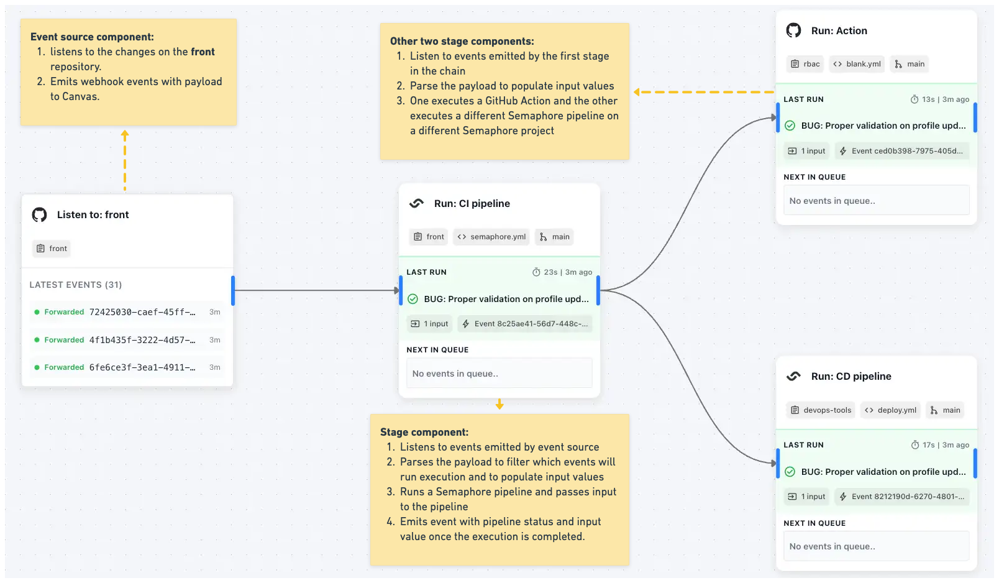

# Core Concepts

## Overview

**Canvas** is your main workspace. Each Canvas contains multiple workflows that operate independently within the same project environment.

**Workflows** operate through event passing. Components listen for events from external sources (integrations, webhooks) or from other components in the workflow chain.

**Components** are the building blocks of workflows. They process events, execute actions on external systems, or control workflow logic.

**Example: A single workflow in a Canvas**

**Events** are the first-class citizen in your Canvas. They trigger components that listen to them, and they are what each component emits. 

You can parse event payloads to:
- Pass data between components through **inputs** and **outputs**
- **Filter** which events will trigger component execution
- Set **parameters** that can be passed to external executors

**Executors** are resources available to certain components like `stage` components. They can be configured to execute some action, like send HTTP request or start a CI/CD pipeline. 

Executors operate by:
- Running the predefined action
- Using values from **parameters** that are populated by **input** values
- Setting values for **outputs** during execution
- Emitting an event with `passed` or `failed` status once execution completes

**Queue** - each component that executes something has a **queue**. This queue contains events that have passed the component's filter and are scheduled for execution. Items in the queue are executed serially (FIFO). 

You can configure **conditions** on the component level that give you additional control over when queue items will be executed:
- Manual approval is required before running
- Run only in specific timeframes

**Inputs** are defined to persist data across components in a chain, use it in the executor, or use it to describe the run/execution better. Their values can be:
- Inherited from the inputs of the previous component in chain
- Set to static values
- Set by parsing the event payload

**Outputs** are additional values that you want your component to emit once execution is finished. They are usually populated by the executor.

**Component secrets** are special type of asset defined on the scope of a single component. Their value can be set as a static value on component level or imported from the Canvas secret. Consider them inputs whose values are not accessible outside of the executor.

**Parameters** and executor level inputs are special data that you want to explicitly define to be available to the executor. Their values are usually imported from defined inputs, but can also be static values.

## Organizations

Organizations provide the top-level boundary for all Superplane resources. Each organization operates as an isolated tenant with complete separation of data and users.

**Key characteristics:**
- **Data isolation**: Complete separation between organizations - no shared resources or data access
- **User management**: Organization admins control member access and permissions
- **Resource container**: All Canvases, integrations, and workflows exist within an organization

**Practical usage:**
Organizations typically represent companies, business units, or major project divisions. Choose your organization scope based on data access requirements and administrative boundaries.

## Canvases

Canvas is your main workspace for building and managing DevOps workflows. Each Canvas operates as a self-contained project environment where you connect tools, build automation, and monitor execution.

**Primary functions:**
- **Tool integration**: Connect external services (source control, CI/CD platforms, deployment tools) through integrations
- **Workflow construction**: Build multiple workflows on a single Canvas using visual component connections
- **Real-time monitoring**: Observe current state of all workflows, component status, and active executions
- **Component inspection**: Click any component to view its execution history, event logs, and configuration details in the Canvas sidebar

**Canvas workspace includes:**
- **Integration management**: Configure and maintain connections to external DevOps tools
- **Workflow builder**: Visual interface for connecting components into automated processes  
- **Execution dashboard**: Real-time view of workflow status, component states, and running processes
- **Component sidebar**: Detailed view of individual component data including event history, run history, and configuration
- **Secrets management**: Encrypted storage for API keys, tokens, and sensitive configuration data
- **User permissions**: Canvas-level access control for team collaboration

**Technical architecture:**
Canvas provides execution isolation - workflows, data, and state are contained within each Canvas boundary. This allows teams to separate concerns by application, environment, or process domain while maintaining unified tool integrations.

### Integrations

Integrations connect external DevOps tools to your Canvas, enabling components to interact with their APIs and receive webhook events.

**Technical function:**
- **API connectivity**: Establish authenticated connections to external tool APIs
- **Webhook registration**: Configure external tools to send event notifications to Superplane
- **Credential management**: Store and manage authentication tokens, API keys, and OAuth credentials
- **Component enablement**: Unlock integration-specific components that can perform tool operations

**Integration lifecycle:**
1. **Authentication setup**: Configure OAuth flows or API token authentication with the target tool
2. **Permission verification**: Confirm Superplane has necessary API permissions for intended operations
3. **Webhook configuration**: Set up external tool to send relevant events to Canvas webhook endpoints
4. **Component availability**: Integration-specific components become available in the Canvas component library

**Current integrations:**
- **Source control platforms**: Repository monitoring, branch operations, pull request management
- **CI/CD systems**: Pipeline triggering, build status monitoring, deployment coordination

**Technical requirements:**
- Valid API credentials with appropriate permissions for the target tool
- Network connectivity between Superplane and external tool APIs
- Webhook endpoint accessibility for receiving external tool events

### Secrets

Secrets provide encrypted storage for sensitive data that components need during workflow execution. All secrets are scoped to the Canvas level with encryption at rest and in transit.

**Technical implementation:**
- **Encrypted storage**: AES-256 encryption for all secret values with secure key management
- **Canvas scoping**: Secrets are isolated per Canvas - no cross-Canvas access possible
- **Runtime injection**: Secret values are securely injected into component execution environments
- **Access logging**: All secret usage is logged for audit and compliance tracking

**Common secret types:**
- **API tokens**: Authentication tokens for external service APIs
- **OAuth credentials**: Client IDs, client secrets, and refresh tokens for OAuth integrations
- **Database credentials**: Connection strings, usernames, and passwords for database access
- **Infrastructure keys**: SSH keys, certificate files, and cloud provider credentials
- **Custom configuration**: Environment-specific settings, endpoints, and feature flags

**Usage in components:**
Components reference secrets by name during configuration. At runtime, Superplane resolves secret names to actual values and injects them into the execution context. Secret values are never logged or exposed in component outputs.

**Security characteristics:**
- **Zero-knowledge access**: Secret values are encrypted and only decrypted during component execution
- **Role-based access**: Canvas permissions control who can create, modify, or delete secrets
- **Audit trail**: Complete logging of secret creation, modification, and usage for compliance
- **Automatic cleanup**: Unused secrets can be identified through usage tracking

## Components

### Overview

Components are the building blocks of workflows in Superplane. They operate on an event-driven model where components listen for events, process them, and emit new events to trigger downstream components.

**Component types:**
- **Event sources**: Listen to external systems (integrations, webhooks) and emit events to the Canvas
- **Stages**: Listen to events from other components, perform actions on external resources (trigger CI/CD pipelines, make API calls), and emit completion events
- **Logic components**: Control workflow flow, filter data, and route events between components

**Event-driven execution:**
All workflows operate through event passing. Components receive events containing payload data, process them based on their configuration, and emit new events to continue the workflow chain.

**Event filtering:**
Components can filter incoming events using configurable rules that parse event payloads and headers. Events that don't match filter criteria are discarded, while matching events proceed to execution.

**Input mapping:**
Components can extract values from event payloads and map them to component inputs. This allows dynamic configuration where component behavior adapts to the data contained in triggering events.

**Execution model:**
Components like `stage` can be configured with executors that perform external operations (running pipelines, making API calls). When a stage receives a qualifying event:
1. The event is processed and mapped to component inputs
2. The executor runs the external operation using those inputs
3. Upon completion, the stage emits a new event containing execution status and any outputs
4. Downstream components can listen for these result events to continue the workflow

This event-driven architecture enables complex automation workflows where each component handles a specific operation while maintaining loose coupling through the event system.

### Events

Events are the core mechanism that drives workflow execution in Superplane. Every component interaction, data transfer, and workflow progression happens through events.

**Event structure:**
- **Payload**: JSON data containing the actual information being passed between components
- **Headers**: Metadata about the event source, timing, and routing information
- **Status**: Event processing status and any error information

**Event sources:**
- **External triggers**: Webhook payloads from integrated tools (repository pushes, pipeline completions, alerts)
- **Component emissions**: Events generated by components after completing their operations
- **Manual triggers**: Events created through user actions or API calls

**Event processing:**
When a component receives an event:
1. **Filter evaluation**: Event payload and headers are checked against component filter rules
2. **Input population**: Matching events have their payload data parsed to populate component inputs
3. **Queue addition**: Processed events are added to the component's execution queue
4. **Execution triggering**: Queue items are processed based on component conditions and executor configuration

**Event propagation:**
After component execution completes, new events are emitted containing:
- **Execution status**: Success or failure state of the operation
- **Input values**: Original inputs that triggered the execution
- **Output values**: New data generated during execution
- **Metadata**: Execution timing, queue information, and approval details

### Executors

Executors are the operational components that perform actual work on external systems. They are configured within stage components and handle the execution of specific actions.

**Executor types:**
- **HTTP executors**: Make REST API calls to external services with configurable authentication and payload processing
- **Pipeline executors**: Trigger builds, tests, or deployments on CI/CD platforms
- **Script executors**: Run custom scripts or commands with environment variable injection
- **Notification executors**: Send messages to communication platforms or create tickets in tracking systems

**Configuration:**
- **Action definition**: Specify the exact operation to perform (API endpoint, pipeline ID, script path)
- **Authentication**: Reference component secrets or Canvas secrets for secure access to external systems
- **Parameter mapping**: Define how input values are transformed into executor parameters
- **Output specification**: Configure what data should be captured and returned as component outputs

**Execution lifecycle:**
1. **Parameter resolution**: Input values are mapped to executor parameters
2. **Authentication**: Secrets are resolved and authentication is established with target system
3. **Operation execution**: The defined action is performed on the external system
4. **Response processing**: Results are captured and mapped to component outputs
5. **Status determination**: Execution success or failure is determined based on response criteria

**Error handling:**
- **Retry logic**: Configurable retry attempts for transient failures
- **Timeout management**: Maximum execution time limits to prevent hanging operations
- **Failure classification**: Distinguish between retryable and permanent failures
- **Error propagation**: Detailed error information is included in emitted events

### Inputs and Outputs

Inputs and outputs define the data interface for components, enabling data flow between workflow stages and external systems.

**Inputs:**
Inputs provide data to components and executors during execution. They serve multiple purposes:
- **Data persistence**: Carry information between connected components in a workflow chain
- **Executor parameters**: Provide dynamic configuration for external operations
- **Run metadata**: Include descriptive information about the execution context

**Input value sources:**
- **Event payload parsing**: Extract values from incoming event data using JSON path expressions
- **Static values**: Fixed values set during component configuration
- **Previous component outputs**: Inherit values from upstream components in the workflow chain
- **Canvas secrets**: Reference encrypted values stored at the Canvas level

**Outputs:**
Outputs capture data generated during component execution and make it available to downstream components.

**Output population:**
- **Executor results**: Data returned from external system operations (API responses, pipeline artifacts)
- **Computed values**: Processed or transformed data generated during execution
- **Status information**: Execution metadata like timing, resource usage, or operation details
- **Error details**: Failure information for debugging and error handling workflows

**Data typing:**
- **String values**: Text data, URLs, file paths, and identifiers
- **Numeric values**: Counts, durations, percentages, and measurements
- **Boolean values**: Success/failure flags, feature toggles, and condition results
- **JSON objects**: Structured data from API responses or complex configurations

**Usage patterns:**
- **Conditional routing**: Use output values to determine which downstream components should execute
- **Parameter substitution**: Pass output values as inputs to subsequent workflow stages
- **Reporting and monitoring**: Collect execution data for dashboards and audit trails
- **Error recovery**: Use failure outputs to trigger remediation workflows

### Runs

Runs represent individual executions of component operations. When a queue item is processed and execution begins, it becomes a run with full tracking and metadata.

**Run lifecycle:**
1. **Queue processing**: A queued event is selected for execution based on FIFO ordering and condition satisfaction
2. **Run creation**: The queue item transitions to active execution state with unique run identifier
3. **Metadata attachment**: Execution context is captured including queue timing, approvals, and trigger information
4. **Operation execution**: The component's executor performs its defined operation
5. **Status resolution**: Run concludes with success or failure status
6. **Event emission**: New event is generated containing run results and metadata

**Run metadata:**
- **Queue information**: When the event entered the queue, queue position, and wait time
- **Approval details**: If manual approval was required, who approved and when
- **Execution timing**: Start time, duration, and completion timestamp
- **Resource usage**: System resources consumed during execution
- **Trigger context**: Original event that initiated the execution chain

**Run status:**
- **Running**: Operation is currently in progress
- **Passed**: Execution completed successfully with expected results
- **Failed**: Operation failed due to errors, timeouts, or external system issues
- **Cancelled**: Execution was manually stopped before completion

**Run history:**
All runs are permanently recorded for audit and analysis purposes:
- **Searchable logs**: Full execution logs with filtering and search capabilities
- **Performance tracking**: Execution duration and resource usage trends
- **Failure analysis**: Error patterns and root cause identification
- **Compliance reporting**: Complete audit trail for regulatory requirements

### Stages

Stages are the primary execution components in Superplane workflows. They listen for events, manage execution queues, and coordinate with external systems through their configured executors.

**Stage architecture:**
- **Event listener**: Monitors Canvas for events from specified sources (event source components, other stages)
- **Filter engine**: Evaluates incoming events against configurable filter rules
- **Execution queue**: Manages FIFO queue of events awaiting processing
- **Condition engine**: Applies approval requirements, time restrictions, and other execution controls
- **Executor interface**: Coordinates with configured executors to perform external operations
- **Event emitter**: Generates new events upon execution completion

**Configuration options:**
- **Event sources**: Specify which components this stage listens to for triggering events
- **Filter rules**: Define JSON path expressions and conditions for event acceptance
- **Input mapping**: Configure how event payload data is extracted and assigned to stage inputs
- **Executor selection**: Choose and configure the appropriate executor for the desired operation
- **Output specification**: Define what data should be captured and emitted after execution
- **Conditions**: Set approval requirements, time windows, and other execution constraints

**Execution management:**
Stages provide sophisticated control over when and how operations execute:
- **Manual approval gates**: Require human approval before proceeding with execution
- **Time-based scheduling**: Restrict execution to specific time windows or schedules
- **Concurrent execution limits**: Control how many operations can run simultaneously
- **Priority handling**: Process high-priority events before standard queue items
- **Retry policies**: Automatically retry failed operations based on configurable rules

**Integration with executors:**
Stages act as the coordination layer between Superplane's event system and external tool operations:
- **Parameter preparation**: Transform stage inputs into executor-specific parameters
- **Authentication management**: Provide executor access to required secrets and credentials
- **Operation monitoring**: Track executor progress and capture operational metrics
- **Result processing**: Transform executor outputs into stage outputs and event data
- **Error handling**: Manage executor failures and implement retry or escalation logic

**Advanced features:**
- **Conditional execution**: Skip execution based on input values or external conditions
- **Batch processing**: Group multiple events for efficient bulk operations
- **Rollback capabilities**: Reverse operations when downstream failures occur
- **Audit integration**: Comprehensive logging of all stage activities for compliance

## Workflows

Workflows represent uninterrupted chains of connected components that automate specific DevOps processes. Multiple workflows can exist within a single Canvas, each handling different aspects of your operational requirements.

**Workflow characteristics:**
- **Event-driven progression**: Workflows advance through component-to-component event passing
- **Logical boundaries**: Each workflow represents a complete operational process from trigger to completion
- **Independent execution**: Workflows operate independently, though they can share Canvas resources like integrations and secrets
- **Cross-tool orchestration**: Single workflows can coordinate operations across multiple external platforms

**Workflow patterns:**
- **Linear chains**: Sequential component execution where each stage depends on the previous completion
- **Parallel branches**: Multiple components execute simultaneously from a single trigger event
- **Conditional routing**: Workflow path selection based on input values, execution results, or external conditions
- **Fan-out/fan-in**: One component triggers multiple parallel operations that later converge

**Workflow examples:**
- **CI/CD orchestration**: Repository push → build → test → deployment approval → production release
- **Infrastructure provisioning**: Resource request → validation → provisioning → configuration → verification
- **Incident response**: Alert detection → classification → notification → diagnostic execution → resolution tracking

**Workflow management:**
- **Visual representation**: Components and connections are displayed graphically on the Canvas
- **Real-time monitoring**: Live view of workflow execution status and component states
- **Execution history**: Complete record of workflow runs with timing and result data
- **Performance analysis**: Metrics on workflow duration, success rates, and bottleneck identification

**Cross-workflow coordination:**
While workflows operate independently, they can coordinate through:
- **Shared event sources**: Multiple workflows can listen to the same external triggers
- **Canvas-level events**: Components can emit events that trigger different workflows
- **Resource sharing**: Common integrations, secrets, and configurations across workflows
- **Data passing**: Workflow outputs can be consumed as inputs by components in other workflows