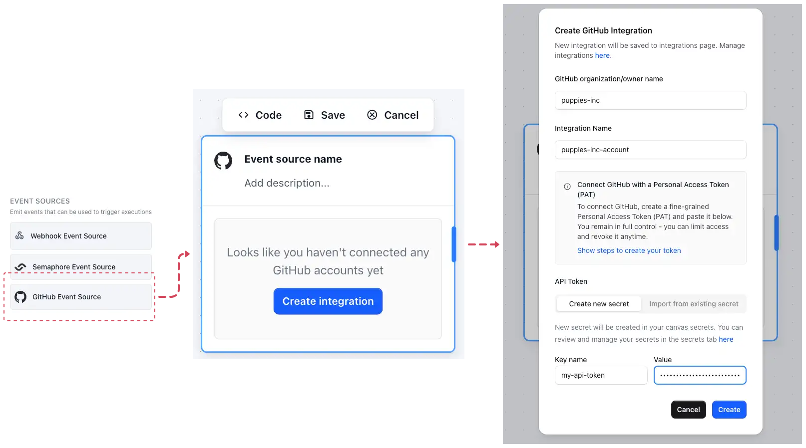
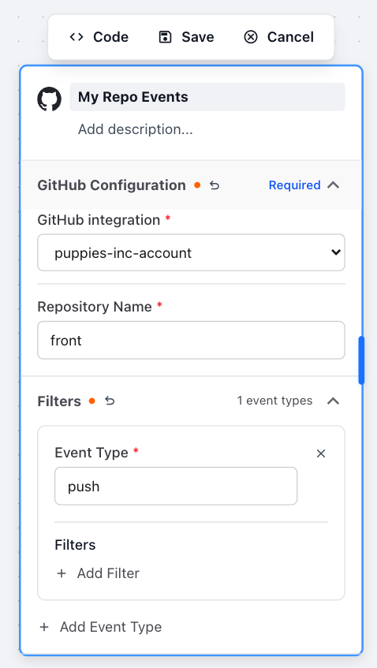
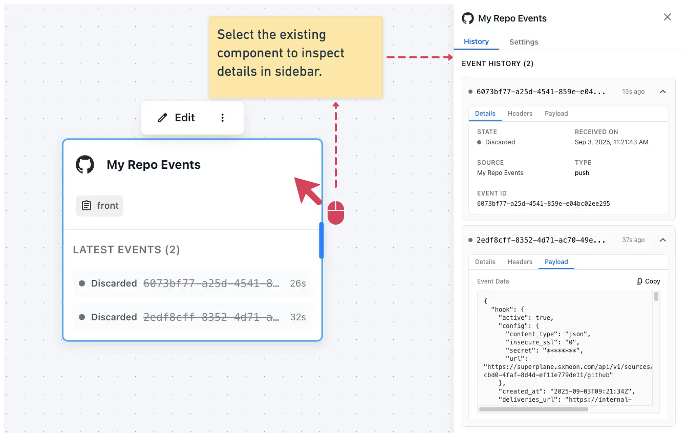
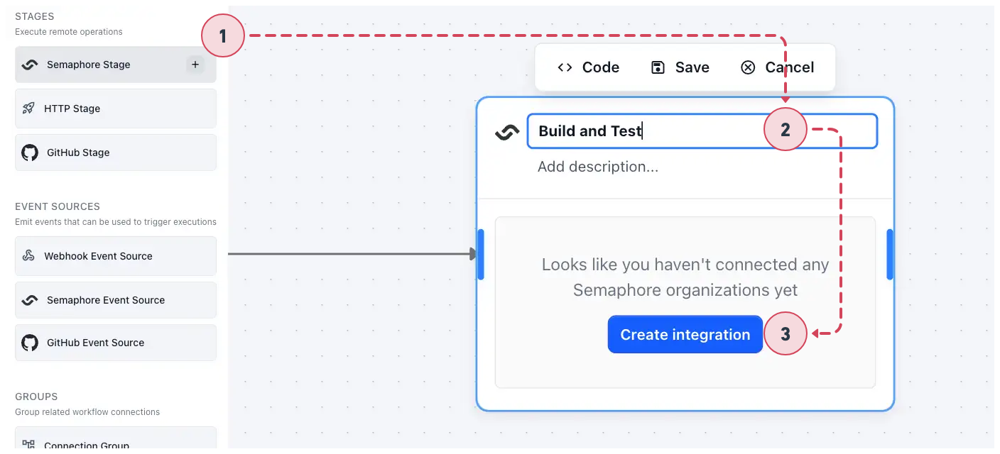
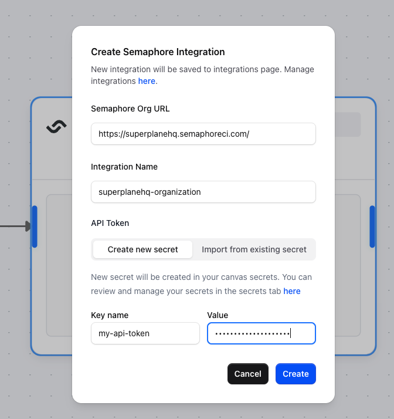
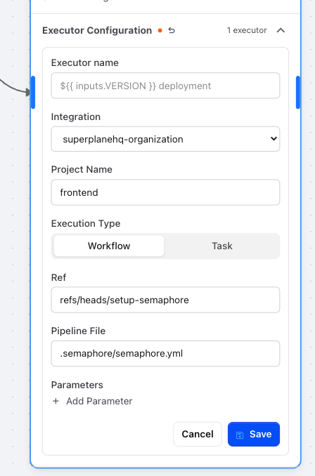
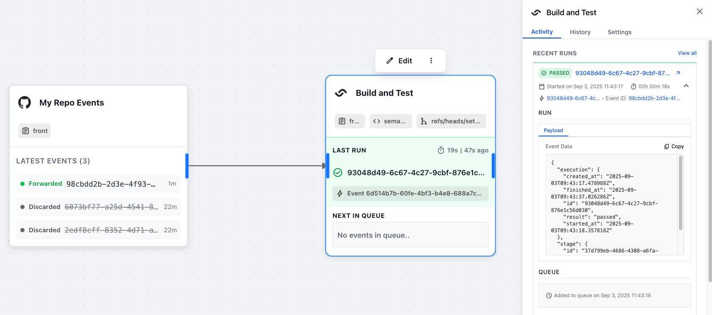

# Quick Start Guide

## Table of Contents

- [Overview](#overview)
- [Level 1: Running a Simple Workflow](#level-1-running-a-simple-workflow)
- [Level 2: Expanding and Upgrading Your Workflow](#level-2-expanding-and-upgrading-your-workflow)
- [Level 3: Building a More Complex Workflow](#level-3-building-a-more-complex-workflow)

---

## Overview

This guide will take you through building SuperPlane workflows in three progressive levels:

1. **Simple workflow** - Connect GitHub and Semaphore for basic CI/CD
2. **Expanded workflow** - Add inputs, outputs, and conditions
3. **Complex workflow** - Multi-stage pipelines with approvals and parallel execution

Each level builds on the previous one, so start with Level 1 even if you're experienced with CI/CD tools.

---

## Level 1: Running a Simple Workflow

**Goal:** Create a basic workflow that triggers a Semaphore build when you push code to GitHub.

**Time:** ~10 minutes

### Step 1: Create Your SuperPlane Account

1. Go to [app.superplane.com](https://app.superplane.com)
2. Click **"Sign in with GitHub"**
3. Authorize SuperPlane to access your GitHub account
   - We need permission to read your email address for account creation
   - We'll request repository access later when connecting specific repos

### Step 2: Create Your Organization

1. After signing in, you'll be prompted to create an organization
2. Enter your organization name (e.g., "My Company" or your GitHub username)
3. Click **"Create Organization"**

This creates your isolated workspace where all your workflows will live.

### Step 3: Create Your Canvas

1. Click **"Create Canvas"** 
2. Name your Canvas (e.g., "My First Workflow")
3. Click **"Create"**

You'll now see the Canvas workspace where you'll build your workflow.

### Step 4: Set Up GitHub Event Source

An event source listens for events from external systems. We'll create one that listens to your GitHub repository.

1. In your Canvas, make sure that the **Components sidebar** on the right is expanded
2. Find and select **"GitHub Event Source"** component
3. You'll see a modal popup asking you to connect GitHub

**Connect GitHub Integration:**

4. Click **"Create Integration"**
5. Follow the instructions in the modal:
   - Go to GitHub Settings → Developer settings → Personal access tokens
   - Create a **fine-grained personal access token**
   - Grant these permissions:
     - **Actions**: Read and Write
     - **Webhooks**: Read and Write
   - Copy the token

[Screenshot placeholder: GitHub token creation interface]

6. Paste your token in the SuperPlane modal
7. Click **"Save"**





**Configure Event Source:**

1. Name your event source (e.g., "My Repo Events")
2.  Select the repository you want to monitor
3.  Choose which events to listen for (start with **"Push"** events)
4.  Click **"Create"**



### Step 5: Test GitHub Connection

Let's verify that SuperPlane is receiving events from your repository.

1. Make a small change to your repository (add a file, edit README, etc.)
2. Commit and push the change to GitHub
3. In SuperPlane, click on your event source component
4. Look at the sidebar - you should see recent events under **"History"**
5. You'll see your push event listed (with a status showing it was "discarded")



**Why "discarded"?** Events are discarded when no components are listening to them. We'll fix this by adding a stage.

### Step 6: Set Up Semaphore Stage

Now we'll create a stage that listens to GitHub events and triggers Semaphore builds.

1. In your Canvas, make sure that the **Components sidebar** on the right is expanded
2. Find and select **"Semaphore Stage"** component
3. Name your stage (e.g., "Build and Test")
4. You'll be prompted to connect Semaphore



**Connect Semaphore Integration:**

5. Click **"Create Integration"**
6. Follow the instructions in the modal:
   - Go to your Semaphore profile
   - Copy the API token

7. Paste your token in the SuperPlane modal
8. Enter your Semaphore organization URL (e.g., `https://myorg.semaphoreci.com`)
9.  Click **"Create"**



### Step 7: Configure Your Stage

Now configure the stage to listen to GitHub events and run Semaphore builds.

**Set up the connection:**

1. In the **Connections** section, click **"Add Connection"**
2. Select your GitHub event source
3. This tells the stage to listen for events from your repository

**Configure the executor:**

4. In the **Executor** section:
   - **Project Name**: Write the name of the Semaphore Project you want to trigger
   - **Ref**: Enter `refs/heads/main` (or other branch that contains your pipeline yml)
   - **Pipeline File**: Enter the path to your Semaphore config (e.g., `.semaphore/semaphore.yml`)


5. Click **"Save"** in executor configuration form
6. Click **"Save"** in the top menu to save the stage



### Step 8: Test Your Complete Workflow

Now let's see your workflow in action!

1. Make another change to your repository
2. Commit and push the change
3. Watch your Canvas:
   - Your event source should receive the push event
   - Your stage should start executing (you'll see it change status)
   - Click on the stage to see execution details in the sidebar

4. Check Semaphore:
   - Go to your Semaphore project
   - You should see a new pipeline run that was triggered by SuperPlane



**🎉 Congratulations!** You've created your first SuperPlane workflow. Every time you push code to GitHub, it will automatically trigger a Semaphore build.

### What You've Built

Your workflow now does this:
1. **GitHub push** → Event sent to SuperPlane
2. **Event source** → Receives the push event  
3. **Stage** → Triggers Semaphore build using the event data

This is the foundation of DevOps automation - connecting tools so they work together automatically.

**Scaling up**: You can use this same pattern to create workflows that listen to different repositories (multi-repo workflows) and run different pipelines across different projects. One Canvas can coordinate builds across your entire organization.

### Troubleshooting Level 1

**Event source not receiving events?**
- Verify the webhook was created in your repository settings
- Make sure you're pushing to the correct repository
- Make sure you didn't misstype the repository name or `push` filter

**Stage not executing?**
- Confirm the stage is connected to your event source
- Verify the Ref is correct (e.g., `refs/heads/main` or `refs/heads/setup-semaphore`)
- Verify your pipeline file path is correct (e.g., `.semaphore/semaphore.yml`)
- Verify that the pipeline file exists on provided path/branch

---

## Level 2: Expanding and Upgrading Your Workflow

**Goal:** Add inputs, outputs, filtering, and custom execution names to make your workflow more intelligent and informative.

**Time:** ~15 minutes

**Prerequisites:** Complete Level 1

### Step 1: Edit Your Existing Stage

1. In your Canvas, click on your Semaphore Stage component
2. Click **"Edit"** to open edit mode
3. You'll now see all the configuration options for your stage

### Step 2: Add Event Filtering

Let's make the stage only trigger for pushes to a specific branch.

1. In the **Connections** section, find your GitHub event source connection
2. Click **Edit** icon next to it
3. Add a new filter:
   - **Filter Type**: Data Filter
   - **Expression**: `$.ref == "refs/heads/test"`

4. Click **"Save"**

This means the stage will only execute when someone pushes to the `test` branch.

### Step 3: Add Stage Inputs

Now we'll extract information from GitHub events to use in our workflow.

1. In the **Inputs** section, click **"Add Input"**
2. Add first input:
   - **Name**: `commit_name`
   - **Description**: "The commit message"

3. Add second input:
   - **Name**: `commit_sha`  
   - **Description**: "The commit SHA"

### Step 4: Map Input Values

Now we need to tell the stage how to get values for these inputs from GitHub events.

1. In the **Input Mappings** section for each input, find your existing mapping
2. Edit the mapping to add your new inputs:
   - **commit_name** → **From Event Data**
     - **Expression**: `$.commits[0].message`
   - **commit_sha** → **From Event Data**
     - **Expression**: `$.commits[0].id`

3. Save your inputs

### Step 5: Add Custom Execution Name

Make your executions more readable by using the commit message as the execution name.

1. In the **Executor** section, find the **Execution Name** field
2. Enter: `Commit: ${{ inputs.commit_name }}`
3. This will show the actual commit message as the execution name in your Canvas

### Step 6: Test Your Enhanced Workflow

1. Create a `test` branch in your repository if it doesn't exist
2. Make a change and commit it to the `test` branch with a descriptive message
3. Push to the `test` branch
4. Watch your Canvas:
   - The stage should execute (only because you pushed to `test` branch)
   - The execution name should show your commit message
   - Click on the execution to see the input values in the sidebar

### Step 7: Add Stage Output

Let's define an output that your stage will produce.

1. Click **"Edit"** on your stage again
2. In the **Outputs** section, click **"Add Output"**
3. Configure the output:
   - **Name**: `image`
   - **Description**: "Docker image tag produced by build"
   - **Required**: No (uncheck this)

4. Click **"Save Stage"**

### Step 8: Configure Semaphore to Push Outputs

Now we need to modify your Semaphore pipeline to push data back to SuperPlane.

1. Edit your `.semaphore/semaphore.yml` file in your repository
2. Add this step at the end of your pipeline:

```yaml
- name: "Push outputs to SuperPlane"
  commands:
    - export IMAGE_TAG="my-app:$(date +%s)"
    - |
      curl -s \
        "https://app.superplane.com/api/v1/outputs" \
        -X POST \
        -H "Content-Type: application/json" \
        -H "Authorization: Bearer $SEMAPHORE_OIDC_TOKEN" \
        --data "{\"execution_id\":\"$SUPERPLANE_STAGE_EXECUTION_ID\",\"external_id\":\"$SEMAPHORE_WORKFLOW_ID\",\"outputs\":{\"image\":\"$IMAGE_TAG\"}}"
```

3. Commit and push this change

### Step 9: Test Complete Enhanced Workflow

1. Make another commit to your `test` branch
2. Push the change
3. Watch the execution in SuperPlane:
   - Custom execution name with your commit message
   - Inputs populated with commit data
   - After Semaphore completes, you should see the `image` output populated

4. Click on the completed execution in the sidebar to see:
   - Input values (commit_name, commit_sha)
   - Output values (image)

**🎉 Level 2 Complete!** Your workflow now intelligently filters events, extracts data from them, and produces outputs that other stages can use.

### What You've Learned

- **Event filtering** - Control when stages execute based on event data
- **Input extraction** - Pull specific information from events into your workflow
- **Custom execution names** - Make your execution history readable and meaningful
- **Stage outputs** - Produce data that can be used by downstream components
- **API integration** - Push data back from external systems to SuperPlane

Your stage now has context about what triggered it and produces meaningful outputs for the next level of automation.

---

## Level 3: Building a More Complex Workflow

**Goal:** Explore advanced workflow patterns and components to build sophisticated automation.

**Time:** ~30 minutes

**Prerequisites:** Complete Level 1 and Level 2

### Challenge: Build an Advanced Multi-Component Workflow

Now that you understand the basics, try building a workflow that uses these advanced features:

### Multi-Repository Setup
- Add a second GitHub Event Source listening to a different repository
- Create at least two stages that respond to events from different repos
- Coordinate actions across multiple repositories

### Stage Conditions
- Add conditions to at least one stage (try manual approval or time restrictions)
- Test how conditions control when stages execute
- Experience the approval workflow in the Canvas interface

### Connection Groups
- Create a Connection Group that waits for events from multiple sources
- Configure the group to coordinate execution based on matching data fields
- Use the Connection Group as input to another stage

### Custom Webhook Integration
- Set up a Webhook Event Source (no external integration required)
- Create an HTTP Stage that makes API calls to external services
- Test sending custom JSON payloads to your webhook URL

### What to Experiment With

**Try these patterns:**
- Multi-stage pipelines with data flowing between stages
- Parallel execution paths that converge later
- Conditional routing based on input values
- Mixed integration types (GitHub + Semaphore + HTTP + Webhooks)

**Explore these components:**
- Different event source types and their configurations
- Various stage executors and their capabilities  
- Filtering and routing options
- Input/output data transformations

### Learning Objectives

By the end of Level 3, you should understand:
- How to orchestrate workflows across multiple repositories and tools
- When and how to use conditions to control execution flow
- How connection groups coordinate multiple event sources
- How to integrate any system using webhooks and HTTP calls

**🚀 Level 3 Complete!** You now have the knowledge to build sophisticated DevOps workflows that can handle real-world automation scenarios.

Take these patterns and apply them to your actual development workflows - you're ready to start automating your team's processes with SuperPlane!