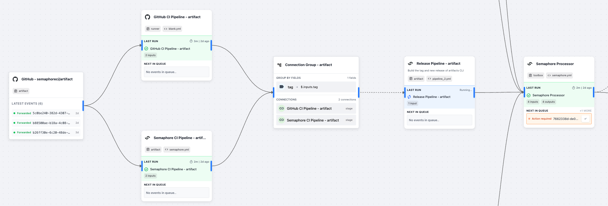

# What is SuperPlane

## Table of Contents

- [The DevOps Integration Problem](#the-devops-integration-problem)
- [How SuperPlane Solves This](#how-superplane-solves-this)
- [Deployment Options](#deployment-options)
- [Primary Use Cases](#primary-use-cases)
- [Technical Architecture](#technical-architecture)
- [When to Use SuperPlane](#when-to-use-superplane)
- [Getting Started Requirements](#getting-started-requirements)
- [Next Steps](#next-steps)

---

## The DevOps Integration Problem

DevOps teams use many different tools: source control systems, deployment orchestration platforms, infrastructure management tools, CI/CD systems, monitoring services, and incident response tools. Each tool works well on its own, but connecting them requires custom scripts and manual coordination.

This creates several problems:
- **Custom scripts everywhere** - Teams write and maintain integration code between tools
- **No single view** - You need to check multiple dashboards to see what's happening
- **Manual processes** - Approvals, compliance checks, and escalations happen outside the tools
- **Knowledge silos** - Only certain team members know how the integrations work

---

## How SuperPlane Solves This

SuperPlane creates a control layer above your existing DevOps tools. Instead of managing workflows separately in each tool, you orchestrate everything from one place.

### Cross-Platform Workflow Orchestration

Connect multiple tools and coordinate their workflows:
- Run builds across different platforms, projects, and services in a single workflow
- Coordinate deployments using various orchestration tools and environments  
- Get real-time status updates from all connected systems in one dashboard

### Event-Driven Process Automation

Build workflows that respond to events automatically:
- **Event listeners** - Start workflows when code is pushed, builds complete, Kubernetes environments change, or alerts fire
- **Policy enforcement** - Set up and enforce compliance rules and deployment policies
- **Approval processes** - Route requests to the right people and track decisions
- **Complete audit logs** - Every event, action and run is recorded with timestamps and user attribution

### Operational Knowledge Centralization

Make your DevOps processes easier to understand and maintain:
- **Visual workflows** - See how your processes work without reading code
- **Living documentation** - Workflows serve as up-to-date process documentation
- **Easier onboarding** - New team members can see and understand existing processes
- **Reduced silos** - Everyone can see how the full DevOps pipeline works

---

## Deployment Options

**Cloud-hosted:** Use SuperPlane's managed service with automatic updates and scaling.

**Self-hosted:** Deploy on your own infrastructure using Docker or Kubernetes for data control.

**Local development:** Run locally for testing workflows or custom built components before production deployment.

---

## Primary Use Cases

### Environment Health and Auto-Scaling
Monitor system health across multiple platforms, correlate metrics from different sources, and trigger scaling actions based on comprehensive health data rather than single alerts.

### Deployment Orchestration
Connect deployment platforms and coordinate releases across environments. Handle deployment approvals, coordinate rollbacks, and manage multi-stage releases from one interface.

### Infrastructure Automation  
Coordinate infrastructure changes across environments. Validate prerequisites, sequence deployments, and handle failures consistently.

### Incident Response
Automate alert routing, run diagnostic workflows, notify stakeholders, and track resolution tasks without manual coordination.

---

## Technical Architecture

### Component System
- **Native components** - HTTP requests, webhooks, conditionals, data processing
- **Integration components** - Tool-specific actions like triggering builds or listening to repository changes
- **Logic components** - Control flow, parallel execution, error handling

### Execution Engine
- Event-driven workflow execution with state persistence
- Parallel component processing with dependency management
- Automatic retry logic and comprehensive error handling
- Real-time monitoring with detailed execution logs

### Security Features
- Encrypted secrets storage for API keys and credentials
- Role-based access control at organization and project levels
- Complete audit trails for compliance and security reviews
- Organization-level data isolation

---

## When to Use SuperPlane

**Good fit if you:**
- Coordinate workflows across multiple DevOps tools
- Need approval processes and compliance tracking
- Want to eliminate custom integration scripts
- Need a single view of multi-tool processes
- Want to standardize DevOps procedures across teams

**Not ideal for:**
- Simple pipelines with linear, single-tool execution
- Teams preferring custom code solutions over visual orchestration
- Organizations where DevOps processes are already fully standardized and optimized

---

## Getting Started Requirements

**Platform access:** Ability to install self-hosted instance of SuperPlane or register an organization on the cloud platform.

**Integration permissions:** Administrative access to configure webhooks and API integrations in target tools.

**Team knowledge:** Understanding of your existing tools and processes.

---

## Next Steps

**Try it out:**

→ [Quick Start Guide](quick-start.md) - Set up your first workflow in 10 minutes

**Learn the concepts:**

→ [Core Concepts](core-concepts.md) - Canvases, Components, and workflows

**Set up in your environment:**

→ [Local development](../installation/local-development.md) - Set up and run in your local environment