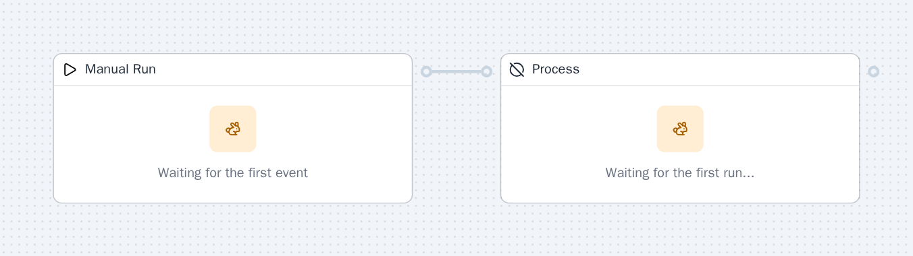
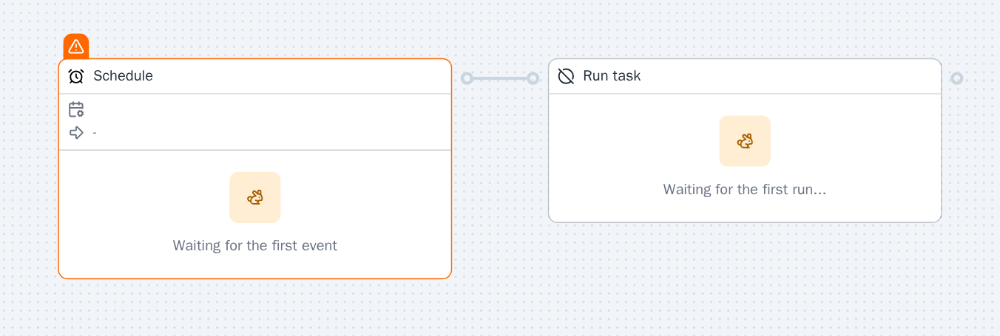
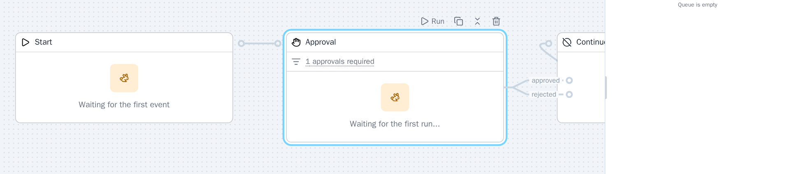
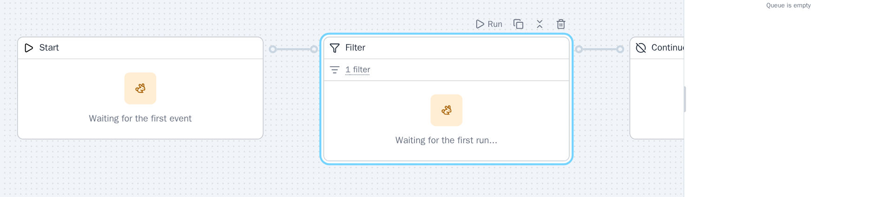
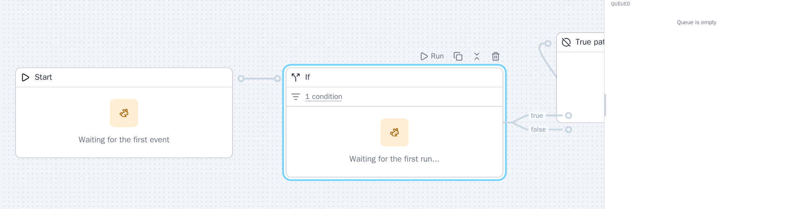
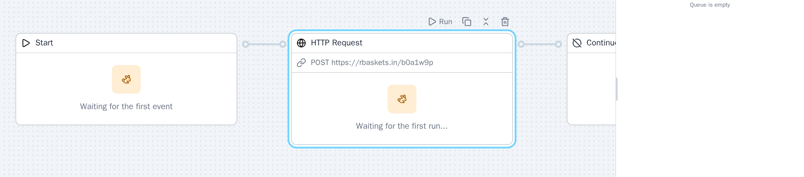
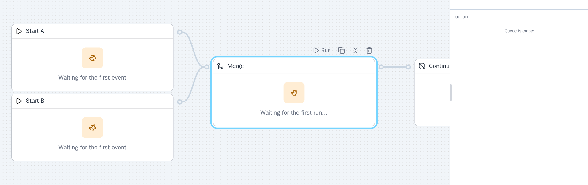
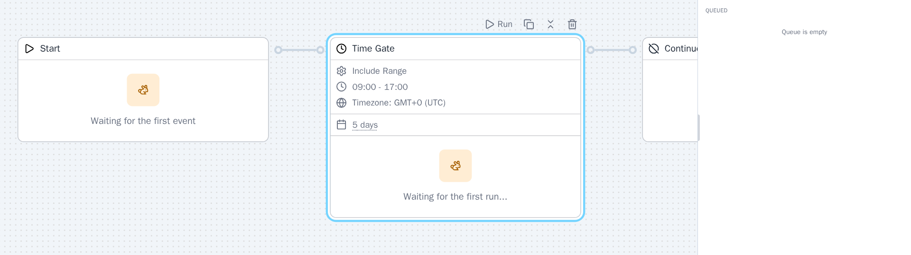
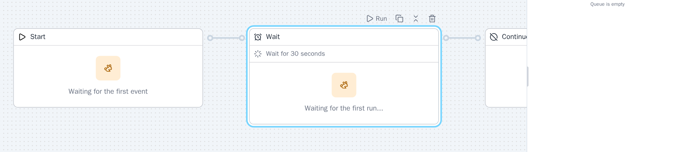
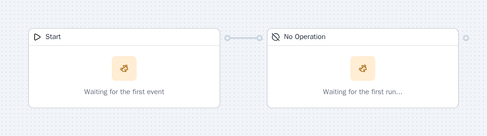

import { CardGrid, LinkCard, Tabs, TabItem } from "@astrojs/starlight/components";

Core components and triggers for building with SuperPlane.

## Triggers

<CardGrid>
  <LinkCard title="Manual Run" href="#manual-run" description="Trigger a run manually, by clicking a button in the UI." />
  <LinkCard title="Webhook" href="#webhook" description="Kick off a run by sending an HTTP request (webhook) from an external system." />
  <LinkCard title="Schedule" href="#schedule" description="Automatically trigger runs on a recurring schedule." />
</CardGrid>

## Components

<CardGrid>
  <LinkCard title="Approval" href="#approval" description="Require a user or external approval before proceeding to the next step." />
  <LinkCard title="Filter" href="#filter" description="Only allow events to pass if they meet specific criteria or conditions." />
  <LinkCard title="If" href="#if" description="Branch the workflow based on a condition or expression evaluation." />
  <LinkCard title="HTTP Request" href="#http-request" description="Send an HTTP request and use the response in downstream steps." />
  <LinkCard title="Merge" href="#merge" description="Wait for all incoming sources before proceeding—fan-in parallel branches." />
  <LinkCard title="Time Gate" href="#time-gate" description="Route events only within a specified time window or schedule." />
  <LinkCard title="Wait" href="#wait" description="Pause execution for a duration or until a condition is met." />
  <LinkCard title="No Operation" href="#no-operation" description="Acts as a passthrough. Useful for debugging and structuring flows." />
</CardGrid>

<a id="manual-run"></a>

## Manual Run

Manually start a run from the SuperPlane UI, useful for testing,
on-demand actions, or operator-initiated runs.

### Use Cases

#### Start a run manually

Trigger a workflow on demand from the UI and continue processing.

<Tabs>
  <TabItem label="UI">



  </TabItem>
  <TabItem label="YAML">

```yaml
metadata:
  name: "Manual run use case"
  description: "Start a workflow manually and continue processing."
  isTemplate: false
spec:
  nodes:
    - id: "manual-trigger"
      name: "Manual Run"
      type: "TYPE_TRIGGER"
      configuration: {}
      metadata: null
      position:
        x: -40
        "y": 320
      component: null
      blueprint: null
      trigger:
        name: "start"
      widget: null
      isCollapsed: false
      appInstallation: null
      errorMessage: ""
    - id: "manual-task"
      name: "Process"
      type: "TYPE_COMPONENT"
      configuration: {}
      metadata: null
      position:
        x: 420
        "y": 320
      component:
        name: "noop"
      blueprint: null
      trigger: null
      widget: null
      isCollapsed: false
      appInstallation: null
      errorMessage: ""
  edges:
    - sourceId: "manual-trigger"
      targetId: "manual-task"
      channel: "default"
```

  </TabItem>
</Tabs>

### Example Data

```json
{}
```

<a id="webhook"></a>

## Webhook

Start a run by sending an HTTP request to a unique webhook URL. This
trigger lets external systems or services initiate a run in SuperPlane.

### Use Cases

#### External system webhook to HTTP request

Accept inbound webhooks from external systems and forward the payload
to an HTTP endpoint for processing.

<Tabs>
  <TabItem label="UI">


  </TabItem>
  <TabItem label="YAML">

```yaml
metadata:
  name: "Webhook external system integration"
  description: "Trigger a canvas from an external system using a webhook, then forward the payload."
  isTemplate: false
spec:
  nodes:
    - id: "webhook-trigger"
      name: "Webhook"
      type: "TYPE_TRIGGER"
      configuration:
        authentication: "none"
      metadata:
        url: "https://hooks.superplane.example/webhook"
        authentication: "none"
      position:
        x: -40
        "y": 320
      component: null
      blueprint: null
      trigger:
        name: "webhook"
      widget: null
      isCollapsed: false
      appInstallation: null
      errorMessage: ""
    - id: "noop-confirmation"
      name: "Received Webhook Payload"
      type: "TYPE_COMPONENT"
      configuration: {}
      metadata: null
      position:
        x: 420
        "y": 320
      component:
        name: "noop"
      blueprint: null
      trigger: null
      widget: null
      isCollapsed: false
      appInstallation: null
      errorMessage: ""
  edges:
    - sourceId: "webhook-trigger"
      targetId: "noop-confirmation"
      channel: "default"
```

  </TabItem>
</Tabs>

### Example Data

```json
{
  "body": {
    "event": "push",
    "repository": "superplanehq/superplane"
  },
  "headers": {
    "X-Event": ["push"]
  }
}
```

<a id="schedule"></a>

## Schedule

Automatically start a run according to a schedule you define.
This is useful for running tasks on a recurring basis (such as nightly
builds, backups, periodic checks, or scheduled deployments) without manual
intervention.

### Use Cases

#### Run a task on a schedule

Trigger a workflow on a cron schedule and continue to the next step.

<Tabs>
  <TabItem label="UI">



  </TabItem>
  <TabItem label="YAML">

```yaml
metadata:
  name: "Schedule use case"
  description: "Run on a schedule and then process the result."
  isTemplate: false
spec:
  nodes:
    - id: "schedule-trigger"
      name: "Schedule"
      type: "TYPE_TRIGGER"
      configuration:
        cron: "0 9 * * 1-5"
        timezone: "UTC"
      metadata: null
      position:
        x: -40
        "y": 320
      component: null
      blueprint: null
      trigger:
        name: "schedule"
      widget: null
      isCollapsed: false
      appInstallation: null
      errorMessage: ""
    - id: "scheduled-task"
      name: "Run task"
      type: "TYPE_COMPONENT"
      configuration: {}
      metadata: null
      position:
        x: 420
        "y": 320
      component:
        name: "noop"
      blueprint: null
      trigger: null
      widget: null
      isCollapsed: false
      appInstallation: null
      errorMessage: ""
  edges:
    - sourceId: "schedule-trigger"
      targetId: "scheduled-task"
      channel: "default"
```

  </TabItem>
</Tabs>

### Example Data

```json
{
  "calendar": {
    "year": "2024",
    "month": "January",
    "day": "1",
    "hour": "09",
    "minute": "00",
    "second": "00",
    "week_day": "Monday"
  },
  "timezone": "+00:00"
}
```

<a id="approval"></a>

## Approval

Pauses the run and waits for users to approve or reject before continuing.
Most useful when manual oversight is required, such as for deploying to
production or handling sensitive operations.

### Use Cases

#### Gate a deployment with approval

Pause the workflow and require a human approval before continuing.

<Tabs>
  <TabItem label="UI">



  </TabItem>
  <TabItem label="YAML">

```yaml
metadata:
  name: "Approval use case"
  description: "Pause a workflow and require approval before continuing."
  isTemplate: false
spec:
  nodes:
    - id: "manual-trigger"
      name: "Start"
      type: "TYPE_TRIGGER"
      configuration: {}
      metadata: null
      position:
        x: -40
        "y": 320
      component: null
      blueprint: null
      trigger:
        name: "start"
      widget: null
      isCollapsed: false
      appInstallation: null
      errorMessage: ""
    - id: "approval-step"
      name: "Approval"
      type: "TYPE_COMPONENT"
      configuration:
        items:
          - type: "anyone"
      metadata: null
      position:
        x: 420
        "y": 320
      component:
        name: "approval"
      blueprint: null
      trigger: null
      widget: null
      isCollapsed: false
      appInstallation: null
      errorMessage: ""
    - id: "post-approval"
      name: "Continue"
      type: "TYPE_COMPONENT"
      configuration: {}
      metadata: null
      position:
        x: 880
        "y": 320
      component:
        name: "noop"
      blueprint: null
      trigger: null
      widget: null
      isCollapsed: false
      appInstallation: null
      errorMessage: ""
  edges:
    - sourceId: "manual-trigger"
      targetId: "approval-step"
      channel: "default"
    - sourceId: "approval-step"
      targetId: "post-approval"
      channel: "approved"
```

  </TabItem>
</Tabs>

### Example Output

```json
{
  "data": {
    "result": "approved",
    "records": [
      {
        "index": 0,
        "type": "user",
        "state": "approved",
        "user": {
          "id": "user_123",
          "name": "Alex Doe",
          "email": "alex@example.com"
        },
        "approval": {
          "approvedAt": "2024-01-01T12:00:00Z",
          "comment": "Looks good"
        }
      }
    ]
  },
  "timestamp": "2026-01-16T17:56:16.680755501Z",
  "type": "approval.finished"
}
```

<a id="filter"></a>

## Filter

Filter only allows events that match your expression to pass through,
letting you control which events continue in the pipeline.

### Use Cases

#### Filter events by condition

Let only matching events through before continuing the workflow.

<Tabs>
  <TabItem label="UI">



  </TabItem>
  <TabItem label="YAML">

```yaml
metadata:
  name: "Filter use case"
  description: "Pass events only when they match a condition."
  isTemplate: false
spec:
  nodes:
    - id: "manual-trigger"
      name: "Start"
      type: "TYPE_TRIGGER"
      configuration: {}
      metadata: null
      position:
        x: -40
        "y": 320
      component: null
      blueprint: null
      trigger:
        name: "start"
      widget: null
      isCollapsed: false
      appInstallation: null
      errorMessage: ""
    - id: "filter-step"
      name: "Filter"
      type: "TYPE_COMPONENT"
      configuration:
        expression: "true"
      metadata: null
      position:
        x: 420
        "y": 320
      component:
        name: "filter"
      blueprint: null
      trigger: null
      widget: null
      isCollapsed: false
      appInstallation: null
      errorMessage: ""
    - id: "filtered-output"
      name: "Continue"
      type: "TYPE_COMPONENT"
      configuration: {}
      metadata: null
      position:
        x: 880
        "y": 320
      component:
        name: "noop"
      blueprint: null
      trigger: null
      widget: null
      isCollapsed: false
      appInstallation: null
      errorMessage: ""
  edges:
    - sourceId: "manual-trigger"
      targetId: "filter-step"
      channel: "default"
    - sourceId: "filter-step"
      targetId: "filtered-output"
      channel: "default"
```

  </TabItem>
</Tabs>

### Example Output

```json
{
  "data": {},
  "timestamp": "2026-01-16T17:56:16.680755501Z",
  "type": "filter.executed"
}
```

<a id="if"></a>

## If

Evaluate a boolean expression to decide how to route each event.

### Use Cases

#### Branch based on an expression

Route events down the true branch when the expression matches.

<Tabs>
  <TabItem label="UI">



  </TabItem>
  <TabItem label="YAML">

```yaml
metadata:
  name: "If use case"
  description: "Branch workflow based on a boolean expression."
  isTemplate: false
spec:
  nodes:
    - id: "manual-trigger"
      name: "Start"
      type: "TYPE_TRIGGER"
      configuration: {}
      metadata: null
      position:
        x: -40
        "y": 320
      component: null
      blueprint: null
      trigger:
        name: "start"
      widget: null
      isCollapsed: false
      appInstallation: null
      errorMessage: ""
    - id: "if-step"
      name: "If"
      type: "TYPE_COMPONENT"
      configuration:
        expression: "true"
      metadata: null
      position:
        x: 420
        "y": 320
      component:
        name: "if"
      blueprint: null
      trigger: null
      widget: null
      isCollapsed: false
      appInstallation: null
      errorMessage: ""
    - id: "true-branch"
      name: "True path"
      type: "TYPE_COMPONENT"
      configuration: {}
      metadata: null
      position:
        x: 880
        "y": 260
      component:
        name: "noop"
      blueprint: null
      trigger: null
      widget: null
      isCollapsed: false
      appInstallation: null
      errorMessage: ""
  edges:
    - sourceId: "manual-trigger"
      targetId: "if-step"
      channel: "default"
    - sourceId: "if-step"
      targetId: "true-branch"
      channel: "true"
```

  </TabItem>
</Tabs>

### Example Output

```json
{
  "data": {},
  "timestamp": "2026-01-16T17:56:16.680755501Z",
  "type": "if.executed"
}
```

<a id="http-request"></a>

## HTTP Request

Send HTTP requests to external services or APIs and process their responses.

### Use Cases

#### Call an external HTTP endpoint

Post a payload to an HTTP endpoint and continue once it completes.

<Tabs>
  <TabItem label="UI">



  </TabItem>
  <TabItem label="YAML">

```yaml
metadata:
  name: "HTTP Request use case"
  description: "Send an HTTP request and pass the response downstream."
  isTemplate: false
spec:
  nodes:
    - id: "manual-trigger"
      name: "Start"
      type: "TYPE_TRIGGER"
      configuration: {}
      metadata: null
      position:
        x: -40
        "y": 320
      component: null
      blueprint: null
      trigger:
        name: "start"
      widget: null
      isCollapsed: false
      appInstallation: null
      errorMessage: ""
    - id: "http-request"
      name: "HTTP Request"
      type: "TYPE_COMPONENT"
      configuration:
        method: "POST"
        url: "https://rbaskets.in/b0a1w9p"
        json:
          message: "Hello from SuperPlane"
      metadata: null
      position:
        x: 420
        "y": 320
      component:
        name: "http"
      blueprint: null
      trigger: null
      widget: null
      isCollapsed: false
      appInstallation: null
      errorMessage: ""
    - id: "request-complete"
      name: "Continue"
      type: "TYPE_COMPONENT"
      configuration: {}
      metadata: null
      position:
        x: 880
        "y": 320
      component:
        name: "noop"
      blueprint: null
      trigger: null
      widget: null
      isCollapsed: false
      appInstallation: null
      errorMessage: ""
  edges:
    - sourceId: "manual-trigger"
      targetId: "http-request"
      channel: "default"
    - sourceId: "http-request"
      targetId: "request-complete"
      channel: "default"
```

  </TabItem>
</Tabs>

### Example Output

```json
{
  "data": {
    "status": 200,
    "error": "Error to read request body: EOF",
    "headers": {
      "Content-Type": ["application/json"]
    },
    "body": {
      "message": "ok"
    }
  },
  "timestamp": "2026-01-16T17:56:16.680755501Z",
  "type": "http.request.finished"
}
```

<a id="merge"></a>

## Merge

Wait for and combine results from multiple upstream nodes before
continuing with the run.  Commonly used to synchronize parallel event
streams, aggregate data from several sources, or ensure that several
conditions are met before proceeding.

### Use Cases

#### Merge multiple starts into one flow

Wait for two upstream triggers before continuing to the next step.

<Tabs>
  <TabItem label="UI">



  </TabItem>
  <TabItem label="YAML">

```yaml
metadata:
  name: "Merge use case"
  description: "Wait for multiple inputs before continuing."
  isTemplate: false
spec:
  nodes:
    - id: "manual-trigger-a"
      name: "Start A"
      type: "TYPE_TRIGGER"
      configuration: {}
      metadata: null
      position:
        x: -40
        "y": 240
      component: null
      blueprint: null
      trigger:
        name: "start"
      widget: null
      isCollapsed: false
      appInstallation: null
      errorMessage: ""
    - id: "manual-trigger-b"
      name: "Start B"
      type: "TYPE_TRIGGER"
      configuration: {}
      metadata: null
      position:
        x: -40
        "y": 400
      component: null
      blueprint: null
      trigger:
        name: "start"
      widget: null
      isCollapsed: false
      appInstallation: null
      errorMessage: ""
    - id: "merge-step"
      name: "Merge"
      type: "TYPE_COMPONENT"
      configuration: {}
      metadata: null
      position:
        x: 420
        "y": 320
      component:
        name: "merge"
      blueprint: null
      trigger: null
      widget: null
      isCollapsed: false
      appInstallation: null
      errorMessage: ""
    - id: "merged-output"
      name: "Continue"
      type: "TYPE_COMPONENT"
      configuration: {}
      metadata: null
      position:
        x: 880
        "y": 320
      component:
        name: "noop"
      blueprint: null
      trigger: null
      widget: null
      isCollapsed: false
      appInstallation: null
      errorMessage: ""
  edges:
    - sourceId: "manual-trigger-a"
      targetId: "merge-step"
      channel: "default"
    - sourceId: "manual-trigger-b"
      targetId: "merge-step"
      channel: "default"
    - sourceId: "merge-step"
      targetId: "merged-output"
      channel: "default"
```

  </TabItem>
</Tabs>

### Example Output

```json
{
  "data": {
    "groupKey": "merge-group-123",
    "eventIDs": ["event_1", "event_2"],
    "sources": ["node_a", "node_b"],
    "stopEarly": false
  },
  "timestamp": "2026-01-16T17:56:16.680755501Z",
  "type": "merge.finished"
}
```

<a id="time-gate"></a>

## Time Gate

Route events based on time conditions - include or exclude specific time windows

### Use Cases

#### Allow events only during business hours

Gate executions to a weekday time range before proceeding.

<Tabs>
  <TabItem label="UI">



  </TabItem>
  <TabItem label="YAML">

```yaml
metadata:
  name: "Time Gate use case"
  description: "Allow events only during business hours."
  isTemplate: false
spec:
  nodes:
    - id: "manual-trigger"
      name: "Start"
      type: "TYPE_TRIGGER"
      configuration: {}
      metadata: null
      position:
        x: -40
        "y": 320
      component: null
      blueprint: null
      trigger:
        name: "start"
      widget: null
      isCollapsed: false
      appInstallation: null
      errorMessage: ""
    - id: "time-gate"
      name: "Time Gate"
      type: "TYPE_COMPONENT"
      configuration:
        mode: "include_range"
        days:
          - "monday"
          - "tuesday"
          - "wednesday"
          - "thursday"
          - "friday"
        startTime: "09:00"
        endTime: "17:00"
        timezone: "0"
      metadata: null
      position:
        x: 420
        "y": 320
      component:
        name: "time_gate"
      blueprint: null
      trigger: null
      widget: null
      isCollapsed: false
      appInstallation: null
      errorMessage: ""
    - id: "time-gate-output"
      name: "Continue"
      type: "TYPE_COMPONENT"
      configuration: {}
      metadata: null
      position:
        x: 880
        "y": 320
      component:
        name: "noop"
      blueprint: null
      trigger: null
      widget: null
      isCollapsed: false
      appInstallation: null
      errorMessage: ""
  edges:
    - sourceId: "manual-trigger"
      targetId: "time-gate"
      channel: "default"
    - sourceId: "time-gate"
      targetId: "time-gate-output"
      channel: "default"
```

  </TabItem>
</Tabs>

### Example Output

```json
{
  "data": {},
  "timestamp": "2026-01-16T17:56:16.680755501Z",
  "type": "timegate.finished"
}
```

<a id="wait"></a>

## Wait

Pause execution for a duration or until a condition is met.

### Use Cases

#### Pause for a fixed interval

Delay the workflow for a set amount of time before continuing.

<Tabs>
  <TabItem label="UI">



  </TabItem>
  <TabItem label="YAML">

```yaml
metadata:
  name: "Wait use case"
  description: "Pause a workflow for a fixed interval."
  isTemplate: false
spec:
  nodes:
    - id: "manual-trigger"
      name: "Start"
      type: "TYPE_TRIGGER"
      configuration: {}
      metadata: null
      position:
        x: -40
        "y": 320
      component: null
      blueprint: null
      trigger:
        name: "start"
      widget: null
      isCollapsed: false
      appInstallation: null
      errorMessage: ""
    - id: "wait-step"
      name: "Wait"
      type: "TYPE_COMPONENT"
      configuration:
        mode: "interval"
        waitFor: "30"
        unit: "seconds"
      metadata: null
      position:
        x: 420
        "y": 320
      component:
        name: "wait"
      blueprint: null
      trigger: null
      widget: null
      isCollapsed: false
      appInstallation: null
      errorMessage: ""
    - id: "wait-output"
      name: "Continue"
      type: "TYPE_COMPONENT"
      configuration: {}
      metadata: null
      position:
        x: 880
        "y": 320
      component:
        name: "noop"
      blueprint: null
      trigger: null
      widget: null
      isCollapsed: false
      appInstallation: null
      errorMessage: ""
  edges:
    - sourceId: "manual-trigger"
      targetId: "wait-step"
      channel: "default"
    - sourceId: "wait-step"
      targetId: "wait-output"
      channel: "default"
```

  </TabItem>
</Tabs>

### Example Output

```json
{
  "data": {
    "started_at": "2024-01-01T12:00:00Z",
    "finished_at": "2024-01-01T12:05:00Z",
    "result": "completed",
    "reason": "timeout",
    "actor": {
      "email": "alex@example.com",
      "display_name": "Alex Doe"
    }
  },
  "timestamp": "2026-01-16T17:56:16.680755501Z",
  "type": "wait.finished"
}
```

<a id="no-operation"></a>

## No Operation

Pass events through unchanged, performing no logic or transformation.

### Use Cases

#### Pass data through unchanged

Use a no-op step to keep the workflow structure explicit.

<Tabs>
  <TabItem label="UI">



  </TabItem>
  <TabItem label="YAML">

```yaml
metadata:
  name: "No Operation use case"
  description: "Pass events through unchanged."
  isTemplate: false
spec:
  nodes:
    - id: "manual-trigger"
      name: "Start"
      type: "TYPE_TRIGGER"
      configuration: {}
      metadata: null
      position:
        x: -40
        "y": 320
      component: null
      blueprint: null
      trigger:
        name: "start"
      widget: null
      isCollapsed: false
      appInstallation: null
      errorMessage: ""
    - id: "noop-step"
      name: "No Operation"
      type: "TYPE_COMPONENT"
      configuration: {}
      metadata: null
      position:
        x: 420
        "y": 320
      component:
        name: "noop"
      blueprint: null
      trigger: null
      widget: null
      isCollapsed: false
      appInstallation: null
      errorMessage: ""
  edges:
    - sourceId: "manual-trigger"
      targetId: "noop-step"
      channel: "default"
```

  </TabItem>
</Tabs>

### Example Output

```json
{
  "data": {},
  "timestamp": "2026-01-16T17:56:16.680755501Z",
  "type": "noop.finished"
}
```

