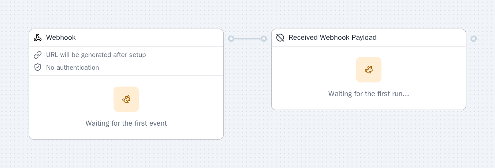

Core components and triggers for building with SuperPlane.

## Example Canvas



import { CardGrid, LinkCard } from "@astrojs/starlight/components";

## Triggers

<CardGrid>
  <LinkCard title="Manual Run" href="#manual-run" description="Trigger a run manually, by clicking a button in the UI." />
  <LinkCard title="Webhook" href="#webhook" description="Kick off a run by sending an HTTP request (webhook) from an external system." />
  <LinkCard title="Schedule" href="#schedule" description="Automatically trigger runs on a recurring schedule." />
</CardGrid>

## Components

<CardGrid>
  <LinkCard title="Approval" href="#approval" description="Require a user or external approval before proceeding to the next step." />
  <LinkCard title="Filter" href="#filter" description="Only allow events to pass if they meet specific criteria or conditions." />
  <LinkCard title="If" href="#if" description="Branch the workflow based on a condition or expression evaluation." />
  <LinkCard title="HTTP Request" href="#http-request" description="Send an HTTP request and use the response in downstream steps." />
  <LinkCard title="Merge" href="#merge" description="Wait for all incoming sources before proceeding—fan-in parallel branches." />
  <LinkCard title="Time Gate" href="#time-gate" description="Route events only within a specified time window or schedule." />
  <LinkCard title="Wait" href="#wait" description="Pause execution for a duration or until a condition is met." />
  <LinkCard title="No Operation" href="#no-operation" description="Acts as a passthrough. Useful for debugging and structuring flows." />
</CardGrid>

<a id="manual-run"></a>

## Manual Run

Manually start a run from the SuperPlane UI, useful for testing,
on-demand actions, or operator-initiated runs.

### Example Data

```json
{}
```

<a id="webhook"></a>

## Webhook

Start a run by sending an HTTP request to a unique webhook URL. This
trigger lets external systems or services initiate a run in SuperPlane.

### Example Data

```json
{
  "body": {
    "event": "push",
    "repository": "superplanehq/superplane"
  },
  "headers": {
    "X-Event": ["push"]
  }
}
```

<a id="schedule"></a>

## Schedule

Automatically start a run according to a schedule you define.
This is useful for running tasks on a recurring basis (such as nightly
builds, backups, periodic checks, or scheduled deployments) without manual
intervention.

### Example Data

```json
{
  "calendar": {
    "year": "2024",
    "month": "January",
    "day": "1",
    "hour": "09",
    "minute": "00",
    "second": "00",
    "week_day": "Monday"
  },
  "timezone": "+00:00"
}
```

<a id="approval"></a>

## Approval

Pauses the run and waits for users to approve or reject before continuing.
Most useful when manual oversight is required, such as for deploying to
production or handling sensitive operations.

### Example Output

```json
{
  "data": {
    "result": "approved",
    "records": [
      {
        "index": 0,
        "type": "user",
        "state": "approved",
        "user": {
          "id": "user_123",
          "name": "Alex Doe",
          "email": "alex@example.com"
        },
        "approval": {
          "approvedAt": "2024-01-01T12:00:00Z",
          "comment": "Looks good"
        }
      }
    ]
  },
  "timestamp": "2026-01-16T17:56:16.680755501Z",
  "type": "approval.finished"
}
```

<a id="filter"></a>

## Filter

Filter only allows events that match your expression to pass through,
letting you control which events continue in the pipeline.

### Example Output

```json
{
  "data": {},
  "timestamp": "2026-01-16T17:56:16.680755501Z",
  "type": "filter.executed"
}
```

<a id="if"></a>

## If

Evaluate a boolean expression to decide how to route each event.

### Example Output

```json
{
  "data": {},
  "timestamp": "2026-01-16T17:56:16.680755501Z",
  "type": "if.executed"
}
```

<a id="http-request"></a>

## HTTP Request

Send HTTP requests to external services or APIs and process their responses.

### Example Output

```json
{
  "data": {
    "status": 200,
    "error": "Error to read request body: EOF",
    "headers": {
      "Content-Type": ["application/json"]
    },
    "body": {
      "message": "ok"
    }
  },
  "timestamp": "2026-01-16T17:56:16.680755501Z",
  "type": "http.request.finished"
}
```

<a id="merge"></a>

## Merge

Wait for and combine results from multiple upstream nodes before
continuing with the run.  Commonly used to synchronize parallel event
streams, aggregate data from several sources, or ensure that several
conditions are met before proceeding.

### Example Output

```json
{
  "data": {
    "groupKey": "merge-group-123",
    "eventIDs": ["event_1", "event_2"],
    "sources": ["node_a", "node_b"],
    "stopEarly": false
  },
  "timestamp": "2026-01-16T17:56:16.680755501Z",
  "type": "merge.finished"
}
```

<a id="time-gate"></a>

## Time Gate

Route events based on time conditions - include or exclude specific time windows

### Example Output

```json
{
  "data": {},
  "timestamp": "2026-01-16T17:56:16.680755501Z",
  "type": "timegate.finished"
}
```

<a id="wait"></a>

## Wait

Pause execution for a duration or until a condition is met.

### Example Output

```json
{
  "data": {
    "started_at": "2024-01-01T12:00:00Z",
    "finished_at": "2024-01-01T12:05:00Z",
    "result": "completed",
    "reason": "timeout",
    "actor": {
      "email": "alex@example.com",
      "display_name": "Alex Doe"
    }
  },
  "timestamp": "2026-01-16T17:56:16.680755501Z",
  "type": "wait.finished"
}
```

<a id="no-operation"></a>

## No Operation

Pass events through unchanged, performing no logic or transformation.

### Example Output

```json
{
  "data": {},
  "timestamp": "2026-01-16T17:56:16.680755501Z",
  "type": "noop.finished"
}
```
