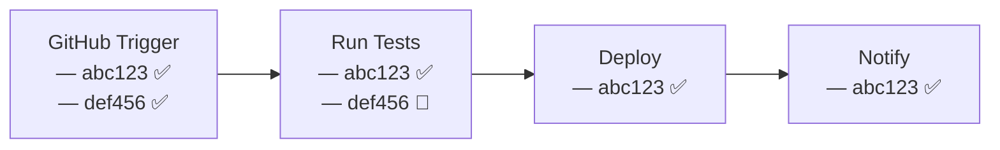
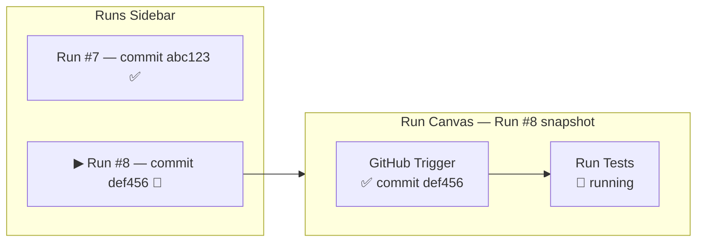
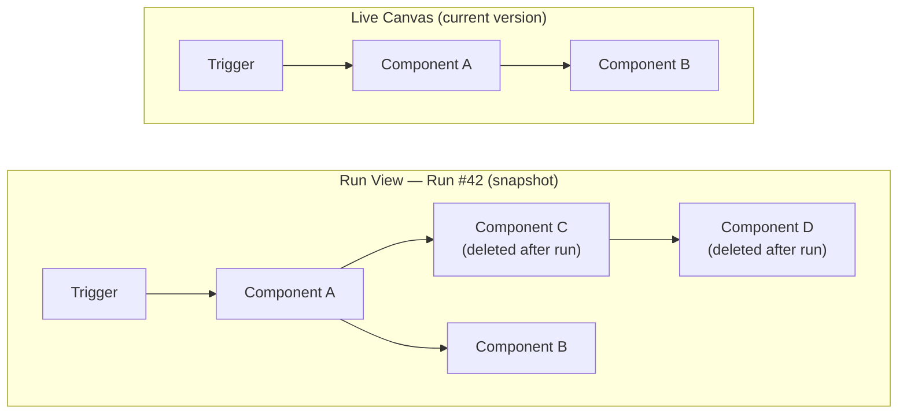
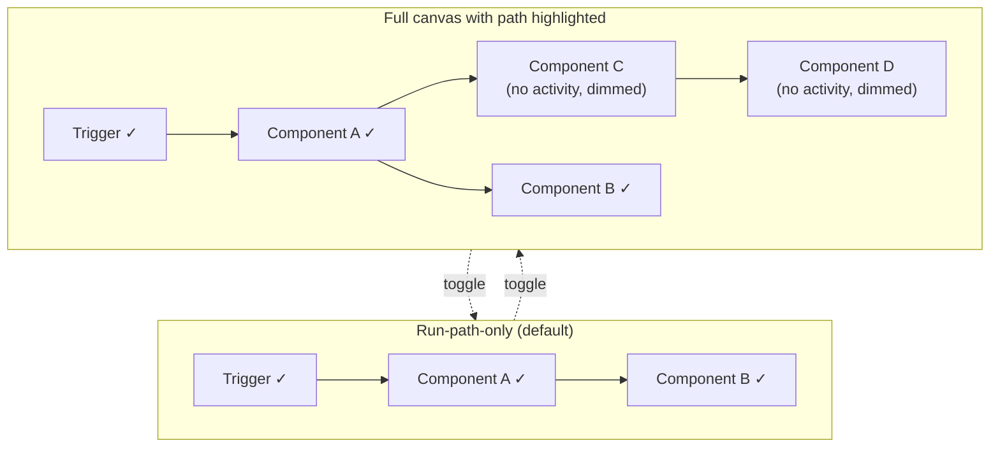

# Canvas Run View

## Overview

This PRD defines **Run View**: a dedicated mode on the Canvas page for inspecting **one execution at a time**. Users pick a run from a **Runs Sidebar**; the **Run Canvas** shows the workflow graph as it existed for that execution, with every node scoped to that run's data only.

The **Live Canvas** always shows the **current version** of the workflow with items from all active runs mixed together. The **Run Canvas** shows a **point-in-time snapshot**: the workflow as it was when the selected run executed, including nodes, branches, and configuration that may no longer exist on the current live version.

Run View **complements** the Live Canvas. It does not replace it. The Live Canvas is still the right place to see the current workflow, monitor activity across all runs, and get a real-time pulse of what is happening. Run View adds the ability to drill into a single execution when that's what the user needs.

**Terms**

| Term | Meaning |
|------|---------|
| **Live Canvas** | Current workflow definition + live signaling. Multiple runs coexist on the same graph. |
| **Run View** | Mode on the Canvas page for inspecting a single run. |
| **Console Runs** | Existing run list panel on the Live Canvas. Stays as-is; becomes an entry point into Run View. |
| **Runs Sidebar** | Run list inside Run View. |
| **Run Canvas** | Graph area in Run View showing the point-in-time snapshot for the selected run. |

## Problem Statement

- The **Live Canvas** mixes signals from multiple concurrent runs on the same graph. Each node shows items from whichever runs have reached it, and the most recent execution wins the node's visual status. Users can't answer "what happened in this specific run?" without cross-referencing Console Runs.
- Correlating node state with one run's data requires mental filtering. There's no way to trust that what a node shows actually belongs to the run you care about.
- **Console Runs** improved run discovery but it's a list, not a graph. Users still can't trace a single run's path visually across the canvas.
- The **component sidebar and chain-item UI** on Live Canvas serve dual roles: configuration and run inspection. It's unclear whether you're looking at the current definition or data from a specific run.

The Live Canvas is **not the problem**. It's the right tool for monitoring live activity and seeing the current state of the workflow at a glance. The problem is that it's also the **only** tool, and it's poorly suited for inspecting a single run in isolation.

## Goals

1. Add **Run View** on the Canvas page alongside **Live Canvas**.
2. Provide a **Runs Sidebar** in Run View: all runs for this canvas, newest first, most recent run selected by default.
3. **Run Canvas** renders a **point-in-time snapshot** of the workflow as it existed for the selected run, including nodes and branches that may have been deleted or changed on the current live version. Config and outputs match that run, not current live.
4. **Double-click** a node in Run View opens a detail panel with chain/run-item depth (status, config at run time, output/payload).
5. **Simplify Live Canvas:** remove the component sidebar and chain-item inline UI. **Console Runs** remains on Live Canvas as the run list and entry point into Run View. Double-click on a live node opens a **preview panel** scoped to the run it belongs to, with a link to open that run in Run View.

## Non-Goals

- Final visual design for the double-click detail shell (content parity with chain item is the requirement; mockups tracked separately).
- Queue/executor architecture changes beyond what's needed to list runs and bind snapshot data to the Run Canvas.
- Replacing or deprecating the Live Canvas. It stays as the primary view for monitoring live workflow activity.
- **v1:** compare two runs, diff snapshot vs live, export/share run summary (see **Follow-ups**).

## Visual Concepts

### Live Canvas: multiple runs, one graph

The Live Canvas shows the current workflow. Multiple runs flow through the same nodes concurrently. Each node shows items from whichever runs have reached it:

Two commits triggered the same workflow. "Run Tests" has items from both; "Deploy" only has `abc123` because `def456` hasn't gotten there yet. **Multiple runs, one graph, mixed items per node.**

### Run View: one run, isolated

Run View isolates a **single run**. The graph shows only that run's path, with every node scoped to that run's data. No mixing:

Only Run #8's nodes and data are visible. "Deploy" and "Notify" don't appear because Run #8 hasn't reached them.

### Snapshot vs current version

The Run Canvas renders the workflow **as it was when the run executed**. Nodes or branches deleted after the run still appear:

**Component C** and **Component D** were part of the canvas when Run #42 executed but have since been removed. Run View still renders them with the correct config and outputs from that run.

### Run Canvas display toggle

Run View supports two display modes for the same snapshot:

**Run-path-only** shows only nodes with activity in the run. **Full canvas** shows the entire snapshot with the run path highlighted and inactive nodes dimmed. Both modes are always available.

## Primary Users

- **Workflow builders / operators** who debug one execution end to end.
- Users familiar with CI run pages, workflow runs, or trace UIs who expect one run = one trace.

## User Stories

1. As a user, I can open **Run View** from the Canvas and see runs for this canvas in the **Runs Sidebar**.
2. As a user, I can select a run and see the graph as it was when the run executed, including nodes that no longer exist on Live.
3. As a user, I can see per-node run data for the selected run only, not mixed with other runs.
4. As a user, I can double-click a node to inspect details, configuration at that point in time, and output/payload.
5. As a user, I can inspect an old run even if nodes were deleted or changed on the Live Canvas afterward.
6. As a user on Live Canvas, I can double-click a node and see a detail panel referencing the run that node's data belongs to, with a link to open that run in Run View.
7. As a user in Run View, I can navigate between nodes in the run using next/previous without going back to the graph.
8. As a user, I can toggle between showing only nodes with run activity and showing the full canvas snapshot with the run path highlighted.

## Functional Requirements

### Live Canvas vs Run View

| | **Live Canvas** | **Run View** |
|---|----------|--------------|
| Graph source | Current published version of the workflow | Point-in-time snapshot from when the run executed |
| Purpose | Monitor live activity across all runs; see the current workflow state | Inspect one execution end to end |
| Run list | **Console Runs** (stays as-is) | **Runs Sidebar** |
| Node items | Items from multiple concurrent runs, latest execution status shown | Only data for the selected run |
| Node double-click | Detail panel with run data + link to open that run in Run View | Same detail panel + next/previous node navigation within the run |
| Component sidebar / chain items | **Removed** | Not applicable (detail panel replaces this) |

### Live Canvas changes

- Remove the component sidebar and chain-item inline UI from Live Canvas. Live Canvas becomes a structural + signaling view of what's currently deployed.
- **Console Runs** remains on Live Canvas. It keeps listing runs and serves as one of the entry points into Run View.
- Double-click on a node in Live Canvas opens a **detail panel** showing the node's run data in the context of the run it belongs to. The panel includes the run reference (ID, status, time) and a link to open that run in Run View.
- Live Canvas keeps showing real-time run activity on nodes (status indicators, items from active runs). It stays the place to get a live pulse of the workflow.

### Entry

- User enters Run View from the Canvas page (same mode-switching patterns as edit/live).
- User can also enter Run View from Console Runs on Live Canvas or from the preview panel link after double-clicking a node.

### Runs Sidebar

- Lists all runs for this canvas, newest at top, most recent run selected by default.
- New runs appear at the top when created.

### Run Canvas

- Renders the workflow graph as it existed when the run executed. Nodes that were later deleted, moved, or reconfigured on the live version still appear as they were for that run.
- By default shows only nodes with run activity (entered, scheduled, completed, or failed in this run).
- A toggle switches to full canvas view: the entire snapshot visible, run path highlighted, inactive nodes dimmed.
- Both display modes always available. The full snapshot is already loaded, so the toggle is zero-cost.
- Node items and badges are scoped to the selected run only.

### Node detail (double-click)

- Opens a detail panel (visual design in progress). Same panel on both Live Canvas and Run View.
- Content matches chain item / run item: status, configuration at time of run, output/payload, and other fields already exposed for deep inspection.
- On **Live Canvas**, the panel includes a link to open that run in Run View.
- On **Run View**, the panel includes **next/previous node navigation** so the user can step through the run's path without going back to the graph.

### Console Runs and Run View

- Console Runs stays on the Live Canvas as the run list and natural entry point for drilling into a specific run.
- Run View is the primary path for inspecting a single run in depth from the Canvas UI.

## Acceptance Criteria

1. User can switch to Run View and see the Runs Sidebar populated for the current canvas.
2. Selecting a run updates the Run Canvas to show the snapshot graph as it existed for that run, not the current live version.
3. Nodes and branches deleted or changed on the Live Canvas after the run still appear on the Run Canvas with snapshot-correct config and outputs.
4. Node-level run UI shows data for the selected run only.
5. Double-click on a Run Canvas node opens a detail surface with chain/run-item parity.
6. Toggle between run-path-only and full-snapshot view works; full-snapshot highlights the run path and dims inactive nodes.
7. Live Canvas does not show the component sidebar or chain-item inline UI; Console Runs remains visible.
8. Double-click on a Live Canvas node opens a detail panel referencing the run it belongs to, with a working link to Run View.
9. Double-click on a Run View node opens the same detail panel with next/previous node navigation within the run.
10. Live Canvas keeps showing real-time run activity on nodes.
11. Internal dogfood: Run View is usable as the default way to debug a single run on the canvas.

## Risks and Mitigations

| Risk | Mitigation |
|------|------------|
| Two modes (live vs Run View) confuse users | Clear labels, entry points, and onboarding copy; align with existing mode switching patterns. |
| Snapshot storage or reconstruction is costly or incomplete | Spec persistence model early; treat snapshot correctness as a hard requirement for trust. |
| Removing component sidebar/chain items from live feels like a regression | Console Runs stays for quick run access; double-click preview panel keeps the quick-glance path; deep inspection moves to Run View where it's scoped and trustworthy. |

## Open Questions

1. When a new run arrives while the user has another run selected in Run View, do we keep selection, notify (toast/badge), or auto-switch to latest?
2. Precise definition of "node ran" for filtering the Run Canvas (edge cases: skipped branches, failures, retries).
3. For queued and running executions in Run View: as one node finishes, the next appears on the canvas. Should the view auto-expand or require manual refresh?
4. Default toggle state: should Run View default to run-path-only or full canvas with path highlighted? Likely run-path-only, but worth validating.
5. **Run item title/ID redundancy in Run View.** On the Live Canvas, titles and run IDs distinguish concurrent runs: two commits, two scheduled times, two alerts all coexist on the same nodes. In Run View there's only one run, so every node carries the same ID and title, making that element redundant. No solution for v1. Leave as-is and revisit per-node chrome for Run View later.

## Follow-ups (post-v1)

- Compare two runs side by side.
- Highlight diff between run snapshot and current Live Canvas.
- Export or share a run summary.
- Run View node chrome optimized for single-run context (see open question #5).

## Reference

- Console Runs section (baseline to match or supersede).
- Chain item / run item UI (content parity for the node detail surface).
- Design mocks (link when ready).
