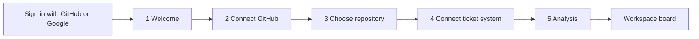

# Onboarding First Run — Copy and UX

> Status: Draft
>
> This document specifies the first steps of a new post-login onboarding
> flow: greeting, connections, and analysis. After analysis, SuperPlane
> opens the workspace board. It is a copy and UX specification only. It
> does not change the existing workspace setup wizard, and it does not
> specify backend behavior beyond what the screens require.

## Overview

A new user signs in and must reach the workspace board. Everything in
this flow exists to connect a repository and a ticket system, run the
first analysis, and open the board. The scored ticket list is a board
surface, not an onboarding screen.

The flow makes two promises and must keep both visible:

1. SuperPlane does not start work and does not change tickets.
2. SuperPlane does not change code without approval on a specific ticket.

Vocabulary: this flow says **ticket** for one item of backlog work
(a GitHub issue, a Jira issue, or a Linear issue) and **backlog** for the
collection. It says **confidence score** for the 65–95% rating. Use these
terms consistently on every screen.

## Flow

Five onboarding screens. Analysis then opens the board.

### Entry conditions

- The flow starts after the first sign-in, when the organization has no
  connected repository.
- A returning user who abandoned the flow resumes at the first incomplete
  screen. Completed connections stay completed.

### Login provider does not change the flow

The greeting and all five screens are identical for GitHub and Google
sign-in. One nuance the UI must respect: signing in with GitHub does not
grant repository access. OAuth sign-in and GitHub App installation are
separate grants. Every user sees the same `Connect GitHub` step, and the
copy must never imply that a GitHub-login user is already connected.

### Layout

Every onboarding screen uses the same chrome, from Linear web
onboarding (Mobbin):

- The content block is centered in the viewport, horizontally and
  vertically.
- Top left: `Log out`.
- Top right: `Logged in as` and the user email.
- Bottom center: five step dots.
- SuperPlane type, buttons, and tokens. Do not copy Linear colors.

### Screen 1 — Welcome

One job: show the payoff and invite the user in. No permission ask on
this screen (see Decision below).

Layout, top to bottom:

1. Greeting (`Hi {firstName}.`) when the name is known.
2. Headline and one intro sentence.
3. Result preview: a static scored ticket list (65–95%).
4. One button: `Get started`.

### Screen 2 — Connect GitHub

One job: ask for repository access.

Layout, top to bottom:

1. Headline and body: SuperPlane reads repositories and does not start
   work yet.
2. `Connect GitHub`.
3. One helper line under the button: SuperPlane does not change code
   without approval.

Connecting GitHub opens the GitHub App installation. On return, the
screen shows `Connected` and `Choose a repository`.

### Screen 3 — Choose repository

A searchable GitHub repository list. The user picks the repository
SuperPlane will analyze. Tickets are not on this screen.

The primary button names the current task: `Choose a repository to continue`.

### Screen 4 — Connect ticket system

One job: choose where tickets live for the selected repository.

Layout, top to bottom:

1. Headline, the repository name, and one body sentence.
2. Ticket options: GitHub Issues, Jira, Linear.
3. Helper: the analysis starts when the user chooses a source.

GitHub Issues requires no second connection; it reuses the GitHub
connection and the selected repository. Jira and Linear open their own
connect dialogs. Choosing GitHub Issues starts the analysis.

### Screen 5 — Analysis

A waiting screen with an honest time expectation and staged progress
lines. The stages tell the user what SuperPlane reads, and the copy
repeats that nothing is changed. If the analysis runs longer than the
stated time, the screen must say so rather than spin silently.

The user can leave. When the analysis finishes, SuperPlane opens the
workspace board. The scored ticket list is not an onboarding screen.

## Decision: one screen or two for welcome and connect

The question: one combined screen (intro plus connect actions), or a
separate welcome page before the connect page?

### Option A — Combined screen

| Pros | Cons |
| --- | --- |
| Value and action are visible together | Trust copy competes with the buttons |
| One less click | The screen looks like a settings form |
| Trust statements sit next to the permission ask | No room for a greeting or preview to breathe |

### Option B — Separate welcome, then connect (recommended)

| Pros | Cons |
| --- | --- |
| One idea per screen: payoff first, then the ask | Adds one click |
| Trust statements stay next to the permission ask | Users who skip welcome meet the ask with less context |
| Welcome can use larger type and more space | Two screens to maintain |

### Recommendation

Option B. Review of comparable onboarding on Mobbin (Linear, Height,
Profound, Gemini) shows the same split: a centered welcome with one
button, then a dedicated connect step for the permission ask.

Keep a hard copy budget on each screen. Welcome: greeting, headline,
one intro, caption, `Get started`. Connect: headline, body,
`Connect GitHub`, one helper line. Permission details stay in the
connect dialog.

The extra click is cheaper than a first screen that asks for GitHub
before the user has a reason to care.

## Copy

All strings follow the ui-copy and Simplified Technical English skills:
active voice, imperative buttons, no contractions, one term per concept,
instructions within 20 words, descriptions within 25 words.

### Chrome (every onboarding screen)

| Element | Copy |
| --- | --- |
| Top left | `Log out` |
| Top right label | `Logged in as` |
| Top right value | User email. Use the first name if the email is missing. |

### Screen 1 — Welcome

| Element | Copy |
| --- | --- |
| Greeting | `Hi {firstName}.` |
| Headline | `See what SuperPlane can ship from your backlog` |
| Intro | `Each ticket is scored by how confident SuperPlane is that an agent can complete it.` |
| Preview caption | `Example: tickets scored from a real backlog.` |
| Button, primary | `Get started` |

Personalization: when the sign-in provider supplies a first name, show
`Hi {firstName}.` as a separate short line above the headline. Do not
merge the greeting into the headline, and do not block on a missing
name.

### Screen 2 — Connect GitHub

| Element | Copy |
| --- | --- |
| Headline | `Connect GitHub` |
| Body | `SuperPlane reads your repositories. It does not start work yet.` |
| Button, primary | `Connect GitHub` |
| Button state after connect | `Connected` |
| Button after connect | `Choose a repository` |
| Helper under button | `SuperPlane does not change code without your approval on a specific ticket.` |
| Connect error | `SuperPlane could not connect to GitHub. Check your access and try again.` |

### Screen 3 — Choose repository

| Element | Copy |
| --- | --- |
| Headline | `Choose a repository` |
| Repository label | `Repository` |
| Repository helper | `Select the repository you want SuperPlane to analyze.` |
| Repository search placeholder | `Search repositories` |
| Missing repository link | `Do not see your repository? Edit the GitHub connection.` |
| Button, primary | `Choose a repository to continue` |
| Helper under button | `You can add more repositories later.` |

### Screen 4 — Connect ticket system

| Element | Copy |
| --- | --- |
| Headline | `Connect your ticket system` |
| Repository caption | `Tickets for {repository}` |
| Body | `SuperPlane reads tickets for this repository. It does not start work yet.` |
| Ticket options | `GitHub Issues` / `Jira` / `Linear` |
| GitHub Issues helper | `Uses GitHub Issues on this repository. No extra setup.` |
| Jira helper | `Find tickets in your Jira backlog.` |
| Linear helper | `Find tickets in your Linear backlog.` |
| Helper under options | `SuperPlane does not start work and does not change your tickets.` |
| Helper under options | `The analysis starts when you choose a ticket system.` |

### Screen 5 — Analysis

| Element | Copy |
| --- | --- |
| Headline | `Analyzing your backlog` |
| Body | `SuperPlane reads your code and your tickets. This takes a few minutes.` |
| Reassurance line | `Nothing is changed. No work starts.` |
| Stage 1 | `Reading the repository structure` |
| Stage 2 | `Reading open tickets` |
| Stage 3 | `Scoring each ticket against the codebase` |
| Leave hint | `You can leave this page. SuperPlane opens the board when the analysis finishes.` |
| Overrun notice | `The analysis needs more time than usual. It is still running.` |
| Failure | `The analysis did not finish. Try again.` |
| Failure button | `Run analysis again` |

## After onboarding — Workspace board

The scored ticket list is a board surface. It is not part of this flow.
Copy for that surface stays on the board work, not here.

## Best practices and rationale

Each copy decision maps to an established onboarding practice.

**Show the payoff before the permission ask.** The scored-list preview
sits on the welcome screen. Users grant access more willingly when they
can see exactly what they get. This is why the headline names the
outcome (`See what SuperPlane can ship`) instead of the product.

**One primary action per screen.** Welcome has `Get started`. Then
`Connect GitHub`, then a repository, then a ticket system. Each button
names the specific action.

**Just-in-time permission detail.** Scope lists and installation
mechanics live in the connect dialog, at the moment of the grant. The
connect screen carries only the two behavioral promises. Note: the trust
statements are behavioral ("does not change code without your approval"),
not scope claims ("read-only access"). Behavioral promises stay honest
even when the GitHub App requests write scopes for later pull requests.

**Honest time expectations, never a silent spinner.** The analysis
screen shows staged progress, an overrun notice when it runs long, and
a leave hint so the wait never holds the user hostage.

**Trust statements adjacent to the moment of doubt.** The two promises
appear directly above the connect buttons. The second promise must
reappear on the board when the user first sees a mutating action.

**Do not block on optional integrations.** GitHub Issues works with zero
extra setup, so a GitHub-only user reaches the board without touching
Jira or Linear. Jira and Linear are offered, not required, and can ship
as "coming soon" without breaking the flow.

**The board closes the loop.** The welcome preview names the outcome.
The board is where that list lives after analysis.

## Out of scope

- Backend analysis behavior, scoring model, and score thresholds.
- Changes to the existing workspace setup wizard
  (`web_src/src/pages/factories/pages/onboarding/`).
- How scored tickets appear on the workspace board.
- What happens after ticket approval (work order creation, line
  dispatch).
- Email notification when a long analysis finishes.
