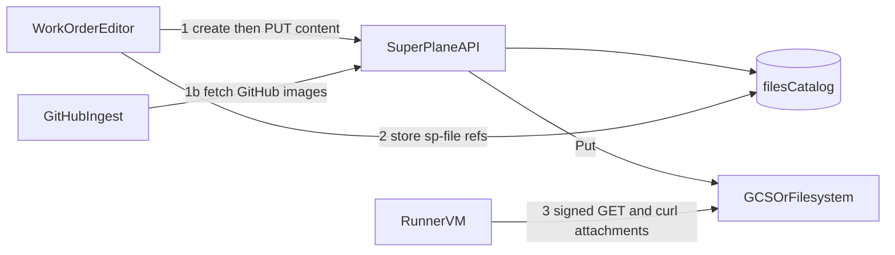

# Platform files

> Status: Shipped
> Audience: Product and engineering
> Shipped in: [PR #7234](https://github.com/superplanehq/superplane/pull/7234)
> Issue: [#7108](https://github.com/superplanehq/superplane/issues/7108)

This playbook is the source for SuperPlane-owned object storage. Postgres
holds the catalog. `pkg/blob` holds the bytes.

This is not a customer object-storage integration. Do not use
[gcp.md](gcp.md) or Hetzner, OCI, or DigitalOcean components for this
path.

## Locked decisions

1. **SuperPlane owns the store.** One bucket per environment. Isolate with
   prefixes. Object names are UUIDs. Display name and MIME type live in
   Postgres.
2. **Four scopes in the key layout.** `app` is the installation.
   `organization` is the org. `workspace` is the factory. `task` is the work
   order.
3. **Create `workspace` and `task` rows only.** Keep `app` and `organization`
   in the CHECK and in `ObjectKey` for later APIs. Do not add a `run` scope
   yet.
4. **Store `sp-file://{uuid}` in markdown.** Never persist a signed URL in
   `factory_work_orders.description`. Mint a signed GET when a reader needs
   bytes.
5. **Upload through SuperPlane.** The client sends an authenticated streaming
   `PUT /api/v1/files/{id}/content`. Do not add a client-to-GCS signed PUT.
6. **Download with a time-limited GET.** GCS uses a V4 signed URL. The
   filesystem provider uses an HMAC public GET. The bucket stays private.
7. **List, quota, and auth use Postgres.** Do not use GCS `List` as a
   directory API.

## Goal

A user attaches images and files to a task description. SuperPlane stores
the bytes. The UI and the runner fetch them without a SuperPlane session.

On GitHub import, SuperPlane copies GitHub-hosted images into this store
and rewrites the description to `sp-file://` refs.

## Scope mapping

Product language vs SuperPlane entities:

- **App** — installation (`installation_metadata`). Key prefix `app`.
- **Organization** — `organizations`.
- **Workspace** — factory. Key prefix `workspaces/{factoryId}`.
- **Task** — work order. Key prefix `tasks/{workOrderId}`.

Object keys:

```
{installationId}/app/{fileId}
{installationId}/orgs/{orgId}/{fileId}
{installationId}/orgs/{orgId}/workspaces/{factoryId}/{fileId}
{installationId}/orgs/{orgId}/workspaces/{factoryId}/tasks/{workOrderId}/{fileId}
```

See [pkg/blob/key.go](../../pkg/blob/key.go).

## What exists today

Do not reinvent these pieces.

### Provider

Interface: `Put`, `Get`, `Head`, `Delete`, `SignedGetURL` in
[pkg/blob/provider.go](../../pkg/blob/provider.go).

| Provider | When | Env |
| --- | --- | --- |
| `filesystem` | Dev, tests, self-host | `BLOB_STORAGE_LOCAL_PATH` |
| `gcs` | Hosted SuperPlane | `BLOB_STORAGE_BUCKET` |

Also set `BLOB_STORAGE_PROVIDER`. Hosted GCS uses Workload Identity or
`BLOB_STORAGE_CREDENTIALS_FILE`. Do not use customer GCP integration
credentials.

HMAC public URLs use `BLOB_STORAGE_SIGNING_KEY` (fallback `ENCRYPTION_KEY`,
then `JWT_SECRET`) and `BASE_URL`. See `.env.example`.

### Catalog

Table `files`. Model: [pkg/models/file.go](../../pkg/models/file.go).
Business logic: [pkg/storedfiles/files.go](../../pkg/storedfiles/files.go).

States: `pending` → `ready` or `failed`.

Limits:

- Max file size: 10 MiB
- Max files per task: 20 (`pending` plus `ready` on create)
- Max ready bytes per organization: 10 GiB
- Max filename: 255 runes
- Stale pending or failed age: 1 hour

Allowed content types: `image/png`, `image/jpeg`, `image/gif`,
`image/webp`, `application/pdf`, `text/plain`, `text/markdown`.

### APIs

Proto: [protos/files.proto](../../protos/files.proto).

| RPC | HTTP | Auth |
| --- | --- | --- |
| `CreateFactoryFile` | `POST /api/v1/factories/{factory_id}/files` | `factories:update` |
| `ListFactoryFiles` | `GET /api/v1/factories/{factory_id}/files` | `factories:read` |
| `CreateWorkOrderFile` | `POST /api/v1/factories/{factory_id}/orders/{order_id}/files` | `work_orders:update` |
| `ListWorkOrderFiles` | `GET /api/v1/factories/{factory_id}/orders/{order_id}/files` | `work_orders:read` |

Raw HTTP (not gRPC gateway):

| Method | Path | Auth |
| --- | --- | --- |
| `PUT` | `/api/v1/files/{file_id}/content` | Org JWT. Caller must be `created_by_id`. |
| `GET` | `/api/v1/public/files/{file_id}` | HMAC `expires` + `sig`. No session. |

Handlers: [pkg/grpc/actions/files/files.go](../../pkg/grpc/actions/files/files.go),
[pkg/public/file_http.go](../../pkg/public/file_http.go).

Create returns `upload_url`. That URL is the SuperPlane content PUT, not a
GCS signed PUT.

`DescribeWorkOrder` returns ready task files with a short-lived
`download_url`. Do not mint URLs on `ListWorkOrders`.

There is no create or list RPC for `app` or `organization` scopes.

### Upload and bind

1. Create a pending catalog row (`workspace` or `task`).
2. Stream bytes with `PUT /api/v1/files/{id}/content`.
3. SuperPlane writes the object, runs `Head`, and marks `ready`.

Create-dialog attach uses workspace scope. On work order create, update, or
intake import, `BindDescriptionFiles` copies those objects to task keys and
reparents the rows.

Call bind from UI `CreateWorkOrder`, `UpdateWorkOrder`, and
`ImportFactoryIntakeItem`. Canvas `FactoryContext.CreateWorkOrder` ingests
GitHub images. It does not call `BindDescriptionFiles`.

Reject refs that are not ready, not in this org or factory, or owned by
another work order.

### Markdown contract

Stored description:

```

[notes.pdf](sp-file://{fileId})
```

Scheme constant: `sp-file` in [pkg/blob/markdown.go](../../pkg/blob/markdown.go).

Dispatch rewrite (`DescriptionForDispatch`) replaces refs with signed GETs
and adds `files[]` on `order()` / `task()` (`id`, `filename`,
`content_type`, `size_bytes`, `url`).

TTL:

- UI list and describe: 1 hour (`UIDownloadTTL`)
- Dispatch: `max(executionTimeoutSeconds, 3600s) + 30m`

Treat signed URLs in prompts and logs as capability URLs.

### GitHub ingest

`IngestRemoteImages` fetches GitHub-hosted image URLs with the intake
GitHub token. It writes task-scoped files and rewrites those URLs to
`sp-file://`.

If one fetch fails, keep the original URL and continue. Do not fail the
import. Leave non-GitHub URLs unchanged. Do not ingest on intake search.

Call sites: `import_factory_intake_item.go` and
`factory_context.ingestGitHubImages`.

### Runner

A signed URL in the prompt is reachable. Claude Code `Read` sees local
files only.

At broker-task build, SuperPlane curls each signed file URL into
`$SUPERPLANE_TASK_DIR/attachments/` before the model starts. See
[pkg/components/runner/agent_task.go](../../pkg/components/runner/agent_task.go).

Do not inline bytes in `BrokerTaskFile`.

### Lifecycle

- Pending or failed rows older than one hour: `FileCleanupWorker` deletes
  the object and the row.
- Factory delete: delete file objects, then catalog rows, then work orders.
- Organization delete: same after factories are gone.
- Failed object deletes become `failed` catalog rows for later GC.

Do not delete a file when the user removes it from markdown. Orphans stay
until work-order or factory delete.



## Product rules

| Topic | Rule |
| --- | --- |
| Store | SuperPlane bucket. Prefix isolation. UUID object names. |
| Catalog | Postgres `files`. Quota and auth use this table. |
| Create scopes | `workspace` and `task` only. |
| Markdown | Persist `sp-file://{uuid}`. Never persist a signed URL. |
| Upload | Authenticated streaming PUT to SuperPlane. |
| Download | Time-limited GET. Private bucket. |
| Task bind | Reparent workspace files on create, update, and import. |
| GitHub ingest | Copy bytes at import. Skip failed fetches. |
| Runner | Rewrite description and curl into `attachments/`. |
| Delete | GC and factory/org cleanup only. No delete RPC. |

## Do not confuse with

- `workflow_staged_files` (unpublished canvas text in Postgres)
- Work-order artifacts (JSONB, 64 KB cap)
- Agent chat images (base64 in Postgres, session cookie)
- `BrokerTaskFile` (inline `path` + `content` in create-task JSON)
- Customer buckets: [pkg/integrations/gcp/storage](../../pkg/integrations/gcp/storage),
  Hetzner S3, Azure Blob triggers, OCI Object Storage
- Canvas memory: [canvas-memory.md](canvas-memory.md)

## Later work

Keep the schema ready. Do not block these with a new key layout.

- Installation and organization file RPCs and UI
- `run` scope for canvas-run recordings
- Video MIME types and direct-to-GCS resumable upload
- Signed PUT from the browser
- Delete-file RPC
- Unbind when the user removes a ref from markdown
- Ingest adapters besides GitHub (Linear, GitLab, and similar)
- Work-order artifact type `file`

## Code pointers

| Area | Path |
| --- | --- |
| Scopes and keys | [pkg/blob/key.go](../../pkg/blob/key.go) |
| Provider interface | [pkg/blob/provider.go](../../pkg/blob/provider.go) |
| HMAC public GET | [pkg/blob/hmac.go](../../pkg/blob/hmac.go) |
| Markdown refs | [pkg/blob/markdown.go](../../pkg/blob/markdown.go) |
| Catalog model | [pkg/models/file.go](../../pkg/models/file.go) |
| Bind, ingest, dispatch | [pkg/storedfiles/files.go](../../pkg/storedfiles/files.go) |
| Proto | [protos/files.proto](../../protos/files.proto) |
| Content PUT and public GET | [pkg/public/file_http.go](../../pkg/public/file_http.go) |
| Pending GC | [pkg/workers/file_cleanup_worker.go](../../pkg/workers/file_cleanup_worker.go) |
| Runner attachments | [pkg/components/runner/agent_task.go](../../pkg/components/runner/agent_task.go) |
| Env template | [.env.example](../../.env.example) |
