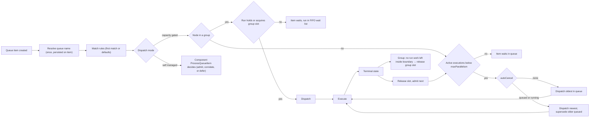
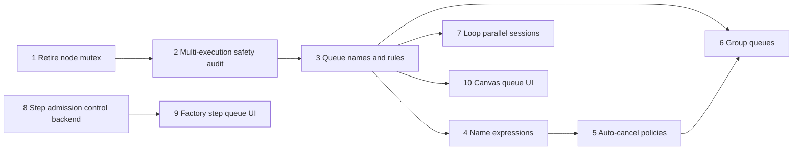

# Workflow Queueing and Parallelism

> Status: Draft
>
> This draft replaces the engine's implicit per-node serialization with a
> single first-class primitive: the **queue**. A queue attaches to a **node**
> (slot per execution) or to a drawn **node group** (slot per run while the
> run has work inside the group) — the attachment point *is* the scope.
> Names may contain expressions resolved per event, and canvas-level
> **rules** configure queues by matching their resolved names. Factory
> line-step admission is the same primitive at the factory layer: a
> whole-automation group with work orders as the waiters.

## Overview

Today every node in a canvas is an implicit serial FIFO queue: at most one
execution of a node can be in flight at any time, and pending inputs accumulate
in the node's backlog. This was never a product decision — it is a side effect
of the node state machine — and it caps throughput for long-running components
(for example, `runnerClaudeCode`) at one execution per node. For a Software
Factory, where a line step such as "Implement" should process several work
orders concurrently, this is a hard blocker.

Plain parallelism is not enough, though. Real workflows need contextual
serialization, deduplication, and section-level gating:

- CI for a monorepo must run pushes to different branches in parallel, but
  pushes to the *same* branch one after another.
- A docs deploy triggered on every merge to main should not run three times
  for three queued merges; only the newest matters.
- A deploy-then-test flow must finish the *whole sequence* for one event
  before deploying the next — serializing the deploy node alone is not
  enough, because the next deploy would start while the previous tests are
  still running.

All of these are queueing decisions. This PRD makes the queue a first-class
citizen of the workflow engine, with a strict separation of concerns:

1. **Nodes and groups name queues.** A queue attaches to a *node* — a slot is
   held by one execution — or to a drawn *node group* — a slot is held by a
   run while it has work inside the group. Scope is structural: what carries
   the name determines what holds the slot, and both are visible on the
   canvas. Names may contain expressions resolved against the incoming
   event, so `ci-{{ $.data.branch }}` yields one independent queue per
   branch. Unattached nodes get an implicit queue of their own, which
   reproduces today's behavior exactly.
2. **Rules configure queues.** A canvas-level ordered list of rules matches
   resolved queue names by pattern and sets `maxParallelism` and
   `autoCancel`. Queues matching no rule use defaults (limit 1, no
   auto-cancel).
3. **Factory line steps** get admission control (`maxParallelism`, default
   10): the same group semaphore with the whole automation as the group,
   acquired at run creation, with work orders as the waiters.

The enabling engine change: the per-node mutex is removed and replaced with
queue-capacity dispatch. Session-style components (`loop`, `merge`) become
parallel across runs.

## Problem Statement

The serialization mechanism today: a node's `state` column on `workflow_nodes`
(`ready` / `processing`) acts as a mutex. The queue worker only dispatches a
node's oldest queue item when the node is `ready`; the default dispatch path
atomically creates the execution, deletes the queue item, and flips the node to
`processing`; the node returns to `ready` only when that execution reaches a
terminal state. Consequences:

- **No parallelism per node.** A factory line like *Bugs: Create plan →
  Implement → Open pull request → CI loop* can only ever have one "Implement"
  agent running, no matter how many work orders are ready.
- **No contextual serialization.** A "trigger Semaphore CI" node listening to
  monorepo pushes serializes *everything*: developer A's push to
  `feature-auth` waits behind developer B's push to `feature-cart`, even
  though only same-branch pushes need ordering.
- **No deduplication.** A 5-minute docs deploy on merge to main runs once per
  queued merge. Three merges in quick succession produce three sequential
  deploys where only the last one is useful.
- **No section-level gating.** In a `deploy → run tests` flow sharing a
  "staging" environment, nothing can express "do not start the next deploy
  until the previous event's tests have finished." Node-level serialization
  frees the deploy node as soon as the deploy execution ends, letting the
  next deploy start while the previous tests still run.
- **No cross-node limits.** Several nodes calling the same external system
  cannot share a concurrency budget.
- **Queueing is invisible and unmanaged.** Backlogs build up in
  `workflow_node_queue_items` with no user-facing concept of a queue, no
  limits, and no controls.
- **Session components self-limit to one.** `loop` explicitly defers new loop
  starts while any session is active on the node, even though its sessions are
  correlated per run and could safely coexist.

## The Queue Primitive

A queue is identified by its **resolved name**. A queue exists because work
references it; there is no declaration step. What carries the name — a node
or a group — determines what holds a slot; there is no configured "scope".

**Nodes name queues** for per-execution semantics. The node-level `queue`
field carries a name and nothing else. A slot is acquired when an item is
dispatched into an execution and released when that execution reaches a
terminal state. Protects a node or a shared resource:

```yaml
# node A (notify): a queue per tenant
queue: "notify-{{ $.data.tenant }}"

# node B (coding agent): a named queue for this node's work
queue: agents

# node C: opt out entirely (unbounded, no queueing)
queue: none

# node D: nothing specified — implicit queue with default settings
#         (limit 1: today's behavior)
```

**Groups name queues** for section semantics. A group is a drawn set of nodes
on the canvas — part of the spec, visible as a boundary in the UI — and its
queue gates *runs* through that section:

```yaml
groups:
  - id: staging-gate
    nodes: [deploy, test]
    queue: "env-{{ $.data.environment }}"
```

- The slot is acquired when a run's first item dispatches at any node inside
  the group. The name expression is resolved from that acquiring item's
  event and is fixed for the run's stay in the group.
- The slot is held **while the run has pending items or running executions
  on the group's nodes**, and released the moment it has none (or the run
  reaches a terminal state — cancellation and failure release it too). In a
  `build → [deploy → test] → rest` flow, the next run's deploy dispatches
  when the previous run's *test* finishes, not when its entire run ends.
- If the flow routes back into the group later in the same run, the run
  re-acquires (and may wait behind other runs — visible, first-come order).
- Runs wait for a group slot in FIFO order of their first acquisition
  attempt; waiting items stay in their node backlog, marked as waiting on
  the queue.

Each distinct resolved value is an independent queue with its own FIFO order
and its own capacity: `ci-{{ $.data.branch }}` produces `ci-main`,
`ci-feature-auth`, and so on. Attachments naming the same queue share its
budget and its FIFO order. The implicit queue of an unattached node is
internal (keyed by node ID), always uses default settings, and is not
addressable by other attachments or by rules — to change a queue's behavior,
name it.

**Rules configure queues.** A canvas-level ordered list of rules, matched
against resolved names, first match wins; no match means defaults:

```yaml
queues:
  - match: agents          # exact name
    maxParallelism: 3
  - match: "docs-deploy"
    autoCancel: queued
  - match: "env-*"         # glob over resolved names
    autoCancel: running
```

Rule settings:

- `maxParallelism` (default 1) — concurrent slot holders in the queue
  (executions for a node queue, runs for a group queue).
- `autoCancel` (`none` | `queued` | `running`, default `none`) — whether newer
  items in the queue supersede older work. `queued` supersedes older waiting
  items; `running` additionally cancels in-flight slot holders. (Semantics
  match Semaphore's auto-cancel and GitHub Actions'
  `concurrency.cancel-in-progress`.) On a node queue the superseded work is
  queued items and running executions; on a group queue it is waiting *runs*
  and, with `running`, the in-flight holder runs themselves — a new push to
  a branch cancels that branch's in-flight CI run.

Because configuration lives only in rules, two attachments can never disagree
about a queue's settings — there is nothing to keep consistent. One queue per
node and per group; naming multiple queues from one attachment is future
work.

**Reference configurations for the motivating examples.**

- Monorepo CI, parallel across branches, serial per branch. Two readings:
  - A node that triggers an external CI provider:
    `queue: "ci-{{ $.data.branch }}"` on that node — no rule needed; the
    defaults (limit 1 per resolved name) are exactly the desired behavior,
    since the constraint lives and dies with that node's execution.
  - The canvas *is* the CI pipeline (build → test → publish as nodes): "one
    CI run per branch" is a statement about the whole pipeline, so a group
    containing all the pipeline's nodes carries
    `queue: "ci-{{ $.data.branch }}"` — no rule needed.
- Coding agent, three concurrent work orders: `queue: agents` plus rule
  `{ match: agents, maxParallelism: 3 }`.
- Docs deploy, only the newest queued merge matters: `queue: docs-deploy`
  plus rule `{ match: docs-deploy, autoCancel: queued }`.
- CI where a newer push makes the running build pointless: the whole-canvas
  group above plus rule `{ match: "ci-*", autoCancel: running }`.
- Deploy → tests on shared staging, with unrelated work after: a group over
  `[deploy, test]` with `queue: "env-{{ $.data.environment }}"`. Run 2's
  deploy dispatches as soon as run 1's test finishes — run 1's remaining
  nodes (outside the group) do not hold the environment.
- Max five concurrent calls to one API across the canvas: `queue: api` on
  every node that calls it, plus rule `{ match: api, maxParallelism: 5 }`.

## Product Decisions

1. The queue is a first-class engine primitive — not a new node kind. The
   original idea of a queue *component* on the canvas was considered twice
   and rejected: queues attached to existing nodes and groups express the
   same semantics without inserting artificial nodes into the flow, and the
   kind axis (trigger/component/widget) is expensive to extend.
2. Strict separation of concerns: **nodes and groups carry only a queue
   name** (optionally an expression); **canvas-level rules carry all
   configuration**, matched against resolved names (ordered, first match
   wins, glob patterns); queues matching no rule use defaults. Inline
   settings on attachments do not exist, so same-name consistency holds by
   construction.
3. **Scope is structural, not configured.** What carries the name determines
   what holds a slot: a node queue's slot is one execution; a group queue's
   slot is a run while it has work inside the group. There is no `scope`
   rule setting. This keeps gating visible: everything a queue covers is a
   drawn boundary on the canvas, never an invisible property of downstream
   nodes. (An earlier draft configured `scope: run` in rules; it was
   rejected because the gated span — from the naming node to run end — was
   invisible in the UI, made downstream queue configuration misleading, and
   over-held the slot through trailing nodes that needed no protection.)
4. Queue identity is the resolved name. There is no key/partition concept:
   `ci-main` and `ci-feature-auth` are simply two queues.
5. The per-node mutex is removed from the engine; dispatch is governed by
   queue capacity.
6. Every node waits in exactly one queue. Unattached nodes get an implicit
   queue with default settings (`maxParallelism: 1`) — today's behavior,
   preserved without any configuration change. Implicit queues are not
   matchable by rules; to configure a queue, name it. `queue: none` opts a
   node out of queueing entirely.
7. Queue naming and rules are engine-level, not part of any component's
   `Configuration()` schema. The engine evaluates them before the component's
   queue processing runs.
8. There is no aggregate cap across the queues produced by one name
   expression. `ci-{{ branch }}` admits up to `maxParallelism` per branch;
   downstream systems are expected to have their own capacity controls.
   Revisit if needed.
9. Groups are **disjoint** — a node belongs to at most one group — and a run
   may hold at most **one** group-queue slot at a time. Enforcement is
   two-layered: publish-time validation rejects overlapping groups; at
   runtime, a run whose work would acquire a second group slot while still
   holding one (parallel branches inside two groups) fails visibly rather
   than waiting, so hold-and-wait deadlocks cannot occur. Sequential groups
   on one path are fine — the run releases the first group before entering
   the second. Lifting the concurrent-hold restriction (ordered acquisition)
   is future work.
10. A group queue's name expression is resolved once per run, from the event
    of the item that acquires the slot, and stays fixed for the run's stay
    in the group. Items of a run that already holds the group's slot proceed
    under that slot without re-resolving.
11. Runs wait for a group slot in FIFO order of their first acquisition
    attempt. Waiting is visible: the item stays in the node backlog, marked
    as waiting on the queue.
12. Components have one of two **dispatch modes**:
    - *Capacity-gated* (the default): the engine dispatches queue items only
      while the item's queue has capacity (and, for nodes inside a group,
      the run holds or can acquire the group slot).
    - *Self-managed* (`loop`, `merge`): queue items are always dispatched, and
      the component enforces its own admission using its queue's effective
      `maxParallelism`. This is required for correctness: these components
      receive feedback and late-arriving events that must be processed even
      while their long-lived executions occupy capacity.
13. `merge` runs concurrently across runs: one merge execution per run
    (grouped by root event), with executions for different runs open at the
    same time. Queue-item handling for the same run remains serialized.
    Conceptually, merge and loop already correlate by the run's root event —
    the same primitive as a per-run queue name.
14. `loop` supports up to its queue's `maxParallelism` concurrent sessions per
    node, each session correlated to its run (root event). New loop starts
    beyond the limit are deferred, exactly as all starts beyond one are
    deferred today.
15. Superseded work is visible, not silent: a superseded item and a
    cancelled execution carry a distinct disposition ("superseded",
    referencing the newer event that replaced them), their runs are finalized
    accordingly, and they are not counted as failures.
16. The node `state` column keeps its **setup-error** job and loses its
    scheduling job. `error` (with `state_reason`) continues to be set at
    publish time and continues to make the router skip the node; `processing`
    is retired (`ready` remains the only operational value). "Is this node
    running" becomes derived from execution counts. The column stays in this
    form; no further rework is planned.
17. Factory line steps gain a `maxParallelism` setting with a **default of
    10**, configured at the step level only (no factory- or
    organization-level override). A step admits up to that many concurrent
    runs; additional ready work orders wait in a per-step queue, ordered by
    the time they became ready for that step. Line-step admission is the
    group-queue semaphore with the whole automation as the group, acquired
    at run creation, with work orders (rather than queue items) as the
    waiters. Auto-cancel does not apply to work orders: every work order
    must be processed.
18. Queues are observable as first-class objects: per-queue depth, current
    holders, and waiters; node cards show backlog depth and running count;
    nodes are badged with their queue name (template and resolved values);
    groups are drawn as boundaries with their queue badge on the border;
    the factory shows waiting work orders per step. The queue list is derived
    from attachments, rules, and live runtime state — there is no static
    registry, and dispatch never depends on one. If the queue UI needs memory
    beyond the live snapshot — idle expression queues (`ci-main` after it
    drains), last activity, per-queue counters — the answer is a purely
    observational queue-state row, lazily upserted on first touch and subject
    to retention (expression names have unbounded cardinality), never read by
    dispatch. Decide when building the queue UI (chunk 10).

## Goals

1. Allow N concurrent executions of a single node.
2. Allow parallelism across contexts with serialization within a context
   (branch, environment, tenant), via event-derived queue names.
3. Allow deduplication of redundant queued work (run only the latest) and,
   optionally, cancellation of in-flight work superseded by newer events.
4. Allow gating a multi-node section of a flow as one unit: the next run
   enters the section only when the previous run's work *in that section*
   has finished — visible on the canvas as a drawn group.
5. Allow multiple nodes to share one concurrency budget.
6. Allow a factory line step to process up to N work orders concurrently, with
   the rest queued and visible.
7. Preserve exact current behavior for existing canvases with no configuration
   changes.
8. Make `merge` and `loop` parallel across runs instead of hard-serialized per
   node, without breaking their correlation and feedback contracts.
9. Make queues explicit, named, and observable rather than a hidden side
   effect of the engine.

## Non-Goals

- A queue *component* (node kind) on the canvas (decision 1).
- A configured `scope` setting on rules (decision 3): scope is structural —
  node or group.
- Inline queue settings on attachments. Nodes and groups name queues; rules
  configure them (decision 2). Declaring queue *names* at the canvas level
  was also rejected: a per-node event expression in a canvas-level
  declaration could resolve to different names at different nodes of the same
  run, silently breaking the sharing the declaration implies.
- Rules matching implicit (unnamed) queues. Implicit queues always use
  defaults; configuring a queue requires naming it.
- Multiple queues per node or group (single queue name in this iteration).
- Nested or overlapping groups; groups are disjoint sets of nodes
  (decision 9).
- Groups carrying anything besides a queue (no group-level configuration,
  retries, or permissions). A group is a queue attachment boundary in this
  iteration.
- An aggregate cap across queues produced by one name expression (decision 8).
- Maximum queue or step-queue depth and overflow policies (reject,
  drop-oldest). Backlogs grow unbounded, exactly as node backlogs do today.
- Per-organization or per-canvas global caps (for example, total concurrent
  coding-agent executions). Not needed yet; revisit alongside billing and
  compute cost tracking.
- Priority queues or reordering beyond FIFO-within-queue and auto-cancel.
- Rate limiting (requests per time window) as opposed to concurrency limiting.
- Cross-canvas or organization-shared queues. Queue names and rules scope to
  a single canvas in this iteration.
- Changes to trigger semantics or event routing topology.
- Autoscaling or scheduling of the workers themselves; worker-level throughput
  (the per-worker semaphores) is infrastructure and out of scope.

## Current Architecture (baseline)

For reference, the pipeline this PRD modifies:

1. A trigger or finished execution creates a `CanvasEvent` (`workflow_events`).
2. `EventRouter` (`pkg/workers/event_router.go`) fans the event out along the
   live spec's edges, creating one `CanvasNodeQueueItem`
   (`workflow_node_queue_items`) per target node.
3. `NodeQueueWorker` (`pkg/workers/node_queue_worker.go`) locks the node with
   `FOR UPDATE SKIP LOCKED`, but only when `state = ready`
   (`LockCanvasNode` in `pkg/models/canvas_node.go`), takes the oldest queue
   item, and calls the component's `ProcessQueueItem`. The default
   implementation (`DefaultProcessing` in
   `pkg/workers/contexts/process_queue_context.go`) atomically creates a
   pending `CanvasNodeExecution`, deletes the queue item, and sets the node to
   `processing`.
4. `NodeExecutor` (`pkg/workers/node_executor.go`) runs the execution. On
   pass/fail/cancel (`pkg/models/canvas_node_execution.go`), output events are
   created and the node is set back to `ready`, which unblocks the next queue
   item.

The `ready`/`processing` state transition in steps 3–4 is the mutex this PRD
removes. The per-node backlog (`workflow_node_queue_items`) remains: items
still wait at their target node; what changes is the dispatch condition, which
becomes queue capacity instead of the node state.

Two components already sidestep the mutex: `loop` and `merge` implement custom
`ProcessQueueItem` logic that dequeues the item and immediately resets the node
to `ready`, so their long-lived executions coexist with continued item
processing. Their concurrency limits are self-imposed, not engine-imposed:
`loop` defers new starts while any session is running, and `merge` maintains
one open execution per run already.

## Design

### Dispatch

At dispatch, the engine resolves the item's queue name (once, persisted), then
finds the queue's settings: the first rule whose pattern matches the resolved
name, or defaults. For capacity-gated components, an item is dispatchable when
its queue has capacity:

- Node queue: `activeExecutions(queueName) < maxParallelism`.
- Node inside a group: the item's run already holds the group's slot, or
  `holdingRuns(queueName) < maxParallelism` and the run acquires one (FIFO by
  first attempt). A run whose dispatch would acquire a second group slot
  while still holding one fails visibly (decision 9). A node inside a group
  may also carry its own node queue; both gates must pass.

For self-managed components, items are always dispatched (as they effectively
are today, since these components keep the node `ready`); the component
receives its queue's effective `maxParallelism` through the queue processing
context and enforces its own admission.



**Behavior specification.**

1. When an item is created or a slot is released, the engine dispatches
   waiting items per queue while capacity remains. A single wake-up may
   dispatch multiple items, across nodes when a queue is shared.
2. With `autoCancel: none`, dispatch takes the oldest item in the queue
   (FIFO). Dispatch order within a queue is FIFO; completion order is not
   guaranteed when `maxParallelism > 1`.
3. With `autoCancel: queued`, dispatch takes the *newest* item in the queue
   and supersedes all older waiting items in it. Collapse happens at dispatch
   time, so any burst that accumulated while the queue was at capacity is
   reduced to the single newest item.
4. With `autoCancel: running`, additionally: when a new item arrives in a
   queue, the queue's in-flight executions are cancelled (through the existing
   cancellation path) so the newest item starts as soon as cancellation
   completes. Superseded waiting items are handled as in `queued`.
5. On a group queue, auto-cancel operates on runs: `queued` supersedes
   the runs of older waiting items (their gated items are removed and the
   runs finalized as superseded); `running` additionally cancels the queue's
   holder runs through the existing run-cancellation path. Cancellation is
   asynchronous, so the slot frees — and the newest waiter dispatches — when
   the cancelled run terminates (run end releases group slots
   unconditionally).
6. The **queue name is resolved once per item** and persisted on the queue
   item, so capacity counting, FIFO selection, and supersede sweeps are plain
   SQL over the resolved name. Executions record the resolved name as well.
   Whether resolution happens in the event router at enqueue or in the queue
   worker on first touch is an implementation choice; expression evaluation
   currently lives in the queue worker's configuration builder, which
   suggests the latter. Either way the resolved name must be persisted on
   first contact: it is what lets capacity counting — and, if ever needed, a
   capacity-aware safety-net poll — run as plain SQL with no expression
   evaluation. An item with a still-null name has never been touched and
   always warrants a dispatch visit, so first-touch resolution stays
   compatible with that poll.
7. **Rules are matched at dispatch time** against the resolved name (first
   match in declaration order; glob patterns). Rule changes published to a
   canvas therefore apply to the very next dispatch — no re-materialization
   of pending items is needed. In-flight executions and held slots are
   unaffected by rule changes; only new dispatch decisions see new settings.
8. Name expression failures fail the item's run visibly, consistent with how
   configuration expression failures behave today. The resolved value is
   coerced to a string.
9. Superseded items and cancelled-by-supersede executions carry a distinct
   "superseded" disposition referencing the newer event, their runs are
   finalized (not as failures), and they appear in run history.
10. Slot acquisition and release are atomic per resolved queue name: dispatch
    decisions for a queue serialize on a per-queue lock (a Postgres advisory
    transaction lock keyed by workflow + resolved name, or a lazily created
    queue-state row — implementation choice; implicit per-node queues may
    simply keep using the node row lock). Two workers can never
    double-dispatch past a queue's limit.
11. Queue runtime state is durable and rebuildable: node-queue capacity
    is *derived* by counting non-terminal executions per resolved name;
    group holders are explicit rows. On engine restart, no counter can
    drift, and workers going down mid-flight never over-admit.
12. Terminal execution transitions (pass/fail/cancel) no longer reset node
    state; they release the node-queue slot and signal the affected queue.
    When the finished execution's node is in a group, the same transition
    checks whether its run has any pending items or running executions left
    on the group's nodes; if not, the group slot is released and the queue
    signalled. Run-terminal transitions release any group slots the run
    still holds (reusing the signals the run finalizer consumes today),
    covering cancellation, failure, and crash cleanup.
13. `DeferQueueItem` / `ErrQueueItemDeferred` semantics are unchanged: a
    component may push an item back to the tail of its queue.
14. Lifecycle hooks, webhooks, and cancellation must tolerate multiple
    concurrent executions per node. Anything that currently resolves "the
    node's execution" by node ID alone must resolve by execution ID.
15. Queue-item *handling* (the `ProcessQueueItem` call itself) remains
    serialized per node under the node row lock. Item handling is fast — the
    long-running part is the execution, which is what parallelizes.
    Cross-queue parallel item handling is deferred future work: if
    item-handling throughput for a single node ever becomes a bottleneck,
    dispatch can parallelize across that node's queues while staying serial
    within each queue.

### Data model

The `state` column on `workflow_nodes` keeps only its setup-error job
(decision 16): `error` + `state_reason` are written at publish and checked by
the router; `processing` is retired with a one-line migration flipping any
`processing` rows to `ready`. No engine logic branches on `state` for
dispatch.

One new table, for group holders only:

```sql
CREATE TABLE workflow_queue_slots (
    workflow_id uuid NOT NULL,
    queue_name  varchar(256) NOT NULL,   -- resolved value
    group_id    varchar(128) NOT NULL,   -- group id from the spec
    run_id      uuid NOT NULL,
    acquired_at timestamp NOT NULL,
    PRIMARY KEY (workflow_id, queue_name, run_id)
);
```

Group holders need explicit rows because a run can hold its slot at a moment
when it has zero running executions inside the group (after deploy finished,
before tests dispatched) — "who holds staging" is not derivable from
execution counts. The `group_id` records which boundary the hold is for, so
the release check (does the run still have work on this group's nodes?) does
not depend on re-deriving the group from the name. Two groups whose templates
resolve to the same name share that queue's budget, like nodes sharing a
name. Node queues need **no slot rows**: a slot *is* a running execution.

Column changes on existing tables:

- `workflow_node_queue_items` + `queue_name` (resolved value, computed once).
  The backlog items are the wait list — FIFO by the existing `created_at` —
  indexed on `(workflow_id, queue_name, created_at)` so oldest/newest
  selection and supersede sweeps are single index scans.
- `workflow_node_executions` + `queue_name` (resolved value), with a partial
  index over non-terminal states, so node-queue capacity is
  `COUNT(*)` per resolved name. Today's
  `CountRunningExecutionsForNodeInTransaction` is the degenerate
  (implicit-queue) case of this query.
- `workflow_nodes` + the queue name template (nullable; null = implicit
  queue; a reserved value for `none`), materialized from the `Node` spec on
  publish like other node-level attributes.
- `workflow_runs.result` gains a `superseded` value; superseded executions
  carry `result_reason = "superseded"`. No new audit tables — the existing
  records tell the story.

Queue rules and groups live on the canvas spec (`workflow_versions`),
alongside nodes and edges, and are read with the live spec at dispatch
(behavior point 7) — they need no runtime table of their own. A group is
`{ id, nodes, queue }`; group membership is also materialized per node at
publish (like other node-level attributes) so dispatch answers "is this node
in a group, and which" without walking the spec.

API surface: an optional `queue` name field on the `Node` proto message, a
`groups` list, and a `queue rules` list on the canvas spec message
(`protos/components.proto`), flowing through the generated SDKs
(`make pb.gen`) to the UI and CLI. Publish-time validation: rules are
well-formed (known settings, valid patterns); groups reference existing
nodes, are disjoint, and each carries a queue name (decision 9); the runtime
guard covers concurrent second-slot acquisition.

### Session components: `merge` and `loop`

Both components correlate work per run — `merge` groups queue items by root
event (`merge_group` = root event ID in
`pkg/components/merge/merge.go`), and `loop` keys its session the same way
(`loop_session` = root event ID in `pkg/components/loop/loop.go`). That
correlation is the same primitive as a per-run queue name, applied with
component-specific semantics — which is why these components stay
self-managed rather than adopting the generic dispatch path. Queue naming and
auto-cancel do not apply to them in this iteration; the effective
`maxParallelism` of their queue is the one setting they honor.

**`merge` — parallel across runs, no capacity limit.**

- Merge already maintains one open execution per run, and executions for
  different runs coexist today. No engine clamp and no behavior change to its
  grouping model are needed; this PRD makes the existing behavior an explicit
  contract.
- What must remain serialized is queue-item handling for items of the *same*
  run: the find-or-create-execution step and the metadata read-modify-write
  (recording received sources and event IDs) would race otherwise. Per-node
  serial item handling (behavior point 15 above) covers this conservatively.
- `maxParallelism` has no effect on the number of open merge executions (one
  per run, unbounded, as today). Merge is self-managed and must keep
  receiving items regardless of how many merge executions are open —
  otherwise late sources for open merges would starve.

**`loop` — up to `maxParallelism` concurrent sessions.**

- The current gate in `startLoop` — defer any new loop start while *any*
  session is running on the node — is replaced by: defer while
  `activeSessions >= maxParallelism` (default 1, preserving current behavior).
- Session correlation already supports this: feedback events carry the run's
  root event ID, and `handleFeedback` resolves the session by that key, so
  concurrent sessions cannot receive each other's feedback.
- Feedback items must always be dispatched, even when the node is at session
  capacity — a feedback item belongs to an existing session, not a new one.
  This is exactly why loop is self-managed: a capacity-gated dispatch would
  deadlock a loop node at capacity, since the feedback needed to finish a
  session would never be processed.
- Per-session timeout behavior is unchanged: each session arms its own
  timeout, so a stuck session releases its slot when the timeout fires.
- Feedback for the same session remains serialized by per-node item handling
  (two concurrent feedback items for one session would race on the iteration
  counter).

### Factory lines — per-step max parallelism

Factory lines chain whole canvases: each `FactoryLineStep`
(`pkg/models/factory_line.go`) launches a `CanvasRun` on the step's app for a
work order and tracks completion through `FactoryWorkOrderExecution`. Step
admission is the group-queue semaphore with the whole automation as the
group, acquired at run creation, with work orders as the waiters; the
implementation should share the underlying slot model with canvas queues
where practical rather than building two semaphore mechanisms.

**Behavior specification.**

1. `FactoryLineStep` gains a `maxParallelism` field with a **default of 10**,
   configured at the step level only (the steps are already a JSONB array; no
   schema migration needed for the field itself). Steps without an explicit
   value use the default.
2. When a work order becomes ready for a step, the factory checks the number
   of in-flight runs for that step (in-flight = the step's
   `FactoryWorkOrderExecution` records whose runs are not terminal). If below
   the limit, the run starts immediately. Otherwise the work order enters the
   step's queue in `waiting` state, ordered by the time it became ready for
   the step.
3. When a step run reaches a terminal state, the step admits the oldest
   waiting work order, if any. Cancelled or failed runs free their slot the
   same way successful runs do.
4. Admission decisions are atomic per step, with the same lock-and-count
   discipline as queue dispatch, so concurrent completions cannot over-admit.
5. Auto-cancel does not apply: work orders are never superseded by newer work
   orders. Every admitted work order runs.
6. Waiting is a durable, queryable state: the factory UI shows, per step, the
   work orders waiting and their position; each waiting work order's page
   shows "Queued at *step name*" with its position. Queueing and admission are
   recorded as work order events (append-only history, consistent with the
   Software Factory PRD).

**Interaction with node queues.** Step-level `maxParallelism` controls how
many runs of the step's automation exist concurrently. For those runs to
actually execute in parallel, the long-running nodes inside the automation
(for example, the coding-agent node) need queue `maxParallelism` at least as
high as the step's limit. With the step default of 10 and the implicit node
queue default of 1, a freshly configured step still processes work orders one
at a time until the bottleneck nodes are given parallelism — the step queue
simply buffers admitted runs at the node backlog instead of the step queue.
The factory experience should surface this: when a step limit exceeds the
effective parallelism of the automation's bottleneck nodes, warn the author.
(Initial iteration: documentation note; warning is a follow-up.)

## How It Composes

- **Line-step `maxParallelism`** is the primary control for factories: "at
  most 3 work orders in Implement at once." It queues *work orders*.
- **Group queues** gate a section of one automation: "one run at a time
  through the staging deploy-and-test group," released as soon as the run's
  work leaves the boundary. They queue *runs*.
- **Node queues** control node and resource throughput: how many executions
  at once, across which contexts (name expressions), whether newer events
  supersede older work, and shared across nodes by name. For `loop`,
  `maxParallelism` bounds concurrent sessions.

A typical factory setup: step "Implement" with `maxParallelism: 3`, the
coding-agent node with `queue: agents`, and rule
`{ match: agents, maxParallelism: 3 }` (or higher). A deploy pipeline draws a
group around its deploy-and-verify nodes with an environment-named queue.

## Migration and Rollout

- Nodes without a `queue` field get the implicit node queue with
  `maxParallelism: 1` — byte-for-byte today's behavior. No data migration for
  existing backlogs; queue items remain valid (`queue_name` is nullable;
  null means the node's implicit queue).
- The `state` column migration is a single update flipping any `processing`
  rows to `ready`; the `error` semantics are untouched.
- The step default of 10 matches or exceeds current admission behavior for
  existing lines (admission is effectively unlimited today), so existing
  factories see no new queueing unless more than 10 runs of one step are in
  flight — in which case the queue is the intended improvement.
- The `ready`/`processing` mutex removal ships first and alone (implicit
  queues at limit 1 everywhere), so the engine change can be validated with
  zero behavioral delta before any parallelism is enabled.
- The `loop` session gate change (1 → `maxParallelism`) is behavior-neutral at
  the default and ships with the engine change.

## Proof of Concept

Before the full delivery, a POC validates the queue model end to end on a
branch, with correctness over polish:

- Scope: mutex removal plus a minimal queue implementation — implicit queues,
  named node queues with name expressions, a minimal rules block
  (`match` + `maxParallelism` + `autoCancel: queued`), and one statically
  named group queue to prove acquisition, section-end release (the slot
  frees when the run's work leaves the group, not at run end), and
  run-terminal release.
- Exercised against the motivating examples: parallel coding agents, monorepo
  branch serialization, docs-deploy dedup, and deploy → tests gating with
  trailing nodes outside the group.
- Explicitly out of POC scope: UI, YAML/proto polish, the multi-execution
  safety audit (POC accepts known rough edges), line-step admission, loop
  parallel sessions, shared queues across nodes.
- Exit criteria: acceptance-criteria scenarios 1–5 and 13 below pass as E2E
  tests; learnings feed back into this PRD before the production chunks
  start.

## Delivery Plan

The work splits into ten independently reviewable and shippable chunks.
Chunks 1–2 are behavior-neutral by design and are validated by the existing
test suite plus new regression tests; nothing user-visible changes until
chunk 3.



**Chunk 1 — Retire the node mutex (engine, behavior-neutral).** Introduce the
dispatch-mode declaration on `core.Action` and registry plumbing; rework
`NodeQueueWorker` and `DefaultProcessing` to dispatch on slot capacity with
the implicit limit hardcoded to 1; stop branching on `ready`/`processing` for
scheduling (the `processing → ready` migration lands here); change
pass/fail/cancel to release capacity instead of resetting node state;
structure dispatch as a loop so one wake-up can dispatch multiple items
(capped at 1 for now). The safety-net poll drops its `state = ready` filter:
the join with `workflow_node_queue_items` remains the scan bound (only nodes
with backlog are listed), and at-capacity nodes now cost one indexed
capacity count per poll instead of being filtered by the column — acceptable
at the once-a-minute poll rate, and necessary, since a stored flag cannot
express "has free slots at limit N". If busy-with-backlog node counts ever
make this loop expensive, the poll query can be made capacity-aware (join
pending items to running-execution counts per resolved `queue_name` and
return only actionable nodes) without schema changes. Add regression tests
that lock in current `merge`
behavior (concurrent executions across runs, same-run item integrity) and
`loop` behavior as explicit contracts. This is the highest-risk chunk and
deliberately contains no new configuration: correctness is proven by zero
behavioral delta.

**Chunk 2 — Multi-execution safety audit (behavior-neutral).** Find and fix
every code path that resolves "the node's execution" by node ID alone —
hooks, webhook handling, cancellation, the execution terminator, and any
UI-facing queries that assume at most one running execution per node. Each
must key by execution ID. Ships before any parallelism is possible.

**Chunk 3 — Queue names and rules.** The `queue` name field on the `Node`
proto and the rules list on the canvas spec (`make pb.gen`), spec storage,
publish materialization and validation, YAML support, glob matching at
dispatch, the `queue_name` columns on items and executions, per-queue
dispatch locking, static shared queues across nodes. First chunk where two
executions can run concurrently; includes E2E tests for FIFO dispatch at
capacity, shared budgets, rule matching (first match wins, defaults on no
match), restart safety, and the default-of-1 regression check.

**Chunk 4 — Name expressions.** Expression resolution in queue names,
once-per-item persistence, failure handling. E2E test: the monorepo case —
two branches proceed in parallel, same-branch pushes serialize, with no rule
required.

**Chunk 5 — Auto-cancel policies.** `queued` (dispatch newest, supersede older
waiting) and `running` (also cancel in-flight on arrival); the "superseded"
disposition on items, executions, and runs; run finalization for superseded
work. E2E tests: the docs-deploy case (three queued, one runs) and
cancel-in-progress.

**Chunk 6 — Group queues.** The `groups` list on the canvas spec
(`make pb.gen`), publish materialization (per-node group membership) and
validation (disjoint groups, existing nodes, queue name present); the
`workflow_queue_slots` table; slot acquisition at first dispatch into the
group with once-per-run name resolution; FIFO run wait list; section-end
release (run has no pending items or running executions on the group's
nodes) plus unconditional release at run terminal; the runtime second-slot
guard. Group auto-cancel builds on chunk 5's superseded machinery: `queued`
supersedes older waiting runs; `running` cancels holder runs through the
run-cancellation path, freeing the slot when the cancelled run terminates.
E2E tests: the deploy → tests case with trailing nodes outside the group
(next run's deploy dispatches when the previous run's test finishes, not at
its run end), and the CI-as-the-workflow case (a new push to a branch
supersedes that branch's waiting and in-flight runs; other branches are
unaffected).

**Chunk 7 — Loop parallel sessions.** Expose the queue's effective
`maxParallelism` in the queue processing context; change the `startLoop` gate
from "any active session" to "sessions at limit"; tests for concurrent
sessions with correct feedback routing, deferral of starts beyond the limit,
and the no-deadlock criterion (feedback processed at capacity).

**Chunk 8 — Line-step admission control (backend).** `FactoryLineStep`
`maxParallelism` with default 10; the waiting state for work orders per step,
ordered by readiness time; admission on run start and on terminal runs
(including failed and cancelled); work order events for queued/admitted;
atomic per-step admission; shared slot model with chunk 6 where practical.
Independent of chunks 1–7 at the code level — it gates run creation at the
factory layer, not engine dispatch — so it can be built in parallel, though
it only pays off fully once bottleneck nodes have parallelism.

**Chunk 9 — Factory step queue UI.** Waiting work orders per step with
position, "Queued at *step name*" on the work order page, and the queued /
admitted events in the work order chronology.

**Chunk 10 — Canvas queue UI.** Queues as first-class objects: a derived
canvas-level queue list (from attachments, rules, and live runtime state)
with depth, holders, and waiters per resolved name; queue-name badges on
nodes; group boundaries drawn on the canvas with the queue badge on the
border; backlog depth and running-execution count on node cards; and queue
naming, group drawing, plus rules in the canvas editor (or YAML-only
initially, per Open Questions).

## Acceptance Criteria

1. A node with `queue: agents` and rule `{ match: agents, maxParallelism: 3 }`
   with five queued inputs runs exactly three executions concurrently; as
   each finishes, the next input dispatches; dispatch order is FIFO.
2. A node with no `queue` field behaves byte-for-byte as today: one execution
   at a time, FIFO.
3. Monorepo case: a node with `queue: "ci-{{ $.data.branch }}"` and no rules
   receives pushes to `feature-auth` and `feature-cart`; both dispatch
   immediately in parallel. Two pushes to `feature-cart` run one after the
   other, FIFO.
4. Docs-deploy case: a node whose queue matches an `autoCancel: queued` rule
   has one execution running and three items waiting; when the execution
   finishes, only the newest item dispatches, and the two older items (and
   their runs) are recorded as superseded, not failed.
5. `autoCancel: running`: a new item arriving in a queue cancels the queue's
   in-flight execution; the newest item dispatches after cancellation
   completes; queues with other resolved names are unaffected.
6. Shared budget: two nodes with `queue: api` and rule
   `{ match: api, maxParallelism: 5 }` never exceed five concurrent
   executions combined.
7. Rule matching: the first matching rule in declaration order wins; a
   resolved name matching no rule uses defaults; publishing a rule change
   affects the next dispatch without touching in-flight work.
8. Two merge executions for different runs proceed concurrently on the same
   merge node: sources arriving for run A are recorded while run B's merge is
   open, and each merge emits independently when its own sources complete.
9. Items for the same merge run never produce duplicate merge executions or
   lose source-received updates, regardless of arrival timing.
10. A loop node whose queue allows `maxParallelism: 2` runs two sessions
    concurrently for two different runs; feedback is routed to the correct
    session; a third start is deferred until a session finishes. With the
    default of 1, loop behavior is unchanged.
11. A loop node at session capacity still processes feedback items for its
    running sessions (no deadlock).
12. A factory line step with `maxParallelism: 2` and four ready work orders
    starts two runs; the other two work orders are visibly queued at the step
    and are admitted, oldest first, as runs finish (including failed and
    cancelled runs). A step with no explicit setting admits up to 10.
13. Deploy → tests case: in a `build → [deploy → test] → rest` flow with a
    group over `[deploy, test]` carrying `queue: staging`, run 2's deploy
    does not dispatch while run 1 has work inside the group; it dispatches
    as soon as run 1's test finishes — even though run 1's `rest` nodes are
    still executing. A run that fails at deploy releases the slot without
    running tests.
14. Group auto-cancel: with a whole-canvas group carrying
    `queue: "ci-{{ $.data.branch }}"` and rule
    `{ match: "ci-*", autoCancel: running }`, a new push to `main` cancels
    the in-flight run for `ci-main` and supersedes any waiting runs in it;
    the newest run dispatches once the cancelled run terminates; runs in
    `ci-feature-auth` are untouched. Superseded runs are recorded as
    superseded, not failed.
15. Engine restarts (workers going down mid-flight) do not over-admit any
    queue or step; node-queue capacity is derived from execution counts, and
    group holders are rebuilt from `workflow_queue_slots`.
16. Cancelling a run releases its line-step slot, any group slot it holds,
    and, for loop, terminates the session and frees the session slot.
17. A canvas with overlapping groups, a group referencing a missing node, or
    a group without a queue name is rejected at publish time; at runtime, a
    run whose dispatch would acquire a second group slot while it still
    holds one fails visibly with a clear error instead of waiting.
18. Publishing a canvas leaves any node with a setup error in `state = error`
    with the router skipping it, exactly as today.

## Open Questions

1. UI sequencing for canvas queues: build the canvas editor experience (a
   queue field on the node configuration panel, group drawing, and a rules
   editor) together with the backend, or ship backend + YAML first and add
   the editor UI later? Note this concerns canvas queues only — line-step `maxParallelism`
   is a separate setting with its own UI in the factory experience and ships
   with its own chunk regardless.
2. Multiple queues per attachment, and concurrent group-slot holds by one
   run (parallel branches inside two groups): the initial restrictions avoid
   hold-and-wait deadlocks. Is ordered acquisition an acceptable way to lift
   them later, or are the restrictions fine in practice?
3. Should queues eventually span canvases (organization-level queues, for
   example "deploys to production" across all automations)? Out of scope now,
   and nothing in the design precludes it: identity is a string, capacity is
   counted, and slot/lock keys widen from workflow to organization. The one
   invariant to preserve is that bare queue names stay canvas-local forever —
   cross-canvas sharing must be explicit opt-in syntax (for example an
   `org:` prefix or a scope field), never a reinterpretation of existing
   names.