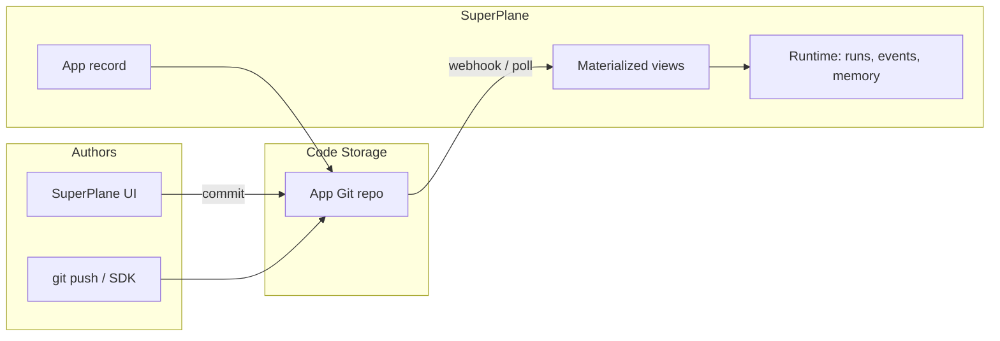

# SuperPlane App

## Overview

This PRD introduces **SuperPlane App** as the primary user-facing entity in SuperPlane. An App is a cohesive unit of platform engineering intent that combines three surfaces:

1. **Dashboard** — operational overview (panels, layout, markdown and future panel types)
2. **Canvas** — event-driven workflow (the existing directed graph of components)
3. **Documentation** — human-readable runbooks, ADRs, and context for the App

All three surfaces are **code-backed**: their declarative definitions live in a **dedicated Git repository** hosted on [Code Storage](https://code.storage/) (one repository per App). SuperPlane **materializes** repository content into its database and runtime so the UI stays fast and workflows keep executing with low latency.

**Decisions locked for v1:**

| Topic | Decision |
|-------|----------|
| Repository model | **One Code Storage repo per App** |
| Editing | **SuperPlane UI and `git push` / SDK** both supported |
| Merge conflicts | **Out of scope for v1** — no dedicated conflict UI |
| Authority on divergence | **Git wins** — SuperPlane overwrites materialized state from the repo |
| Navigation naming | User-facing **Apps** (replace Canvas list as the primary catalog) |
| MVP scope | **Dashboard, Canvas, and Documentation from day one** |
| Default App view | **Dashboard** tab when opening an App |
| Delete App | **Delete** the Code Storage repository (not orphan/archive) |
| Canvas versioning | **Both** DB draft/publish/change requests **and** Git history on `main` (and branches) |
| Docs editing | **Raw Markdown** editor in v1 (no WYSIWYG) |
| App identity | **Display name** (human) + **slug** `{org_slug}-{app_slug}` (unique for repo connection, e.g. `acmeorg-my_great_app`) |
| Create App | **Blank app** scaffold only in v1; "Start from template" deferred |
| CLI | **`superplane apps`** commands ship in **v1** |
| Canvas draft → Git | Each **editing session** uses a **tmp branch**; **draft save** commits `canvas/canvas.yaml` to that branch |

## Problem Statement

Today SuperPlane centers on **Canvas** as the top-level artifact:

- Workflow definitions live in PostgreSQL (`workflows` / versions), with optional YAML import/export.
- **Dashboard** is a recent overlay stored as JSON on `canvas_dashboards`, keyed by `canvas_id`.
- There is **no first-class documentation** surface tied to a workflow.
- Definitions are not uniformly versioned in Git; collaboration and review happen inside SuperPlane's DB-backed change management, separate from how platform teams already work with repositories.

Platform engineers expect **one place** that answers: *What does this system do? How do I operate it? How does automation run?* Those answers are split across canvas UI, ad-hoc markdown, and external wikis. SuperPlane App unifies them under a single entity with Git as the source of truth.

## Goals

1. Make **SuperPlane App** the primary catalog entity in the org (UI: **Apps**).
2. Provision **one Code Storage repository per App** at creation time.
3. Store **Dashboard**, **Canvas**, and **Documentation** definitions in that repository using a stable on-disk layout.
4. Support editing via **SuperPlane UI** (commits back to Git) and **external Git workflows** (`git clone`, push, Code Storage SDK).
5. On any sync, treat **Git as authoritative** — materialized DB state reflects the repo; Git wins over stale SuperPlane edits.
6. Ship all **three surfaces in the App shell from day one** (not a phased UI cutover).
7. Preserve existing **runtime** capabilities: executions, events, memory, secrets, integrations — keyed to the materialized canvas under the App.
8. Provide a **migration path** for existing canvases to become Apps without data loss.
9. Keep **DB canvas versioning** (draft, publish, change requests) while mirroring definitions to **Git**; inbound sync from Git remains authoritative.
10. Ship **CLI** support for Apps (`superplane apps …`) in v1.

## Non-Goals (v1)

- Merge conflict resolution UI or three-way merge.
- Bidirectional "DB wins" sync modes.
- Supporting multiple Git hosts as source of truth (Code Storage only for v1; GitHub sync via Code Storage may be used where available).
- Multiple canvases per App (v1: **exactly one canvas** per App; see Future).
- Public unauthenticated documentation sites.
- Replacing org-level secrets, integrations, or service accounts with repo-stored secrets (secrets stay in SuperPlane; repo may only reference them).
- AI-authored App scaffolding (may follow in a separate PRD).
- **Create App from template** in the UI (blank scaffold only in v1; template picker later).

## Primary Users

- **Platform engineers** — own App repos, review Git history, push from local clones.
- **SRE / on-call** — read Dashboard and Documentation during incidents.
- **Workflow builders** — edit Canvas in the existing graph UI, now scoped under an App.
- **Org admins** — configure Code Storage credentials, permissions, and App lifecycle.

## User Stories

1. As a platform engineer, I create an **App** and receive a Code Storage repo with starter Dashboard, Canvas, and docs.
2. As a builder, I open an App and switch between **Dashboard**, **Canvas**, and **Docs** without losing context.
3. As a builder, I edit the Canvas in SuperPlane and my changes are **committed to the App repo**.
4. As a builder, I `git clone` the App repo, edit files locally, push, and SuperPlane **updates automatically** (webhook-driven sync).
5. As an on-call engineer, I open an App's **Documentation** for runbooks and its **Dashboard** for status panels.
6. As an admin, I promote a legacy **canvas** to an **App** with a new repo containing exported YAML and dashboard JSON.
7. As a reviewer, I use **SuperPlane change requests** for in-product review and **Git history** on Code Storage for external audit; both apply to canvas changes per [Dual versioning](#dual-versioning-git--database).

## Conceptual Model



- **App** — org-scoped metadata + link to Code Storage repo + sync state.
- **Materialized views** — PostgreSQL projections used by API/UI (canvas version spec, dashboard panels, docs index/content cache).
- **Runtime** — unchanged execution model; still driven by materialized canvas graph and org integrations.

### Relationship to Canvas

Internally, a materialized **Canvas** row (`workflows` table) remains the runtime anchor for executions. Each App **owns exactly one** canvas in v1. The App is the user-facing identity; `canvas_id` is an implementation detail exposed only where needed (API compatibility, deep links during migration).

## Git Repository Layout

Each App has its own repository on Code Storage.

**Branches (v1):**

| Branch | Purpose |
|--------|---------|
| `main` | Live definitions; webhooks here **materialize** dashboard, docs, and **published** canvas into DB/runtime |
| `sp/edit/<session_id>` (tmp) | Per **editing session** on the Canvas tab; **draft save** commits `canvas/canvas.yaml` here |

Tmp branch naming is implementation-defined but must be stable for the lifetime of one editing session. Creating a new editing session creates (or checks out) a new tmp branch. **Publish** merges the session branch into `main` (or equivalent) and runs existing DB publish semantics, then materializes from `main`.

Default branch: **`main`**.

```
app.yaml                      # App metadata & schema version
canvas/
  canvas.yaml                 # Workflow spec (Kubernetes-style Canvas document)
dashboard/
  dashboard.yaml              # Panels + layout
docs/
  README.md                   # Landing doc (required in scaffold)
  ...                         # Additional .md / .mdx files
```

### `app.yaml`

```yaml
apiVersion: app.superplane.io/v1alpha1
kind: App
metadata:
  name: payments-platform
  description: Operational automation for payments services
spec:
  # Reserved for future: links, labels, owners
  {}
```

### `canvas/canvas.yaml`

Aligns with the existing export format (`apiVersion`, `kind: Canvas`, `metadata`, `spec.nodes`, `spec.edges`). SuperPlane already exports this shape from the workflow UI; the App repo stores the canonical file.

### `dashboard/dashboard.yaml`

```yaml
apiVersion: app.superplane.io/v1alpha1
kind: Dashboard
spec:
  panels:
    - id: welcome
      type: markdown
      content:
        title: Overview
        body: |
          # Payments platform
          Key links and status.
  layout:
    - i: welcome
      x: 0
      y: 0
      w: 12
      h: 6
```

Panel `type` and `content` match today's `DashboardPanel` model (`markdown` in v1; same extensibility as current dashboard feature).

### `docs/`

- **Format:** Markdown (`.md`) in v1; MDX optional later.
- **Rendering:** SuperPlane serves a docs reader in the App shell (sidebar nav from repo tree).
- **No secrets** in docs; use references to SuperPlane secret names where needed.

## Sync Semantics

### Source of truth

**Git (Code Storage repository) is the source of truth** for Dashboard, Canvas, and Documentation definitions.

### Sync triggers

1. **Webhook** from Code Storage on push to tracked branch (preferred).
2. **Manual sync** API/CLI (`apps sync`) for recovery and initial bootstrap.
3. **UI commit** — after a successful save in SuperPlane, the backend writes to the repo and then materializes from the same commit (treat as a push).

### Git wins

When SuperPlane materializes from a commit:

- Parse and validate all required paths.
- **Replace** materialized dashboard, canvas spec (new version or in-place per existing versioning rules), and docs index/content cache.
- Do **not** merge DB state with repo state on conflict.
- If the UI had unsaved local state older than the incoming commit, **discard** local draft in favor of Git (v1: acceptable; conflict UI deferred).

### Validation failure

If a commit fails validation (invalid YAML, schema errors, missing required files):

- **Do not** partially update runtime-critical canvas spec (atomic materialization per commit).
- Record `sync_status = failed` with error details on the App.
- Keep last known-good materialization for runtime (do not break live executions).

### Editing paths

| Path | Flow |
|------|------|
| UI dashboard/docs save | Validate → commit to `main` → materialize from commit SHA |
| UI canvas **draft save** | Validate → commit `canvas/canvas.yaml` to session **tmp branch** → update DB draft projection from that commit (does not change live runtime) |
| UI canvas **publish** | DB publish + merge tmp → `main` → materialize from `main` |
| External Git push to `main` | Webhook → materialize (Git wins on live surfaces) |
| External Git push to tmp branch | Optional: refresh in-session draft only; does not promote live |

Both **live** materialization paths converge on the same pipeline targeting `main`.

### Dual versioning (Git + database)

Canvas definitions use **two complementary versioning layers** in v1:

| Layer | Role | When it updates |
|-------|------|-----------------|
| **Git** (`canvas/canvas.yaml` on Code Storage) | Durable, auditable source of truth for the App repo; `main` for live, tmp branch per editing session for drafts | Draft save → tmp branch; publish / `main` sync → live materialization |
| **Database** (`workflow_versions`, drafts, publish, change requests) | In-product editing workflow, approvals, live vs draft execution boundaries | Existing canvas flows: draft edits, publish, change management |

**Rules:**

1. **Git wins on sync from `main`** — when `main` is materialized (webhook, manual sync, or post-publish commit), incoming `canvas/canvas.yaml`, dashboard, and docs **replace** the DB live projection. Unsaved UI state older than that commit is discarded (no merge UI in v1).
2. **Draft save → tmp branch** — each Canvas editing session has a tmp branch (`sp/edit/<session_id>`). **Draft save** writes `canvas/canvas.yaml` to that branch and updates the DB **draft** view from the commit; **live** runtime is unchanged.
3. **Publish** — existing DB publish/approval flow; on success, merge session tmp branch into `main`, commit if needed, materialize from `main`.
4. **Dashboard and docs** commit directly to `main` on save (no tmp branch in v1).
5. **Runtime** continues to use DB live version + execution semantics; only `main` materialization may change the live graph.

Product implication: users see familiar **Versions / change requests** in the Canvas tab **and** Git history on tmp + `main`; alignment is via draft save, publish, and inbound `main` sync—not bidirectional merge UI.

## SuperPlane Data Model (new / changed)

### App identity

- **`display_name`** — Human-readable label in the UI (not required to be globally unique).
- **`slug`** — Stable identifier `{org_slug}-{app_slug}`, unique across the installation (used for Code Storage repo name and org+app connection). Example: org slug `acmeorg`, user chooses app slug `my_great_app` → `acmeorg-my_great_app`.
- **`id`** — UUID primary key for APIs and routes (`/:organizationId/apps/:appId`).

Slug rules (v1): lowercase; `app_slug` segment uses `[a-z0-9_]` (user input normalized); org slug comes from organization settings. Collision on create returns a validation error.

### `apps`

| Column | Description |
|--------|-------------|
| `id` | UUID, primary key |
| `organization_id` | FK to organization |
| `display_name` | Human-readable name |
| `slug` | `{org_slug}-{app_slug}`, unique globally |
| `description` | Optional |
| `canvas_id` | FK to `workflows.id` (1:1 in v1) |
| `code_storage_repo_id` | Provider repo identifier (derived from `slug` or mapped 1:1) |
| `code_storage_remote_url` | Clone URL (for "Open in Git") |
| `default_branch` | `main` |
| `live_commit_sha` | Last successfully materialized commit on `main` |
| `edit_session_branch` | Current tmp branch for active canvas editing session (nullable) |
| `sync_status` | `ok`, `syncing`, `failed` |
| `sync_error` | Last error message (nullable) |
| `created_by`, `created_at`, `updated_at`, `deleted_at` | Standard |

### Deprecations / redirects

- **`canvas_dashboards`**: Populated only via materialization from `dashboard/dashboard.yaml` (no direct UI→DB-only persistence in App mode).
- **Canvas folders**: May group Apps in a follow-up; v1 Apps list replaces canvas home grid as primary entry.

### Code Storage connection (org-level)

- Encrypted credentials / API key on `organizations` or `integration`-style config table.
- Used to create repos, commit from UI, and register webhooks.

## API (sketch)

New gRPC service `Apps` (REST via existing gateway patterns):

| RPC | Description |
|-----|-------------|
| `ListApps` | Org-scoped catalog (replaces primary use of `ListCanvases` on home) |
| `DescribeApp` | Metadata + sync state + links |
| `CreateApp` | Create DB row, provision Code Storage repo, scaffold files, initial materialize |
| `DeleteApp` | Soft-delete App record; **delete** Code Storage repository via provider API |
| `SyncApp` | Pull `live_commit` from default branch and materialize |
| `GetAppDashboard` | Read materialized dashboard (same payload as today's canvas dashboard) |
| `UpdateAppDashboard` | Validate → commit `dashboard/dashboard.yaml` → materialize |
| `GetAppCanvas` | Proxy to existing canvas describe (by `canvas_id`) |
| `UpdateAppCanvas` | Validate → commit `canvas/canvas.yaml` → materialize (uses existing canvas version rules where applicable) |
| `ListAppDocs` | Tree of `docs/` |
| `GetAppDoc` | Single doc content by path |
| `UpdateAppDoc` | Commit file under `docs/` → materialize |

Authorization resource: **`apps`** with actions `read`, `create`, `update`, `delete`, `sync`. Map existing roles:

- Org owner/admin: full `apps:*`
- Builder: `apps:read`, `apps:update` (scoped)
- Viewer: `apps:read`

During migration, `canvases:*` scopes may alias to the same underlying App/canvas for one release.

### CLI (v1)

Extend the SuperPlane CLI with an `apps` command group, for example:

- `superplane apps list`
- `superplane apps describe <app>`
- `superplane apps create --display-name … --app-slug …` (blank scaffold)
- `superplane apps delete <app>`
- `superplane apps sync <app>` (pull `main` and materialize)

CLI uses the same APIs and org context as existing commands. Canvas subcommands may accept app slug or delegate via linked `canvas_id` during migration.

## UI / UX

### Navigation rename

- Org home **lists Apps** (not "Canvases").
- Primary route: `/:organizationId/apps/:appId`
- Sub-routes or query modes: `?view=dashboard` | `canvas` | `docs` — **default `dashboard`** when opening an App (`/:organizationId/apps/:appId` redirects or renders Dashboard first).
- Legacy URLs `/:organizationId/canvases/:canvasId` **redirect** to the parent App when `canvas_id` is linked (301/ client redirect).

### App shell

Shared chrome for every App:

- App name, description
- Tab bar: **Dashboard** | **Canvas** | **Docs**
- Sync indicator: last commit SHA (short), status (`Synced`, `Syncing`, `Failed`), link to Code Storage remote
- Actions: **Sync now** (admin/builder), **Clone repo** (copy URL)

### Dashboard tab

Reuse existing `DashboardView` / overlay components; persistence goes through App APIs that commit to Git.

### Canvas tab

Reuse existing `WorkflowPageV2` / `CanvasPage`; graph edits use **DB draft/publish/change requests** as today. **Draft save** commits to the session **tmp branch**; **publish** merges to `main` (see [Dual versioning](#dual-versioning-git--database)). Runs, memory, YAML viewer, and version UI remain. Git history is visible via sync indicator / "Open in Git."

### Docs tab

- Left: file tree from `docs/`
- Right: rendered Markdown preview; **raw Markdown** editor for users with `apps:update` (commit to `main` on save)
- Support relative links between docs in the same repo

### Create App flow

1. **Display name** + **app slug** (preview full slug `{org_slug}-{app_slug}`) + description
2. v1: **blank app only** — empty scaffold (dashboard, canvas, `docs/README.md`); no template picker
3. Backend creates Code Storage repo named from slug, pushes initial commit on `main`, materialize
4. Navigate to new App (lands on **Dashboard** tab)

"Start from template" is a **future** enhancement on this flow.

### Delete App flow

1. User confirms delete (destructive; name confirmation recommended).
2. Backend soft-deletes App (and associated canvas per org policy).
3. Backend calls Code Storage API to **delete the repository** for that App.
4. If repo deletion fails, surface error; App may remain in `delete_failed` state for admin retry (do not leave orphan repo without operator visibility).

### Migrate canvas flow

- Action on legacy canvas card: **Convert to App**
- Exports current live canvas YAML, dashboard JSON (if any), creates `docs/README.md` stub
- Creates App + repo; sets redirect from old canvas URL

## Runtime & Integrations

- **Executions, triggers, webhooks, memory** continue to use `canvas_id` and existing workers.
- Materialization updates the **live canvas spec** used for new runs; in-flight runs follow existing versioning semantics.
- **Secrets and integrations** remain org-scoped; canvas nodes reference them by ID/name as today.
- **Templates** (`is_template`): Either excluded from App catalog or shown as a separate "Templates" area; templates promoted to Apps are out of scope for v1 unless explicitly converted.

## Code Storage Integration

### Provisioning (CreateApp)

1. Call Code Storage API to create repository using App **`slug`** (already globally unique, e.g. `acmeorg-my_great_app`).
2. Push initial commit (scaffold tree).
3. Register webhook → SuperPlane endpoint `POST /api/v1/webhooks/code-storage` (exact path TBD).
4. Store `code_storage_repo_id` and `remote_url` on App.

### Webhook handler

1. Verify signature / auth.
2. Resolve App by repo id.
3. Fetch commit tree at branch tip (or payload SHA).
4. Run materialization pipeline (Git wins).

### UI commits

Use Code Storage SDK or Git HTTP API from the app container (service account), with commit message including user id and change summary.

## Materialization Pipeline

For commit SHA `C`:

1. Fetch files: `app.yaml`, `canvas/canvas.yaml`, `dashboard/dashboard.yaml`, `docs/**`.
2. Validate schemas and cross-references (e.g. panel layout ids match panel ids).
3. In a DB transaction:
   - Update App `live_commit_sha`, `sync_status`.
   - Upsert canvas spec via existing `workflow_versions` rules (draft vs live): Git materialization updates DB versions; **live** execution graph follows published/live DB state after sync (see [Dual versioning](#dual-versioning-git--database)).
   - Replace `canvas_dashboards` row for `canvas_id`.
   - Replace docs cache table(s) (`app_docs`: path, content, sha).
4. Emit audit log event: `app.materialized` with commit SHA.

On failure: rollback transaction, set `sync_status=failed`, retain previous materialization.

## Security & Compliance

- Code Storage credentials stored encrypted; never returned to clients.
- Docs and repo content inherit **org auth** — no public read in v1.
- Commit messages and webhook payloads logged for audit; no secret values in commits.
- Repo URLs may be shown to users with `apps:read`.
- Webhook endpoint authenticated (HMAC or mTLS per Code Storage docs).

## Migration Strategy

1. Ship Apps alongside existing canvases behind feature flag `apps` (org or global).
2. **Convert to App** for existing workflows; bulk migration tool optional for admins.
3. Home page switches to Apps when flag enabled.
4. After stabilization: deprecate standalone canvas creation without App (create always creates App + repo).
5. Redirect `canvases/:id` → `apps/:appId` for converted canvases.

Existing `canvas_dashboards` rows migrate into `dashboard/dashboard.yaml` on conversion.

## Feature Flags

| Flag | Purpose |
|------|---------|
| `apps` | Enable App catalog, shell, and Git-backed persistence |
| `dashboards` | Existing dashboard UI; required for App dashboard tab |

## Acceptance Criteria

1. User can create an App and receives a working Code Storage repository with scaffold files.
2. App shell exposes **Dashboard**, **Canvas**, and **Docs** tabs on day one.
3. Editing any surface from the UI results in a Git commit and updated materialized state.
4. Pushing to the App repo from outside SuperPlane triggers sync; **Git state is reflected in the UI** after sync.
5. If UI and Git diverge, the next successful sync from Git **overwrites** SuperPlane materialization without merge UI.
6. Org home lists **Apps** (when feature enabled); legacy canvas URLs redirect when mapped.
7. **Convert to App** preserves workflow graph and dashboard panels in the new repo.
8. Failed validation on a commit does not corrupt the last good runtime canvas.
9. Runtime: triggers and runs still work for materialized canvas under the App.
10. Authorization enforced on all new App RPCs.
11. Opening an App shows the **Dashboard** tab by default.
12. **Delete App** removes the Code Storage repository, not only the SuperPlane record.
13. Canvas tab supports **both** DB versioning (draft/publish/change requests) **and** Git-backed `canvas/canvas.yaml` with Git winning on inbound `main` sync.
14. **Draft save** commits canvas YAML to the session **tmp branch**, not `main`.
15. Docs use a **raw Markdown** editor; saves commit to `main`.
16. **Create App** offers blank scaffold only (no template picker in v1).
17. App **slug** `{org_slug}-{app_slug}` is unique; Code Storage repo uses that slug.
18. **`superplane apps`** CLI commands are available in v1.

## Risks and Mitigations

| Risk | Mitigation |
|------|------------|
| Sync latency makes UI feel sluggish | Optimistic UI with "Syncing…" badge; materialize async after commit; read from DB cache |
| Git wins discards in-flight UI edits | Show sync banner when external commit detected; refresh from server |
| Code Storage outage blocks saves | Queue commits or surface clear error; read-only mode from last materialization |
| Large docs repos slow sync | Limit docs size per commit in v1; tree fetch with size caps |
| Breaking existing API consumers | Keep canvas APIs during migration; Apps wrap `canvas_id` |
| DB vs Git drift on canvas | Draft on tmp branch, live on `main`; sync banner on external `main` push; Git wins on `main` sync |
| Stale tmp branches | GC policy for abandoned `sp/edit/*` branches (implementation) |
| Accidental repo delete | Confirm dialog; `apps:delete` restricted to admin/owner |

## Implementation Phases (engineering)

These are delivery order suggestions, not UI phasing (all three surfaces ship together for users).

1. **Foundation** — `apps` table, Code Storage client, org credentials, scaffold + `CreateApp`.
2. **Materialization** — Pipeline for canvas + dashboard + docs; webhooks; Git wins semantics.
3. **API** — Apps gRPC + authorization; wire dashboard/canvas/docs endpoints.
4. **UI** — App shell, home rename to Apps, create/migrate flows, redirects.
5. **Hardening** — E2E tests, failure modes, observability (`app_sync_*` metrics).
6. **CLI** — `superplane apps` command group.

## Open Questions

None for v1 scope. Follow-ups (post-v1): "Start from template" on create; tmp-branch garbage collection policy; optional MDX docs.

## References

- Existing canvas YAML export/import: `web_src/src/pages/workflowv2/index.tsx` (`getYamlExportPayload`), `ImportYamlDialog`.
- Dashboard model: `pkg/models/canvas_dashboard.go`, `protos/canvases.proto` (`CanvasDashboard`).
- Code Storage: https://code.storage/docs
- Related (non-blocking): canvas change management, `canvas_folders`, AI canvas builder PRD.

## Document History

| Date | Author | Notes |
|------|--------|-------|
| 2026-05-16 | — | Initial PRD; locked repo-per-app, Git wins, Apps rename, three surfaces day one |
| 2026-05-16 | — | Locked default Dashboard tab, delete repo on App delete, dual DB+Git canvas versioning |
| 2026-05-16 | — | Locked raw docs editor, app slug, blank create only, CLI v1, draft save → tmp branch |
