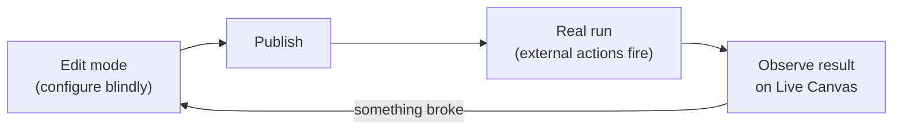
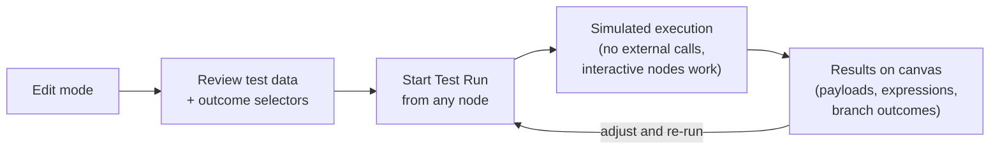
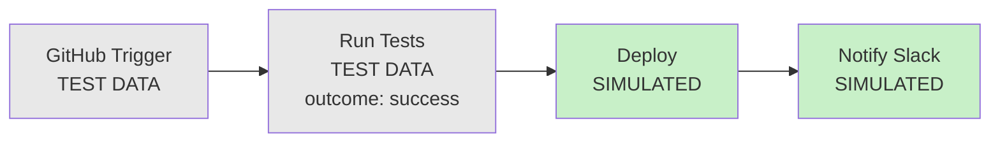
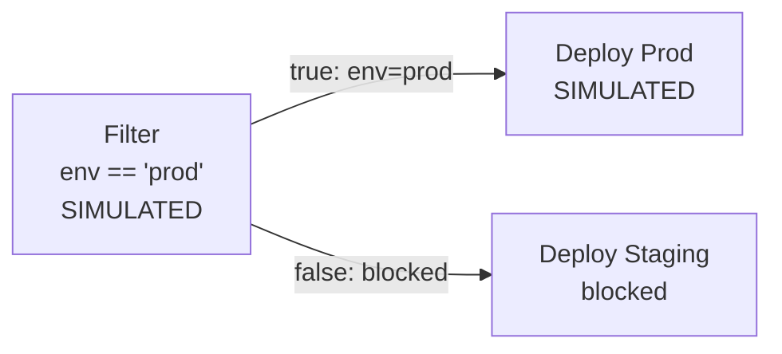

# Test Run in Edit Mode

## Overview

This PRD defines **Test Run**: a simulation mode in Canvas Edit mode that lets users validate workflow logic before publishing. Users start a test from any node in the graph; the system simulates execution downstream, evaluates expressions, follows all branches, and shows the results on the canvas. External APIs are not called, but interactive components like Approval, Wait, and Time Gate work for real so users can test human-in-the-loop flows.

Test Run closes the feedback loop between editing and publishing. Today, users configure components blindly in Edit mode and only find out if something is wrong after they publish and a real run fails.

**Terms**

| Term | Meaning |
|------|---------|
| **Test Run** | A simulated execution of the workflow triggered from Edit mode. External actions don't fire, but interactive components (approval, wait) work. |
| **Test Data** | Synthetic event payloads used as node inputs during a test run. Sourced from historical runs or example events, editable by the user. |
| **Outcome Selector** | Per-node control that lets the user choose how an integration/action node resolves: success, failure, or stopped. Defaults to the happy path. |
| **Starting Node** | The node the user picks as the entry point for a test run. Upstream nodes use test data; this node and downstream nodes are simulated. |
| **Simulated Output** | The payload a node emits during a test run. Expressions are evaluated for real; external calls are skipped. |

## Problem Statement

Edit mode is deliberately isolated from live execution. That isolation is good: users shouldn't be able to accidentally modify a running workflow. But it creates a bad feedback loop:

- Users configure components and wire up expressions without being able to see what the data actually looks like at each step.
- The only way to verify whether a workflow works is to publish it and trigger a real run, which may call external APIs, deploy to production, or provision cloud resources.
- When something breaks, the user has to go back to Edit mode, guess what went wrong, make changes, and publish again.
- New components or newly added branches have no historical data at all, so users have no reference point when configuring expressions or conditions.

This is especially painful for workflows that interact with expensive or irreversible external systems (GitHub Actions deploying to production, DigitalOcean provisioning resources, Semaphore running a test suite). You don't want to run those on every iteration.

## Goals

1. Let users simulate workflow execution from any node in Edit mode without publishing.
2. Use real historical event data where available; fall back to example events for new nodes. Let users edit test data and choose node outcomes before running.
3. Evaluate expressions for real against the synthetic message chain so users see actual computed values.
4. Follow all downstream branches and evaluate conditions (`if`, `filter`) against the test data.
5. Skip external API calls for action components but let interactive components (approval, wait, time gate) work for real so users can test those flows.
6. Show test results visually on the canvas: which nodes ran, what each node emitted, which paths were blocked.
7. Persist test run results for the duration of the edit session. Multiple test runs accumulate; the user can switch between them.

## Non-Goals

- Testing the external systems themselves (GitHub, Slack, Semaphore, etc.). Test Run only validates the workflow logic and expression wiring.
- Persisting test runs beyond the current edit session. Everything is discarded when the user exits Edit mode.
- Saving test data configurations across edit sessions or building a side-by-side test run comparison view.

## Visual Concepts

### The feedback loop problem today

Without Test Run, the only way to validate a workflow is to publish and observe a real run:

Every iteration costs a publish and risks triggering real external actions.

### Test Run in Edit mode

With Test Run, users get a fast inner loop entirely within Edit mode:

### Starting from any node

Upstream nodes use test data (frozen but with resolved expressions). The starting node and everything downstream is simulated:

If the user starts from node C, A and B use their test data with expressions resolved. Since B is an integration node, it has an outcome selector defaulting to "success". The user can switch it to "failure" before running to test the error path instead.

### Condition evaluation in test

Conditions evaluate for real against test data. The test shows which path was taken:

## Functional Requirements

### Test data and outcome selectors

- Each node in the canvas has **test data**: the simulated event payload it would emit.
- For nodes with historical runs, test data is loaded per outcome: the latest successful run output for the "success" state, the latest failed run output for the "failure" state. The happy path (success) is preselected.
- For nodes with no run history (new nodes, newly added branches), test data falls back to the component's built-in example output for each outcome.
- Test data is visible and editable in the node's configuration panel in Edit mode.
- If a node's configuration has changed since its last real run, show a warning that the historical test data may not reflect the current setup.
- **Outcome selector**: every integration/action node has an outcome control that defaults to the happy path (success). The user can switch it to failure or stopped before running.
- When historical data exists for multiple outcomes, the system uses the latest successful run output for "success" and the latest failed run output for "failure". When no historical data exists, it falls back to the component's example output for each outcome.
- The chosen outcome determines which output channel fires and what payload shape downstream nodes receive.

### Upstream nodes: partially simulated

Upstream nodes (above the starting node) are not fully simulated but they're not just raw data blobs either:

- **Expressions in their configuration resolve for real.** If a Slack message uses `$["GitHub Trigger"].data.branch`, the resolved payload shows the actual branch name from the test data. This lets users see what the message would contain.
- **External calls are skipped.** Nothing is actually sent or executed.
- **The output payload is controlled by the outcome selector.** The user picks success/failure/stopped, and the node emits the corresponding test data payload downstream.

This gives users a clear picture of "here's what this node would do" without actually doing it.

### Starting a Test Run

- The user picks a **starting node** by triggering the Test Run action on that node (exact UI placement tracked separately with design).
- All nodes upstream of the starting node are partially simulated as described above.
- The starting node and all nodes downstream are fully simulated in sequence.
- If the starting node is a trigger, the full workflow is simulated.
- The user can start a test from any node type: trigger, component, or custom component.

### Execution behavior

- **Condition components** (`if`, `filter`) evaluate for real against the synthetic message chain. The test follows whichever path the condition resolves to and marks the other path as blocked.
- **Action components** (GitHub, Slack, Semaphore, HTTP, etc.) do not call external APIs. They resolve expressions in their configuration (so you can see what would be sent) and emit the test data payload based on the outcome selector.
- **Expression fields** in component configuration are evaluated for real against the synthetic message chain. If an expression references `$["GitHub Trigger"].data.branch`, the simulated output contains the actual branch value from the test data, not a placeholder.
- **Custom component nodes** are not yet shipped. See Open Questions for how to handle them when they land.

### Interactive components

**Note:** interactive behavior for these components is nice to have. If it turns out to be too complicated, they can be simulated the same way as action components: skip the real behavior, let the user pick an outcome, and emit the corresponding test data.

These components work for real during a test run rather than auto-completing:

- **Approval**: enters the waiting-for-approval state. The user can approve or reject from the canvas to continue the simulation.
- **Wait**: enters the waiting state. The user can use "push through" to continue.
- **Time Gate**: enters the gated state. The user can push through to continue.

This lets users validate the human-in-the-loop parts of their workflow. The simulation pauses at these nodes and resumes when the user takes action. Since this is a simulation, permission constraints are ignored: if an approval requires users A, B, and C, the current user can approve on behalf of all of them.

### Memory

- `setData`, `getData`, and `clearData` work during simulation against a **temporary memory store** that's separate from live canvas memory.
- Simulation writes don't affect production data.
- The temporary memory persists across test runs within the same edit session, so users can test memory-dependent workflows across multiple iterations.
- The temporary memory is discarded when the user exits Edit mode.

### Expression evaluation

- Expressions are evaluated against a **synthetic message chain** built from test data.
- The message chain is constructed the same way as in real execution: upstream node outputs are keyed by node name and accessible via `$["Node Name"]`, `root()`, `previous()`, etc.
- If an expression can't be evaluated (e.g., it references a field that doesn't exist in the test data), the test surfaces a clear error on that node rather than silently producing a wrong value.

### Simulation session and history

- Test run results persist while the user is in Edit mode.
- Multiple test runs accumulate during the session. The canvas shows the latest test run's results by default.
- A simple list lets the user switch between previous test runs to review their results.
- All test runs and the temporary memory are discarded when the user exits Edit mode in any way (publish, discard, navigate away).

### Visual feedback

- Test runs should look and feel like real runs on the canvas, with the same node states, payloads, and inspection flows.
- The key difference is a clear visual distinction indicating that events are test events and runs are simulated, not real. Users should never confuse a test run with a live one.

### What does and doesn't run

| Component type | Test Run behavior |
|---|---|
| Trigger | Emits test data as its output; no webhook/polling fires |
| Action component (GitHub, Slack, HTTP, etc.) | Skips external call; resolves expressions; emits test data based on outcome selector |
| `if` | Evaluates condition against synthetic data for real; follows resolved path |
| `filter` | Evaluates condition against synthetic data for real; blocks path if false |
| `merge` | Auto-completes once all upstream branches deliver simulated input |
| `approval` | *(optional)* Enters waiting state for real; user approves or rejects. If too complex, works like action components: outcome selector + test data. |
| `wait` | *(optional)* Enters waiting state for real; user can push through. If too complex, works like action components. |
| `time gate` | *(optional)* Enters gated state for real; user can push through. If too complex, works like action components. |
| Memory (`setData`, `getData`, `clearData`) | Works against temporary memory store; isolated from live memory |
| Custom component | Not yet shipped; see Open Questions |

## Acceptance Criteria

1. A user in Edit mode can initiate a Test Run from any node.
2. Nodes upstream of the starting node are partially simulated: expressions resolved, external calls skipped, output determined by outcome selector.
3. The starting node and all downstream nodes execute in full simulation: expressions evaluated, conditions run, external calls skipped.
4. All downstream branches are followed, not just one path.
5. `if` and `filter` conditions evaluate against synthetic data and correctly route or block downstream nodes.
6. Simulated outputs contain real evaluated expression values, not raw expression strings.
7. Action components do not call external APIs during a test run.
8. Approval, Wait, and Time Gate components enter their real waiting state; the user can interact with them to continue the simulation.
9. Memory components work against an temporary memory store that's isolated from live data and discarded on exit.
10. After a test, each simulated node on the canvas shows its output payload.
11. Blocked paths are clearly marked as blocked with the reason visible.
12. Nodes with changed configuration since their last real run show a warning on their test data.
13. Users can edit test data and outcome selectors and re-run without leaving Edit mode.
14. Multiple test runs persist during the edit session; the user can switch between them.
15. All test data, results, and the temporary memory are discarded when the user exits Edit mode.

## Risks and Mitigations

| Risk | Mitigation |
|------|------------|
| Historical test data is stale or misleading | Warn when node configuration has changed since the last real run; let the user override with example data or manual edits. |
| Test gives false confidence that a workflow is correct | Make clear in the UI that Test Run validates logic and wiring, not the external systems themselves. |
| Condition evaluates differently on real data than on test data | This is expected. Test Run is for verifying expression syntax and path routing, not predicting real-world outcomes. |
| Users find test data management tedious when there are many nodes | Reasonable defaults (happy path, latest run data) mean users only need to edit when they want to test a specific scenario. |
| Interactive components pausing the simulation confuses users | Clear "waiting" state on the canvas with visible actions (approve, push through) so users know what to do. |
| Simulation memory doesn't match production memory state | Document that simulation memory starts empty each session. Users can pre-populate via `setData` nodes early in their test if needed. |

## Open Questions

1. **Custom components** are not shipped yet. When they land, Test Run will need a strategy for them. Options: (a) treat them as black boxes that emit test data without simulating the inner graph, (b) simulate the inner graph the same way we simulate the outer canvas, or (c) let the user choose per node. Option (a) is simplest to start with; option (b) is more useful but adds complexity.
2. **Test data persistence**: should test data edits (including outcome selector choices) persist across edit sessions (e.g., saved with the draft) or reset each time the user enters Edit mode?
## Follow-ups (post-v1)

- Save and name test data configurations so users can re-run common scenarios (e.g., "PR opened", "deployment failed").
- Test Run results integrated with the Run View so users can compare simulated vs real execution.
- Pre-populate temporary memory from live canvas memory as a starting point option.
