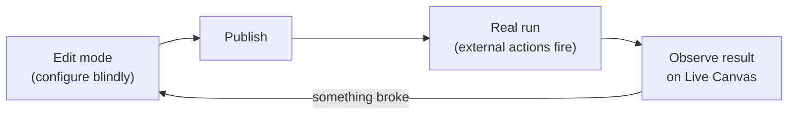
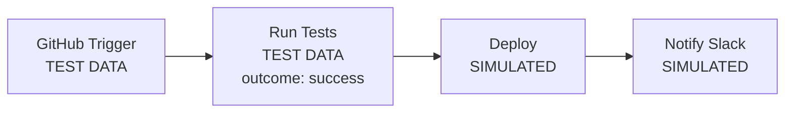
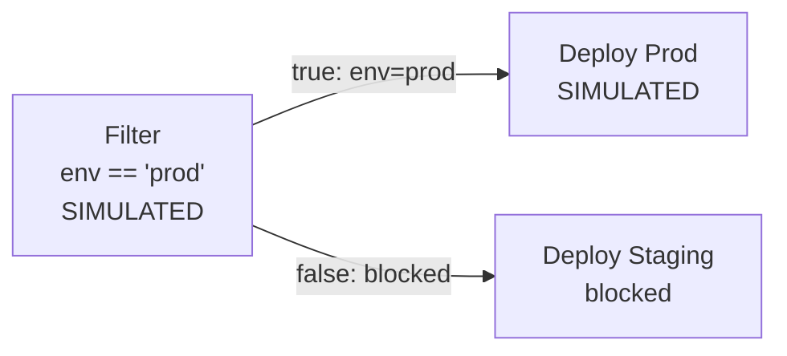

# Test Run in Edit Mode

> This is an RFD (Request for Discussion), not a spec. It's meant to frame the problem, explore the design space, and start the conversation. Once we agree on the direction and details, it'll be converted into a PRD.

**Test Run** is a simulation mode in Edit mode. You pick a node, hit run, and the system simulates execution downstream: evaluates expressions, follows branches, shows results on the canvas. External APIs are not called. You see what the workflow would do without actually doing it.

Today, the only way to find out if a workflow works is to publish it and trigger a real run. Test Run closes that feedback loop.

## Problem

Edit mode is isolated from live execution on purpose. You shouldn't be able to accidentally modify a running workflow. But that isolation creates a bad feedback loop:

You configure components and wire up expressions without seeing what the data actually looks like at each step. The only way to verify it works is to publish, which may call external APIs, deploy to production, or provision cloud resources. When something breaks you go back to Edit mode, guess what went wrong, and try again.

This is especially painful for workflows that talk to expensive or irreversible systems. GitHub Actions deploying to production, DigitalOcean provisioning resources, Semaphore running a test suite. You don't want to run those on every iteration.

New components or newly added branches are even worse. There's no historical data at all, so you have no reference point when writing expressions or conditions.

## How it should work

**Test data.** Every node has test data: the payload it would emit during a test. For nodes with historical runs, this comes from the latest real execution (success outcome preselected). For new nodes with no history, it falls back to the component's built-in example output. Test data is visible and editable in the node's config panel. If a node's configuration changed since its last real run, show a warning that the test data might be stale.

**Outcome selectors.** Every integration/action node has a control that lets you pick how it resolves: success, failure, or stopped. Defaults to the happy path. The chosen outcome determines which output channel fires and what payload shape downstream nodes receive.

**Starting a test.** You pick any node as the starting point. Everything upstream of that node uses test data with expressions resolved but no external calls. The starting node and everything downstream is fully simulated. If you start from a trigger, the whole workflow runs. You can start from any node type.

Start from Deploy: GitHub Trigger and Run Tests use their test data with expressions resolved. Run Tests has an outcome selector defaulting to success. Switch it to failure to test the error path.

**What actually runs.** Expressions evaluate for real against the synthetic message chain built from test data. Conditions (`if`, `filter`) evaluate for real and route or block downstream paths. Action components skip the external API call but resolve all expressions so you see what would be sent. Blocked paths show up as blocked with the reason visible.

**Memory.** `setData`, `getData`, and `clearData` work against a temporary memory store, separate from live canvas memory. Simulation writes don't affect production data. The temporary memory persists across test runs in the same edit session but is discarded when you leave Edit mode.

**Session.** Test run results persist while you're in Edit mode. Multiple test runs accumulate and you can switch between them. Everything is discarded when you exit Edit mode (publish, discard, navigate away). Test runs should look and feel like real runs on the canvas but with a clear visual distinction so you never confuse a test with a live execution.

## What does and doesn't run

| Component type | Test Run behavior |
|---|---|
| Trigger | Emits test data as its output; no webhook/polling fires |
| Action component (GitHub, Slack, HTTP, etc.) | Skips external call; resolves expressions; emits test data based on outcome selector |
| `if` | Evaluates condition against synthetic data for real; follows resolved path |
| `filter` | Evaluates condition against synthetic data for real; blocks path if false |
| `merge` | Auto-completes once all upstream branches deliver simulated input |
| `approval` | See open questions |
| `wait` | See open questions |
| `time gate` | See open questions |
| Memory (`setData`, `getData`, `clearData`) | Works against temporary memory store; isolated from live memory |
| Modules | See open questions |

## Not in scope

- Testing the external systems themselves. Test Run validates logic and expression wiring, not whether GitHub or Slack actually works.
- Persisting test runs beyond the edit session.
- Saving test data configurations across sessions.

## Open questions

**Interactive components.** Should approval, wait, and time gate work for real during a test (enter waiting state, let the user approve/push through on the canvas) or should they behave like action components (pick an outcome, emit test data)? Real interactive behavior lets you test human-in-the-loop flows. Simulated behavior is simpler to build. Could start with simulated and add real later.

**Modules.** When modules ship, should Test Run simulate the internal graph transparently or treat the module as a black box with an outcome selector?

**Test data persistence.** Should test data edits and outcome selector choices persist across edit sessions (saved with the draft) or reset each time you enter Edit mode?

**Expression errors.** If an expression references a field that doesn't exist in the test data, should the test surface a clear error on that node or skip the node? Clear error is more useful but might be noisy for partially configured workflows.

## Later

- Save and name test data configurations so you can re-run common scenarios ("PR opened", "deployment failed").
- Test Run results integrated with Run View to compare simulated vs real execution.
- Pre-populate temporary memory from live canvas memory as a starting point.
