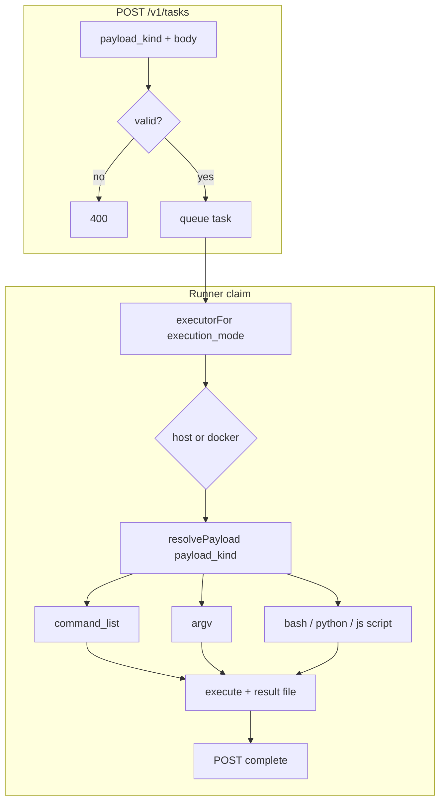

# Task payload kinds — design mock

> **Status:** draft for review — not implemented  
> **Goal:** name the current shell-directive path explicitly (`command_list`) and add first-class **script** payloads for Bash, Python, and JavaScript.

---

## Problem

Today a task carries *what to run* implicitly via field shape:

| Field | Meaning today |
|-------|----------------|
| `commands` | Shell directives — sourced line-by-line in Bash (PTY or pipe bundle) |
| `command` | Single argv subprocess (`command[0]` + args) |

And separately *where to run* via `execution_mode`:

| `execution_mode` | Meaning |
|------------------|---------|
| `host` | Run on the runner VM directly |
| `docker` | Run inside a one-shot container |

There is no explicit name for the `commands` shape, and no way to submit a multi-line **script body** (Bash / Python / JS) without splitting it into directive lines or wrapping it in shell quoting.

---

## Proposal: two orthogonal axes

```
┌─────────────────────────────────────────────────────────────┐
│  payload_kind  — WHAT to run (new)                          │
│    command_list | argv | bash_script | python_script |      │
│    javascript_script                                        │
├─────────────────────────────────────────────────────────────┤
│  execution_mode — WHERE to run (unchanged)                   │
│    host | docker                                            │
└─────────────────────────────────────────────────────────────┘
```

- **`payload_kind`** replaces implicit inference as the primary contract.
- **`execution_mode`** stays exactly as today (`host` / `docker`).

---

## API shape (mock)

### Shared create-task fields (unchanged)

```jsonc
{
  "fleet_id": "…",                    // broker only
  "webhook_url": "https://…",
  "execution_mode": "host",           // "host" | "docker"
  "docker_image": "node:22-bookworm", // required when execution_mode=docker
  "environment": [{ "name": "FOO", "value": "bar" }],
  "execution_timeout_seconds": 3600
}
```

### New field

| Field | Type | Description |
|-------|------|-------------|
| `payload_kind` | string | Required on new clients. See table below. |

### Payload bodies (exactly one body per kind)

| `payload_kind` | Body field(s) | Notes |
|----------------|---------------|-------|
| `command_list` | `commands: string[]` | Renamed conceptually; same JSON field as today |
| `argv` | `command: string[]` | Renamed conceptually; same JSON field as today |
| `bash_script` | `script: string` | Full script source; executed as a file |
| `python_script` | `script: string` | Full script source; executed as a file |
| `javascript_script` | `script: string` | Full script source; executed as a file |

Optional script overrides (all script kinds):

| Field | Type | Default |
|-------|------|---------|
| `interpreter` | string | see runner defaults below |

---

## Example payloads

### 1. Command list (today’s `commands`)

Sequential shell directives; fail-fast on first non-zero exit. Same Bash sourcing semantics as today.

```json
{
  "payload_kind": "command_list",
  "commands": [
    "echo \"branch=$GIT_BRANCH\"",
    "npm ci",
    "npm test"
  ],
  "webhook_url": "https://example.com/hook",
  "execution_mode": "host"
}
```

### 2. Argv (today’s `command`)

Single process, no shell unless the binary is a shell.

```json
{
  "payload_kind": "argv",
  "command": ["curl", "-fsS", "https://example.com/health"],
  "webhook_url": "https://example.com/hook",
  "execution_mode": "host"
}
```

### 3. Bash script

```json
{
  "payload_kind": "bash_script",
  "script": "#!/usr/bin/env bash\nset -euo pipefail\n\necho \"author=$COMMIT_AUTHOR\"\ncat \"$SUPERPLANE_RESULT_FILE\" <<'EOF' || true\n{\"status\":\"ok\"}\nEOF\n",
  "environment": [{ "name": "COMMIT_AUTHOR", "value": "alice@example.com" }],
  "webhook_url": "https://example.com/hook",
  "execution_mode": "host"
}
```

### 4. Python script

```json
{
  "payload_kind": "python_script",
  "script": "import json, os\n\nprint('hello from python')\n\nwith open(os.environ['SUPERPLANE_RESULT_FILE'], 'w') as f:\n    json.dump({'items': [1, 2, 3]}, f)\n",
  "webhook_url": "https://example.com/hook",
  "execution_mode": "host"
}
```

### 5. JavaScript script

```json
{
  "payload_kind": "javascript_script",
  "script": "const fs = require('fs');\n\nconsole.log('hello from node');\n\nfs.writeFileSync(\n  process.env.SUPERPLANE_RESULT_FILE,\n  JSON.stringify({ ok: true })\n);\n",
  "webhook_url": "https://example.com/hook",
  "execution_mode": "docker",
  "docker_image": "node:22-bookworm"
}
```

---

## Runner behavior (mock)

All kinds share:

- Task-scoped `environment` injected into the process
- `SUPERPLANE_RESULT_FILE` for structured JSON result (host path or `/mnt/superplane-result.json` in docker)
- Live log streaming + output cap (`MaxOutputBytes`)
- Cancel + execution timeout (unchanged)

### Per-kind execution

| Kind | Host | Docker |
|------|------|--------|
| `command_list` | **unchanged** — `runHostShellDirectives` | **unchanged** — bundled `sh -c` script |
| `argv` | **unchanged** — `exec.Command(command[0], …)` | **unchanged** — `docker exec … command…` |
| `bash_script` | Write `$WORKDIR/.superplane/script.sh`, `chmod +x`, run `bash script.sh` | Write to bind-mounted workdir, `docker exec … bash /work/script.sh` |
| `python_script` | Write `script.py`, run `python3 script.py` (or `interpreter`) | Same inside container — image must include Python |
| `javascript_script` | Write `script.mjs`, run `node script.mjs` (or `interpreter`) | Same — image must include Node |

Default interpreters (host fleet AMI assumptions):

| Kind | Default `interpreter` |
|------|------------------------|
| `bash_script` | `/bin/bash` |
| `python_script` | `python3` |
| `javascript_script` | `node` |

Script files land under the task work directory (host: `TaskWorkDir`; docker: container workdir mount). Filename is runner-internal (`script.sh`, `script.py`, `script.mjs`) — not part of the API.

### Sketch: payload router in the runner

```go
// mock — not wired yet
func resolvePayload(task *api.TaskPayload) (payloadKind, error) {
    kind := models.PayloadKind(strings.ToLower(strings.TrimSpace(task.PayloadKind)))
    if kind == "" {
        kind = inferPayloadKind(task) // backwards compat
    }
    switch kind {
    case models.PayloadCommandList:
        return runCommandList(ctx, task)
    case models.PayloadArgv:
        return runArgv(ctx, task)
    case models.PayloadBashScript, models.PayloadPythonScript, models.PayloadJavaScriptScript:
        return runScript(ctx, task, kind)
    default:
        return error("unknown payload_kind")
    }
}
```

`HostExecutor` / `DockerExecutor` would call `resolvePayload` instead of the current `len(task.Commands) > 0` branch.

---

## Broker validation (mock)

```go
func validateCreateTaskPayload(req *api.CreateTaskRequest) string {
    kind := normalizePayloadKind(req)

    switch kind {
    case PayloadCommandList:
        if empty(req.Commands) { return "commands required for payload_kind command_list" }
        if set(req.Command) || set(req.Script) { return "only commands allowed" }
    case PayloadArgv:
        if empty(req.Command) { return "command required for payload_kind argv" }
        if set(req.Commands) || set(req.Script) { return "only command allowed" }
    case PayloadBashScript, PayloadPythonScript, PayloadJavaScriptScript:
        if strings.TrimSpace(req.Script) == "" { return "script required" }
        if set(req.Command) || set(req.Commands) { return "only script allowed" }
    default:
        return "invalid payload_kind"
    }

    // execution_mode / docker_image / env / timeout — unchanged
}
```

---

## Persistence (mock)

Add one column to broker tasks:

| Column | Type | Notes |
|--------|------|-------|
| `payload_kind` | `text NOT NULL DEFAULT 'command_list'` | or inferred default at read time |
| `script` | `text` | nullable; set for script kinds |

Existing rows:

- `commands_json` non-empty → `payload_kind = command_list`
- else `command_json` non-empty (and not `[]`) → `payload_kind = argv`
- else error (should not happen)

`command` / `commands` JSON columns stay for backwards compatibility during migration.

---

## Go types (mock)

```go
// shared/models/task.go (proposed additions)

type PayloadKind string

const (
    PayloadCommandList       PayloadKind = "command_list"
    PayloadArgv              PayloadKind = "argv"
    PayloadBashScript        PayloadKind = "bash_script"
    PayloadPythonScript      PayloadKind = "python_script"
    PayloadJavaScriptScript  PayloadKind = "javascript_script"
)

type Task struct {
    // … existing fields …
    PayloadKind PayloadKind
    Script      string // set when kind is *_script
    Interpreter string // optional override
}
```

```go
// shared/api/types.go (proposed additions)

type CreateTaskRequest struct {
    PayloadKind string `json:"payload_kind,omitempty"`
    Script      string `json:"script,omitempty"`
    Interpreter string `json:"interpreter,omitempty"`
    // Command, Commands, … unchanged
}
```

---

## Backwards compatibility

| Client | Behavior |
|--------|----------|
| Old (no `payload_kind`) | Broker + runner **infer** kind from fields: `commands` → `command_list`, `command` → `argv` |
| New (explicit `payload_kind`) | Must match body fields; validation errors on mismatch |
| SuperPlane canvas | Can migrate component-by-component to script kinds |

Deprecation path (optional, later):

1. Document `commands` as alias for `payload_kind: command_list`
2. Log warning when `payload_kind` omitted
3. Eventually require `payload_kind` on create (major version)

---

## Flow diagram



---

## Open questions for review

1. **Naming:** `payload_kind` vs `task_kind` vs `run_as` — preference?
2. **`argv` vs `command`:** keep JSON field `command` but kind name `argv`, or rename kind to `command`?
3. **Script module type:** always CommonJS for JS on host, or support `javascript_module` / `.mjs` via `interpreter: "node --experimental-vm-modules"`?
4. **Shebang:** honor `#!/usr/bin/env python3` in `script` when present, or always use default interpreter?
5. **Docker defaults:** should broker reject `python_script` + `docker` when image lacks Python, or let runtime fail with a clear error?
6. **Multi-file scripts:** out of scope for v1? (single `script` string only)
7. **Command list rename in JSON:** keep field name `commands` (recommended) or rename to `command_list` array?

---

## Suggested implementation order (when approved)

1. Types + inference + validation in `shared/` and task-broker (no runner change yet)
2. DB migration + store mapping
3. `runScript` in host executor + tests
4. Docker script path + tests
5. README / API docs + SuperPlane component integration

---

## Quick comparison

| | Command list | Bash script |
|---|--------------|-------------|
| Input | Array of shell lines | One multiline string |
| Semantics | Source each line in shared shell state | Run as single file |
| Best for | CI steps, env between lines | Full programs, heredocs, functions |
| Today | ✅ `commands` | ❌ workaround via `echo '…' > file` directives |
