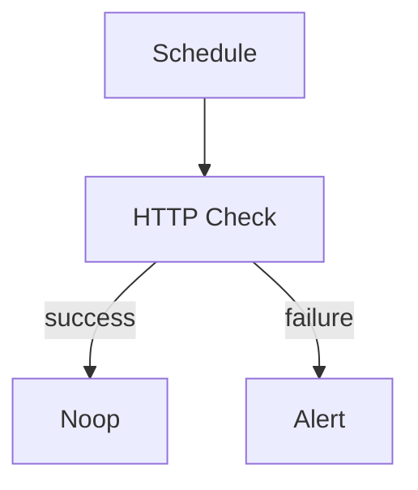

# Rich UI Widgets

Output these blocks in your chat messages. The frontend renders them as interactive widgets. Always prefer widgets over plain text when presenting choices, structured data, or interactive content.

## Buttons (single-choice)

**When to use:** Asking the user to pick between 3 or fewer options. No free-text input needed.

```
:::buttons
Which option?
- Option A
- Option B
- Option C
:::
```
No `[input]` fields. Clickable only.

## Survey (multi-question form)

**When to use:** Gathering answers to multiple questions at once, or when one option should be free-text input. Use instead of buttons when there are more than 3 options.

```
:::survey
First question?
- Option A
- Option B
- [input]

Second question?
- Option X
- Option Y
:::
```
`[input]` adds a free-text field.

## Rubric (build plan / spec)

**When to use:** Presenting a build plan or implementation spec before building. The widget has a "Start Building" button the user clicks to approve.

```
:::rubric Plan Title
## Category Name
- Criterion 1 (specific, verifiable)
- Criterion 2

## Another Category
- Criterion 3
:::
```
Categories with `##` headings. Criteria should be functional requirements, not implementation details.

## Staging Actions

**When to use:** After successfully staging canvas, console, or repository file edits. Renders Commit/Discard/See changes buttons. Print in the chat response, not as a file.

```
:::staging-actions
canvasId: <session-canvas-id>
message: Staging ready — added health check nodes
:::
```

`canvasId` must match the current session canvas ID from the preamble.
## Chart

**When to use:** Showing run history, metrics, analytics, or any numerical data the user asks about.

```
:::chart
type: bar
title: Run Success Rate
x: [Mon, Tue, Wed]
series:
  - name: Success
    data: [12, 15, 10]
    color: "#22c55e"
:::
```
Types: `bar`, `line`, `area`, `pie`.

## Collapse

**When to use:** Any output longer than 20 lines — YAML, logs, tool output, large JSON.

```
:::collapse title="Canvas YAML"
(long content here)
:::
```

## Success / Error Banners

**When to use:** Showing final operation outcomes — build succeeded, deploy failed, etc.

```
:::success
Canvas published successfully. 10 nodes, 9 edges, zero errors.
:::
```

```
:::error
Build failed: missing required field `url` on http node.
:::
```

## Confirm

**When to use:** Before destructive operations — deleting nodes, discarding drafts, resetting canvas.

```
:::confirm
message: This will delete all nodes. Are you sure?
yes: Delete everything
no: Cancel
:::
```

## Steps

**When to use:** Showing progress through a multi-step operation.

```
:::steps
- [x] Read canvas state
- [x] Check integrations
- [ ] Write YAML
- [ ] Deploy draft
:::
```

## Mermaid Diagrams

**When to use:** Visualizing canvas topology, workflow flows, or any process the user needs to understand before approving.

````

````

## Inline Chips

**When to use:** Referencing specific canvas nodes, runs, or integrations in your messages. Chips are clickable — nodes zoom the canvas, integrations open the config dialog.

| Type | Syntax | Example |
|------|--------|---------|
| Node | `[Name](node:id)` | `[Deploy](node:deploy-ssh)` |
| Run | `[Name](run:uuid~status)` | `[Build #1](run:abc~passed)` |
| Integration | `[Name](integration:uuid)` | `[dash0](integration:791ee...)` |
| Integration (new) | `[Name](integration:vendor)` | `[GitHub](integration:github)` |

Integration chips show vendor icon + connection state. Click opens configure/connect modal.
