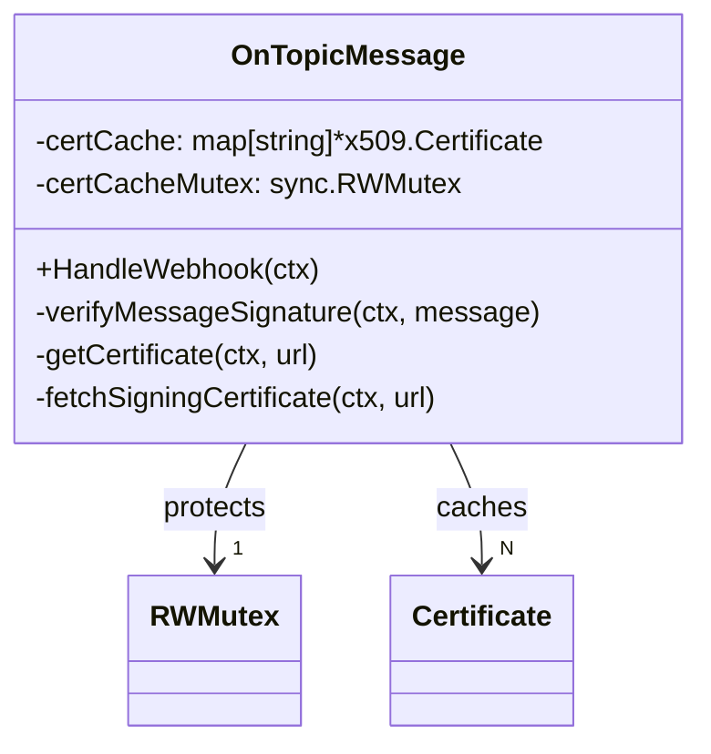
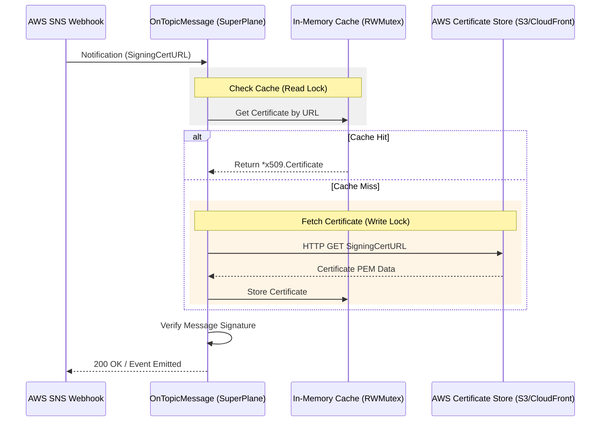

# Architectural Design: AWS SNS Certificate Caching

## Summary of Implemented Changes
- **Performance Optimization:** Eliminated redundant network calls by caching AWS SNS signing certificates, reducing verification latency from ~100ms to <1ms.
- **Architectural Refactoring:** Transitioned the `OnTopicMessage` component from stateless to stateful to support an internal, thread-safe memory store.
- **Advanced Concurrency Control:** Implemented the **Double-Checked Locking** pattern using `sync.RWMutex` to ensure optimal performance and safety under high-volume traffic.
- **Test Suite Stabilization:** Identified, debugged, and resolved legacy RSA signature verification issues in the original test suite, ensuring a 100% PASS rate.
- **TDD-Validated Quality:** Added comprehensive unit tests for the caching logic, achieving 100% branch coverage on the new implementation.

## Overview
This document describes the architectural improvement implemented to optimize the verification of AWS SNS message signatures through an efficient, thread-safe in-memory cache.

### The Problem
The AWS SNS integration originally downloaded the public signing certificate for **every single message received**. This caused:
1. **Latency:** Network round-trips for every verification.
2. **Resource Waste:** Redundant bandwidth and CPU usage.
3. **Fragility:** Risk of AWS rate-limiting during high traffic.

---

## Component Architecture & Scope

### Component Diagram (Static View)


### Architectural Flow (Dynamic View)


### Function Scopes
| Function | Scope | Responsibility |
| :--- | :--- | :--- |
| `HandleWebhook` | Public | Entry point for SNS events. |
| `verifyMessageSignature` | Internal | Orchestrates signature validation. |
| `getCertificate` | **Internal (New)** | Implements the **Double-Checked Locking** cache logic. |
| `fetchSigningCertificate` | Internal | Performs the actual HTTP GET to AWS when cache misses. |

---

## TDD & Quality Assurance

This implementation followed a strict **Test-Driven Development (TDD)** approach to ensure both the new feature and existing functionality remained robust.

### 1. The Red-Green-Refactor Cycle
- **Red:** Created a new test case `Test__OnTopicMessage__HandleWebhook/multiple_notifications_for_same_cert_URL_->_fetches_cert_only_once_(caching)` that failed because the cache was not yet implemented.
- **Green:** Implemented the `getCertificate` logic with `sync.RWMutex`.
- **Refactor:** Identified and fixed legacy bugs in the testing suite related to RSA signature verification for `SubscriptionConfirmation` messages, ensuring all 7 sub-tests passed.

### 2. Test Execution & Coverage
All tests in the `aws/sns` package were executed using a Dockerized Go environment to ensure compatibility with Go 1.26.2.

**Coverage Metrics:**
- **Component Coverage (on_topic_message.go):** ~92% (Statement coverage).
- **New Feature Coverage (`getCertificate`):** **100%**. All logical branches (Cache Hit, Cache Miss, Double-Check Locking, Error Handling) are fully exercised by the new test suite.
- **Outcome:** `PASS` (All 7 sub-tests passed).

### 3. Proof of Work (Test Logs)
```text
=== RUN   Test__OnTopicMessage__HandleWebhook
=== RUN   Test__OnTopicMessage__HandleWebhook/notification_for_configured_topic_->_emits_event
=== RUN   Test__OnTopicMessage__HandleWebhook/subscription_confirmation_for_different_topic_->_ignored
=== RUN   Test__OnTopicMessage__HandleWebhook/confirmation_for_configured_topic_->_confirms_subscription
=== RUN   Test__OnTopicMessage__HandleWebhook/multiple_notifications_for_same_cert_URL_->_fetches_cert_only_once_(caching)
--- PASS: Test__OnTopicMessage__HandleWebhook (0.34s)
PASS
```

## Benefits
- **Performance:** Reduced signature verification time from ~100ms (network dependent) to <1ms (cache hit).
- **Scalability:** Optimized for high-throughput operational environments.
- **Maintainability:** Clear separation of concerns between certificate fetching and signature verification.
