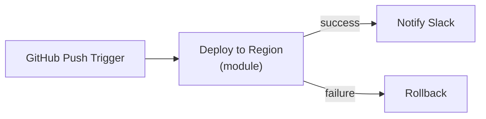
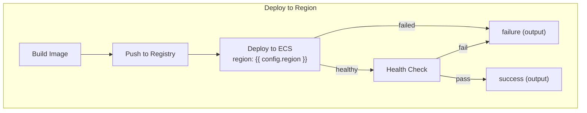
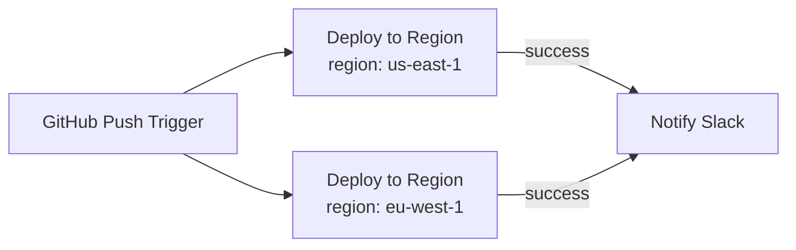

# Modules

> This is an RFD (Request for Discussion), not a spec. It's meant to frame the problem, explore the design space, and start the conversation. Once we agree on the direction and details, it'll be converted into a PRD.

Canvases need a way to take a chunk of circuitry, say five components that together form a "run tests and gate on coverage" step, and collapse it behind a single node you can name, configure, reuse, and not think about every time you look at the canvas.

We've been calling this "blueprints" in the backend, "bundles" in the UI, and "custom components" in code. None of those names stuck. We're using **module** as a working title in this doc. The final name is TBD. We built a POC that proves the mechanics work. This doc is about turning that into a real feature.

## Why

**Grouping.** Large canvases get noisy. You end up with a pile of components and edges and you lose track of what the workflow actually does. We need a way to take a section of the canvas, collapse it into one thing with a name, and reduce the abstraction so the canvas reads like an outline instead of a circuit diagram.

**Queues.** Right now every component has its own queue. If you have five components in a row and a new run comes in, it can start on component 1 while the previous run is still on component 3. Sometimes that's fine, but sometimes those five components are a unit and you don't want anything new entering the group until the current run finishes the whole sequence. A module gives the group one queue: item goes in, all five components run to completion, then the next item enters.

**Reusability.** People build the same logic across canvases. "Run tests and gate on coverage", "notify and wait for approval", that kind of thing. Today you rebuild it every time. If there's a bug you fix it in every copy. We need a way to build it once and use it everywhere.

## What we have today

There's a POC behind a feature flag (called "blueprints" / "custom components" internally). It's not published and nobody is using it. The core mechanics work: you can build a mini-canvas with config fields and output channels, drop it into a canvas, and the system expands and executes the internal graph. But there's no way to see inside it during a run, no update tracking, the editor is a disconnected page, and we haven't figured out the UI for how these appear and behave on the canvas.

## How others do it

| | **SuperPlane** | **n8n** | **Temporal** | **Windmill** |
|---|---|---|---|---|
| **Model** | Inline sub-graph, part of the canvas | Standalone workflow called by reference | Separate workflow execution | Flow step referencing another flow by path |
| **Outputs** | Explicit named channels | Implicit (last node's output) | Explicit (typed return value) | Last step's result |
| **Execution** | Same run, own queue | Separate execution, separate memory | Separate execution, separate event history | Separate job per step |
| **Nesting** | Not yet | Yes | Yes | Yes |

Everyone else treats sub-workflows as separate entities you call by reference. Our approach is different: the module lives inside the canvas and runs as part of the same execution, but with its own queue so it behaves as a single step. Tighter integration, simpler mental model, but we have to build the inspection and debugging story ourselves instead of getting it for free from separate execution views.

## What a module looks like on a canvas

One node. Config fields you fill in, output channels you wire up:

Open it up and you see the guts:

`success` and `failure` are the output channels. The `region` config field is used inside by the ECS and health check components via `{{ config.region }}`.

Same module used twice in one canvas, different config each time:

Fix "Deploy to Region" once, both instances benefit.

## How it should work

**Building one.** The Module Editor is a canvas editor scoped to the module's internals. You wire up components, define config fields (typed, with defaults), and map output channels to specific internal component outputs. A module has a name (unique per org), description, icon, color.

**Using one.** Modules show up in the building blocks sidebar under a "Modules" section. Drop one on a canvas and you get a node. Fill in config, wire the outputs. There's a visual cue that it's a module, not a regular component.

**Execution.** The module node has its own queue. Item arrives, the internal graph runs start to finish, then output channels emit downstream. If something inside fails, the module fails and tells you what broke. The parent canvas sees one step.

**Debugging.** You can drill into a module node during a run to see which internal components ran, what they emitted, where it went wrong. In Run View it expands with per-component data scoped to that run.

**Staying current.** You can see which canvases use a module. Canvases can tell when a module they depend on has changed. Breaking changes (removed field, renamed channel) get surfaced. The exact mechanism is an open question (see below).

## MLP: canvas-level grouping

The full vision is org-level reusable modules with config fields, output channels, version tracking, and a dedicated editor. But we don't need all of that to solve the core problems. The smallest thing that delivers grouping and queues is canvas-level grouping.

**The idea.** You select a set of components on a canvas, group them, give the group a name. The selected components collapse into a single node. The group has its own queue: items go in, all internal components run to completion, then output flows downstream. You can expand the group to see and edit the internals. That's it.

**Why start here.** Grouping and queues are the two problems people hit first. Reusability matters but it's a second-order problem. You don't need a separate editor, a module library, config fields, or output channel mappings to get value from "these five things are one thing now." Starting with canvas-level grouping means:

- No new entity type to manage. The group is part of the canvas, saved with the canvas, versioned with the canvas.
- No interface design upfront. The inputs and outputs are whatever edges already connect the selected nodes to the rest of the canvas. The system figures out entry and exit points from the existing wiring.
- The queue behavior is the real product value and it works the same regardless of whether the group is canvas-level or org-level.

**What you can do.**

- Select components on the canvas, group them, give the group a name.
- Optionally define config fields on the group. Internal components can reference them via expressions. Useful when the same group appears multiple times on a canvas with different settings (like deploying to different regions).
- The group collapses into a single node. Edges that crossed the group boundary become the node's inputs and outputs.
- Expand the group to see the internals, edit components, rewire things.
- The group has its own queue. One item at a time runs through the entire internal graph before the next item enters.
- When something inside fails, the group node fails and tells you which internal component broke.

**What you can't do yet.**

- Reuse a group across canvases. It lives on this canvas only.
- Nest groups inside groups.

**Graduation path.** Canvas-level grouping extends to org-level modules. "Extract this group into a reusable module" takes the internal graph and config fields and creates a standalone entity you can drop into any canvas. The execution model (own queue, parent-child executions, output aggregation) stays the same.

## Open questions

**Naming.** Blueprint, bundle, custom component, none of these worked. "Module" is the working title. Other candidates: circuit, block, routine, group. For the MLP it might just be "group" since that's what it is.

**Selection constraints.** Can a group have multiple entry points? Multiple exit points? Allowing only single-in single-out is simpler but restrictive. A canvas section that fans out or merges is common.

**Memory.** Does a group share the canvas memory or get its own scope? Sharing is simpler and probably fine for the MLP since the group is part of the canvas. Scoping becomes a real question when groups become reusable modules.

**Expand/collapse UX.** How do you view and edit the internals? Inline expand on the canvas (like opening a folder) or a separate view? Inline keeps context but gets crowded. Separate view is cleaner but disconnected.

**What happens to existing edges and expressions.** When you group nodes, edges that used to connect internal nodes to external nodes now cross the group boundary. Do expressions inside the group that reference nodes outside it keep working? They should, since the group is still part of the same canvas, but this needs to be airtight.
