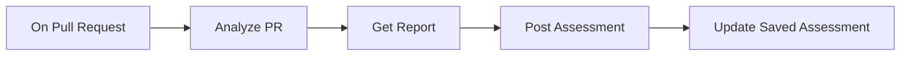

# Markdown renderer showcase

This README is a Storybook fixture for the **Files** tab. It exercises every
feature currently supported by `MarkdownContent` (Console markdown panels and
Files `.md` preview share the same renderer).

> Agent-only widgets (`:::chart`, `:::buttons`, `run:` chips, etc.) are **not**
> rendered here yet — those are the next feature.

---

## Headings

### Heading level 3

#### Heading level 4

## Inline formatting

**Bold**, *italic*, ***bold italic***, ~~strikethrough~~, and `inline code`.

Soft line breaks are enabled (remark-breaks), so a single newline
becomes a `<br>` in the rendered output.

## Links

- External: [SuperPlane docs](https://docs.superplane.com)
- Relative: [local docs](../docs "Local docs title")
- Node chip (canvas context required): [Analyze PR](node:analyze-pr) · [On Pull Request](node:on-pull-request) · [Post Assessment](node:post-assessment)
- Integration chip: [GitHub](integration:github) · [Cursor](integration:cursor)

## Lists

Unordered:

- First item
- Second item
  - Nested item
- Third item

Ordered:

1. One
2. Two
3. Three

Task list (GFM):

- [x] Supported today
- [x] Integration chips
- [x] GitHub alerts
- [ ] Agent widgets (charts, run chips, …)
- [ ] Interactive confirm / survey blocks

## Blockquote

> Use markdown panels for runbooks, status notes, and lightweight docs.
> Nested quotes and **formatting** work inside blockquotes.

## GitHub alerts

> [!NOTE]
> Useful information when skimming a runbook.

> [!TIP]
> Prefer `node:` chips when linking to canvas steps.

> [!IMPORTANT]
> Console interpolates `{{ variables }}` before markdown renders.

> [!WARNING]
> Urgent info that needs attention before the next deploy.

> [!CAUTION]
> Destructive actions in table row triggers cannot be undone.

## Table

| Feature        | Console | Files | Agent chat |
| -------------- | ------- | ----- | ---------- |
| GFM markdown   | yes     | yes   | yes        |
| Mermaid        | yes     | yes   | yes        |
| `node:` chips  | yes     | yes   | yes        |
| `integration:` | yes     | yes   | yes        |
| GitHub alerts  | yes     | yes   | no         |
| `:::chart`     | no      | no    | yes        |
| `run:` chips   | no      | no    | yes        |

## Code blocks

Labeled fence (Monaco widget):

```yaml
apiVersion: v1
kind: Canvas
metadata:
  name: Clean Code Assessment
```

Unlabeled fence (plain `<pre><code>`):

```
raw output line 1
raw output line 2
```

Inline: call `upsertMemory` with namespace `prScores`.

## Mermaid diagram



## Collapsible details

<details>
<summary>How scoring works</summary>

The agent checks out the PR, runs metric tooling, and posts a single
self-updating comment with a 0–100 Clean Code score.

You can nest markdown inside details:

- Coverage
- Complexity
- Module size

</details>

<details open>
<summary>Open by default</summary>

This section uses `<details open>` so it starts expanded.

</details>

## Horizontal rule

Above the rule.

---

Below the rule.

## Escaped / edge cases

HTML that should be stripped for safety (script tags must not run):

<script>window.__shouldNotRun = true</script>

Anchors keep their `href` but lose event handlers:

<a href="#safe" onclick="alert('nope')">Safe link text</a>
