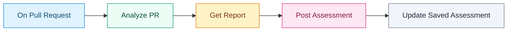
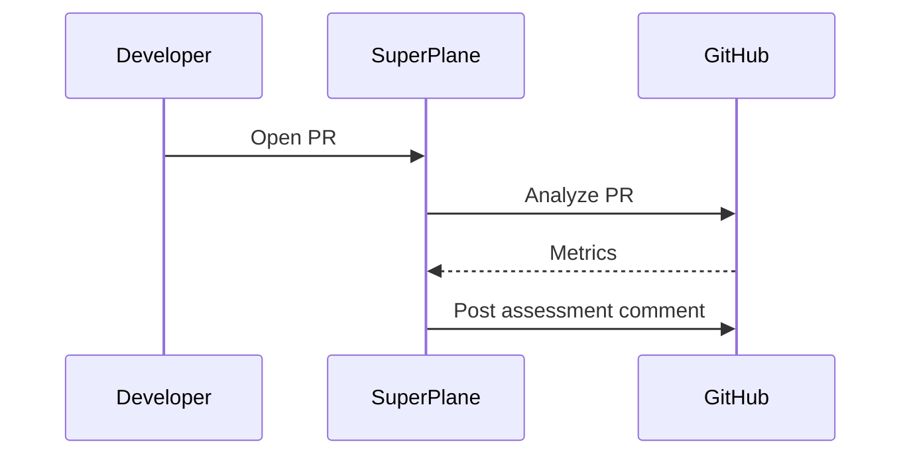
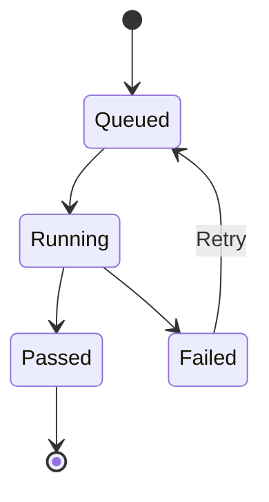
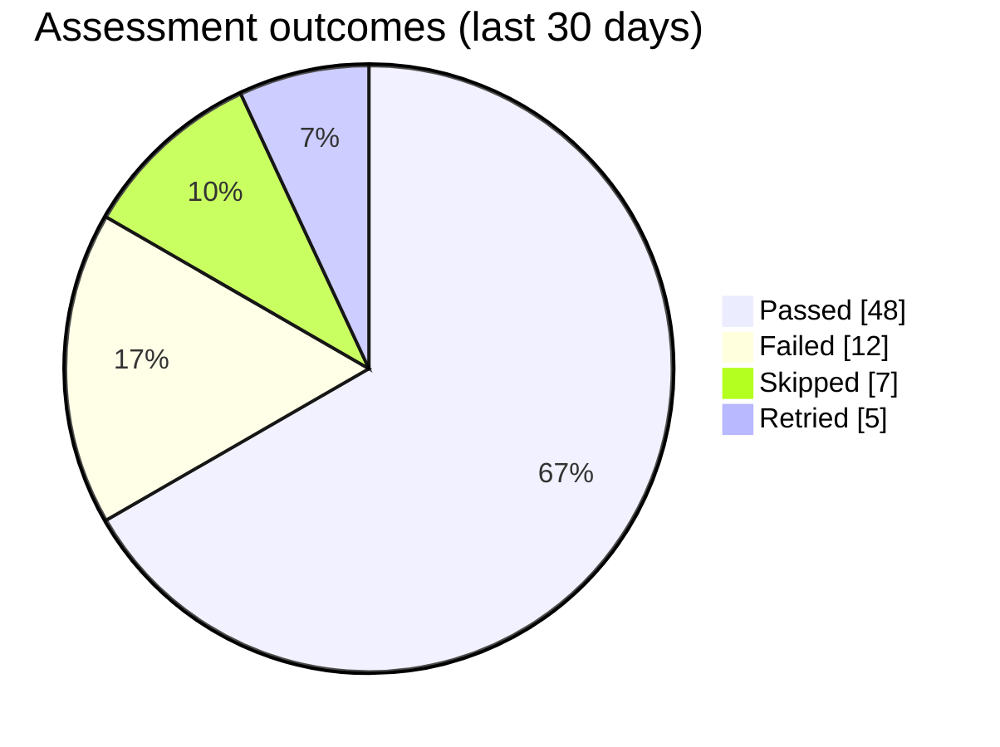

# Markdown renderer showcase

Storybook fixture for the **Files** tab and Console markdown panel.

## Chips

- Node: [Analyze PR](node:analyze-pr) · [On Pull Request](node:on-pull-request) · [Post Assessment](node:post-assessment)
- Integration: [GitHub](integration:github) · [Cursor](integration:cursor) · [Slack](integration:slack)

## GitHub alerts

> [!NOTE]
> Useful information when skimming a runbook.

> [!TIP]
> Prefer `node:` chips when linking to canvas steps: [Analyze PR](node:analyze-pr).

> [!IMPORTANT]
> Console interpolates `{{ variables }}` before markdown renders.

> [!WARNING]
> Urgent info that needs attention before the next deploy.

> [!CAUTION]
> Destructive actions in table row triggers cannot be undone.

## Sections

Presets pick icon + accent: `tools`, `rules`, `skills`, `mcp`, `folder`.
Trailing meta after ` · ` is optional. Nested sections show a count on the parent.

> [!SECTION:tools] Tool definitions · ~9,202
> Descriptions of tools the agent can call.

> [!SECTION:rules] Rules · ~5,366
> Standing instructions the agent follows each turn. Keep them focused and lightweight.
>
> Nested markdown still works: [docs](https://docs.superplane.com) and `inline code`.
>
> > [!SECTION:folder] Project Rules · ~2,752
> > Project-local guidance from `AGENTS.md` and related files.
>
> > [!SECTION:rules] Cursor & User Rules · ~2,522
> > Personal and Cursor-level standing instructions.

> [!SECTION:skills] Scoring
> The agent checks out the PR, runs metric tooling, and posts a self-updating comment.

> [!SECTION:mcp] MCP servers · 3
> Connected tools the agent can call through Model Context Protocol.

## Code

```yaml
apiVersion: v1
kind: Canvas
metadata:
  name: Clean Code Assessment
spec:
  nodes:
    - id: analyze-pr
      type: cursor.analyze_pr
```

## Mermaid

Flowchart (custom node colors):



Sequence:



State diagram:



Pie chart:


